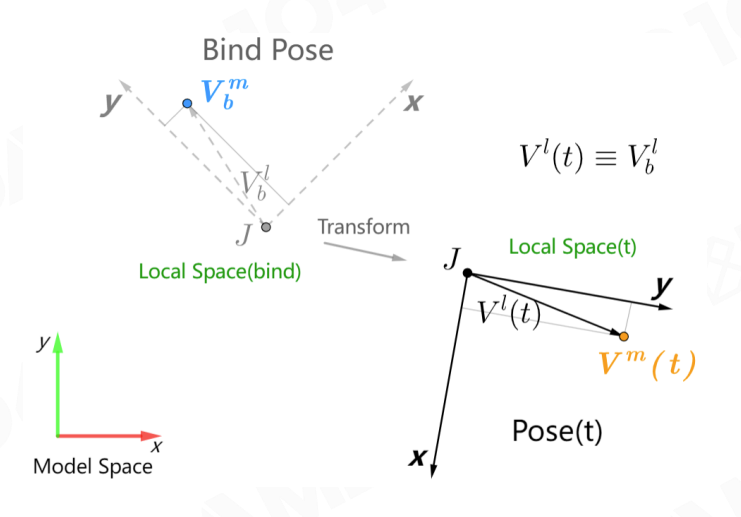
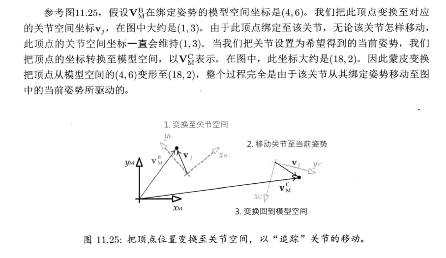

# Skinning Matrix理解

## 前言
最近在学习ue4动画相关的知识，对skinningMatrix的理解做一个梳理。
## 一. 符号表示：
- $V_b^m$: Vertex's position in **model space** within bind pose
- $V_b^l$: Vertex's position in **local space** within bind pose
- $M_{b(J)}^m$: Joint's pose in **model space** within bind pose

## 二. 绑定姿态
### Bind Pose Matrix 
**Bind Pose Matrix：** $M_{b(J)}^m$ 是初始状态下（A-Pose或T-Pose）蒙皮顶点Vertex，从关节 Joint 局部空间到其joint模型空间的一个仿射变换。 数学表示如下：
$$
V^{\prime}(t) \equiv V_b^l=\left(M_{b(J)}^m\right)^{-1} \cdot V_b^m \\
$$

* 无论Joint如何变换，Vertex与其相对位置不发生改变。


> Note: 
>蒙皮顶点： 蒙皮顶点位置是在模型空间定义的（无论是A-pose还是T-pose都是如此）。
>关键帧数据：动画的关键帧数据是存放在其对应的`父骨骼空间（localSpace）`下，而非模型空间下。

## 三.蒙皮
### Skinning Matrix
**当前关节姿态：** $M_j^m(t)$ joint $J$ 's pose in model space at time $\boldsymbol{t}$， 从root骨骼一路累积到计算的骨骼空间中。
$$
M_j^m(t)=\prod_{j=J}^0 M_{p(j)}^{l}(t) \\
$$
* $V^m(t)$: Vertex`s position in **model space** at time t

**Skinning Matrix:** $K_J$ 为 t 时刻 Joint 相对**初始状态**在模型空间中的变换。蒙皮矩阵（skinning matrix）能把网格顶点从原来位置 (绑定姿势) 变换至骨骼的当前姿势。
* 蒙皮网格的顶点会追随其绑定的关节而移动.
* 蒙皮矩阵和MVP矩阵不同，不是基矩阵变换。 蒙皮顶点在变换前后都是在模型空间。

$$
\begin{aligned}
    &V^m(t)=M_j^m(t) \cdot V_j^{l}=M_j^m(t) \cdot\left(M_{b(J)}^m\right)^{-1} \cdot V_b^m \\
&K_J=M_j^m(t) \cdot\left(M_{b(J)}^m\right)^{-1}
\end{aligned}
$$

## 四. 单个关节的蒙皮计算
>理解蒙皮矩阵的总结： 
>1. 先把蒙皮顶点从处于模型空间的绑定姿态变换到关节空间。
>2. 再把关节空间移动到当前姿态。
>3. 最后由当前姿态转换至其骨骼的模型空间中。

eg：



## 五. Skinning Matrix Palette

要将上的公式扩展至含多关节的骨骼, 只需做两个小调整。
1. 确保矩阵 $M_{b(J)}^m$ 及 $M_j^m(t)$ 正确计算。 $M_{b(J)}^m$ 及 $M_j^m(t)$ 仅分别等价于该方程中蒙皮顶点的**绑定姿势**及**当前姿势**。
2. 我们须计算一组蒙皮矩阵 $\mathbf{K}_j$, 当中每个矩阵对应第 $j$ 个关节。此数组称为矩阵调色板 (matrix palette) 。当要渲染一个蒙皮网格时, 矩阵调色板便要传送至渲染引擎。渲染器会为每个顶点查找调色板中合适的关节蒙皮矩阵, 并用该矩阵把顶点从绑定姿势变换至当前姿势。

### 5.1 引入模型至世界变换
每个蒙皮顶点最终都会由模型空间变换到世界空间， 从优化角度，一般引擎会把蒙皮矩阵调色盘预先乘以物体的模型至世界变换。因此可以得到Skinning Matrix Palette如下：
$$
K^{\prime}_J=M^{\text{w}} \cdot M_j^m(t) \cdot\left(M_{b(J)}^m\right)^{-1} \\
$$

### 5.2 把顶点蒙皮至多个关节
1. 先计算每个关节进行蒙皮计算：
$$
V_{J_i}^m(t)=K_{J_i}(t) \cdot V_{b\left(J_i\right)}^m \\
$$
2. 由各个关节的权重计算最终顶点在模型空间中的位置。
$$
V^m(t)=\sum_{i=0}^{N-1} W_i \cdot V_{J_i}^m(t)\\
$$

### 六. 计算实例
非蒙皮顶点通常会像这样计算：
```c++
gl_Position = projection * view * model * position;
```

蒙皮顶点像这样被有效计算:
```c++
gl_Position = projection * view *
              (bone1Matrix * position * weight1 +
               bone2Matrix * position * weight2 +
               bone3Matrix * position * weight3 +
               bone4Matrix * position * weight4);
```


## 参考资料
1. [GAMES104-现代游戏引擎] (https://www.bilibili.com/video/BV1fF411j7hA/?share_source=copy_web&vd_source=e84f3d79efba7dc72e6306f35613222e)
2. [游戏引擎架构]
3. [游戏引擎原理与实践]
