# 从BRDF散射模型建立渲染方程 The Rendering Equation
### prerequisite 
理解radiance和irradiance
什么是irradiance ？
总结：
  - radiance 可以理解为一条光线所携带的能量
  - irradiance 为一个极小面上所有入射光线能量的集合
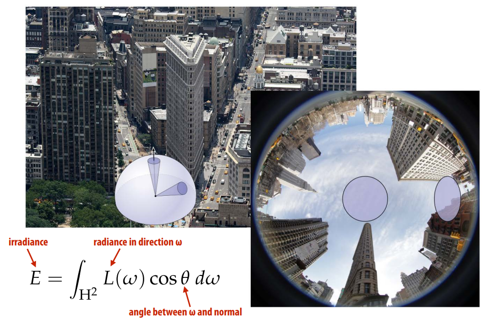
什么是radiance ？ 
* Radiance at point p in direction N is radiant energy (“#hits”) per unit time, per solid angle, per unit area perpendicular to N.
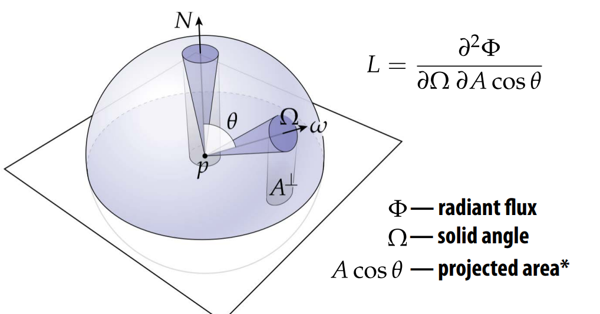
* **Confusing** : this $\cos\theta$  has to do with parameterization of sphere, not Lambert’s law
* 理解兰伯特$\cos{\theta}$ 与 球面积分$\cos{\theta}$的不同tale of two consines
* 参考[PBRT Working_with_Radiometric_Integrals](https://www.pbr-book.org/3ed-2018/Color_and_Radiometry/Working_with_Radiometric_Integrals)
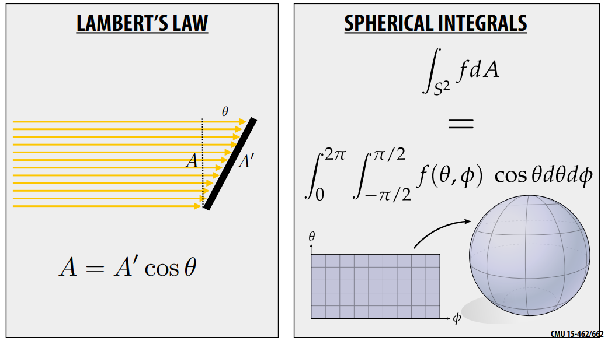
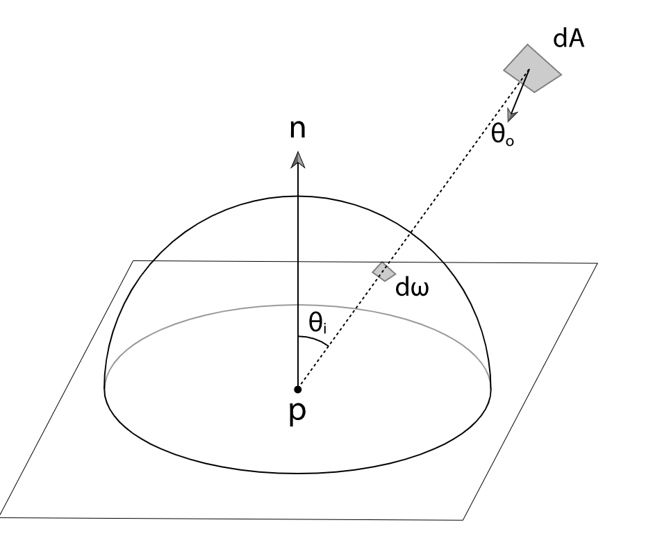

### 1.光的反射如何影响出射的辐射度?

Refection models
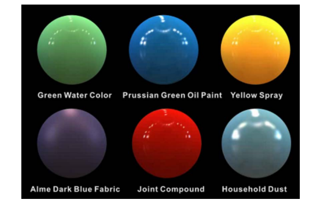
* 反射定义： 光线进入物体表面在相同一侧离开，且频率不改变。 Refection is the process by which light incident on a surface interacts with the surface such that it leaves on the incident (same) side without change in frequency
* 选择什么样的反射方程决定了物理表面什么颜色
$$f_r(\mathbf{p}, \omega_i\to\omega_o)$$

基础的反射函数 Some basic refection functions
**`需要找到一个合适的光线传输模型来表现这些反射现象。`**
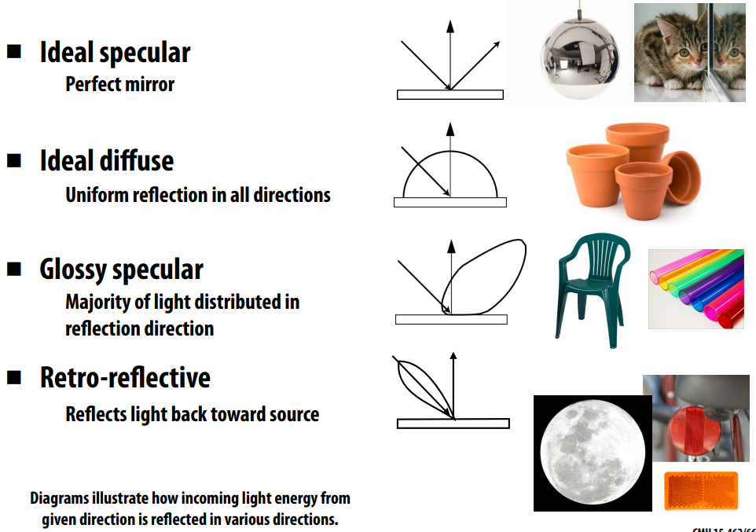

### 2.根据反射现象建立BRDF模型

Scattering off a surface: 
* the BRDF(Bidirectional refectance distribution function)
* Encodes behavior of light that “bounces off” surface
* Given incoming direction ωi, how much light gets scattered in any given outgoing direction ωo.
* 表面散射分布描述： $f_r( \omega_i\to\omega_o)$

**以上引出brdf**： 
双向反射率分布函数(BRDF) 提供了一种描述表面反射的形式。由沿方向$\omega_i$的入射辐射$L_i(p, \omega_i)$, 有多少辐射$L_o(p, \omega_o)$在朝向观察者$\omega_o$的方向离开表面 。如果将方向$\omega_i$视为立体角方向的微分锥面，则在点p的微分辐照度为：
$$
 \mathrm{d}E(\mathbf{p},\omega_{\mathrm{i}})=L_{\mathrm{i}}(\mathbf{p},\omega_{\mathrm{i}})\;\cos\theta_{\mathrm{i}}\,\mathrm{d}\omega_{\mathrm{i}}\\
$$
BRDF的辐射度描述: （注：双向反射分布函数（BRDF）抽象来描述表面的光反射，BTDF 描述表面的透射,BSDF 包含这两种效果。）
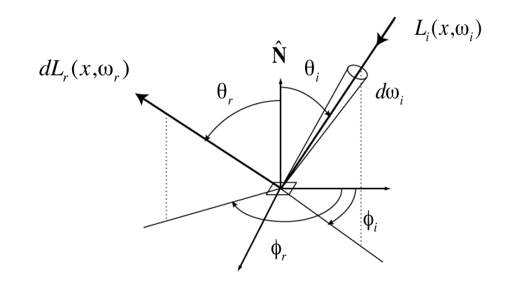
$$
f_r(\omega_i\to\omega_o) = \frac{\text{d}L_o(\omega_o)}{\text{d}E_i(\omega_i)}
=\frac{\text{d}L_o(\omega_o)}{\text{d}L_i(\omega_i)\cos\theta_i\text{d}\omega_i} \tag{2.1}\\
$$

**BRDF有如下的两个重要性质**
* Helmholtz互易性(Reciprocity)： 就是交互入射方向和反射方向，BRDF计算出来的结果是一致的 $f(p, w_i) = f(p, w_o)$
* **能量守恒: 能量守恒可以理解brdf为一束入射光的投射到表面$\Delta\mathbf{p}$点光通量与该点某一个观察方向的出射光光通量的比值，BRDF同时满足Helmholtz互异性，对一束入射光的所有反射光比值加总（积分），由能量守恒可知必然$\le1$**
$$
f_r(\omega_i\to\omega_o)\ge0\\
f_r(\omega_i\to\omega_o)=f_r(\omega_o\to\omega_i)\\
\int_{\mathcal{H}^2}f_r(\omega_i\to\omega_o)\cos\theta\ \text{d}\omega_i\le1 \\
$$

**漫反射 Lambertian Reflection**
* Assume light is equally likely to be refected in each output direction

* 由于各个出射光一样：$ f_r=f_r(\mathbf{p}, \omega_i\to\omega_o)$
> diffuse derivative:
$$
\begin{align*}
f_r(\mathbf{p})&=\frac{\rho(\mathbf{p})}{\pi}\\
L_o(\mathbf{p},\omega_o) &=\int_{\mathcal{H}^2}{f_r(\mathbf{p})L_i(\mathbf{p},\omega_i)\cos\theta}\ \text{d}\omega_i\\
&=f_r(\mathbf{p})\int_{\mathcal{H}^2}{L_i(\mathbf{p},\omega_i)\cos\theta}\ \text{d}\omega_i\\
&=f_r(\mathbf{p})E(\mathbf{p})\\
&=\frac{\rho(\mathbf{p})}{\pi}E(\mathbf{p})\\
\end{align*}\\
$$
> 漫反射中**$\rho(\mathbf{p})$ is albedo**,就是反照率 between 0 and 1, because:
$$
0 \le\int_{\mathcal{H}^2}{f_r(\mathbf{p})\cos\theta}\ \text{d}\omega_i\le 1\\
0 \le\frac{\rho(\mathbf{p})}{\pi}\int_0^{2\pi}\int_0^\frac{\pi}{2}          cos\theta\sin\theta\ \text{d}\phi\text{d}\theta\le 1\\
0\le\rho(\mathbf{p})\le 1\\
$$

**镜面反射 perfect specular refection**

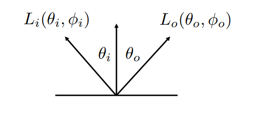
* Specular refection BRDF
$$L_o(\theta_o,\phi_o)=L_i(\theta_i,\phi_i)\\$$

菲涅耳方程给出了反射光的比例$F_r(\omega_r)$, 使用Dirac delta 函数`将入射方向限制为镜面反射方向`: [Specular_Reflection](https://www.pbr-book.org/3ed-2018/Reflection_Models/Specular_Reflection_and_Transmission)
$$
f_{\mathrm{r}}(\mathrm{p},\omega_{0},\omega_{\mathrm{i}})=F_{\mathrm{r}}(\omega_{\mathrm{r}}){\frac{\delta(\omega_{\mathrm{i}}-\omega_{\mathrm{r}})}{|\cos\theta_{\mathrm{r}}|}}  \tag{1} \\
$$
也可以写成这样：（注意：在这里$|\cos \theta_r| = |\cos \theta_i|$）
$$
f_r(\theta_i,\phi_i;\theta_o,\phi_o)=
\begin{cases} 
F_r(\omega_r)\frac{1}{\cos\theta_i}       &      & {\theta_o=\theta_i \text{ and }\phi_i=\phi_o\pm\pi}\\
0     &      & \text{otherwise} \\
\end{cases} \\ 
$$

**TransmissionLight**

* 光穿过介质 refracts:Transmitted angle depends on relative index of refraction of material ray is leaving/entering
* 折射 Snell`s  Law ： 折射率随光的波长而变化。因此，入射光通常在两种不同介质之间的边界沿多个方向散射，这种效应称为色散。
* eg: 人眼视角 Optical manhole
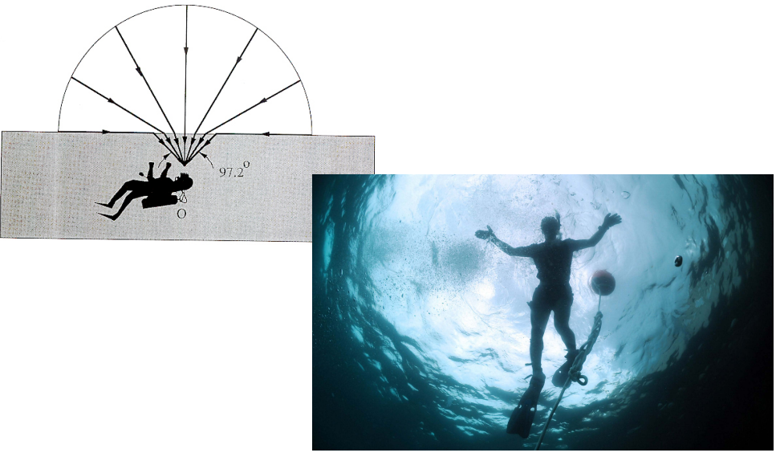
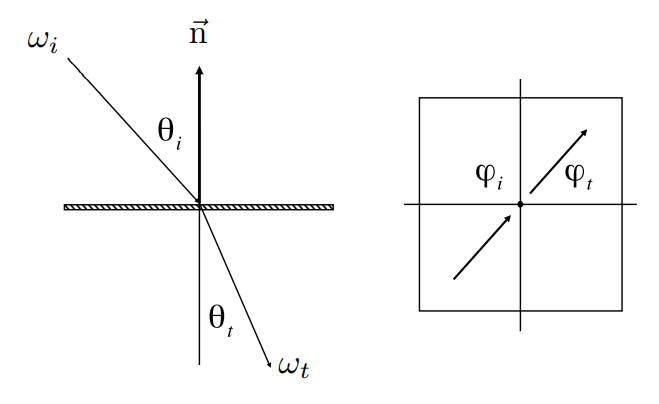
公式具体推导见[SpecularTransmission](https://www.pbr-book.org/3ed-2018/Reflection_Models/Specular_Reflection_and_Transmission#SpecularTransmission)
$$
\begin{align*}
\eta_i\sin\theta_i
&=\eta_t\sin\theta_t\\
\cos\theta_t
&=\sqrt{1-\sin^2\theta_t}\\
&=\sqrt{1-(\frac{n_i}{n_t})^2\sin^2\theta_i}\\
&=\sqrt{1-(\frac{n_i}{n_t})^2(1-\cos^2\theta_i)}  &\left(1-(\frac{n_i}{n_t})^2(1-\cos^2\theta_i)<0)\right)
\end{align*}\\
$$


### 3.菲涅尔反射 Fresnel reflection

除了反射和透射方向之外，还需要**计算反射或透射的入射光的比例**。对于物理上准确的反射或折射，这些项与方向有关，不能通过恒定的每表面缩放量来捕获。`菲涅耳方程描述了从表面反射的光量；它们是麦克斯韦方程在光滑表面上的解。`

**菲涅耳方程**： 给定折射率和入射光线与表面法线的夹角，菲涅耳方程指定了材料对入射照明的两种不同偏振态的相应反射率。因为偏振的视觉效果在大多数环境中是有限的，所以在 pbrt中会做出一个常见的假设，即光是非偏振的；也就是说，它相对于光波是随机定向的。有了这个简化的假设，菲涅耳反射率是平行和垂直偏振项的平方的平均值。（关于光的偏振可以观看[光的偏振：圆偏振，线偏振，非偏振光](https://www.bilibili.com/video/BV1Lt411t7Lh?share_source=copy_web&vd_source=e84f3d79efba7dc72e6306f35613222e)）

为了`计算两种(two dielectric media)电介质界面处的菲涅耳反射率，需要知道两种介质的折射率`

$$
r_{\parallel}=\frac{\eta_{\mathrm{t}}\cos\theta_{\mathrm{i}}-\eta_{\mathrm{i}}\cos\theta_{\mathrm{t}}}{\eta_{\mathrm{t}}\cos\theta_{\mathrm{i}}+\eta_{\mathrm{i}}\cos\theta_{\mathrm{t}}}\\
\\[10pt]
r_{\perp}=\frac{\eta_{\mathrm{i}}\cos\theta_{\mathrm{i}}-\eta_{\mathrm{t}}\cos\theta_{\mathrm{t}}}{\eta_{\mathrm{i}}\cos\theta_{\mathrm{i}}+\eta_{\mathrm{t}}\cos\theta_{\mathrm{t}}}\\
$$
其中$r_{\parallel}$是平行偏振光的菲涅耳反射率，$r_{\perp}$是垂直偏振光的反射率， $\eta_i$是入射和$\eta_t$透射介质的折射率，$\omega_i$和$\omega_t$是入射和透射方向.
**对于非偏振光，菲涅耳反射率**为:
$$F_{\mathrm{r}}=\frac{1}{2}(r_{\parallel}^{2}+r_{\perp}^{2})\\$$


导体和电介质之间的折射率（a conductor and a dielectric medium）：
$$
\begin{align*}
r_{\perp}&={\frac{a^{2}+b^{2}-2a\cos\theta+\cos^{2}\theta}{a^{2}+b^{2}+2a\cos\theta+\cos^{2}\theta}}\\
r_{\parallel}&=r_{\perp}\frac{\cos^{2}\theta(a^{2}+b^{2})-2a\cos\theta\sin^{2}\theta+\sin^{4}\theta}{\cos^{2}\theta(a^{2}+b^{2})+2a\cos\theta\sin^{2}\theta+\sin^{4}\theta}\\
a^{2}\,+\,b^{2} & =\,\sqrt{\left(\eta^{2}\,-\,k^{2}\,-\,\mathrm{sin}^{2}\,\theta\right)^{2}\,+\,4\eta^{2}\,k^{2}}\\
\end{align*}\\
$$
是使用复数除法运算计算$\eta+\mathrm{i}k=\bar{\eta}_{\mathrm{t}}/\bar{\eta}_{\mathrm{i}}$相对折射率。但是，通常$\eta_i$是电介质，因此可以使用正常的实数分割.

**Schlick’s approximation**: 真实世界的菲涅尔公式非常复杂，采用简化方法：($R_0 = F_0$)
$$
\begin{align*} R(\theta) &=R_{0}+\left(1-R_{0}\right)(1-\cos \theta)^{5} \\ R_{0} &=\left(\frac{n_{1}-n_{2}}{n_{1}+n_{2}}\right)^{2} \end{align*}\\
$$

利用菲涅尔方程，我们就可以根据不同的反射率画出$F_{\mathrm{r}}$与$\theta_i$的对应关系图,可以看到：
* 大部分电介质（Dielectric）都随着视角增加而反射增加 Many real materials: refectance increases with viewing angle
* conductor导体（比如铜镜），可以发现即使光线垂直于导体表面，但是依旧有90%的光被反射。
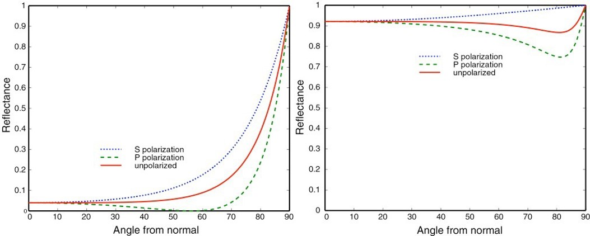
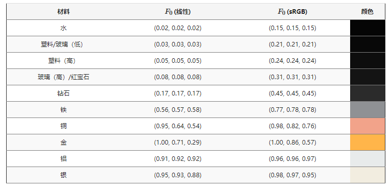

### 4.双向透射分布函数 BTDF 
现在将推导出镜面传输的BTDF。Snell`s Law斯涅尔定律是推导的基础。斯涅尔定律不仅给出了透射光线的方向，而且还可以用来表明当光线在具有不同折射率的介质之间传播时，沿光线的辐射度会发生变化。

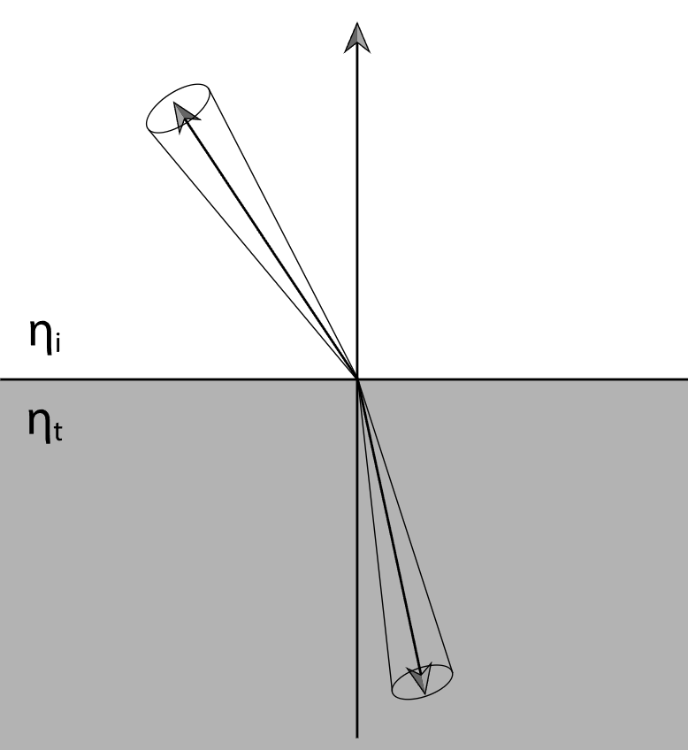

用$\tau$来表示由菲涅耳方程给出的传输到出射方向的入射能量分数，所以$\tau = 1 - F_r(\omega_i)$。那么传输的微分光通量为
$$\mathrm{d}\Phi_{\mathrm{o}}=\tau\mathrm{d}\Phi_{\mathrm{i}}\\$$


如果使用radiance的定义$L=\frac{\mathrm{d}\Phi}{\mathrm{d}\omega\,\mathrm{d}A^{\perp}}$，有:
$$
L_o\cos \theta_o \text{d}A\text{d}\omega_o = \tau(L_i\cos \theta_i \text{d}A\text{d}\omega_i)
$$

将立体角展开为球面角$\text{d}\omega =\sin \theta\ \text{d}\theta \text{d}\phi$，(具体公式推导见[从辐射度量学理解BRDF: Differential solid angle](https://zhuanlan.zhihu.com/p/549572824))有:
$$
L_{\mathrm{o}}\cos\theta_{\mathrm{o}}\,\mathrm{d}A\sin\theta_{\mathrm{o}}\,\mathrm{d}\theta_{\mathrm{o}}\,\mathrm{d}\phi_{\mathrm{o}}=\tau L_{\mathrm{i}}\cos\theta_{\mathrm{i}}\,\mathrm{d}A\sin\theta_{\mathrm{i}}\,\mathrm{d}\theta_{\mathrm{i}}\,\mathrm{d}\phi_{\mathrm{i}} \tag{2}\\
$$

现在可以根据Snell Law 给出关于$\theta$的关系：
$$\eta_{o}\;\mathrm{cos}\,\theta_{o}\;\mathrm{d}\theta_{o}\,=\,\eta_{\mathrm{i}}\;\mathrm{cos}\,\theta_{\mathrm{i}}\,\mathrm{d}\theta_{\mathrm{i}}\\$$

重新排列术语，有:
$$\frac{\cos\theta_{\mathrm{o}}\,\mathrm{d}\theta_{\mathrm{o}}}{\cos\theta_{\mathrm{i}}\,\mathrm{d}\theta_{\mathrm{i}}}\,=\,\frac{\eta_{\mathrm{i}}}{\eta_{\mathrm{o}}}\\$$

将这个关系和斯涅尔定律代入方程（2），然后化简，有
$$L_{\circ}\,\eta_{\mathrm{i}}^{2}\,\mathrm{d}\phi_{\circ}=\tau L_{\mathrm{i}}\,\eta_{\circ}^{2}\,\mathrm{d}\phi_{\mathrm{i}}\\$$

因为$\phi_{\mathrm{i}}=\phi_{\mathrm{o}}+\pi$因此$\mathrm{d}\phi_{\mathrm{i}}=\mathrm{d}\phi_{\mathrm{o}}$ ，有最终的关系： 
$$L_{\mathrm{o}}=\tau L_{\mathrm{i}}\frac{\eta_{\mathrm{o}}^{2}}{\eta_{\mathrm{i}}^{2}}\\$$

与镜面反射的BRDF（1）公式一样，需要分出$\theta_i$项来获得正确的BTDF镜面透射 ： 
$$f_{\mathrm{r}}(\omega_{0},\omega_{\mathrm{i}})=\frac{\eta_{0}^{2}}{\eta_{\mathrm{i}}^{2}}(1-F_{\mathrm{r}}(\omega_{\mathrm{i}}))\frac{\delta(\omega_{\mathrm{i}}-\mathrm{T}(\omega_{0},{\bf n}))}{|\mathrm{cos}\,\theta_{\mathrm{i}}|}\\$$

> $T(\omega_o, n)$是镜面透射方向$\omega_o$穿过与表面法线n的界面产生的镜面透射矢量. $F_r(\omega_o) = F_r(\omega_i)$

Example : Snell + Fresnel

### 5.其他光学现象
**各项异性 Anisotropic refection**
Refection depends on azimuthal angle$\phi$


**次表面散射 Subsurface scattering**
  Translucent materials: eg: jade skin

原因：光线出射点与入射点不一致 Visual characteristics of many surfaces caused by light entering at different points than it exits
  - Violates a fundamental assumption of the BRDF
  - Need to generalize scattering model (BSSRDF)： $S(\mathbf{p}_i,\omega_i,\mathbf{p}_o,\omega_o)$

BSSRDF:"Bidirectional Scattering Surface Reflectance Distributed Function
  - Generalization of BRDF; describes exitant radiance at one point due to incident differential irradiance at another point:
$$
L_o(\mathbf{p}_o,\omega_o)=
\int_\mathcal{A}
\int_{\mathcal{H}^2}
{S(\mathbf{p}_i,\omega_i,\mathbf{p}_o,\omega_o)L_i(\mathbf{p_i},\omega_i)\cos\theta}
\ \text{d}\omega_i\text{d}A \\
$$

> compare BRDF: 
$$
L_o(\mathbf{p},\omega_o)=L_e(\mathbf{p},\omega_o) + \int_{\mathcal{H}^2}f_r(\mathbf{p},\omega_i\to\omega_o)L_i(\mathbf{p},\omega_i)\cos\theta \ \text{d}\omega_i \\
$$


### 6.有什么相对简单的算法能够捕获以上所有的光线行为？ 

**The refection equation** : 使用反射方程对以上所有的光线反射现象进行建模
$$
L_{r}({\bf p},\omega_{r})=\int_{H^{2}}f_{r}({\bf p},\omega_{i}\to\omega_{r})\,L_{i}({\bf p},\omega_{i})\,\cos\theta_{i}\,\mathrm{d}\omega_{i}\\
$$

### 7.如何生成最终的图像

**The rendering Equation**: 使用渲染方程求解观察点的radiance，最终生成完整图像
* Core functionality of photorealistic renderer is to estimate radiance at a given point p, in a given direction ωo
* 对渲染方程求和：Summed up by the rendering equation (Kajiya)
  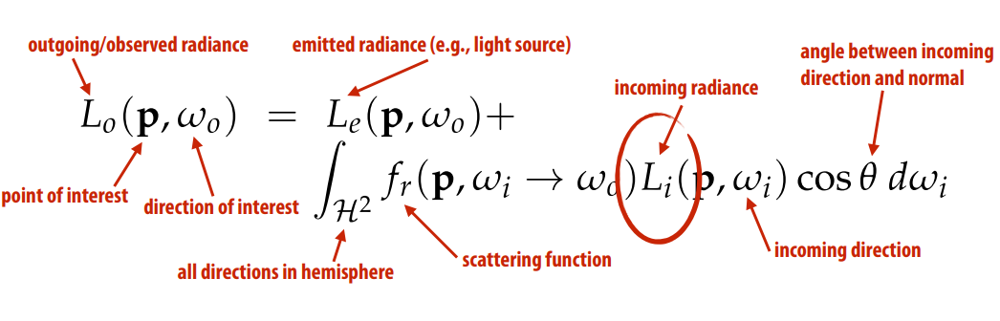
  1. outgoing/observation
  2. incoming radiance 未知 
* 深入理解Rendering Equation： 
> $$
> Lo(\mathbf{p}, \omega_o) = L_e(\mathbf{p}, \omega_o) + \int_{\mathcal{h^2}}f_r(\mathbf{p, \omega_i}\to\omega_o )L_i(\mathbf{p}, \omega_i)(\omega_i\cdot\mathbf{N}(\mathbf{p}))\text{d}\omega_i \\
> $$
* 由于一条光线的radiance输入来自另外一条光线的输出所以需要通过递归方法求解方程 
* Recursive Raytracing
  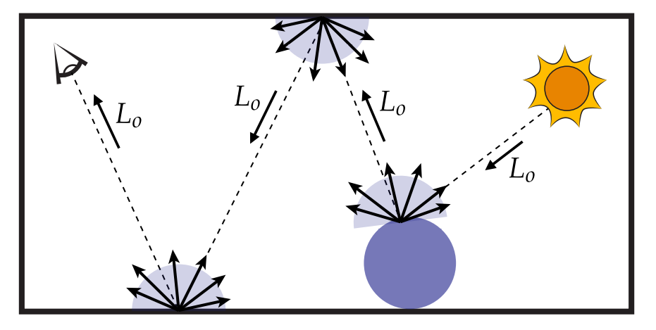
  - 这就是为什么使用路径追踪而不是光栅化的原因： 光栅化无法递归的得到incoming radiance。
  - 光线来源于光源，其他gometry的reflection
  - 输出结果： **观察方向**的radiance 
* 渲染器用光线路径来计算radiance  Renderer measures radiance along a ray
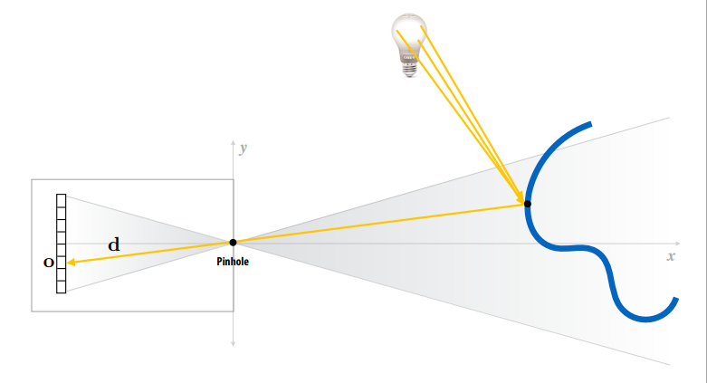


### 8.渲染方程中如何确定入射的radiance以及对渲染方程求解? 

**Path tracing**: 拆解递归无限光线为逐束递归光线求解，take advantage of special knowledge to break up integration into “easier” components：
* 将渲染方程拆解为直接光照部分和间接光照部分： Partition the rendering equation into direct and indirect illumination ： 
* 采用蒙特卡洛积分去单独计算每部分（束光），Use Monte Carlo to estimate each partition separately 
  - One sample for each 
  - Assumption: 100s of samples per pixel 
  - $$\frac{1}{N}\sum_{j=1}^N\frac{f_r(\mathbf{p},\omega_j\to\omega_r)L_i(\mathbf{p},\omega_j)\cos\theta_j}{p(\omega_j)} \\$$
* 采用俄罗斯轮盘赌算法：决定要不要继续，避免无线递归下去。Terminate paths with Russian roulette


**选择合适的入射光线**
为了降低方差$p(\omega_j)$ 应该尽量符合BRDF分布入射光线分布。详解分析参考[]()

```c++
// Assume:
// Ray ray hits surface at point hit_p
// Normal of surface at hit point is hit_n
Vector3D wr = -ray.d; // outgoing direction
Spectrum Lr = 0.;
for (int i = 0; i < N; ++i) {
    Vector3D wi; // sample incident light from this direction
    float pdf; // p(wi)
    
    generate_sample(brdf, &wi, &pdf); // generate sample according to brdf
    
    Spectrum f = brdf->f(wr, wi);
    Spectrum Li = trace_ray(Ray(hit_p, wi)); // compute incoming Li
    Lr += f * Li * fabs(dot(wi, hit_n)) / pdf;
}
return Lr / N;
```


**参考资料**

1. [PBRT Reflection_Models](https://www.pbr-book.org/3ed-2018/Reflection_Models)


