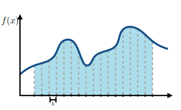
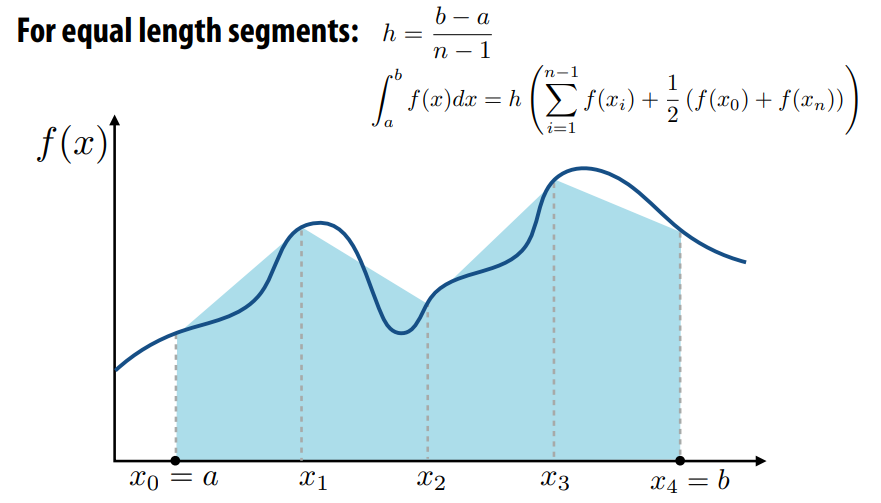
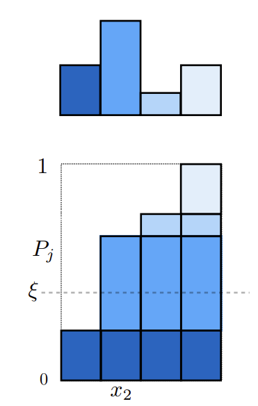
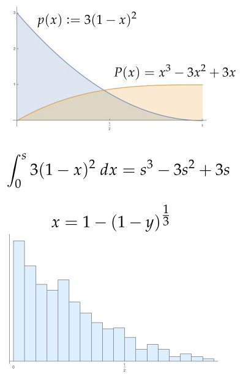
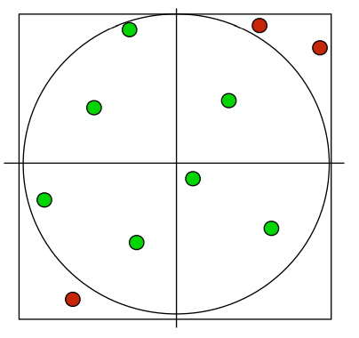

# 数值积分 Numerical Integration
数值积分是利用黎曼积分等数学定义，用数值逼近的方法近似计算给定的定积分值, 此篇文章使用蒙特卡洛数值积分求解渲染方程

**概率论基础** 

fundamental theorem of calculus
- 随机变量$X$: 可能取很多数值的变量
- 随机变量$X \sim p(x)$概率密度函数PDF/[Probability density function](https://en.wikipedia.org/wiki/Probability_density_function):
  $$\begin{cases}
  \quad p(x) \ge 0 \, \\ 
  \quad \int_{-\infty}^{\infty} p(x)\text{d}x = 1\\  
  \end{cases} \\
  $$
- 期望: The average value that one obtains if repeatedly drawing samples from the random distribution.
  - 离散期望：$E[X] = \sum\limits_{i=0}\limits^{N} x_i \cdot p(x_i)$
  - 连续期望：$E[X]=\int x p(x) d x$

随机变量的属性 Properties of expectation：
- 如果某个随机变量Y是随机变量X的函数：$Y=f(X)$
- 期望的关系：$E[Y]=E[f(X)]=\int f(x) p(x) d x$

方差属性 Property of Variance:
$$
\begin{align*}
  & V[Y] = E[Y^2] - E[Y]^2 \\
  & V[\sum_{i = 1}^{N}Y_i] = \sum_{i = 1}^{N}[Y_i] \\
  & V[aY] = a^2V[Y] \\
  & V[X] = \sum_{i =1}^NP_i(x_i - \sum_{j = 1}^{N}p_j x_j )^2 \\
  & V[X] = \int_{\Omega} p(x)(x - \int_{\Omega}yp(y)\text{d}y)^2\text{d}x\\
\end{align*}\\
$$


### Overview
* 在图形中，很多概念是通过积分形式来表达的。 In graphics, many quantities we’re interested in are naturally expressed as integrals (total brightness, total area, …) 
* 对于非常简单的积分，我们可以解析地计算解，例如：
$$\int_0^1\frac{1}{3}x^2\text{d}x = \left[x^3\right]_0^1 = 1\\$$

* 另外一种情况是无法使用解析解求解渲染方程的，只能采用数值方式求解。For everything else, we have to compute a numerical approximation 
* 基本思路：
   - 积分是“曲线下面积”，
   - 在许多点对函数进行采样
   - 积分近似为加权和
  

 ### 蒙特卡洛估算器 The Monte Carlo Estimator

现在可以定义基本的蒙特卡洛估计器，它近似于任意积分的值。它是光传输算法的基础。假设要评估一维积分$\int_{a}^{b}f(x)\text{d}x$。给定均匀随机变量$X_{i}\in[a,b]$的供给，蒙特卡洛估计量表示估计量的期望值。 最后得出：期望值实际上等于积分。
$$F_{N}=\frac{b-a}{N}\sum_{i=1}^{N}f(X_{i})\\$$

具体分析推导可以见前文[使用参数估计统计量(有效性 无偏性 一致性)评估 蒙特卡洛方法](https://zhuanlan.zhihu.com/p/553388212)

对均匀随机变量的限制可以通过一个小的泛化来放宽到任意随机分布。这是一个极其重要的步骤，因为仔细选择从中抽取样本的 PDF 是减少 Monte Carlo 方差的一项重要技术。如果随机变量$X_i$是从某个任意 PDF $p(x)$中提取的 ，则估计器:

$$F_{N}\,=\,{\frac{1}{N}}\,\sum_{i=1}^{N}\,{\frac{f(X_{i})}{p(X_{i})}}\\$$

 
将此估计器扩展到多个维度或复杂的集成域很简单。 N个样本$X_i$取自多维（或“联合”）PDF，估计量照常应用。例如，考虑3D积分:

$$\int_{z_{0}}^{z_{1}}\,\int_{y_{0}}^{y_{1}}\,\int_{x_{0}}^{x_{1}}\,f(x,y,z)\,\mathrm{d}x\,\mathrm{d}y\,\mathrm{d}z\\$$

如果从$X_{i}\,\equiv\,(x_{i},\,y_{i},\,z_{i})$的框中均匀选择$\left[x_{0},x_{1}\right]\times\,\left[y_{0},y_{1}\right]\times\,\left[z_{0},z_{1}\right]$样本，则PDF $p(X)$是常数值:
$$\frac{1}{(x_{1}-x_{0})}\frac{1}{(y_{1}-y_{0})}\frac{1}{(z_{1}-z_{0})}\\$$
估计量是:
$$\frac{(x_{1}-x_{0})(y_{1}-y_{0})(z_{1}-z_{0})}{N}\sum_{i}f(X_{i})\\$$


请注意，无论被积函数的维数如何，都可以任意选择样本数。这是蒙特卡洛相对于传统确定性正交技术的另一个重要优势。Monte Carlo 中采集的样本数量完全与积分的维度无关. 具体分析推导可以见[veach_thesis](http://graphics.stanford.edu/papers/veach_thesis/) 


### 随机变量抽样 Sampling Random Variables

为了评估渲染方程中的蒙特卡洛估计量，有必要能够从选定的概率分布中抽取随机样本。以后会使用更复杂的采样方法，如何使用这些技术从由 BSDF、光源、相机和散射介质定义的分布中生成样本。


**逆采样方法 inversion method**

逆采样方法使用一个或多个均匀随机变量，并将它们映射到所需分布的随机变量。为了解释这个过程一般是如何工作的，将从一个简单的离散示例开始。`用分布在[0,1]区间的均匀随机变量去采样随机分布变量`，可以得到sample is uniform, probalility is nonuniform. 
理论证明部分参考[不同分布函数之间的转换](https://zhuanlan.zhihu.com/p/552773776)

1. 生成离散随机变量的样本（具有已知的 PDF) 
   - select $x_i$ if $P_{i-1}<\xi\le P_i$
   - $P$ 是累计概率函数 $P_j=\sum_{i=1}^j p_i$
   - $\xi$ 是均匀分布随机变量 $\in [0,1)$


2. 使用逆方法对连续随机变量进行采样
  - 求解累积概率分布函数 $X$是代表随机变量：
$$
P(x) = Pr(X < x)=\int_{-\infty}^xp(t)\ \text{d}t \\
$$
- Construction of samples: solve for $x=P^{-1}(\xi)$ 
  * eg: 
    


**拒绝采样 rejection sampling**

当一个采样很复杂，无法通过逆方法采样来获取PDF时候，可以采用拒绝采样方法， 利用一个容易的均匀分布区覆盖采样区域，超出区域的采样点直接丢弃掉。

参考资料：
1. [接受拒绝采样（Acceptance-Rejection Sampling）](https://zhuanlan.zhihu.com/p/75264565)
2. PBRT: 13.3.2 THE REJECTION METHOD
Completely different idea: pick uniform samples in square (easy)
Then toss out any samples not in square (easy)


   ```c++
   Point2f RejectionSampleDisk(RNG &rng) 
   {
      Point2f p;
      do {
        //生成[-1, 1]区间的均匀随机数
      p.x = 1 - 2 * rng.UniformFloat();
      p.y = 1 - 2 * rng.UniformFloat();
      } while (p.x * p.x + p.y * p.y > 1);
      return p;
    }
   ```
一般来说，拒绝抽样的效率取决于样本的百分比预计会被拒绝。 对于在 2D 中寻找均匀点的问题情况下，这很容易计算。 它是圆的面积除以正方形的面积：π/4≈78.5%。 
如果将该方法应用于一般在超球体中生成样本然而，在 n 维情况下，n 维超球面的体积实际上是随着 n 的增加而变为 0，这种方法变得越来越低效。

**Metropolis Sampling**
Metropolis 抽样是一种从非负函数生成一组样本的技术，该函数f与f的值成比例分布（Metropolis 等人，  1953 年）。 值得注意的是，它能够做到这一点，只需要评估能力；没有必要能够对f积分、归一化积分和反转得到的 CDF 进行积分。此外，每次 迭代都会产生一个从函数的 PDF 生成的可用样本；Metropolis 抽样没有拒绝抽样的缺点，即获得下一个样本所需的迭代次数无法限制。因此，与上一节介绍的技术相比，它可以从更广泛的函数中有效地生成样本。它构成了Metropolis 光传输算法的基础 。 

Metropolis 采样确实有一些缺点：序列中的连续样本在统计上是相关的，因此无法确保 Metropolis 生成的一小部分样本在整个域中很好地分布。只有在大量样本的限制范围内，样本才会覆盖该域。因此，在使用 Metropolis 抽样时，分层抽样等技术的方差减少优势通常不可用。

todo...


**参考资料**

1. [Numerical integration](https://en.wikipedia.org/wiki/Numerical_integration)
2. [《PBRT》](https://www.pbr-book.org/3ed-2018/Monte_Carlo_Integration/Metropolis_Sampling)


