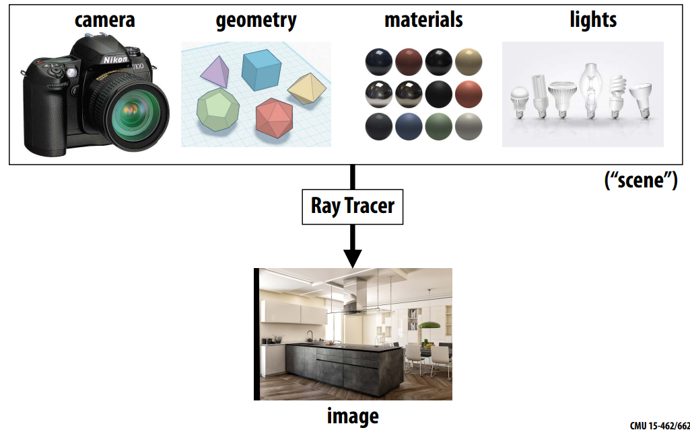
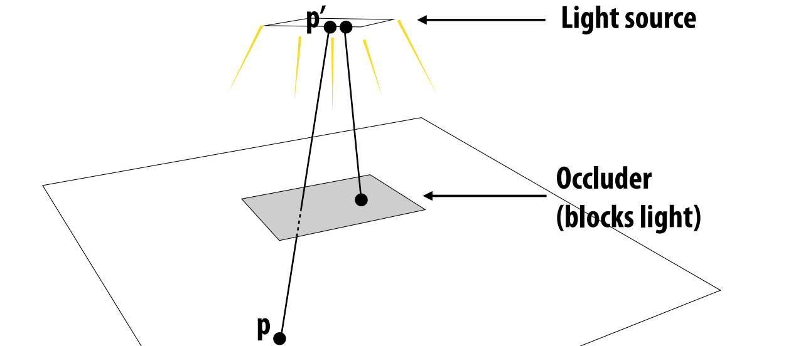
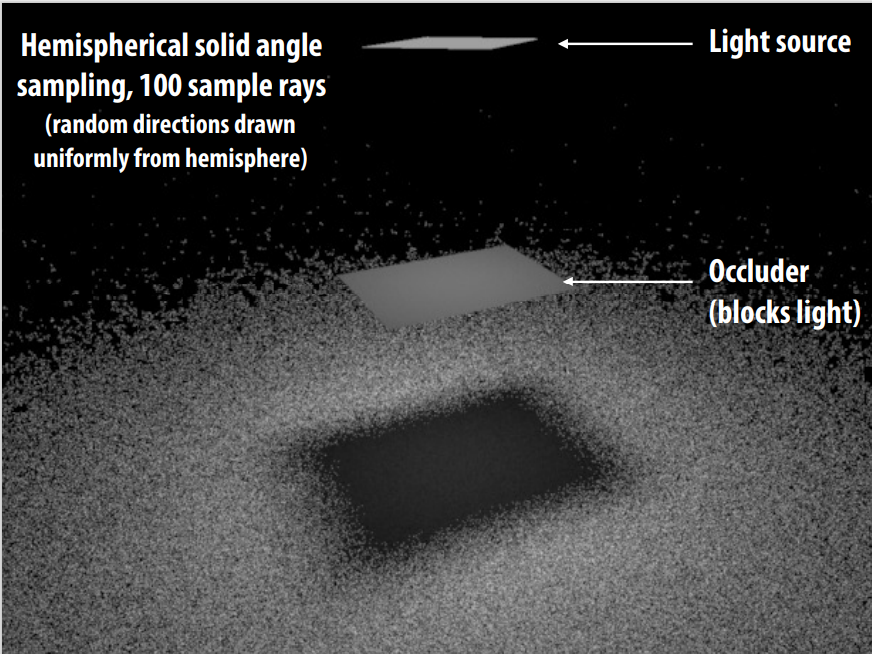
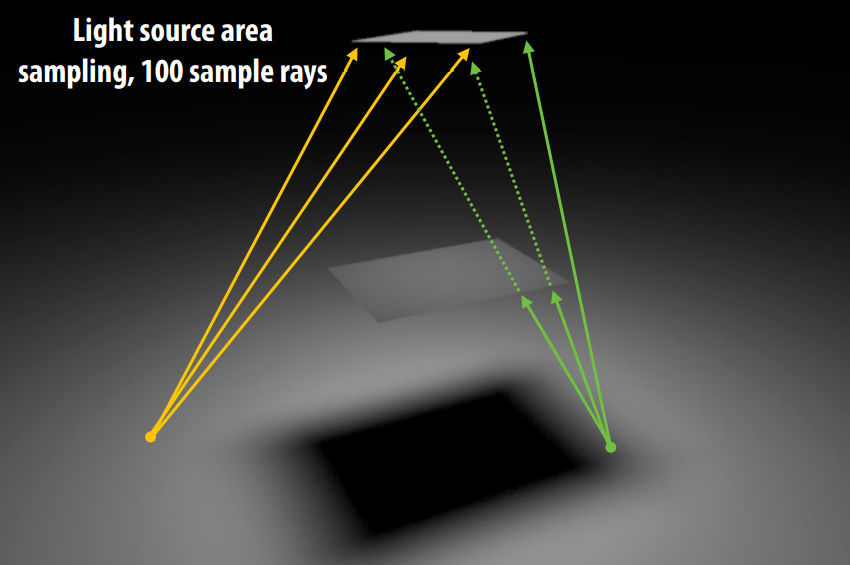
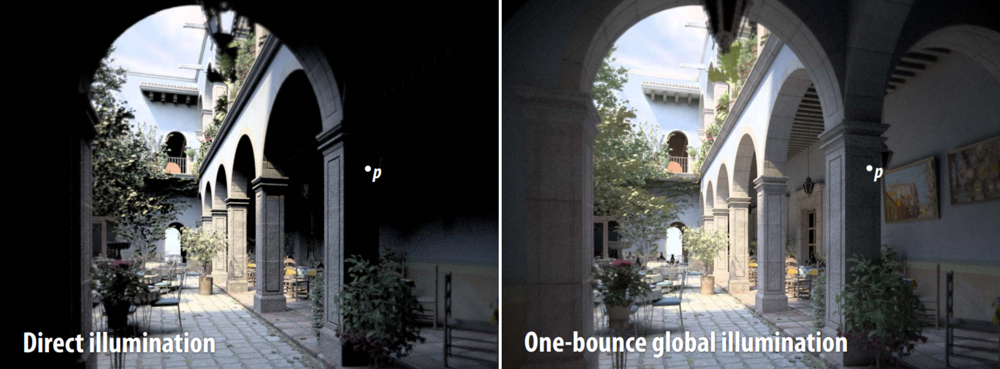
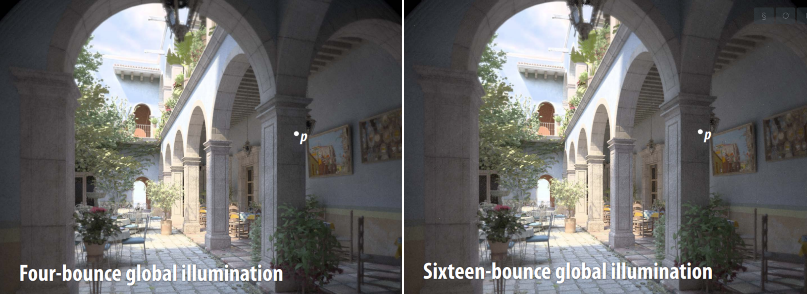
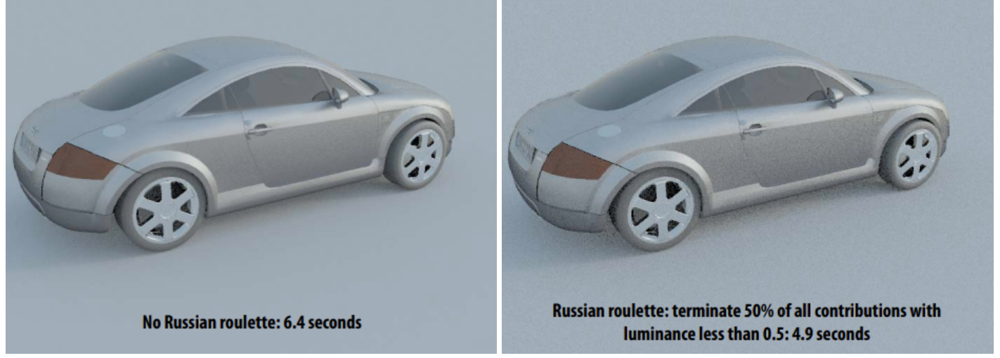

# 蒙特卡洛渲染
### Photorealistic Rendering
渲染一张真实感图片需要： 
1. camera
2. geometry
3. material
4. lights

### Monte Carlo Ray Tracing
* 在渲染方程中使用蒙特卡洛估算渲染方程.
  * 参考上篇[蒙特卡洛估算器](https://zhuanlan.zhihu.com/p/545565243)
* 对输入光线进行积分决定每一个像素的着色：
* 对什么函数进行积分? 
   - illumination along different paths of light 
* What does a “sample” mean in this context? 
   - ==每条光线路径就是一个采样==  each path we trace is a sample

**思考**
1. 利用均匀分布随机变量去采样
   * 大数定律
2. 预期得到什么数值： EXPECTED VALUE — what value do we get on average?
   * 获取采样期望值。
3. 如何减少方差： VARIANCE —what’s the expected deviation from the average?
   * 重要性采样 IMPORTANCE SAMPLING
4. 如何让每次采样更有效： 即在（正确地）在更重要的区域抽取更多样本？
   * 对光源采样等。。。

### Direct Lighting

Visibility function
$$
   V(p, p^\prime) =
   \begin{cases}
      1, \quad p  "sees" \,  p^\prime \\
      0, otherwise  \\
   \end{cases}\\
$$

### uniform sampling
在半球上的均匀采样参考[多维空间下的均匀采样方法](https://zhuanlan.zhihu.com/p/552773776)

### 光照计算
#### 直接光均匀采样
直接光均匀采样Direct lighting—uniform sampling
**采样算法：**
- Given surface point $\mathbf{p}​$ 
- For each of N samples:
  - Generate random direction: $\omega_i$ 
  - Compute incoming radiance $L_i$ arriving at $\mathbf{p}$ from direction: $\omega_i$,A ray tracer evaluates radiance along a ray 
  - Compute incident irradiance due to ray: $dE_i=L_i\cos\theta_i$ 
  - Accumulate $\frac{2\pi}{N}\ \text{d}E_i$ into estimator
$$
\begin{align*}
   &p(\omega) = \frac{1}{2\pi}\quad \Longrightarrow \quad  E(p) = \int L(p, \omega) \cos \theta \text{d}\omega\\
   &F_N = \frac{2\pi}{N}\sum_{i=1}^{N} \text{d}E_i \\
\end{align*}\\
$$

result: 均匀在半球面上采样会产生大量的噪声
  - 原因：均匀采样导致，环境当中光线的来源往往不是均匀的。

#### 对灯光区域进行采样
对灯光区域进行采样  Direct lighting: area integral
* Don’t need to integrate over entire hemisphere of directions (incoming radiance is 0 from most directions). 
* 对灯光进行采样：Just integrate over the area of the light (directions where incoming radiance is non-zero)and weight appropriately
   - 蒙特卡洛允许任何方式的采样，只要喂对应的x和p就行
   - 对光源积分是个很高效的想法，但是积分的对象和"Sample on x & integrate on x"的要求不匹配→只需要找到光源对应$\omega_i$的关系就行→改变积分域
   
   $$
   \begin{align*} 
   L_{o}(x, \omega_{o}) &=\int_{\Omega^{+}} f_{r}(x, \omega_{i}, \omega_{o}) L_i(x, \omega_{i})  V(p, p^\prime)  \cos \theta \text{d} \omega_{i} \\ 
   &=\int_{A} f_{r}(x, \omega_{i}, \omega_{o}) L_i(x, \omega_{i}) V(p, p^\prime) \frac{\cos \theta \cos \theta^{\prime}}{\left\|x^{\prime}-x\right\|^{2}} \text{d}A  \\
   \end{align*}\\
   $$

>Sample shape uniformly by area A(Light area)
$$
\int_{A^\prime} p(p^\prime) \text{d}A = 1  \quad \Longrightarrow  p(p^\prime) = \frac{1}{A}\\
$$
Estimator:
$$
Y_i = L_i(x, \omega_{i}) V(p, p^\prime) \frac{\cos \theta \cos \theta^{\prime}}{\left\|x^{\prime}-x\right\|^{2}}\\
F_N = \frac{A}{N}\sum_{i = 1}^{N}Y_i \\
$$

灯光采样结果(没有考虑遮挡情况)

然后我们就可以consider the radiance coming from two parts:
 1. light source (direct, no need to have RR) 直接光照
 2. other reflectors (indirect, RR) 间接光照

### 比较不同的采样方式
比较不同的采样方式Comparing different techniques: 估算器中的方差表现为渲染图像中的噪声。 减少蒙特卡洛方差思路：具体分析见[蒙特卡洛方法评估](https://zhuanlan.zhihu.com/p/553388212)

* 估算器效率与方差和计算成本之间的关系 Estimator efficiency measure:
  * $$ Efficiency\propto\frac{1}{Variance\times Cost}$$
* 如果一种积分技术的方差是另一种的两倍，那么需要两倍的样本才能达到相同的效果方差
* 如果一种技术的成本是另一种技术的两倍相同的方差，则需要两倍的时间来实现相同的方差

#### Cosine-Weighted Hemisphere Sampling
Cosine-Weighted Hemisphere Sampling是一种对渲染方程中$\cos \theta_i$项进行重要性采样的方法：参考资料：《PBRT 13.6.3 COSINE-WEIGHTED HEMISPHERE SAMPLING 》因为散射方程用余弦项对 BSDF 和入射辐射的乘积进行加权，所以有一种方法可以生成更可能接近半球顶部的方向，其中余弦项与半球底部的余弦项相比具有较大的值,所以。
$$
p(\omega) \propto \cos \theta \\
p(\theta,\phi) =\frac{1}{\pi}\cos \theta \sin\theta\\
$$
$$
\begin{align*}
   \int_{\mathcal{H}^2}p(\omega) \text{d}\omega = \int_{\mathcal{H}^2}C\cos\theta \text{d}\omega &=C\int_0^{2\pi}\int_0^\frac{\pi}{2}\cos\theta\sin\theta\ \text{d}\phi\text{d}\theta=C\pi=1\\
   p(\omega)&=\frac{\cos\theta}{\pi}\\
   p(\theta,\phi)\ \text{d}\theta\text{d}\phi&=\frac{\cos\theta\sin\theta\ \text{d}\theta\text{d}\phi}{\pi}\\
   p(\theta,\phi)&=\frac{1}{\pi}\cos \theta \sin\theta\\
   p(\phi)&=\frac{1}{2\pi},\qquad P(\phi)=\frac{\phi}{2\pi},\phi=2\pi\xi_2\\
   p(\theta)&=2\cos \theta \sin\theta,\qquad P(\theta)=  \frac{1 - \cos {2\theta}}{2},  \cos\theta =\sqrt{1-\xi_1}  \\
   (x,y,z)&=(\sin\theta\cos\phi,\sin\theta\sin\phi,\cos\theta)\\
   &=(\sqrt{\xi_1}\cos(2\pi\xi_2), \sqrt{\xi_1}\sin(2\pi\xi_2), \sqrt{1-\xi_1})\\
\end{align*}\\
$$

半球均匀采样的估算器：$\int_{\Omega}f(\omega)\,\mathrm{d}\omega\approx\frac{1}{N}\sum_{i}^{N}\frac{f(\omega)}{p(\omega)}=\frac{1}{N}\sum_{i}^{N}\frac{L_{i}(\omega)\,\cos\theta}{1/2\pi}=\frac{2\pi}{N}\sum_{i}^{N}L_{i}(\omega)\cos\theta$
Cosine-Weighted Hemisphere Sampling估算器：$\int_{\Omega}f(\omega)\,\mathrm{d}\omega\approx\frac{1}{N}\sum_{i}^{N}\frac{f(\omega)}{p(\omega)}=\frac{1}{N}\sum_{i}^{N}\frac{I_{i i}(\omega)\,\cos\theta}{\cos\theta/\pi}=\frac{\pi}{N}\sum_{i}^{N}L_{i}(\omega)$

### 间接光的路径追踪
间接光的路径追踪 Path tracing: indirect illumination
$$
E(\mathbf{p},\omega_o)=\int_{\mathcal{H}^2}f_r(\mathbf{\omega_i},\omega_o)L_{o,i}(tr(\mathbf{p},w_i),-\omega_i)\cos\theta_i\ \text{d}\omega_i \\
$$
递归调用路径追踪函数计算光线间接辐射radiance
 

### 递归终止方法
**Russian roulette**
$$
L=[\frac{f_r(\omega_i\to\omega_o)L_i(\omega_i)\cos\theta_i}{p(\omega_i)}]V(\mathbf{p},\mathbf{p}')\\
$$
* 如果[ ]括号内贡献很小，不管怎样对图像的贡献都会很小
* 忽略低贡献样本会引入系统误差， 不再收敛到正确的值！
* 相反，以某种方式随机丢弃低贡献样本使估计器无偏

新的估算器：
* New estimator: evaluate original estimator with probability, reweight. Otherwise ignore.
* Same expected value as original estimator
$$
   p_{rr}E[\frac{X}{p_{rr}}]+(1-p_{rr})E[0]=E[X] \\
$$

