# 蒙特卡洛采样方差减少方法

### Overview

上篇文章中原始的[蒙特卡洛数值积分](https://zhuanlan.zhihu.com/p/545566323)会导致图像产生很多噪点，面对某些场景效率非常低下，下面重点讲解，如何减少蒙特卡洛的方差。

**带着问题思考：**
- Uniformly sampling the hemisphere
  - How? And in general, how to sample any function(详细参考[均匀采样方法](https://zhuanlan.zhihu.com/p/552773776))
- Monte Carlo integration allows arbitrary pdfs
  - What's the best choice? (importance sampling) 
- Do random numbers matter?
  - Yes! (low discrepancy sequences)
- I can sample the hemisphere and the light
  - Can I combine them? Yes! (multiple imp. sampling)

### How do we reduce variance?
不能减少被积函数的方差！ 只能减少估计量的方差。

**Variance of an Estimator**
ture integral : 
$$
I = \int_{\Omega}f(x)\text{d}x
$$
Monte Carlo estimate: 
$$
\hat{I} = V(\Omega)\frac{1}{N}\sum_{i =1}^{N} f(x_i) 
$$

### Bias & Consistency

关于方差，一致性，无偏性参考上篇[估计量的性质评估](https://zhuanlan.zhihu.com/p/553388212)

1. 一致性：“收敛到正确答案” Consistency: “converges to the correct answer”
$$
\lim_{n\to \infin} p(|I - \hat{I_n}| > 0 ) = 0 \\
$$
2. 无偏：“估计平均是正确的 Unbiased: “estimate is correct on average”
$$
E[I - \hat{I_n}] = 0 
$$
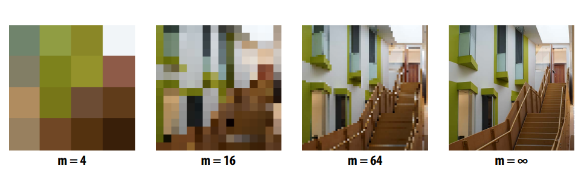

经验法则: 无偏估计器具有更可预测的行为/更少的参数需要调整以获得正确的结果
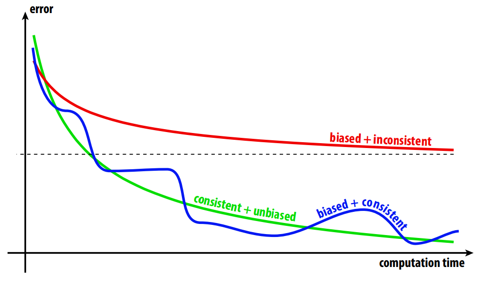

### Naive Path Tracing
如果使用最原始的PT去做光线追踪， 就会出现。
* The probability we sample the reflected direction: Zero
* The Probability we hit a point light source: Zero 

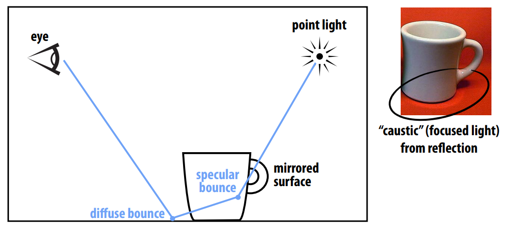
如果沿着各个方向随机的发射光线，specular bounce的次数会很少, `因为光线数量很少某些渲染效果就无法呈现（比如焦散）` 
Naive path tracing ==misses== important phenomena! (Unfortunately: the result is biased)
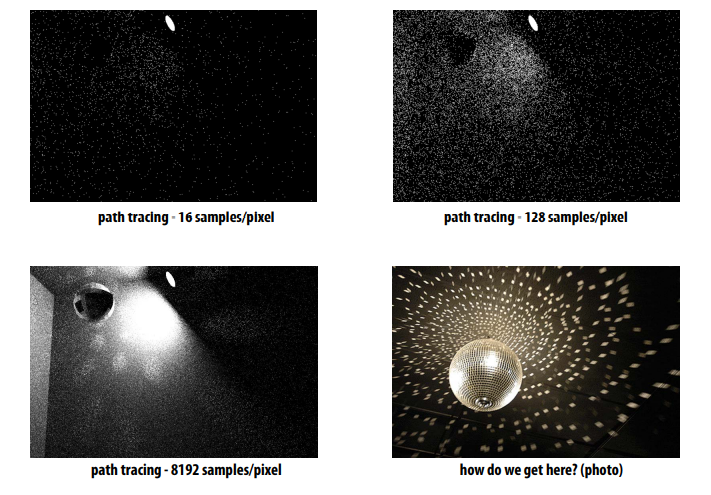

从上图可以看到需要将增加采样数量增加到非常大才能出现渲染效果，此时普通的蒙特卡洛计算收敛太慢，从实际应用来说需要更好的采样方式，重要性采样就发挥作用了。

###  Importance Sampling in Rendering
**重要性采样**
>方差： 参考[Variance wiki](https://en.wikipedia.org/wiki/Variance) it is often represented by $\sigma^2 \,, s^{2} \,, \operatorname{Var}(X) \,, V(X)$
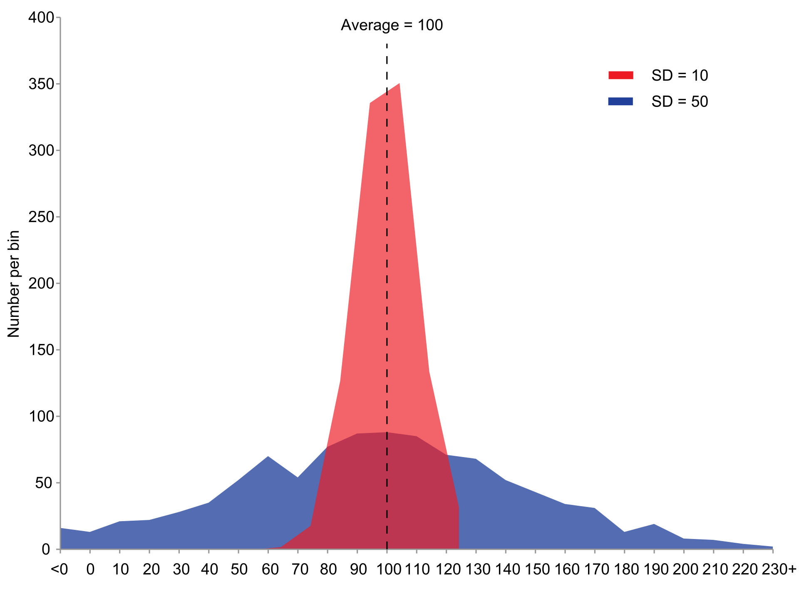
定义：
$$\sigma^2 = E[(X-\mu)^2] \quad or \quad  Var(X) = \frac{\sum(X-\mu)^2}{N}\\
  {\mu =\operatorname {E} [X]}\\
  \operatorname{Var}(X) = E[X^2] - E[X]^2 \\
$$

 **Simple idea:** 
 * 根据对积分贡献的大小来采样 sample the integrand according to how much we expect it to contribute to the integral

**naive Monte Carlo  Vs Importance sample Monte Carlo:** 
$$
V(\Omega)\frac{1}{n}\sum_{i=1}^Nf(x_i)  \quad  \text{VS}  \quad  \frac{1}{n}\sum_{i=1}^N\frac{f(x_i)}{p(x_i)}
$$
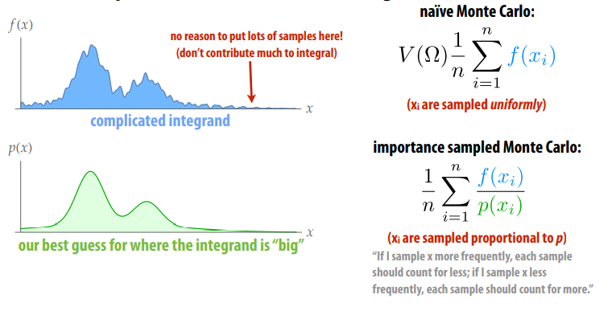

- 根据采样的分布权重区采样(xi are sampled proportional to p)
- 如果更频繁地对 x 进行采样，则每个样本的计数应该更少； 如果采样 x 的频率较低，则每个样本都应该计数更多. `样本取自与被积函数中的函数相似的分布，则收敛得更快`

### 光线传输算法
光线传输空间公式 Path Space Formulation of Light Transport
$$
L_o(\mathbf{p},\omega_o)=L_e(\mathbf{p},\omega_o) + \int_{\mathcal{H}^2}f_r(\mathbf{p},\omega_i\to\omega_o)L_i(\mathbf{p},\omega_i)\cos\theta \ \text{d}\omega_i
$$

考虑重要性采样，由重要性采样的公式可以知道： $p(x)$ 应该接近 $f_r(\mathbf{p},\omega_i\to\omega_o)L_i(\mathbf{p},\omega_i)\cos\theta$，但我们并不知道这个函数的具体表达式，只能去一步步推导。

分别考虑乘积项
- $f_r(\mathbf{p},\omega_i\to\omega_o)$：我们可以根据BRDF来确定采样规律，如遇到镜面就往镜面反射方向采样
- $L_i(\mathbf{p},\omega_i)$：我们可以根据光源来确定采样规律，如在光源方向采样

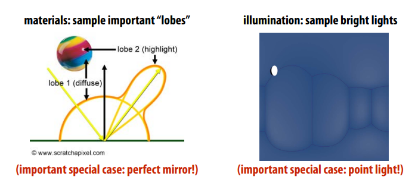

#### Bidirectional Path Tracing
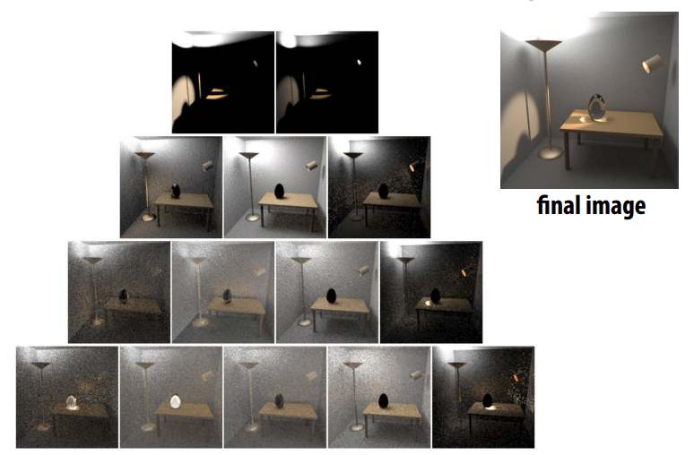

* 正向路径跟踪：无法控制路径长度（命中n 次反弹后亮，或被俄罗斯轮盘赌终止）, 场景中大部分位置与光源之间都存在阻隔，故直接在灯光区域采样积分也无法起作用.
* 想法：直接连接来自光、眼睛的路径（“双向” `要求与光源之间无阻隔`） 
* 重要性采样： 需要根据采样策略仔细权衡路径的贡献。 
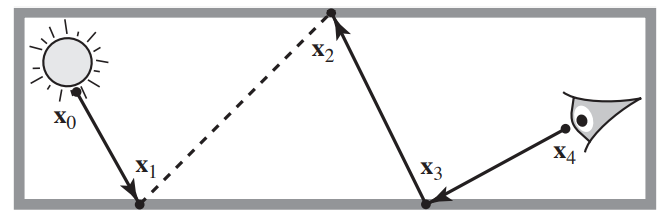

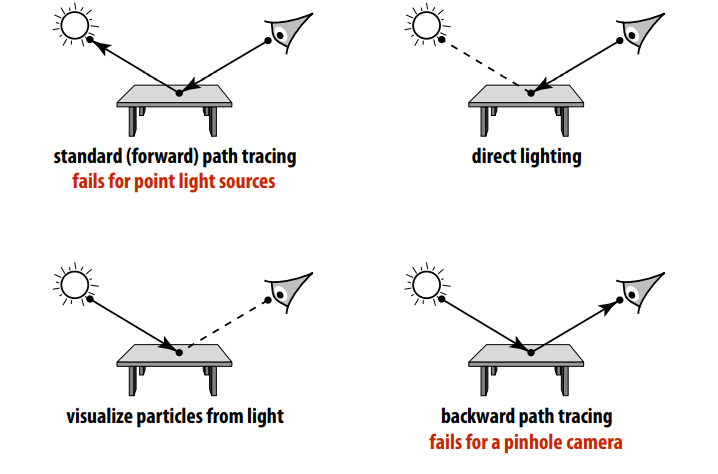

#### Metropolis-Hastings Algorithm

双向路径追踪算法，如何选择光源出发的路径? 
* **核心是选择路径：** 有时候，光源的大部分路径都是无效的, 这时候可以使用Metropolis_Light_transport方法。
.png)

一旦我们找到一条好路径，就干扰采样光线以找到附近的“好”路径。（Idea: Once we fnd a good path, perturb it to fnd nearby “good” paths）
- 马尔可夫链帮助采样
  - 马尔可夫链：根据当前样本，根据一个概率分布，生成下一个相近的样本
- Jumping from the current sample to the next with some PDF
- 可以做到以任意函数为pdf生成样本

Cons Vs Pros
- 好处：Very good at locally exploring difficult light paths 有了种子，就能找到更多相似的
  - Caustics, Indirect Light Source
- 缺点：
  - Difficult to estimate the convergence rate; 而Monte Carlo可以估计Variance，可以量化
  - Does not guarantee equal convergence rate per pixel
  - So, usually produces “dirty” results 看上去比较脏
  - Therefore, usually not used to render animations（帧和帧之间会dirty 闪烁）

> 参考 [Metropolis-Hastings Algorithm—(wikipedia_MHA)](https://en.wikipedia.org/wiki/Metropolis%E2%80%93Hastings_algorithm) 

**Metropolis-Hastings: Sampling an Image**
标准蒙特卡洛：对独立样本求和
MH：随机游走相关样本（“突变”）
基本思想：倾向于采取增加样本值的措施

- Want to take samples proportional to image density f
- Start at random point; take steps in (normal) random direction
- Occasionally jump to random point (ergodicity)
- Transition probability is “relative darkness” f(x’)/f(xi) 

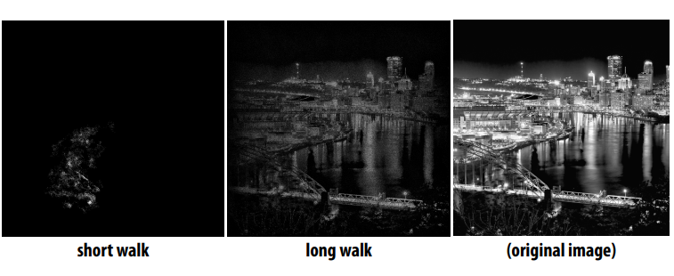

**Metropolis Light Transport** 
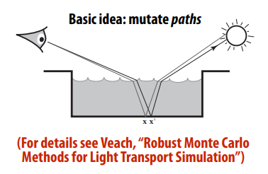
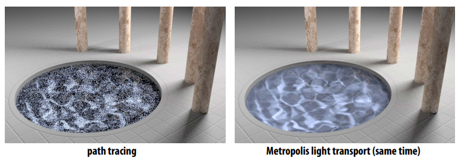

#### 多重重要性采样（MIS）和重要性重采样（RIS）的区别？
1. 多重重要性采样采样样本只有一个， 在额外乘以另外一个样本的权重。
2. 重要性重采样先采样一个样本，然后在采样的样本中再次采样。
  * 优点, 使用 RIS 可以在直接采样光中降低 33% 的方差，使用 RIS 来采样 BRDF 也同样会带来更好的结果

#### Multiple Importance Sampling (MIS)
* Many possible importance sampling strategies 
* Which one should we use for a given integrand? 
* MIS: combine strategies to preserve strengths of all of them 
* Balance heuristic is (provably!) about as good as anything:
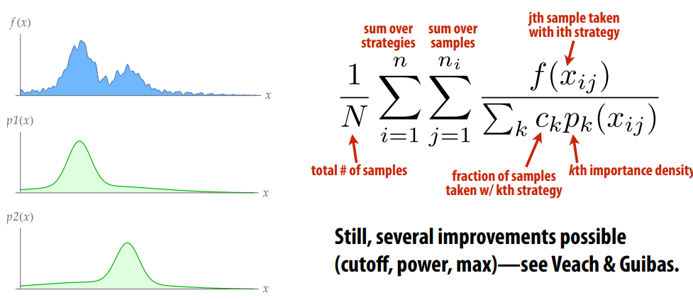
* Still, several improvements possible (cutoff, power, max)—see Veach & Guibas.

**也可以写成如下形式：**
$\mathrm{MIS}$ 提供了一种将多种采样分布结合起来的无偏估计的方法，假设现在有 $n$ 种采样分布，每种采样 分布采样了 $n_i$ 个点，则最后的估计为:
$$
F=\sum_{i=1}^n \frac{1}{n_i} \sum_{j=1}^{n_i} w_i\left(X_{i, j}\right) \frac{f\left(X_{i, j}\right)}{p_i\left(X_{i, j}\right)} \\
$$
可以看到其本身依旧是一个蒙特卡洛积分的形式，只不过对于**从不同的采样分布中采样的结果都乘上了一个与之对应的权重$w_i\left(X_{i, j}\right)$**. 要想保证这样的estimator依旧是无偏的则需要满足以下两个条件：
1. $\sum_{i=1}^n w_i(x)=1$ whenever $f(x) \neq 0$, and
2. $w_i(x)=0$ whenever $p_i(x)=0$

公式证明如下： 
$$
\begin{aligned}
E[F] & =\sum_{i=1}^n \frac{1}{n_i} \sum_{j=1}^{n_i} \int_{\Omega} \frac{w_i(x) f(x)}{p_i(x)} p_i(x) d x \\
& =\int_{\Omega} \sum_{i=1}^n w_i(x) f(x) d x \\
& =\int_{\Omega} f(x) d x
\end{aligned}
$$

效果对比：
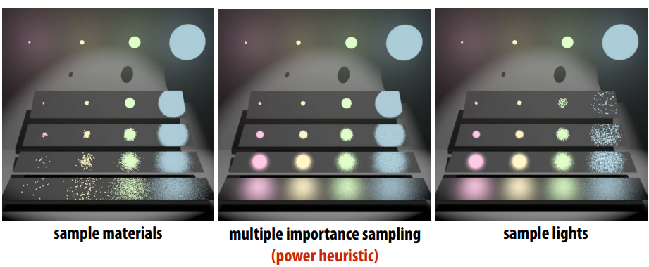

#### RIS  重要性重采样
Given the samples $\mathbf{X}$ and $Y$ from the importance resampling process, we develop the RIS estimator as a form of weighted importance sampling:
$$
\hat{I}_{\text {ris }}=\frac{1}{N} \sum_{i=1}^N w\left(\mathbf{X}_i, Y_i\right) \frac{f\left(Y_i\right)}{g\left(Y_i\right)}
$$
The weighting function $w$ must be chosen to correct for both the fact that $g$ is unnormalized and for the fact that the density of $Y$ only approximates $g$. The appropriate choice of $w$ is surprisingly simple. It is the average of the weights computed in the resampling step:
$$
w\left(\mathbf{X}_i, Y_i\right)=\frac{1}{M} \sum_{j=1}^M w_{i j}
$$
Combining these two equations gives the RIS estimate:
$$
\hat{I}_{r i s}=\frac{1}{N} \sum_{i=1}^N\left(\frac{f\left(Y_i\right)}{g\left(Y_i\right)} \cdot \frac{1}{M} \sum_{j=1}^M \frac{g\left(X_{i j}\right)}{p\left(X_{i j}\right)}\right)
$$
When M = 1, RIS reduces to standard importance sampling。 For the RIS estimate to be unbiased, two conditions must hold. First, g and p must be greater than zero everywhere that f is non-zero [Tal05]. Second, M and N must be greater than zero
### Sampling Patterns & Variance Reduction

#### Sampling Patterns
* Want to pick samples according to a given density 
* But even for uniform density, lots of possible sampling patterns 
* Sampling pattern will affect variance (of estimator!
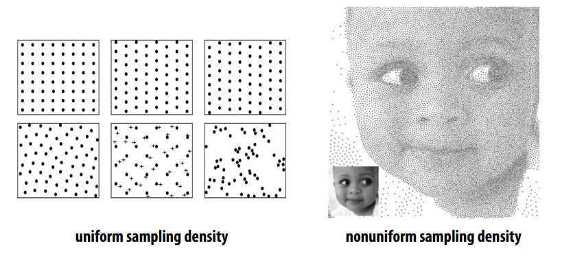

我们如何从 [0,1] 中选择 n 个值？ 
* 可以随机均匀地选取 n 个样本 或者：
* 分成 n 个 bin，在每个 bin 中均匀选取.
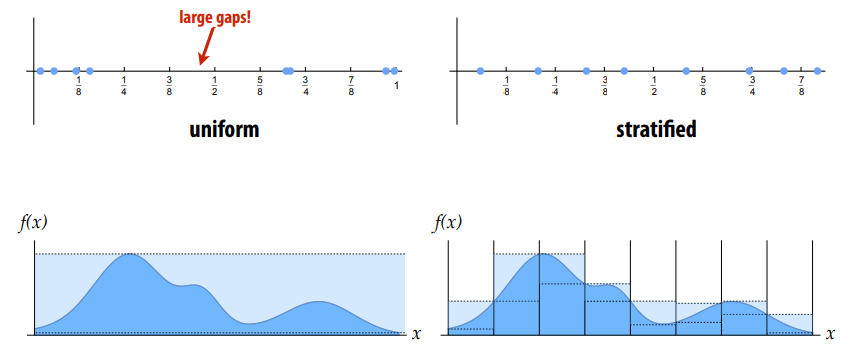

>Note: 
>* 事实分层估计永远不会有更大的方差（通常更低）
>* Inturion：每个层都有较小的方差。 （通过期望的线性证明！linearity of expectation! ）

渲染/图形中的分层采样:
* Simply replacing uniform samples with stratifed ones already improves quality of sampling for rendering (…and other graphics/visualization tasks!)
* 参考文章： Jim Arvo, “Stratifed Sampling of Spherical Triangles” (SIGGRAPH 1995)

**Low-Discrepancy Sampling**
低差异序列：
* “No clumps(团块)” hints at one possible criterion for a good sample: 
* Number of samples should be proportional to area 
* Discrepancy measures deviation from this ideal
* 参考文章： Dobkin et al, “Computing Discrepancy w/ Applications to Supersampling” (1996)
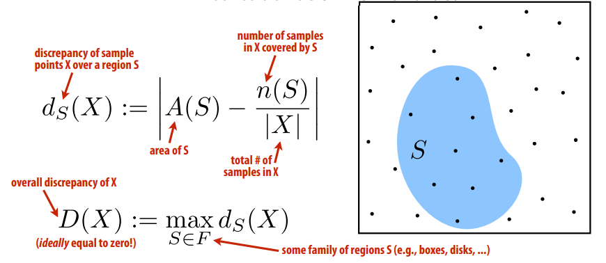

#### Quasi-Monte Carlo methods (QMC)
用低差异样本替换真正随机的样本.
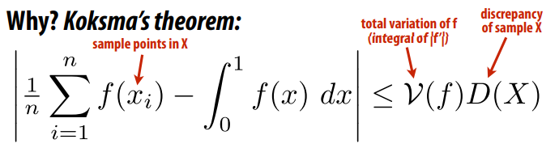
* 对于低差异 X，估计接近积分 I.e., for low-discrepancy X, estimate approaches integral 
* 类似的界限可以在更高的维度上显示 Similar bounds can be shown in higher dimensions
* WARNING:：总变化并不总是有界的！ total variation not always bounded!
* WARNING：仅适用于轴对齐框 S 的系列 F！ only for family F of axis-aligned boxes S!
* 例如，边缘可以有任意方向（覆盖）
* 在实践中，Discrepancy仍然是一个非常合理的标准

**Hammersley & Halton Points**
可以轻松生成具有接近最佳差异的样本:  Can easy generate samples with near-optimal discrepancy
* First defne radical inverse φr(i) 
* Express integer i in base r, then refect digits around decimal 
* E.g., φ10(1234) = 0.4321 
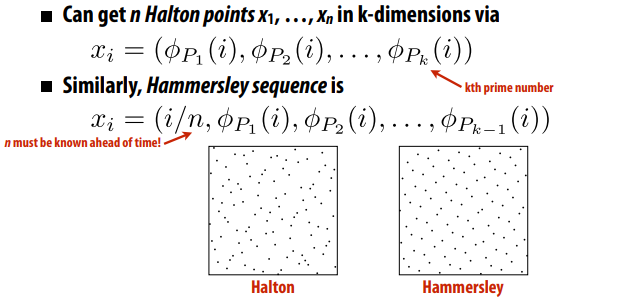

**There’s more to life than discrepancy**
* Even low-discrepancy patterns can exhibit poor behavior
* Want pattern to be anisotropic (no preferred direction) 
* Also want to avoid any preferred frequency (see above!
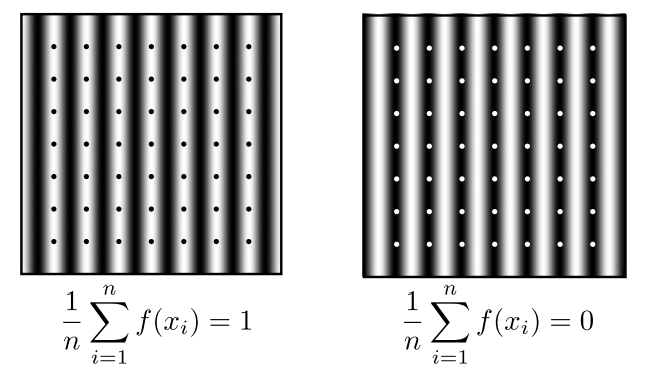

**Adaptive Blue Noise**
蓝噪声的动机： 可以观察到猴子视网膜呈现蓝噪声模式
* 没有明显的首选方向（各向异性）
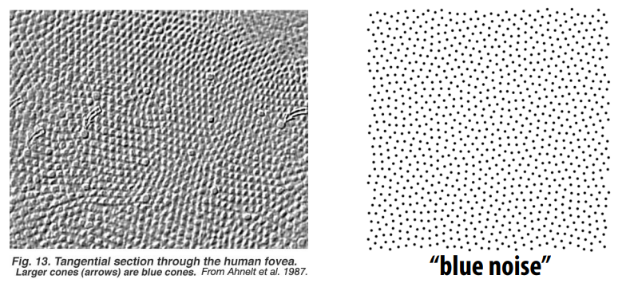

Blue Noise - Fourier Transform
* 可以分析傅里叶域中样本模式的质量 Can adjust cell size to sample a given density (e.g., importance) 
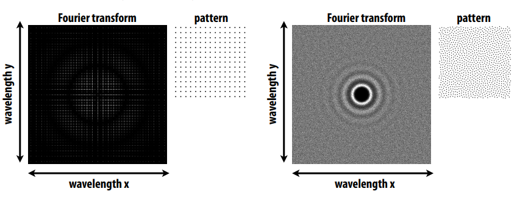
* 规则模式定期有“尖峰” Regular pattern has “spikes” at regular intervals
* 蓝噪声在各个方向的所有频率上均匀分布 Blue noise is spread evenly over all frequencies in all directions
* 明亮的中心“环”对应于样本间距 bright center “ring” corresponds to sample spacing

Can adjust cell size to sample a given density (e.g., importance)
* Computational tradeoff: expensive* precomputation / efficient sampling
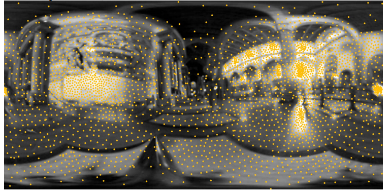
**Spectrum affects reconstruction quality**
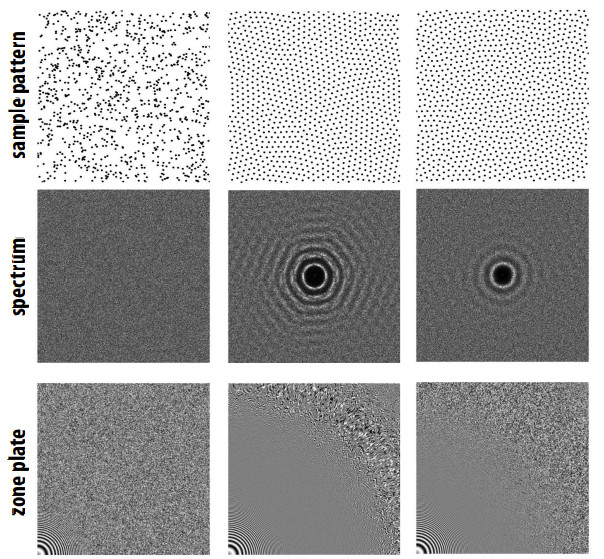

**Poisson Disk Sampling**
How do you generate a “nice” sample? 
* One of the earliest algorithms: Poisson disk sampling 
* Iteratively add random non-overlapping disks (until no space left

**Lloyd Relaxation**
* Iteratively move each disk to the center of its neighbors
* Better spectral quality, slow to converge. Can do better yet..
### efficiently sample from a large distribution 

**Sampling from the CDF** 
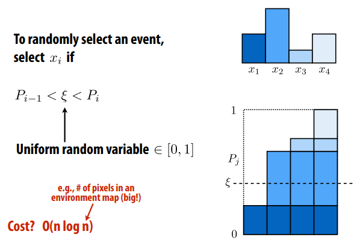

**Alias Table** 

* Get amortized **O(1)** sampling by building “alias table” 
* Basic idea: rob from the rich, give to the poor (**O(n)**): 
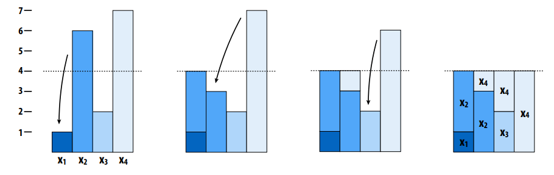

Table just stores **two identities** & **ratio of heights** per column 
> 构建 To sample:
> 1. n个事件则有n个column，分成有空的和溢出的两类
> 2. 对于每个溢出的，找一个有空的，**空多少就从溢出处搬多少过去**，之后溢出处可能溢出，有空或刚满
> 3. 重复步骤2即可

### Other techniques
一些其他技术
#### Photon Mapping
跟踪光中的粒子，在 kd-tree 中沉积“光子”，特别适用于焦散、参与介质（雾）
- Stage 1 — photon tracing
  - 光源出发，Emitting photons from the light source, bouncing them around, finally recording photons on diffuse surfaces
- Stage 2 — photon collection (final gathering)
  - Shoot sub-paths from the camera, bouncing them around, until they hit diffuse surfaces
- Calculation — local density estimation 局部光子密度估计
  - Idea: areas with more photons should be brighter
  - For each shading point, find the nearest N photons (通过树状结构实现算法，N是固定的). Take the surface area they over 面积计算，然后光子密度=光子数量/面积
  - 光子数量少：面积大，噪声大；光子数量大：模糊
- 模糊是因为有偏
  - Local Density estimation dN / dA != ΔN / ΔA 光子密度估计在数量趋向无限时才与真正光子密度相等，所以biased but consistent!

估计某个像素的颜色
- 类似Path Tracing的无偏算法，射出光线之后获得的样本就是对这个像素的估计量，这个估计量的期望和真实一致（也就是说，估计越多越接近真实）
- 而类似Photon Mapping，对于光子密度的估计，“渲染方程是基于光线路径定义的，而Photon Mapping在计算photon密度那一步用一个半径不为0的kernel去加权每个photon的contribution，这和直接计算渲染方程的结果是不一样的。”

#### Vertex Connection and Merging (VCM)

- A combination of BDPT and Photon Mapping
- Key idea:  Let’s not waste the sub-paths in BDPT if their end points cannot be connected but can be merged, but Use photon mapping to handle the merging of nearby “photons”
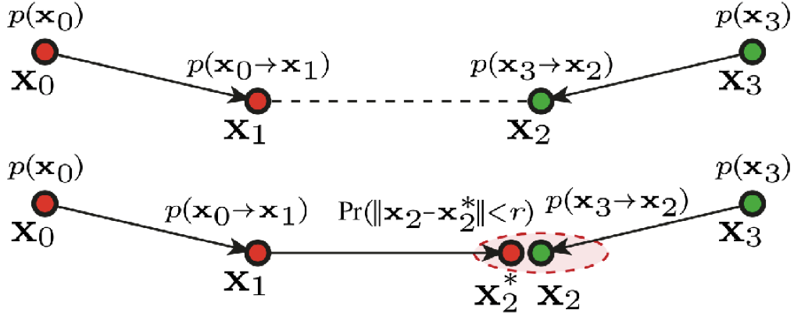

- 比如，$x_2$和$x^{*}_{2}$ 在同一个面上，但是没有重合，按照BDPT，这种就是浪费
- 但是VCM决定利用这种情况，把其中一半光路转化成光子，进行Photon Mapping一样的计算

#### Finite Element Radiosity
适合漫射照明.
* Very different approach: transport between patches in scene 
* Solve large linear system for equilibrium distribution 
* Good for diffuse lighting; hard to capture other light paths
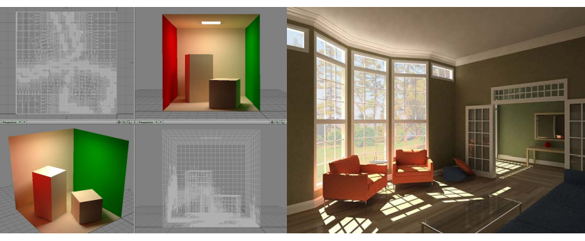
#### Instant Radiosity (IR)

- aka many-light approaches 很多光源的方法
- Key idea: Lit surfaces can be treated as light sources 被照亮的表面就像是光源
- 模拟从光源发出光线，打到的地方相当于二级光源。如果此时Sample某个场景点的颜色，那么遍历这些二级光源，叠加计算即可
- Shoot light sub-paths and assume the end point of each sub-path is a Virtual Point Light (VPL), Then Render the scene as usual using these VPLs
- Pros: fast and usually gives good results on diffuse scenes
- Cons:
  - Spikes will emerge when VPLs are close to shading points
  - Cannot handle glossy materials

### Consistency & Bias in Rendering Algorithms
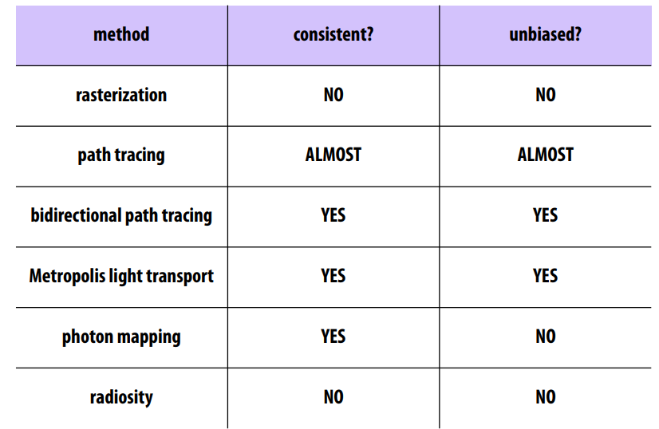

**参考资料**：
1. [Variance wiki](https://en.wikipedia.org/wiki/Variance)
2. [veach_thesis](http://graphics.stanford.edu/papers/veach_thesis/)
3. [Jim Arvo, “Stratifed Sampling of Spherical Triangles” (SIGGRAPH 1995)](https://www.graphics.cornell.edu/pubs/1995/Arv95c.pdf)
4. [如何理解 (un)biased render？ - 知乎](https://www.zhihu.com/question/26683585)
5. [Games 101]()
6. [Importance Resampling for Global Illumination
]()
