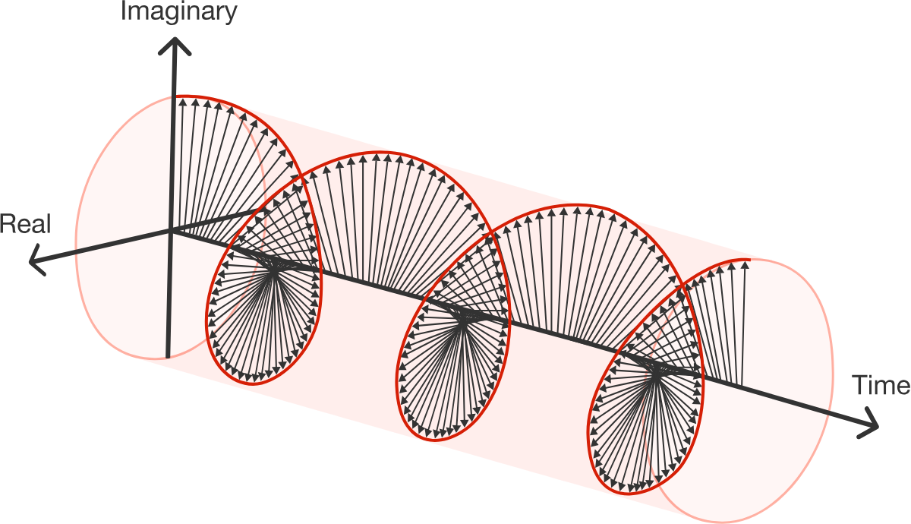
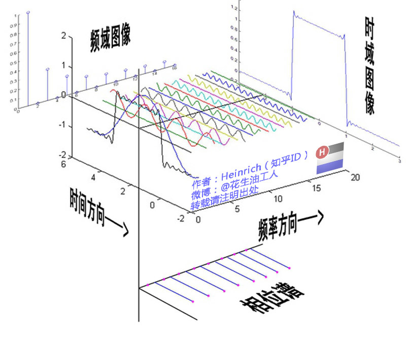

# 傅里叶变换推导

**Prerequisite**

接上篇文章知道[傅里叶级数展开](https://zhuanlan.zhihu.com/p/545524628)如下：
$$
\begin{align*}
    f(t) &= a_0 + \sum_{n = 1}^{\infty}[a_n \cos(nw t) +b_n \sin(nw t)]  \tag{1} \\
    a_0 &= \frac{1}{T}\int_{0}^{T}f(t)\text{d}t \\
    a_n &= \frac{2}{T}\int_{0}^{T}f(t)\cos(nw t)\text{d}t \\
    b_n &= \frac{2}{T}\int_{0}^{T}f(t)\sin(nw t)\text{d}t \qquad (n \in 1, 2, 3, \dotsb)
\end{align*}\\
$$

### 傅里叶级数的复数形式
由欧拉公式可知
$$
\sin x = \frac{e^{ix} - e^{-ix}}{2i} \\
\cos x = \frac{e^{ix} + e^{-ix}}{2} \\
$$
带入(1)式中：
$$
\begin{align*}
    f(t) &= a_0 +  \sum_{n=1}^{N}[a_n \frac{e^{inwt} + e^{-inwt}}{2} -i b_n \frac{e^{inwt} - e^{-inwt}}{2} ] \\
    & = a_0 + \sum_{n=1}^{N}[\frac{a_n - ib_n}{2}e^{inwt} + \frac{a_n + ib_n}{2}e^{-inwt}] \\
    & = a_0 + \sum_{n=1}^{N}\frac{a_n - ib_n}{2}e^{inwt} + \sum_{n=1}^{N}\frac{a_n + ib_n}{2}e^{-inwt}\\
    & = \sum_{i = 0}^{0}a_0e^{inwt}  + \sum_{n=1}^{N}\frac{a_n - ib_n}{2}e^{inwt} + \sum_{n = -N}^{-1}\frac{a_{-n} + ib_{-n}}{2}e^{inwt} \\
    &=\sum_{i= -N}^{N}C_ne^{inwt} \\
\end{align*}\\
C_n =
\begin{cases}
 a_0 ,\qquad  (n = 0) \\
 \frac{a_n - ib_n}{2}, \qquad  (n \in 1, 2, 3, 4, \dotsb )\\
 \frac{a_n + ib_n}{2}, \qquad  (n \in -1, -2, -3, -4, \dotsb)\\
\end{cases}\\
$$
求解各项系数$a_0,a_n, b_n$ : 
$$
\begin{align*}
    当 \, n = 0: \\
    C_n &= a_0 = \frac{1}{T}\int_{0}^{T}f(t)\text{d}t \\
    当 \, n = 1, 2, 3, \dotsb : \\
    C_n &= a_n = \frac{1}{2}(a_n - ib_n) \\
    & = \frac{1}{2}(\frac{2}{T}\int_{0}^{T}f(t)\cos(nwt)\text{d}t - i\frac{2}{T}\int_{0}^{T}f(t)\sin(nwt)\text{d}t) \\
    & = \frac{1}{T}\int_{0}^{T}f(t)\left[\cos(nwt) - i\sin(nwt)\right] \text{d}t\\
    & = \frac{1}{T}\int_{0}^{T}f(t)e^{-inwt} \text{d}t \\
    当 \, n = -1, -2, -3, \dotsb : \\
    C_n &= b_n  = \frac{1}{2}(a_n + ib_n) \\
    & = \frac{1}{2}(\frac{2}{T}\int_{0}^{T}f(t)\cos(-nwt)\text{d}t + i\frac{2}{T}\int_{0}^{T}f(t)\sin(-nwt)\text{d}t) \\
    & = \frac{1}{T}\int_{0}^{T}f(t)\left[\cos(nwt) - i\sin(nwt)\right] \text{d}t\\
    &= \frac{1}{T}\int_{0}^{T}f(t)e^{-inwt} \text{d}t \\
\end{align*}\\
$$
由以上推导可以知道：
**对于一个周期为T的函数$f(t) = f(t + T)$  展开为傅里叶级数，他的复数形式为：**
$$
\begin{align*}
    f_T(t) &= \sum_{n = -N}^{N}C_ne^{inwt}  \tag{2} \\ 
    C_n &= \frac{1}{T}\int_0^{T}f(t)e^{-inwt}\text{d}t\\
\end{align*}\\
$$

由欧拉公式知道复指数$e^{-inwt}$为一个螺旋线， 所以$C_n$为垂直频率轴到螺旋线上的距离。（ps：如果f(t)不是直线是的，那就不是等距螺旋线了。）

### 傅里叶变换 FT
如果(2)式中$T = + \infty$即寻找一个**非周期函数的变换** ，这就是傅里叶变换. 
$$
\lim_{T \rightarrow +\infty}f_T(t) = f(t)  \\
$$
所以有:
$$
T \rightarrow + \infty  \Longrightarrow \omega = \frac{2\pi}{T} \rightarrow 0\\
\sum_{-N}^{N}\Delta \omega  \Longrightarrow \int_{-\infty}^{+\infty}\text{d}\omega\\
n\Delta \omega \Longrightarrow \omega\\
$$
$$
\begin{align*}
    f(t) &= \lim_{T \rightarrow + \infty}f_T(t) = \sum_{n = -N}^{N}[\frac{1}{T}\int_0^{T}f(t)e^{-inwt}\text{d}t]e^{inwt}\\
    & =\sum_{n = -N}^{N}[\frac{w}{2\pi} \int_{-\infty}^{+\infty}f(t)e^{-inwt}\text{d}t ]e^{inwt}\\
    &= \frac{1}{2\pi} \sum_{n = -N}^{N}[\int_{-\infty}^{+\infty}f(t)e^{-inwt}\text{d}t ]e^{inwt}w\\
    &=\frac{1}{2\pi}\int_{-\infty}^{+\infty}[\int_{-\infty}^{+\infty}f(t)e^{-iwt}\text{d}t]e^{iwt}\text{d}w\\
    F(w) &= \int_{-\infty}^{+\infty}f(t)e^{-iwt}\text{d}t  \tag{3}\\
    f(t) &= \frac{1}{2\pi}\int_{-\infty}^{+\infty} F(w) e^{iwt}\text{d}w\\
\end{align*}\\
$$ 
其中有：
$$
\begin{cases}
    C_n = \frac{1}{T}\int_0^{T}f(t)e^{-inwt}\text{d}t \\
    \\
    f(t) = \sum_{i= -N}^{N} C_ne^{inwt}
\end{cases}\\
$$
其中F(w)为傅里叶变换， f(t)为逆变换。至此就明白前面所说的：
**原函数f(t)在复指数基函数$h(t)=e^{-iwt}$上的投影 = 原函数f(t)傅里叶展开的系数 $C_n$ ，这系数就组成了频域。 而$C_n$与各个复指数基函数h(t)组合就恢复了f(t). f(t)构成了时域。 通过复指数$h(t) = e^{inwt}$实现频域到时域的双向转换**

### 傅里叶变换(Fourier Series)的频谱图
这个图是大佬的这篇[傅里叶分析之掐死教程](https://zhuanlan.zhihu.com/p/19763358)，个人觉得非常形象生动引用下。

**参考资料：**
[Fourier_series]
(https://en.wikipedia.org/wiki/Fourier_series)

[Fourier transform]
(https://en.wikipedia.org/wiki/Fourier_transform)

[傅里叶级数与傅里叶变换](https://www.bilibili.com/video/BV1jt411U7Bp?share_source=copy_web&vd_source=e84f3d79efba7dc72e6306f35613222e)

[傅里叶分析之掐死教程]
(https://zhuanlan.zhihu.com/p/19763358)

