# 图形学中的数学知识点

**Prerequsite**

本文主要是为记录图形学学习过程中遇到的数学知识点，内容包含微积分，线性代数，数学分析，复变函数，场论等知识。以后会持续更新。。。


### 矢量运算 Vector

#### 定义
向量（欧几里得）：具有大小和方向的几何实体。
$$
\mathbf{p} = 
\begin{bmatrix}
    p_x\\
    p_y\\
    p_z\\
\end{bmatrix} \in \mathbf{R}^{3} \,,\qquad \mathbf{0} = 
\begin{bmatrix}
    0\\
    0\\
    0\\
\end{bmatrix}\\
$$
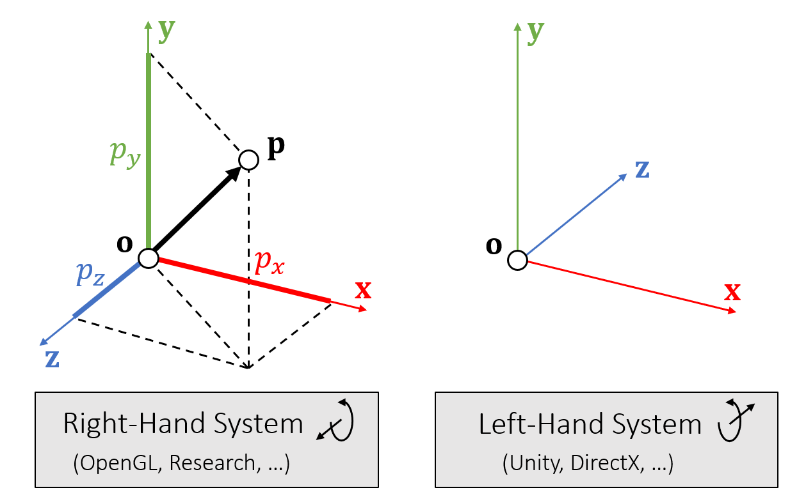

设定这个坐标系区别主要还是因为屏幕空间：
左手好处： 物体在屏幕里面，物体的xy坐标都是正值  

#### 加减法
$$
\mathbf{p}\pm\mathbf{q}=
\begin{bmatrix}
    p_x + q_x\\
    p_y + q_y\\
    p_z + q_z\\
\end{bmatrix}\\
$$
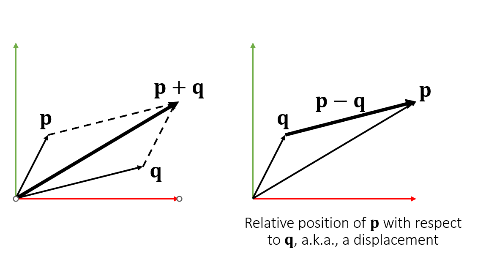

#### 点乘
$$
\mathbf{p}\cdot\mathbf{q}=p_{x}q_{x}+p_{y}q_{y}+p_{z}q_{z}=\mathbf{p}^{\mathrm{{T}}}\mathbf{q} =||\mathbf{p}|||\mathbf{q}||\cos\theta \\
$$
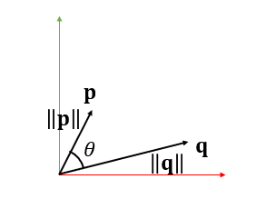
运算法则： 
* $\mathbf{p}\cdot(\mathbf{q}+\mathbf{r})=\mathbf{p}\cdot\mathbf{q}+\mathbf{p}\cdot\mathbf{r}$
* $\mathbf{p}\cdot\mathbf{p}=||\mathbf{p}||^{2}$

#### 叉乘
叉积的结果是一个向量:
$$
\mathbf{r}=\mathbf{p}\times\mathbf{q}=
\begin{bmatrix}
    p_{y}q_{z}-p_{z}q_{y}\\
    p_{z}q_{x}-p_{x}q_{z}\\
    p_{x}q_{y}-p_{y}q_{x}\\
\end{bmatrix}\\
$$
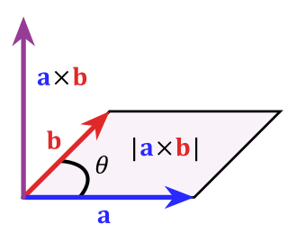 
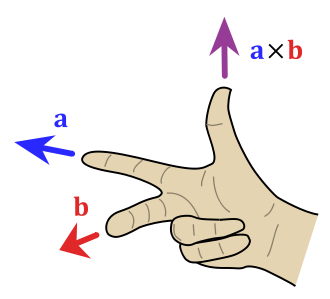

运算性质：
* ${\mathbf{r}}\cdot{\mathbf{p}}=0;\ {\textbf{r}}\cdot{\mathbf{q}}=0;\ {\mathrm{~}}\ \|{\mathbf{r}}\|=\|{\mathbf{p}}\|\Vert{\mathbf{q}}\|\,\sin\theta$
* $\mathbf{p}\times\mathbf{q}=-\,\mathbf{q}\times\mathbf{p}$
* 叉乘的平方 = 向量平方的乘积 - 点乘的平方
$$
\begin{aligned}
\mathbf{(p \times q)^2} &= \left\|\left\langle P_y Q_z-P_z Q_y, P_z Q_x-P_x Q_z, P_x Q_y-P_y Q_x\right\rangle\right\|^2 \\
&= \left(P_y Q_z-P_z Q_y\right)^2+\left(P_z Q_x-P_x Q_z\right)^2+\left(P_x Q_y-P_y Q_x\right)^2 \\
& = \left(P_y^2+P_z^2\right) Q_x^2+\left(P_x^2+P_z^2\right) Q_y^2+\left(P_x^2+P_y^2\right) Q_z^2- 2 P_x Q_x P_y Q_y-2 P_x Q_x P_z Q_z-2 P_y Q_y P_z Q_z \\
& =(\mathbf{p}^2)(\mathbf{q}^2)-(\mathbf{p} \cdot \mathbf{q})^2
\end{aligned}\\
$$
#### 应用实例：

1. 求解三角形面积和法向量：
* 边向量：
$\begin{array}{c c}{{\mathbf{x}_{10}=\mathbf{x}_{1}-\mathbf{x}_{0}~~~~}}&{{\mathbf{x}_{20}=\mathbf{x}_{2}-\mathbf{x}_{0}}}\end{array}$

* 法线：
$\mathbf{n}=(\mathbf{x}_{10}\times\mathbf{x}_{20})/\|\mathbf{x}_{10}\times\mathbf{x}_{20}\|$

* 面积：
$$
\begin{align*}
A &=\|\mathbf{x}_{10}\|h/2\\ 
&=\|\mathbf{x}_{10}\||\mathbf{x}_{20}\|\sin\theta/2\\
&=\|\mathbf{x}_{10}\times\mathbf{x}_{20}\|/2\\
\end{align*}\\
$$
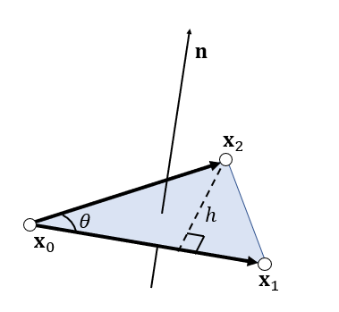

* 叉积同时给出法线和面积。
* 法线取决于三角形索引顺序，也称为拓扑顺序

1. 测试点是否在三角形内
这个一般用于光栅化算法中详情参看[测试点是否在三角形内](https://zhuanlan.zhihu.com/p/549175616)
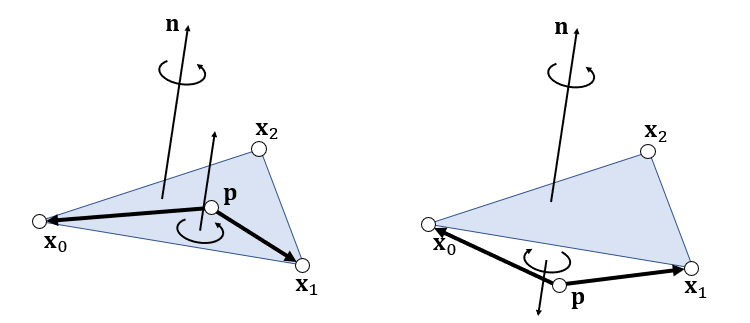
通过叉乘判断是否同方向:
$$
\begin{array}{l}
{{(\mathbf{x}_{0}-\mathbf{p})\times(\mathbf{x}_{1}-\mathbf{p})\cdot\mathbf{n}\gt 0}}\\ 
{{(\mathbf{x}_{1}-\mathbf{p})\times(\mathbf{x}_{2}-\mathbf{p})\cdot\mathbf{n}\gt 0}}\\
 {{(\mathbf{x}_{2}-\mathbf{p})\times(\mathbf{x}_{0}-\mathbf{p})\cdot\mathbf{n}\gt 0}}
\end{array}
$$
```c++
函数 SameSide(p1,p2, a,b)
    cp1 = CrossProduct(ba, p1-a)
    cp2 = CrossProduct(ba, p2-a)
    如果 DotProduct(cp1, cp2) >= 0 则返回 true
    否则返回假
函数 PointInTriangle(p, a,b,c)
    如果 SameSide(p,a,b,c) 和 SameSide(p,b,a,c)
        和 SameSide(p,c, a,b) 然后返回 true
    否则返回假
```
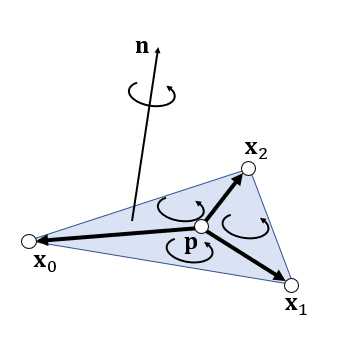

3. 重心坐标系
   这个的具体应用案例：
   [在三角形生成均匀采样点](https://zhuanlan.zhihu.com/p/552773776); 
   [光栅化过程插值(也可以用于判断点是否在三角内)计算](https://zhuanlan.zhihu.com/p/549175616), `在实践中并不是计算机重心坐标，而是扫描线算法去线性计算光栅化后的颜色。 但是现代GPU其实是完全有能力对per pixel计算的。`
   
$$
S_{A_2} ={\textstyle\frac{1}{2}}(\mathbf{x}_{0}-\mathbf{p})\times(\mathbf{x}_{1}-\mathbf{p})\cdot\mathbf{n}={\left\{\begin{array}{l l}{{\frac{1}{2}}||(\mathbf{x}_{0}-\mathbf{p})\times(\mathbf{x}_{1}-\mathbf{p})|| \qquad \mathbf{inside}}\\ {-{\frac{1}{2}}||(\mathbf{x}_{0}-\mathbf{p})\times(\mathbf{x}_{1}-\mathbf{p})|| \qquad \mathbf{outside}}
\end{array}\right.}
$$
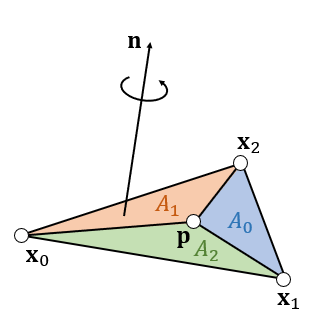
$$
\begin{array}{l}
A = A_{0}+A_{1}+A_{2}\\
{{A_{2} = \frac{1}{2}({\bf x}_{0}-{\bf p})\times({\bf x}_{1}-{\bf p})\cdot{\bf n}}}\\ {{A_{0}=\frac{1}{2}({\bf x}_{1}-{\bf p})\times({\bf x}_{2}-{\bf p})\cdot{\bf n}}}\\ {{A_{1}=\frac{1}{2}({\bf x}_{2}-{\bf p})\times({\bf x}_{0}-{\bf p})\cdot{\bf n}}}\\
\end{array}\\
$$
* $b_{0}=A_{0}/A\;\;\;\;\;\;\;b_{1}=A_{1}/A\;\;\;\;\;\;\;b_{2}=A_{2}/A$
* 当点在三角形内部：
$$
\begin{cases}
{b_{0}+b_{1}+b_{2}}=1 \\
{\bf p}=b_{0}{\bf x}_{0}+b_{1}{\bf x}_{1}+b_{2}{\bf x}_{2} = b_{0}{\bf x}_{0}+b_{1}{\bf x}_{1}+(1 - b_{0} - b_{1}){\bf x}_{2} \\
\end{cases}\\
$$
也可以转化成下面的形式来计算：
* [利用向量计算重心坐标](https://youtu.be/HYAgJN3x4GA)
$w_{1}=\frac{A_{x}(C_{y}-A_{y})+(P_{y}-A_{y})(C_{x}-A_{x})-P_{x}(C_{y}-A_{y})}{(B_{y}-A_{y})(C_{x}-A_{x})-(B_{x}-A_{x})(C_{y}-A_{y})}$
$w_{2}={\frac{P_{y}-A_{y}-w_{1}(B_{y}-A_{y})}{C_{u}-A_{y}}}$
$$
\vec{AP} = w_1 \vec{AB} + w_2\vec{AC} \qquad   (w_1 \ge 0, w_2 \ge 0, (w_1 +w_2) \le 1)\\
$$

1. 点和三角形相交

* 首先，找到点与三角形平面时相交𝑡值： 
* 然后检查$p(t)$是否在三角形内里面（参考上面3）。
$$
\begin{gathered}
\left(\mathbf{p}(t)-\mathbf{x}_{0}\right) \cdot \mathbf{x}_{10} \times \mathbf{x}_{20}=0 \\
\left(\mathbf{p}-\mathbf{x}_{0}+t \mathbf{v}\right) \cdot \mathbf{x}_{10} \times \mathbf{x}_{20}=0 \\
t=\frac{\left(\mathbf{p}-\mathbf{x}_{0}\right) \cdot \mathbf{x}_{10} \times \mathbf{x}_{20}}{\mathbf{v} \cdot \mathbf{x}_{10} \times \mathbf{x}_{20}}
\end{gathered}\\
$$
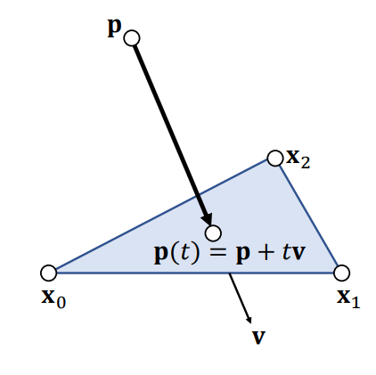


5. 四面体体积
* Edge vectors:
$\mathbf{x}_{10}=\mathbf{x}_{1}-\mathbf{x}_{0}\;\;\;\;\;\mathbf{x}_{20}=\mathbf{x}_{2}-\mathbf{x}_{0}\;\;\;\;\;\;\mathbf{x}_{30}=\mathbf{x}_{3}-\mathbf{x}_{0}$
* Base triangle area:
$A={\frac{1}{2}}\|\mathbf{x}_{10}\times\mathbf{x}_{20}\|$
* Height:
$h={\bf x_{30}}\cdot{\bf n_{\mathrm{\tiny{1}}}\cdot\hat{n}=x_{30}\cdot\frac{x_{10}\times x_{20}}{\|{\bf x_{10}\times x_{20}}\|}}$
* Volume:
$$
\begin{aligned}
V&={\frac{1}{3}}h A={\frac{1}{6}}\mathbf{\mathbf{x}}_{30}\cdot\mathbf{x}_{10}\times\mathbf{x}_{20}\\
&=\frac{1}{6}\left|\begin{array}{cccc}
\mathbf{x}_1 & \mathbf{x}_2 & \mathbf{x}_3 & \mathbf{x}_0 \\
1 & 1 & 1 & 1\\
\end{array}\right| \\
&= \frac{1}{6}\left|\begin{array}{cccc}
\mathbf{x}_{10} & \mathbf{x}_{20} & \mathbf{x}_{30}\\
\end{array}\right| \\
\end{aligned}
$$
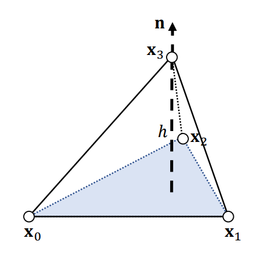
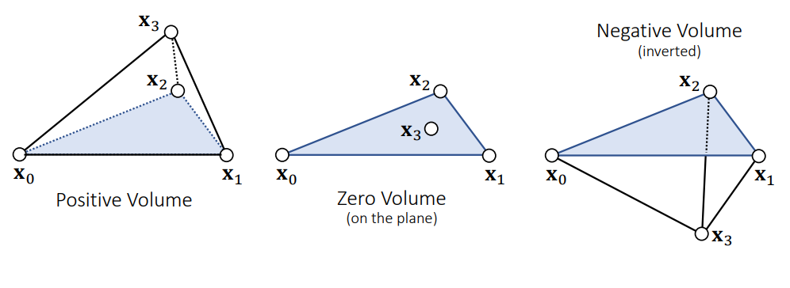

6. 四面体重心计算
* 𝐩 点将四面体分成四个子四面体
$$
\begin{array}{l}{{V_{0}=\mathrm{Vol}({\bf x}_{3},{\bf x}_{2},{\bf x}_{1},{\bf p})}}\\ {{V_{1}=\mathrm{Vol}({\bf x}_{2},{\bf x}_{3},{\bf x}_{0},{\bf p})}}\\ {{V_{2}=\mathrm{Vol}({\bf x}_{1},{\bf x}_{0},{\bf x}_{3},{\bf p})}}\\ {{V_{3}=\mathrm{Vol}({\bf x}_{0},{\bf x}_{1},{\bf x}_{2},{\bf p})}}\end{array}
$$
* 𝐩 在内部当且仅当：𝑉0，𝑉1，𝑉2，𝑉3 > 0。
* 重心权重：
$b_{0}=V_{0}/V\;\;\;\;\;b_{1}=V_{1}/V\;\;\;\;\;b_{2}=V_{2}/V\;\;\;\;\;\;b_{3}=V_{3}/V$
$b_{0}+b_{1}+b_{2}+b_{3}=1$
$\mathbf{p}=b_{0}\mathbf{x}_{0}+b_{1}\mathbf{x}_{1}+b_{2}\mathbf{x}_{2}+b_{3}\mathbf{x}_{3}$

### 矩阵 Matrix

#### 矩阵运算
* $\mathbf{AB}\neq\mathbf{BA}\qquad\qquad\qquad(\mathbf{AB})\mathbf{x}=\mathbf{A}(\mathbf{Bx})$
* $\left(\mathbf{AB}\right)^{\mathrm{T}}=\mathbf{B}^{\mathrm{T}}\mathbf{A}^{\mathrm{T}}\qquad\qquad\left(\mathbf{A}^{\mathrm{T}}\mathbf{A}\right)^{\mathrm{T}}= \mathrm{A}^{\mathrm{T}}\mathrm{A}$
* $\mathrm{Ix}={\bf x}\,\qquad\qquad\qquad\qquad\ \ \ \ \ \ \ \ \ \ \mathrm{AI}=\mathrm{IA}={\bf A}$

正交矩阵是由正交单位向量构成的矩阵：
$\mathbf{A}=[\mathbf{a}_{0}\quad\mathbf{a}_{1}\quad\mathbf{a}_{2}]$， 有：${\bf a}_{i}^{\mathrm{T}}{\bf a}_{j}=\left\{1,\ {\mathrm{if}}\ i=j\atop0.\ {\mathrm{if}}\ i=j\right\}$

性质有$\mathbf{A}^{\mathrm{T}}=\mathbf{A}^{-1}$，计算如下：
$$
\mathbf{A}^{\mathrm{T}} \mathbf{A}=\left[\begin{array}{c}
\mathbf{a}_{0}^{\mathrm{T}} \\
\mathbf{a}_{1}^{\mathrm{T}} \\
\mathbf{a}_{2}^{\mathrm{T}}
\end{array}\right]\left[\begin{array}{lll}
\mathbf{a}_{0} & \mathbf{a}_{1} & \mathbf{a}_{2}
\end{array}\right]=\left[\begin{array}{ccc}
\mathbf{a}_{0}^{\mathrm{T}} \mathbf{a}_{0} & \mathbf{a}_{0}^{\mathrm{T}} \mathbf{a}_{1} & \mathbf{a}_{0}^{\mathrm{T}} \mathbf{a}_{2} \\
\mathbf{a}_{1}^{\mathrm{T}} \mathbf{a}_{0} & \mathbf{a}_{1}^{\mathrm{T}} \mathbf{a}_{1} & \mathbf{a}_{1}^{\mathrm{T}} \mathbf{a}_{2} \\
\mathbf{a}_{2}^{\mathrm{T}} \mathbf{a}_{0} & \mathbf{a}_{2}^{\mathrm{T}} \mathbf{a}_{1} & \mathbf{a}_{2}^{\mathrm{T}} \mathbf{a}_{2}
\end{array}\right]=\mathbf{I}
$$

矢量的叉乘：(满足分配律)
$$
\mathbf{A} \times(\mathbf{B}+\mathbf{C})=\mathbf{A} \times \mathbf{B}+\mathbf{A} \times \mathbf{C}\\
$$

#### 矩阵变换

**旋转矩阵**
旋转可以用正交矩阵表示: 
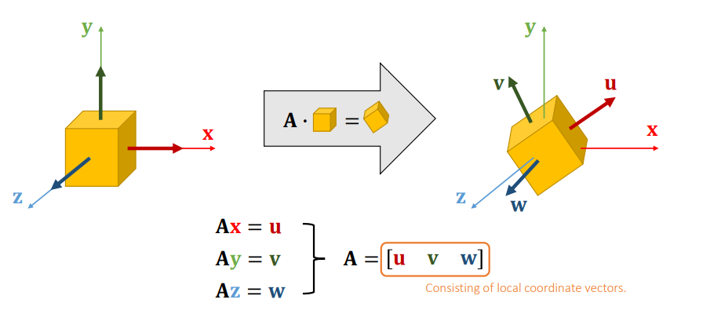

缩放可以用对角矩阵表示:
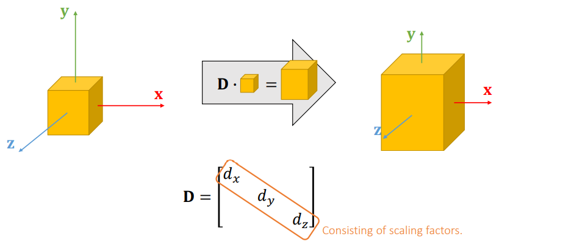

**奇异值分解 Singular Value Decomposition**

* A 矩阵可以分解为：$M=U\Sigma V^{\mathsf{T}}$ 使得$\Sigma$是对角阵，而 𝐔 和 𝐕 是正交的。$\Sigma$为奇异值Singular values
* 核心理解就是： 任何线性变形$M$都可以分解为三个步骤：旋转$U$、缩放$\Sigma$和旋转(投影)$V$，A矩阵的作用就是将一个向量从$U$这组正交基向量旋转到又$V$组成的正交基向量空间中，并且对每个方向进行了缩放，缩放因子就是$\Sigma$中各个奇异值，如果$V$比$U$秩大，则表示有投影变换。
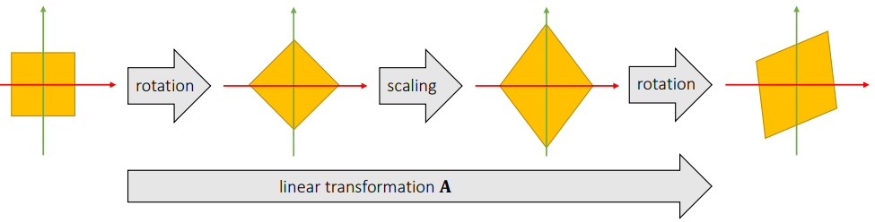

动画展示过程：

* 可以用于图像压缩：
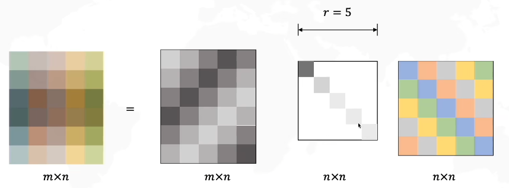
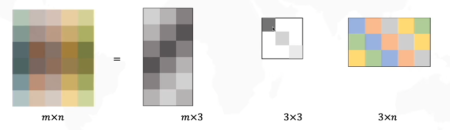


**特征值分解 Eigenvalue Decomposition**

当n阶对称方阵A对应的`行列式值大于0`(即：特征值分解的充要条件是其有n个线性无关的特征向量)时，可以分解为：$A=S\Lambda S^{-1}=S\Lambda S^{T}$， 使得$\bf \Lambda$是对角阵，而$\bf S$是正交的。$\bf \lambda_i$就是特征矩阵$\bf \Lambda$的特征值eigenvalues。
>证明如下：
$$
\begin{align*}
    A S & =A\,[\,\vec{x}_{1}\quad\vec{x}_{2}\quad\cdots\cdot\quad\vec{x}_{n}\,]=[\,\lambda_{1}\vec{x}_{1}\quad\lambda_{2}\vec{x}_{2}\quad\cdots\quad\lambda_{n}\vec{x}_{n}\,]\\
    & = [{\vec{x}}_{1}\quad{\vec{x}}_{2}\quad\cdot\cdot\cdot\quad \vec{x}]
    \begin{bmatrix}
        \lambda_1 & 0 & \cdots & 0\\
        0 & \lambda_2 & \cdots & 0 \\
        \vdots, & \vdots & \lambda_3 & \vdots \\
        0 & 0 & \cdots & \lambda_4 \\
    \end{bmatrix} \\
    &  = S A 
\end{align*}
$$
> Note: 
> * 奇异值分解和特征值分解的区别在于奇异值有投影变化效果，且都是分解的都是正交矩阵
> * 有投影效应的矩阵不是方阵，没有特征值
> * 对于实对称矩阵，特征向量正交(不对称，有特征值但是特征向量不正交), 如果允许特征值和特征向量是复数，也可以将特征值分解应用于非对称矩阵。

**对称正定性 Symmetric Positive Definiteness**
定义：
* 𝐀 是 s.p.d.  当且仅当$\mathbf{v}^{\mathrm{{T}}}\mathbf{A}\mathbf{v}\gt 0$ 且 𝐯 ≠ 0
* 𝐀 是对称半定的symmetric semi-definite，当且仅当$\mathbf{v}^{\mathrm{{T}}}\mathbf{A}\mathbf{v}\ge 0$ 且 𝐯 ≠ 0

理解正定含义：对于实数有：$d\gt 0\quad\Longleftrightarrow\quad\mathbf{v}^{\mathrm{{T}}}d\mathbf{v}\gt 0$， 对于任何$\mathbf{v} \ne 0$；对于矩阵$\bf v$有：$d_{0},d_{1},\ldots\gt 0$
$$
{\bf v}^{\mathrm{T}}{\bf D}{\bf v}= \mathbf{v}^{\bf T}
\begin{bmatrix}
    \ddots \\
    & d_i \\
    &  & \ddots\\
\end{bmatrix} \bf v  = \sum_{i = 1}^{n}d_iv_i^2 \gt 0
$$
性质：
* 𝐀 是 s.p.d. 如果只有它的所有特征值都是正的。（线性代数知识点）
$$
\mathbf{A}=\mathbf{U D U}^{\mathrm{T}} \text { and } d_{0}, d_{1}, \ldots>0\\
$$
* 特征值分解需要很多计算的时间.
* 在实践中，人们经常选择$a_{i i}>\sum_{i \neq j}\left|a_{i j}\right| \text { for all } i$方法来检查𝐀是否为 s.p.d，对角占优矩阵是 p.d矩阵。 例如: 
$$
\left[\begin{array}{ccc}
4 & 3 & 0 \\
-1 & 5 & 3 \\
-8 & 0 & 9
\end{array}\right] \qquad \begin{aligned}
&4>3+0 \\
&5>1+3 \\
&9>8
\end{aligned}
$$
* 最后，一个 s.p.d. 矩阵必须是可逆的：
$$
\mathbf{A}^{-1}=\left(\mathbf{U}^{\mathrm{T}}\right)^{-1} \mathbf{D}^{-1} \mathbf{U}^{-1}=\mathbf{U D}^{-1} \mathbf{U}^{\mathrm{T}}\\
$$
#### 线性方程组数值解法
许多数值问题都可以转化为求解线性问题：
$$\mathbf{Ax = b}\\$$
计算 $\mathbf{A^-1}$的成本很高，尤其是在$\mathbf{A}$大且稀疏的情况下。 所以不能简单地做:$\mathbf{x = A^{-1}}$

**LU分解**
$\bf{LU}$分解定理：若 $\mathbf{A}$ 的各阶顺序主子式 $\mathbf{D}_{\mathbf{k}} \equiv 0$ ，则 $\mathbf{A}$ 可唯一分解为一个单位下三角矩阵 $\mathbf{L}$ 和一个上 三角矩阵$\mathbf{U}$的乘积的形式，即： $\bf{A=L U}$ 
(1) 直接线性求解器：
* 直接求解器通常基于 LU 分解或其变体：Cholesky、LDLT， ETC…
$$
\mathbf{A}=\mathbf{L U}=\left[\begin{array}{ccc}
l_{00} & & \\
l_{10} & l_{11} & \\
\vdots & \cdots & \ddots
\end{array}\right]\left[\begin{array}{ccc}
\ddots & \ldots & \vdots \\
& u_{n-1, n-1} & u_{n-1, n} \\
& & u_{n, n}
\end{array}\right]
$$
图解如下：
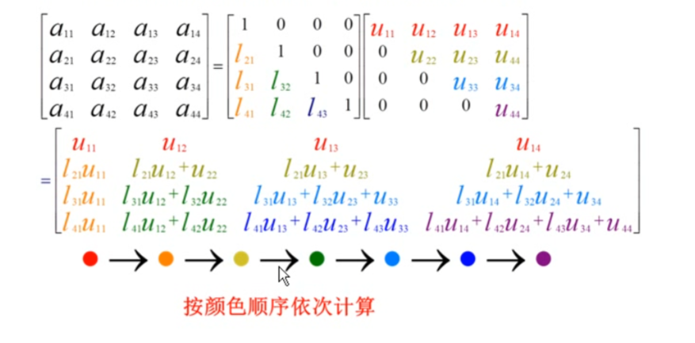
* 先求解: 𝐋𝐲 = 𝐛:
$$
\left[\begin{array}{ccc}
l_{00} & & \\
l_{10} & l_{11} & \\
\vdots & \cdots & \ddots
\end{array}\right]\left[\begin{array}{c}
y_{0} \\
y_{1} \\
\vdots
\end{array}\right]=\left[\begin{array}{c}
b_{0} \\
b_{1} \\
\vdots
\end{array}\right]\\
\begin{aligned}
&y_{0}=b_{0} / l_{00} \\
&y_{1}=\left(b_{1}-l_{10} y_{0}\right) / l_{11}\\
&\cdots \\
\end{aligned}\\
$$
* 然后将上一步求解的$\bf y$带入$\mathbf{Ux=y}$即求解$\bf x$：
$$
\left[\begin{array}{ccc}
\ddots & \ldots & \vdots \\
& u_{n-1, n-1} & u_{n-1, n} \\
& & u_{n, n}
\end{array}\right]\left[\begin{array}{c}
\vdots \\
x_{n-1} \\
x_{n}
\end{array}\right]=\left[\begin{array}{c}
\vdots \\
y_{n-1} \\
y_{n}
\end{array}\right]\\
\begin{aligned}
&x_{n}=y_{n} / u_{n, n} \\
&x_{n-1}=\left(y_{n-1}-u_{n-1, n} x_{n}\right) / u_{n-1, n-1}\\
&\cdots\\
\end{aligned}\\
$$
(2) 迭代线性求解器
* 迭代求解器具有形式:
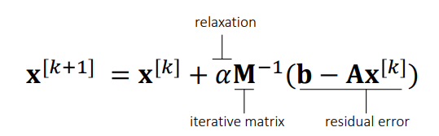

* 原理证明：
$$
\begin{aligned}
\mathbf{b}-\mathbf{A} \mathbf{x}^{[k+1]} &=\mathbf{b}-\mathbf{A} \mathbf{x}^{[k]}-\alpha \mathbf{A} \mathbf{M}^{-1}\left(\mathbf{b}-\mathbf{A} \mathbf{x}^{[k]}\right) \\
&=\left(\mathbf{I}-\alpha \mathbf{A} \mathbf{M}^{-1}\right)\left(\mathbf{b}-\mathbf{A \mathbf { x } ^ { [ k ] }}\right)=\left(\mathbf{I}-\alpha \mathbf{A} \mathbf{M}^{-1}\right)^{k+1}\left(\mathbf{b}-\mathbf{A \mathbf { x } ^ { [ 0 ] }}\right)
\end{aligned} \\
$$
因为$\left(\mathbf{b}-\mathbf{A} \mathbf{x}^{[0]}\right)$是最初迭代形似，满足一下条件时，迭代结果越来越好。
$$
\mathbf{b}-\mathbf{A x} \mathbf{x}^{[k+1]} \rightarrow 0，即\rho(\left(\mathbf{I}-\alpha \mathbf{A} \mathbf{M}^{-1}\right)^{k+1}) \lt 1\\
$$

>Note:  $\rho\left(\mathbf{I}-\alpha \mathbf{A} \mathbf{M}^{-1}\right)^{k+1}$就是谱半径（特征值的最大绝对值）

* M矩阵需要时容易计算的形似，还有其他形式：
  * **Jacobi Method** ： $\bf M = diag(A)$ （对角矩阵）
  * **Gauss-Seidel Method** : $\mathbf{M = lower(A)}$ （下三角矩阵） 
  * 可以加速收敛：Chebyshev、Conjugate Gradient、……

* Pros and Cons ：
  * 实现简单， 不精确的情况快速，可并行
  * 需要满足条件（谱半径< 1,判断谱半径可以简单先判断：Gauss-Seidel A矩阵需要正定，Jacobi A矩阵需要对角占优）, 精确解很慢


### 矩阵求导
详细内容查看[理解矩阵求导](https://zhuanlan.zhihu.com/p/564642767)
### 质点弹簧系统
详细内容查看[物理模拟之深入理解质点弹簧系统](https://zhuanlan.zhihu.com/p/565040287)
### 刚体动力学
详细内容查看[刚体动力学](https://zhuanlan.zhihu.com/p/564852770)

#### 参考资料：
1. [GAMES103-基于物理的计算机动画入门](https://www.bilibili.com/video/BV12Q4y1S73g?p=2&share_source=copy_web&vd_source=e84f3d79efba7dc72e6306f35613222e)
2. [Symmetric Positive Definiteness](https://en.wikipedia.org/wiki/Definite_matrix)
3. [什么是奇异值分解SVD--SVD如何分解时空矩阵](https://www.bilibili.com/video/BV16A411T7zX/?spm_id_from=333.788.recommend_more_video.0&vd_source=1a163e481fb12c5b6ca8a57f994c1d73)
4. [向量微积分----李柏坚](https://www.bilibili.com/video/BV1WD4y1Q731?p=2&vd_source=1a163e481fb12c5b6ca8a57f994c1d73)
5. [【nabla算子】与梯度、散度、旋度](https://www.bilibili.com/video/BV1a541127cX?spm_id_from=333.337.search-card.all.click&vd_source=1a163e481fb12c5b6ca8a57f994c1d73)
6. [Choi and Ko. 2002. Stable But Responive Cloth. TOG (SIGGRAPH)](https://citeseerx.ist.psu.edu/viewdoc/download?doi=10.1.1.518.8136&rep=rep1&type=pdf)
7. [【大学物理】](https://www.bilibili.com/video/BV1qW411H7UX?p=14&vd_source=1a163e481fb12c5b6ca8a57f994c1d73)
8. [矩阵求导法则与性质](https://www.zdaiot.com/Math/%E7%9F%A9%E9%98%B5%E6%B1%82%E5%AF%BC%E6%B3%95%E5%88%99%E4%B8%8E%E6%80%A7%E8%B4%A8/)
9. [图解材料力学](https://youtu.be/DLE-ieOVFjI)
