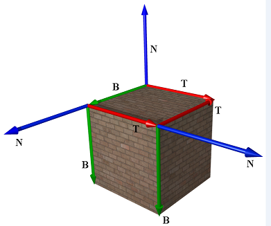
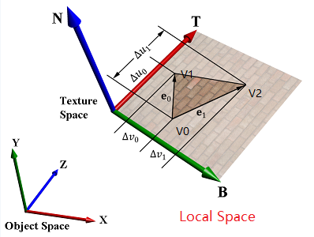
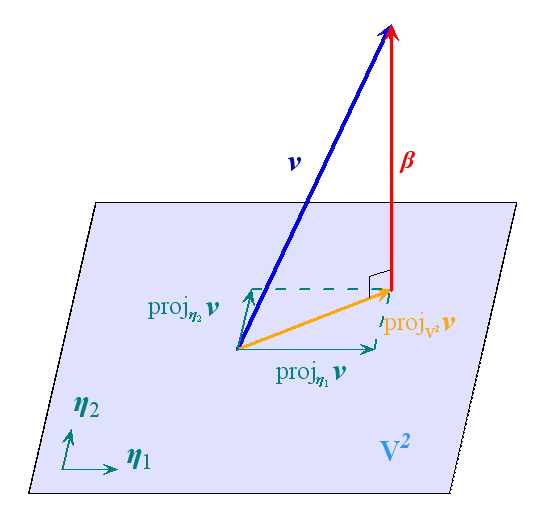
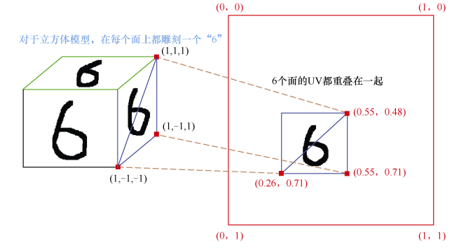

# 从TBN变换到UV展开

### 带着问题去学习
1. 为啥需要做变换？
* 解决法线贴图复用问题。
* 在美术制作流程中，经常会使用发现贴图来弥补三角形网格密度不足造成的细节缺失问题。它把高模里面精细的三角网格点的向量存放到了贴图里面。但直接把这些向量存放到贴图里面会导致一个问题，就是贴图不能够复用。 
* 例如：一个立方体有 6 个面，在 6 个面上都雕刻同一个图案，因为 6个面的朝向不一样，所以每个面的法线在立方体的模型空间下方向都不一样。

2. 法线贴图的是什么？
* 当阅读理解TBN变换之后就知道： **其实法线贴图存储的是TBN空间中的一个向量**（即N向量）。

### 法线与切线空间
#### 切线空间：（需要注意的是以下的所有变换时基于mesh网格的Local Space）
由上面问题知道需要将贴图法线做到与mesh网格位置（即网格的局部坐标）无关,以实现图片的复用，因此引入了切线空间。
* 因此需要将： 法线贴图的坐标定义在切线空间坐标系中。
* 切线空间： 类比模型空间，每个mesh网格，存放实体时肯定会复用模型数。为了让模型显示在正确的位置，把模型从模型空间变换到世界空间（world space），变换这个过程的矩阵就是世界变换矩阵； 对于每个mesh网格的贴图数据，复用法线贴图数据。 为了各个mesh网格的法线贴图显示正确，需要将法线贴图**从切线空间变换到模型空间**。（相关的变换矩阵就是**TBN矩阵**）

* 在xyz坐标系下，三个顶点坐标$\mathbf{V}_0, \mathbf{V}_1, \mathbf{V}_2$.
  * 两条边：$\mathbf{E}0 =\mathbf{V}_1-\mathbf{V}_0, \mathbf{E}1=\mathbf{V}_2-\mathbf{V}_0$
* 做UV纹理坐标下，三个顶点坐标$V_0(\mathrm{u} 0, \mathrm{v0}), \quad V_1(\mathrm{u} 1, \mathrm{v} 1), \quad V_2(\mathrm{u} 2, \mathrm{v} 2)$,
    * 两条边：$(\Delta u_0 , \Delta v_0 )=\left(\mathrm{u}_1-\mathrm{u}_0, \mathrm{v}_1-\mathrm{v}_0\right), \quad(\Delta u_1 , \Delta v_1 )=\left(\mathrm{u}_2-\mathrm{u}_0, \mathrm{v}_2-\mathrm{v}_0\right)$
    * 也可以用向量表示：$\Delta \mathbf{U_0V_0} = \left(\mathrm{u}_1-\mathrm{u}_0, \mathrm{v}_1-\mathrm{v}_0\right), \Delta \mathbf{U_1V_1} = \left(\mathrm{u}_2-\mathrm{u}_0, \mathrm{v}_2-\mathrm{v}_0\right)$

纹理坐标与位置坐标，可以通过切线空间联系起来
$$
\begin{aligned}
& \mathbf{E}0 = \Delta u_0   \mathbf{T}+\Delta v_0 \mathbf{B} \\
&\mathbf{E}1 =\Delta u_1    \mathbf{T}  + \Delta v_1 \mathbf{B} \\
\end{aligned} \\
$$

#### 计算出切线向量$T$ 和副切线 $B$：
将上面公式转换成矩阵形式：
$$
\left[\begin{array}{l}
\mathbf{E}0 \\
\mathbf{E}1 \\ 
\end{array}\right]= \left[\begin{array}{ll}
\Delta u_0   & \Delta v_0    \\
\Delta u_1   & \Delta v_1  \\
\end{array}\right]\left[\begin{array}{l} 
\mathbf{T} \\
\mathbf{B} \\
\end{array}\right] =  \left[\begin{array}{ll}
\Delta \mathbf{U_0V_0} \\
\Delta \mathbf{U_1V_1} \\
\end{array}\right]\left[\begin{array}{l} 
\mathbf{T} \\
\mathbf{B} \\
\end{array}\right] \\
$$

将$\mathbf{E}0, \mathbf{E}1, \mathbf{T}, \mathbf{B}$ 分量展开， 
$$
\begin{aligned}
\left[\begin{array}{lll}
E0x & E0y & E0z \\
E1x & E1y & \text { E1z }
\end{array}\right] &=\left[\begin{array}{ll}
\Delta u_0   & \Delta v_0   \\
\Delta u_1   & \Delta v_1 
\end{array}\right]\left[\begin{array}{ccc}
Tx & Ty & \mathrm{Tz} \\
Bx & By & \text { Bz }
\end{array}\right] \\
&\Downarrow \\
\left[\begin{array}{ccc}
Tx & Ty & \mathrm{Tz} \\
Bx & By & \mathrm{Bz}
\end{array}\right] &=\left[\begin{array}{cc}
\Delta u_0   & \Delta v_0   \\
\Delta u_1   & \Delta v_1 
\end{array}\right]^{-1}\left[\begin{array}{lll}
E0x & E0y & E0z \\
E1x & E1y & \text { E1z }
\end{array}\right]
\end{aligned}
$$
由矩阵知识：矩阵的逆等于其伴随矩阵除以其行列式 $\mathbf{A} = \frac{\mathbf{A}^{*}}{|\mathbf{A}|}$， 得到：
$$
\left[\begin{array}{ccc}
Tx & Ty & \mathrm{Tz} \\
\mathrm{Bx} & \mathrm{By} & \mathrm{Bz}
\end{array}\right]=\frac{1}{\Delta u_0    \Delta v_1 -\Delta v_0    \Delta u_1  }\left[\begin{array}{cc}
\Delta v_1  & - \Delta v_0  \\
-\Delta u_1  & \Delta u_0 
\end{array}\right] \quad\left[\begin{array}{lll}
E0x & E0y & \mathrm{E} 0 z \\
E1x & E1y & \text { E1z }
\end{array}\right] \\
$$

综上： 有了最后这个等式，就可以用三角形的两条边以及纹理坐标计算出切线向量$T$ 和副切线 $B$ .

### TBN矩阵构造
由上面的计算出的切线向量$T$ 和副切线 $B$，向量叉乘得到法向量$N = T \times B$, 最后通过施密特正交化，TBN 才变成了正交基向量（标准化成单位矩阵）。

$$
\begin{array}{ll}
\boldsymbol{\beta}_1=\boldsymbol{v}_1, & \boldsymbol{\eta}_1=\frac{\boldsymbol{\beta}_1}{\left\|\boldsymbol{\beta}_1\right\|} \\
\boldsymbol{\beta}_2=\boldsymbol{v}_2-\left\langle\boldsymbol{v}_2, \boldsymbol{\eta}_1\right\rangle \boldsymbol{\eta}_1, & \boldsymbol{\eta}_2=\frac{\boldsymbol{\beta}_2}{\left\|\boldsymbol{\beta}_2\right\|} \\
\boldsymbol{\beta}_3=\boldsymbol{v}_3-\left\langle\boldsymbol{v}_3, \boldsymbol{\eta}_1\right\rangle \boldsymbol{\eta}_1-\left\langle\boldsymbol{v}_3, \boldsymbol{\eta}_2\right\rangle \boldsymbol{\eta}_2, & \boldsymbol{\eta}_3=\frac{\boldsymbol{\beta}_3}{\left\|\boldsymbol{\beta}_3\right\|}
\end{array}
$$
将切线向量$T$ 和副切线 $B$带入，可以得到相应的标准正交基 $\left\{\boldsymbol{\eta}_1, \boldsymbol{\eta}_2, \boldsymbol{\eta}_3\right\}$

### 具体使用
#### 使用细节
TBN具体使用过程有以下几点需要注意：
* 在存储上，可以只存储三个正交向量中的两个，一般是选择$T$ 和 $N$。 
* 在TBN的作用上：有的程序将$\mathbf{M}_\text{ModelSpace\_TBN} = \mathbf{M}_\text{model} \, \mathbf{M}_\text{LocalSpace\_TBN}$ （但是我个人趋向于将TBN写成切线空间到局部空间的变换）

#### UV展开过程
实际上，展开 UV 的过程就是把模型面片从模型空间映射到贴图切空间的过程，只要三角形面片的每个顶点都一一对应到贴图上的 2D 顶点（模型空间（也叫loacl space）坐标到切空间的 UV 坐标）。 如下图所示：
* 外围大框表示贴图大小
* 中间小框表示模型6个面在贴图上的 UV 分布 

todo...
多个物体的UV展开算法。。。

### 参考资料
1. [D3D11游戏编程](https://blog.csdn.net/bonchoix/article/details/8619624)
2. [游戏引擎原理与实践](https://zhuanlan.zhihu.com/p/376082862)
3. [Gram－Schmidt](https://zh.wikipedia.org/wiki/%E6%A0%BC%E6%8B%89%E5%A7%86-%E6%96%BD%E5%AF%86%E7%89%B9%E6%AD%A3%E4%BA%A4%E5%8C%96#:~:text=%E5%9C%A8%E7%BA%BF%E6%80%A7%E4%BB%A3%E6%95%B0%E4%B8%AD%EF%BC%8C%E5%A6%82%E6%9E%9C,%E7%9A%84%E6%A0%87%E5%87%86%E6%AD%A3%E4%BA%A4%E5%9F%BA%E3%80%82)
