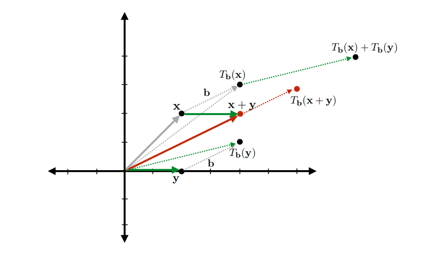
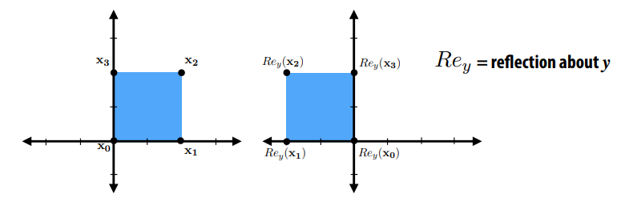
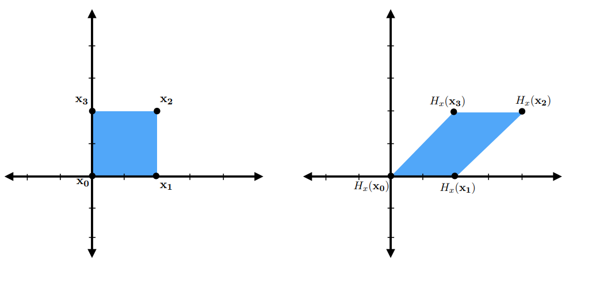
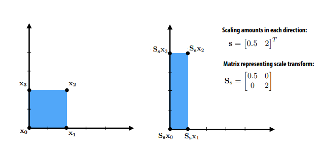
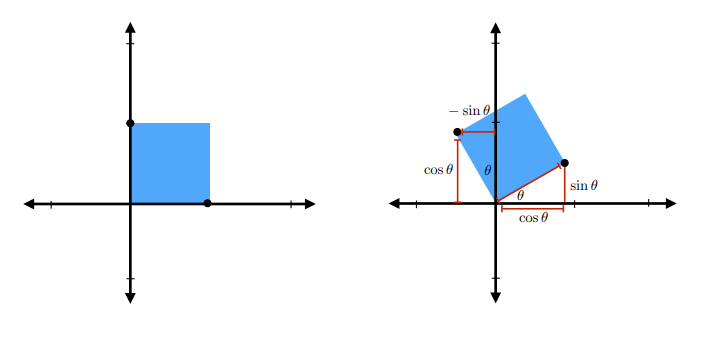
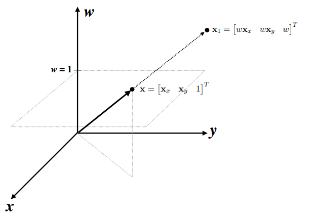
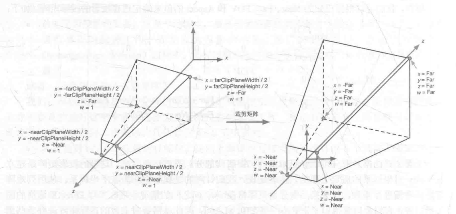
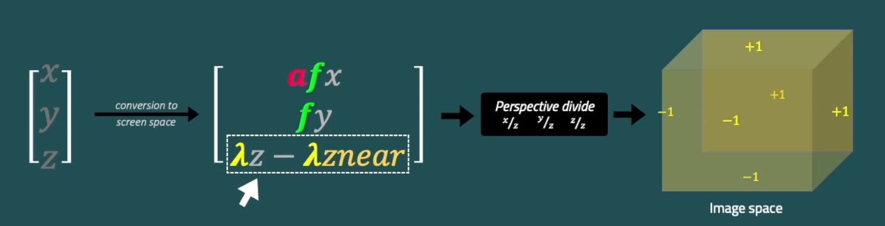
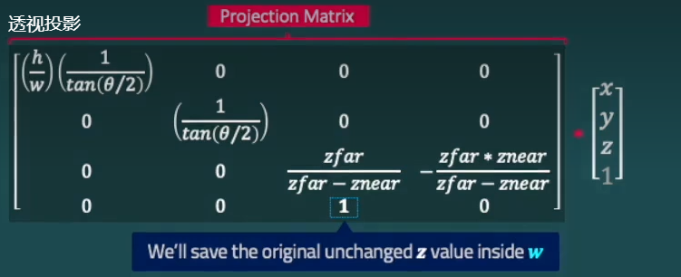
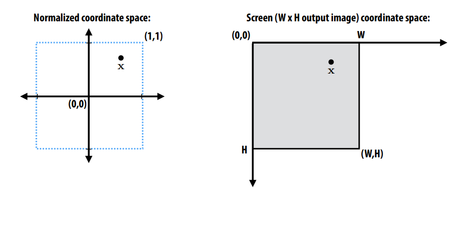

# 坐标系变换推导

## 一. 理解线性变换
线性变换的思想：
$$
\begin{gathered}
f(\mathbf{x}+\mathbf{y})=f(\mathbf{x})+f(\mathbf{y}) \\
f(a \mathbf{x})=a f(\mathbf{x})
\end{gathered} \\
$$
具体分析见: [微分方程: 理解线性变换](https://zhuanlan.zhihu.com/p/560191727)
具体的变换形式有：
* 旋转
* 缩放

### 1.1 仿射变换

仿射变换的具体形式有：
* Refection

* Shear

## 二. 变换的表示
* **目前所有变化都是基于** 列向量，也就是向量右乘。

### 2.1 scale matrix
$$
\operatorname{scale}\left(s_x, s_y, s_z\right)=\left[\begin{array}{ccc}
s_x & 0 & 0 \\
0 & s_y & 0 \\
0 & 0 & s_z
\end{array}\right] \left[\begin{array}{c}
    x \\
    y \\
    z \\
    \end{array} \right] \\
$$

### 2.2 Rotation matrix
* if we simply want to rotate about the z-axis, which will only change x- and y-coordinates, we can use the 2D rotation matrix with no operation on z:

$$
\begin{aligned}
    \mathrm{ rotate- x}(\phi)=\begin{bmatrix}
1 & 0 & 0 \\
0 & \cos \phi & -\sin \phi \\
0 & \sin \phi & \cos \phi
    \end{bmatrix} \left[\begin{array}{c}
    x \\
    y \\
    z \\
    \end{array} \right] \\
\end{aligned}
$$

### 2.3  Arbitrary 3D Rotations
* 3D 旋转是正交矩阵。从几何上讲，这意味着矩阵的三行是三个相互正交单位向量的笛卡尔坐标
$$
\mathbf{R}_{u v w} = \left[\begin{array}{c}
    \mathbf{u}\\
    \mathbf{v}\\
    \mathbf{w}\\
    \end{array} \right] =\left[\begin{array}{lll}
x_u & y_u & z_u \\
x_v & y_v & z_v \\
x_w & y_w & z_w
\end{array}\right] \left[\begin{array}{c}
    x \\
    y \\
    z \\
    \end{array} \right] \\
$$

因为是正交矩阵，所以有如下性质：
* 性质一：
$$
\begin{aligned}
&\mathbf{u} \cdot \mathbf{u}=\mathbf{v} \cdot \mathbf{v}=\mathbf{w} \cdot \mathbf{w}=1 \\
&\mathbf{u} \cdot \mathbf{v}=\mathbf{v} \cdot \mathbf{w}=\mathbf{w} \cdot \mathbf{u}=0
\end{aligned}
$$
* 性质二：
$$
\mathbf{R}_{u v w} \mathbf{u}=\left[\begin{array}{c}
\mathbf{u} \cdot \mathbf{u} \\
\mathbf{v} \cdot \mathbf{u} \\
\mathbf{w} \cdot \mathbf{u}
\end{array}\right]=\left[\begin{array}{l}
1 \\
0 \\
0
\end{array}\right]=\mathbf{x}\\
$$

#### 具体操作：
如果希望围绕任意向量 a 旋转，我们可以形成一个 w = a 的正交基，将该基旋转到规范基 xyz，绕 z 轴旋转，然后将规范基旋转回 uvw 基。在矩阵形式中，绕 w 轴旋转一个角度φ：
$$
\left[\begin{array}{lll}
x_u & x_v & x_w \\
y_u & y_v & y_w \\
z_u & z_v & z_w
\end{array}\right]\left[\begin{array}{ccc}
\cos \phi & -\sin \phi & 0 \\
\sin \phi & \cos \phi & 0 \\
0 & 0 & 1
\end{array}\right]\left[\begin{array}{lll}
x_u & y_u & z_u \\
x_v & y_v & z_v \\
x_w & y_w & z_w
\end{array}\right]\\
$$

## 三. 齐次坐标系 homogeneous coordinates
齐次坐标到笛卡尔坐标系的转换：
* Many points in 2D-H correspond to same point in 2D  and correspond to the same 2D point (divide by to convert 2D-H back to 2D)

**这里以2D空间为例：**
$$
\left[\begin{array}{c}
w \mathbf{x}_x \\
w \mathbf{x}_y \\
w
\end{array}\right] \Longrightarrow \left[\begin{array}{c}
w \mathbf{x}_x /w \\
w \mathbf{x}_y / w\\
\end{array}\right] = \left[\begin{array}{c}
\mathbf{x}_x  \\
\mathbf{x}_y \\
\end{array}\right] \\
$$

### 3.1 仿射变换
$$
\mathbf{T}_{\mathbf{b}} \mathbf{x}=\left[\begin{array}{cccc}
1 & 0 & 0 & \mathbf{b}_x \\
0 & 1 & 0 & \mathbf{b}_y \\
0 & 0 & 1 & \mathbf{b}_z \\
0 & 0 & 0 & 1
\end{array}\right] \left[\begin{array}{c}
w \mathbf{x}_x \\
w \mathbf{x}_y \\
w \mathbf{x}_z \\
w
\end{array}\right]=\left[\begin{array}{c}
w \mathbf{x}_x+w \mathbf{b}_x \\
w \mathbf{x}_y+w \mathbf{b}_y \\
w \mathbf{x}_z+w \mathbf{b}_z \\
w
\end{array}\right]\\
$$

### 3.2 剪切变换
* in x, based on y,z position
$$
\mathbf{H}_{x, \mathbf{d}}=\left[\begin{array}{ccc}
1 & \mathbf{d}_y & \mathbf{d}_z \\
0 & 1 & 0 \\
0 & 0 & 1
\end{array}\right] \quad \mathbf{H}_{x, \mathbf{d}}=\left[\begin{array}{cccc}
1 & \mathbf{d}_y & \mathbf{d}_z & 0 \\
0 & 1 & 0 & 0 \\
0 & 0 & 1 & 0 \\
0 & 0 & 0 & 1
\end{array}\right] \\
$$

## 四. view Matrix

#### todo

## 五. Project Matrix 透视投影矩阵
#### 5.1 正交投影推导过程
**推导x的公式：**
1. 视域体中的点的x坐标范围在[l, r]，想把它变换到范围在[-1,1]。
$$
l \leq x \leq r \\
$$
2. 把范围缩小到我们期望的，各项减去l，这样，最左边的项变为0
$$
0 \leq x-l \leq r-l \\
$$
3. 将各项乘以2/(r-l)，然后再减去 1 ，就产生了我们期望的范围[-1,1] 。
$$
-1 \leq \frac{2 x-2 l}{r-l} - 1 \leq 1 \Longrightarrow  -1 \leq \frac{2 x- r - l}{r-l}\leq 1
$$
4. 将中间项分成两部分使他形如：px+q的形式。
$$
-1 \leq \frac{2 x}{r-l} - \frac{r+l}{r-l} \leq  1
$$
5. 这个不等式的中间项把x转换到了规范视锥体内。
$$
x^{\prime}=\frac{2 x}{r-l}-\frac{r+l}{r-l} \\
$$

**推导y的公式：** 参考x的推导，得到如下的结果：
$$
y^{\prime}=\frac{2 y}{t-b}-\frac{t+b}{t-b} \\
$$

**推导z的变换公式：** z的规范范围限制在[0, 1]之间。
$$
0 \leqslant \frac{z}{f-n} - \frac{n}{f-n} \leqslant 1 \Longrightarrow z^{\prime}=\frac{z}{f-n} - \frac{n}{f-n} \\
$$

把视锥体定义为1一个宽度w和一个高度h(注意：r = -l并且t = -b)，以及近裁剪面n和远裁剪面f。 由x, y , z 三个变换公式可以得到如下变换矩阵：
$$
\mathbf{P_{projective}} = \left[\begin{array}{cccc}
\frac{2}{r-l} & 0 & 0 & -\frac{r+l}{r-l} \\
0 & \frac{2}{t-b} & 0 & -\frac{t+b}{t-b} \\
0 & 0 & \frac{1}{f-n} & -\frac{n}{f-n} \\
0 & 0 & 0 & 1 \\
\end{array}\right] = \left[\begin{array}{cccc}
\frac{2}{w} & 0 & 0 & 0 \\
0 & \frac{2}{h} & 0 & 0 \\
0 & 0 & \frac{1}{f-n} & \frac{-n}{f-n} \\
0 & 0 & 0 & 1 \\
\end{array}\right]\\
$$

上面的正交投影矩阵可以由：平移矩阵和缩放矩阵组成，这种方式可以直观的了解正交投影矩阵做了什么操作。
$$
\mathbf{P}_o=\mathbf{S T}=\left[\begin{array}{cccc}
\frac{2}{r-l} & 0 & 0 & 0 \\
0 & \frac{2}{t-b} & 0 & 0 \\
0 & 0 & \frac{1}{f-n} & 0 \\
0 &0 & 0 & 1\\
\end{array}\right]\left[\begin{array}{cccc}
1 & 0 & 0 & 0 \\
0 & 1 & 0 & 0 \\
0 & 0 & 1 & -n \\
0 & 0 & 0 & 1
\end{array}\right]\\
$$

#### 5.2 透视投影矩阵推导
透视投影矩阵和正交矩阵不同之处在于， 视锥体的近平面是从(l,b, n)到(r, t, n)的一个范围。远平面和近平面缩放的比例不一样，因此不能像正交投影一样简单的表达为一个平移和缩放。

1. Aspect ratio（屏幕长宽比）： 根据屏幕调整长宽比 $\text{Aspect} =\frac{h}{w}$, x和y对齐。
$$
\left[\begin{array}{c}
 \mathbf{x} \\   
 \mathbf{y} \\   
 \mathbf{z} \\   
\end{array}\right] \Longrightarrow \left[\begin{array}{l}
a \mathbf{x} \\
\mathbf{y} \\
\mathbf{z} \\
\end{array}\right] \\
$$
1. FOV : Field of view $f=\frac{1}{\tan (\mathbf{fov} / 2)}=\frac{1}{\tan (\theta / 2)}=\frac{2z}{h}$  x,y都和z对齐, 即有：$\rm z = afx \,; z = fy$， 此时再处于Zfar就可以将x，y范围限在[-1, 1]中。
$$
\left[\begin{array}{c}
 \mathbf{x} \\   
 \mathbf{y} \\   
 \mathbf{z} \\   
\end{array}\right] \Longrightarrow \left[\begin{array}{l}
af \mathbf{x} \\
f\mathbf{y} \\
\mathbf{z} \\
\end{array}\right] \\
$$
1. 标准化/归一化(Normalization): 当进行透视投影后下，x,y.z 都归一到[minValue,maxValue] (一般是-1，1)，归一化设备坐标，即NDC。。 具体的转换过程如下：
z到z'的转换不依赖于x和y，形如z'z= pz + q，p和q是常量。并且很容易的找到那些常量，因为在两种特殊情况下如何得到z': 因为你要把[N, F]映射到[0, 1]，你知道当z=N时z'=0，和z=F时z'=1。当你把第一组值代入z'z = pz + q，有方程组：
$$
\begin{cases}
& 0=p N+q \Longrightarrow q=-p N  \\
& f=p F+q \Longrightarrow p = \frac{F}{F - N}\\
\end{cases}
$$
因此得到z'z = pz + q 的表达式： 
$$
z^{\prime} z=\frac{F}{F-N} z+\frac{F N}{F-N} \\
$$
1. 设置 $\lambda=p = \frac{zFar}{zFar-zNear}$
$$
\left[\begin{array}{c}
 \mathbf{x} \\   
 \mathbf{y} \\   
 \mathbf{z} \\   
\end{array}\right] \Longrightarrow \left[\begin{array}{l}
af \mathbf{x} \\
f\mathbf{y} \\
\lambda\mathbf{Z}_{far} - \lambda \mathbf{Z}_{naear} \\
\end{array}\right] \\
$$

透视投影矩阵的目的就是将左边的坐标位置变换到右边 $[-1, 1]^3$ 的标准设备坐标。
1. 将数据转换映射到矩阵中: **同时需要注意到这里所有的坐标数值都乘了z值**，所以相当于现在是给(x'z, y'z, z'z, w'z)写一个变换。所以取而代之的，把w' = 1写成w'z = z。 所以矩阵形式有如下：
$$
P_p=\left[\begin{array}{cccc}
\frac{2 n}{w} & 0 & 0 & 0 \\
0 & \frac{2 n}{h} & 0 & 0 \\
0 & 0 & \frac{f}{f-n} & -\frac{f n}{f-n} \\
0 & 0 & 1 & 0  \\
\end{array}\right]
$$
**最后通过矩阵变换后的坐标是(x'z, y'z, z'z, w'z),  这个时候需要除以齐次坐标，然后就得到(x', y', z', 1)** 。

## 标准设备坐标系 Normalized coordinate space

### 参考资料

1. [Computer Graphics CMU 15-462] () 
2. [透视投影] (https://www.bilibili.com/video/BV1SL4y1x72k/?share_source=copy_web&vd_source=e84f3d79efba7dc72e6306f35613222e)
3. [投影矩阵的推导] (https://blog.csdn.net/stl112514/article/details/83927643)
