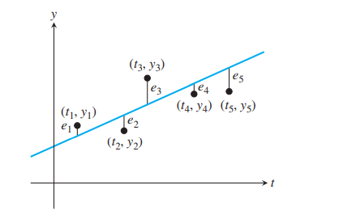
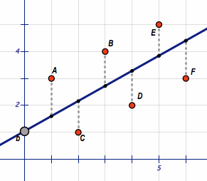
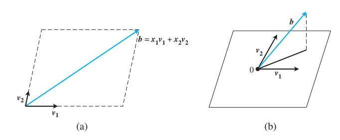

# 理解最小二乘法

## 线性回归方程

一组具有线性相关关系的样本数据: $\left(x_1, y_1\right),\left(x_2, y_2\right), \ldots,\left(x_n, y_n\right)$, 该组数据的回归直线方程为 $\hat{y_i}=b x_i+a(i=1,2, \ldots, n)$. 如图所示：寻找整个线性方程与原始数据误差最小， 即寻求
 
$\sum_{i=1}^n\left|y_i-\hat{y}_i\right|$的最小值. 但是由于绝对值不好算，所以可以将问题转化为求解：
$$
\sum_{i=1}^n\left(y_i-\hat{y}_i\right)^2\\
$$
的最小值, 因此有：$Q=\left(y_1-b x_1-a\right)^2+\left(y_2-b x_2-a\right)^2+\cdots+\left(y_n-b x_n-a\right)^2$，当 $a, b$ 取什么值时, $Q$ 的值最小, 即总体偏差最小

## 推导过程
可以将上式定义成关于$a, b$的函数,其中有：$\bar{x}=\frac{1}{n} \sum_{i=1}^n x_i, \bar{y}=\frac{1}{n} \sum_{i=1}^n y_i$. 
$$
\begin{aligned}
Q(a, b) &=\sum_{i=1}^n\left(y_i-\hat{y}_i\right)^2=\sum_{i=1}^n\left(y_i-b x_i-a\right)^2 \\
&=\sum_{i=1}^n\left[\left(y_i-b x_i\right)-a\right]^2=\sum_{i=1}^n\left(y_i-b x_i\right)^2-2a\sum_{i=1}^n\left(y_i-b x_i\right)+\sum_{i=1}^n a^2 \\
&= -2a\sum_{i=1}^n\left(y_i-b x_i\right)+\sum_{i=1}^n a^2  + \sum_{i=1}^n\left(y_i-b x_i\right)^2 \\
&=n a^2-2 n a(\bar{y}-b \bar{x})+n(\bar{y}-b \bar{x})^2-n(\bar{y}-b \bar{x})^2 + \sum_{i=1}^n\left(y_i-b x_i\right)^2 \\
&=n(a-\bar{y}+b \bar{x})^2 + \sum_{i=1}^n\left(y_i-b x_i\right)^2 -n(\bar{y}-b \bar{x})^2 \\
&= n(a-\bar{y}+b \bar{x})^2 + \sum_{i=1}^n y_i^2+b^2 \sum_{i=1}^n x_i^2-2 b \sum_{i=1}^n x_i y_i - n \bar{y}^2-n b^2 \bar{x}^2+2 n b \overline{y x} \\
& = n(a-\bar{y}+b \bar{x})^2+b^2\left(\sum_{i=1}^n x_i^2-n \bar{x}^2\right)-2 b\left(\sum_{i=1}^n x_i y_i-n \overline{y x}\right) \quad+\sum_{i=1}^n y_i^2-n \bar{y}^2 \\
\end{aligned}\\
$$

从上式的转化关系中可以得出：
$$
Q(a, b)=n(a-\bar{y}+b \bar{x})^2+b^2\left(\sum_{i=1}^n x_i^2-n \bar{x}^2\right)-2 b\left(\sum_{i=1}^n x_i y_i-n \overline{y x}\right)+\sum_{i=1}^n y_i^2-n \bar{y}^2\\
$$
满足$Q(a, b)$最小值的条件就是：
$$
\begin{cases}
a=\bar{y}-b \bar{x}  \qquad  (a-\bar{y}+b \bar{x} = 0)\\
b = -(\frac{-2\left(\sum_{i=1}^n x_i y_i-n \overline{y x}\right)}{2\left(\sum_{i=1}^n x_i^2-n \bar{x}^2\right)}) \qquad (\text{开口向上二次函数，最小值再对称轴})\\
\end{cases} \\
$$

**最后将公式进一步化简,** 其中项有：
$$
\begin{aligned}
\sum_{i=1}^n\left(x_i-\bar{x}\right)\left(y_i-\bar{y}\right)
&= \sum_{i=1}^n\left(x_i y_i-x_i \bar{y}-\bar{x} y_i+\bar{x} \bar{y}\right) \\
&=\left(\sum_{i=1}^n x_i y_i\right)-\sum_{i=1}^n x_i \bar{y}-\sum_{i=1}^n \bar{x} y_i+\sum_{i=1}^n \bar{x} \bar{y} \\
&= \sum_{i=1}^n x_i y_i-\bar{y} \cdot n \bar{x}-\bar{x} \cdot n \bar{y}+n \bar{x} \bar{y} \\
&= \sum_{i=1}^n x_i y_i-n \bar{x} \bar{y}\\
\end{aligned}\\
$$
最终整理公式有：
$$
\begin{cases}
    \hat{b}=\frac{\sum_{i=1}^n\left(x_i-\bar{x}\right)\left(y_i-\bar{y}\right)}{\sum_{i=1}^n\left(x_i-\bar{x}\right)^2}=\frac{\sum_{i=1}^n x_i y_i-n \bar{x} \bar{y}}{\sum_{i=1}^n x_i^2-n \bar{x}^2} \\
    \hat{a}=\bar{y}-\hat{b} \bar{x}\\
\end{cases}\\
$$

## 几何解释

**不一致的方程组**
如果一个方程组无解，那么这个方程组被称为不一致。例如下面的方程组:
$$
\begin{aligned}
&x_1+x_2=2 \\
&x_1-x_2=1 \\
&x_1+x_2=3 \\
\end{aligned} \\
$$
将方程组写成矩阵形式：
$$
\left[\begin{array}{cc}
1 & 1 \\
1 & -1 \\
1 & 1
\end{array}\right]\left[\begin{array}{l}
x_1 \\
x_2
\end{array}\right]=\left[\begin{array}{l}
2 \\
1 \\
3
\end{array}\right] \Longrightarrow \left[\begin{array}{l}
1 \\
1 \\
1
\end{array}\right] x_1 +\left[\begin{array}{c}
1 \\
-1 \\
1
\end{array}\right] x_2 =\left[\begin{array}{l}
2 \\
1 \\
3
\end{array}\right]
$$
对于任意 $m \times n$ 方程组 $A x=b$ 都可以看做:把 $b$ 看做$A = [v_1, v_2,\cdots, v_i]$的列向量的线性组合，对应的系数即为 $x_i$。 如果$b$在$x_i$组成的平面上，方程组有解。 如果不存在，则：寻找平面 $A x$ 中有与 $b$ 最接近的点，即如下图所示的虚线向量,（定义为$e = b-A \bar{x}$）。

由几何关系可知：
$$
\begin{cases}
v_1^{T} \cdot e=0 \\ 
v_2^{T} \cdot e=0\end{cases}
$$
因此有：
$$
A^{T}\left(b-A \bar{x}\right)=0
$$
这给出了定义最小二乘解的方程组: 
$$
A^T A \bar{x}=A^T b \Longrightarrow \bar{x} = (A^T A)^{-1}A^T b\\
$$
$A^T A \bar{x}=A^T b$ 就被称为法线方程，它的解 $\bar{x}$ 也就是方程组 $A x=b$ 的最小二乘解。令$x_1=k, x_2 = b$,即有回归方程：
$$
y = kx + b \\
$$

**参考资料：**

1. [最小二乘法的几何意义](https://www.bilibili.com/video/BV11a41127w2/?spm_id_from=333.788&vd_source=1a163e481fb12c5b6ca8a57f994c1d73)
2. [Least Squares and the Normal Equations](https://www.mymathscloud.com/api/download/modules/University/Textbooks/numerical-analysis/Numerical%20Analysis%20(2).pdf?id=50126435)

