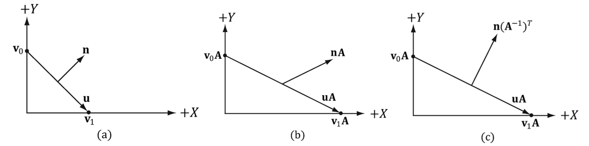

# 法线矩阵Normal Matrix推导

### 带着问题去学习
* 如果模型矩阵执行了不等比缩放，顶点的改变会导致法向量不再垂直于表面了。因此，不能直接使用模型矩阵来变换法向量

### 法线矩阵推导

数学分析
* 图a所示:  与法向量$\bf n$正交的切向量$\mathbf{u}=\mathbf{v}_1-\mathbf{v}_0$。 如果我们应用非均匀缩放变换$\mathbf{A}$，
* 图b中看到，变换的切向量 $ \mathbf{A} \mathbf{u}= \mathbf{A} \mathbf{v}_1 - \mathbf{A}\mathbf{v}_0$ 不与变换的法向量$\bf An$保持正交。

根据前面的法线$\mathbf{n}$垂直切线$\mathbf{u}$ 得到：$\mathbf{u} \cdot \mathbf{n} = \mathbf{u}^T \mathbf{n} = 0$,得到：

$$
\begin{align*}
\mathbf{u}^T \mathbf{n} &= \mathbf{u}^T (\mathbf{A}^{-1} \mathbf{A})^{T}\mathbf{n}\\
& = \mathbf{u}^T \mathbf{A}^T (\mathbf{A}^{-1})^{T}\mathbf{n} \\
or & = \mathbf{u}^T \mathbf{A}^T (\mathbf{A}^T)^{-1}\mathbf{n}  \\
& = 0    \tag{1.1}\\
\end{align*}\\
$$

**目标：**
找到一个转换矩阵 $\mathbf{B}$，它转换法向量，使得转换的切线向量与转换的法向量正交, 即 $\mathbf{(Au)}  \cdot \mathbf{(Bn)} =0$ 。有限定条件推导如下公式：

$$
\begin{aligned}
    \mathbf{(Au)}  \cdot \mathbf{(Bn)} &=  \mathbf{(Au)}^T \mathbf{(Bn)} \\
    & = \mathbf{u}^T \mathbf{A}^T \mathbf{B} \mathbf{n}\\
\end{aligned}\\
$$
由公式（1.1） 可知当$\mathbf{B} = (\mathbf{A}^T)^{-1} = \mathbf{(A^{-1})}^{T}$, 可以使得法线和切线在变化后依旧保持垂直。
$$
\begin{aligned}
    \mathbf{(Au)}  \cdot \mathbf{(Bn)} & = \mathbf{u}^T \mathbf{A}^T (\mathbf{A}^T)^{-1} \mathbf{n} \\
    & = 0
\end{aligned}
$$

### 参考资料
1. [Basic Lighting](https://learnopengl.com/Lighting/Basic-Lighting)
