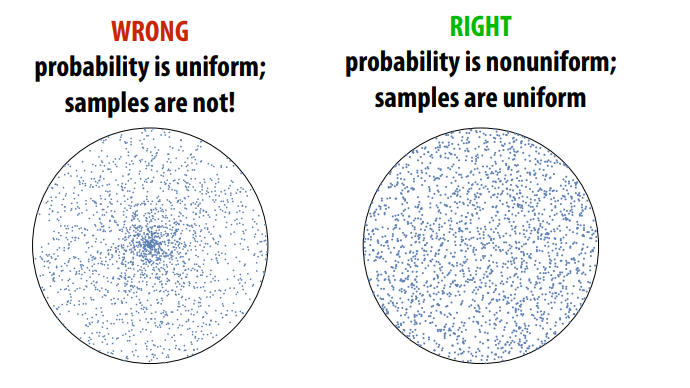
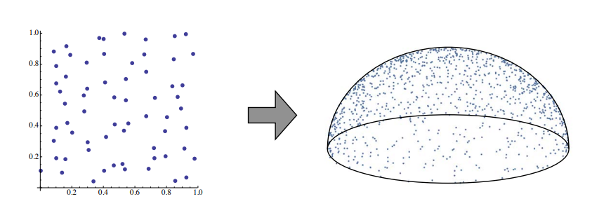
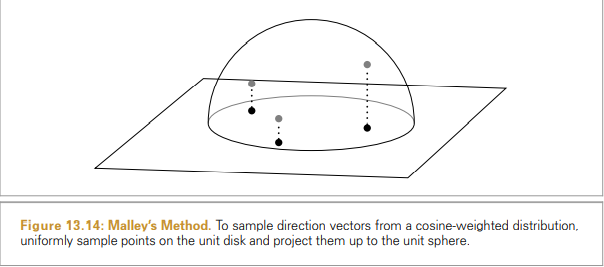
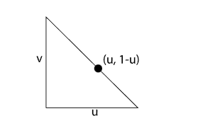
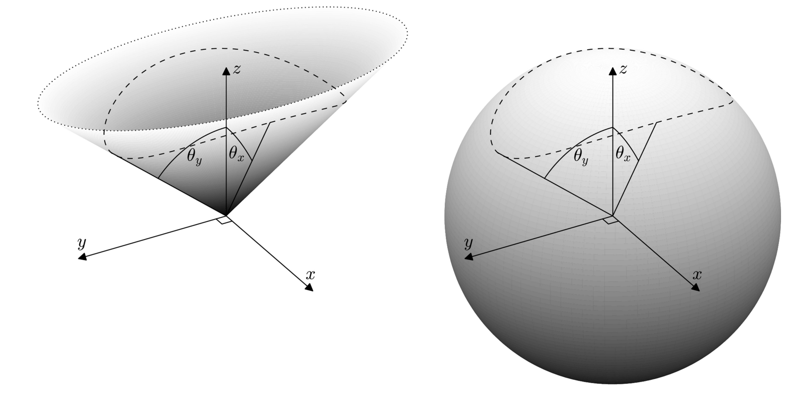
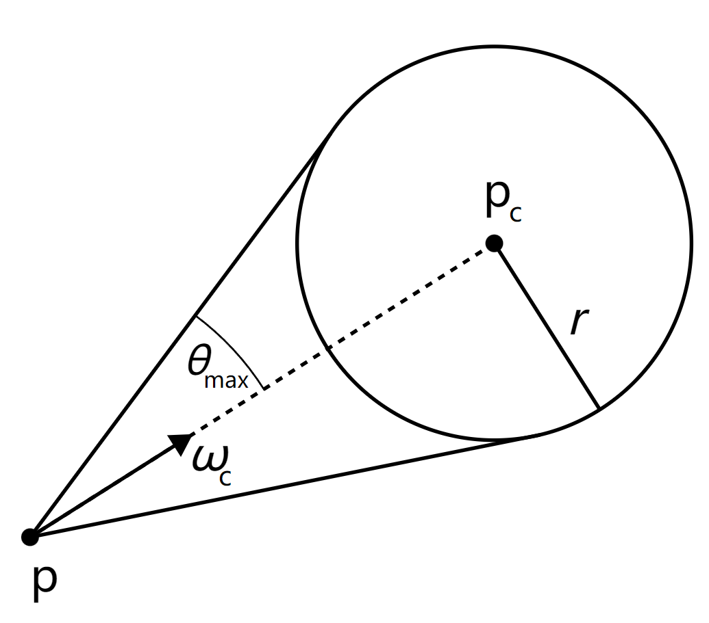
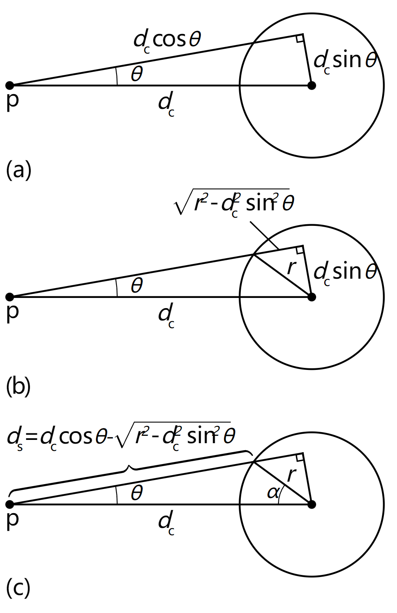

# 多维空间下的均匀采样方法

**前言**

用均匀分布随机数采样任意分布样本： 一个特别重要的随机变量是典型的均匀随机变量，该变量以相等的概率取其域中的所有值。由于两个原因均匀随机变量很重要: 其一，在软件中使用这种分布很容易生成一个变量——大多数运行时库都有一个伪随机数生成器可以做到这一点。 其次，正如稍后将展示的，可以通过首先从`规范均匀随机变量开始并应用适当的变换来从任意分布生成样本`。

### 不同分布函数之间的转换
当将样本从任意分布转换为具有函数的其他分布时，需要研究新的分布函数和原始分布的关系。 

假设得到了已经从某个PDF中提取的随机变量$X_i$。现在，如果计算$Y_i = y(X_i)$，希望找到新随机变量$Y_i$的分布。这似乎是一个深奥的问题，但将看到理解这种转换对于从多维分布函数中抽取样本至关重要。

转换的前提：函数$y(x)$必须是一对一的转换；如果多个值$x$映射到同一个值$y$，那么就不可能明确地描述特定值$y$的概率密度。一对一的直接结果是$y$的导数必须严格大于 0 或严格小于 0，这意味着: (使用了概率论PMF性质)
$$P_r\{Y \le y(x)\} = P_r\{ X \le x\} \Longrightarrow  P_y(y) = P_x(x)\\$$

CDF之间的这种关系直接可以推导出PDF之间的关系。如果假设的导数大于0，则微分给出：
$$p_y(y)\frac{\text{d}y}{\text{d}x} = p_x(x)\\$$
一般来说，的导数要么是严格正的，要么是严格的负的(因为X和Y是一对一的关系)，密度之间的关系是 :
$$p_y(y) = \left|\frac{\text{d}y}{\text{d}x}\right|^{-1} p_x(x)\\$$

如何使用这个公式？假设在$p_x(x) = 2x$域上[0, 1]，并且让$Y = sinX$, 那么随机变量的Y的PDF是怎样？因为知道$\text{d}y/\text{d}x = \cos x$,
$$p_y(y)= \frac{p_x(x)}{|\cos x|} = \frac{2x}{\cos x} = \frac{2 \arcsin y}{\sqrt{1 - y^2}}\\$$ 

这个过程可能看起来很落后——通常有一些想要从中采样的 PDF，而不是给定的转换。例如，可能已经从一些$p_x(x)$中提取$X$并希望从一些$p_y(y)$分布中进行计算$Y$。应该使用什么转换？所需要的只是 CDF 相等，或者$P_x(x) = P_y(y)$，它立即给出转换:
$$y(x) = P_y^{-1}(P_x(x))\\$$
**这样当$p(X = x)$是均匀随机分布的时候，$P_x(x) \in [0, 1)$, 令均匀随机分布变量$\xi = P_x(x)$ 那么可以通过这个公式采样任意分布的概率密度函数$pdf(X_i) = y(X_i)$**。这是Inversion method（逆变换采样方法）的思想。图解过程看前面的[蒙特卡洛数值积分](https://zhuanlan.zhihu.com/p/545565243)的推广。

### 多维空间下的概率密度转换

在一般n维的情况下，类似的推导给出了不同密度之间的类似关系。不会在这里展示推导,具体公式推导见上篇文章[概率密度函数在多维空间下的变换](https://zhuanlan.zhihu.com/p/552643817) 它遵循与一维案例相同的形式。假设有一个密度函数为$p_x(x)$的n维随机变量$X$。现在让$Y = T(x)$，T是变换矩阵。在这种情况下，有：
$$p_y(y) = \frac{p_x(x)}{|J_T(x)|}\\$$
其中$|J_T|$是T的雅可比矩阵行列式的绝对值，即:
$$
\left(\begin{array}{ccc}
\partial T_{1} / \partial x_{1} & \cdots & \partial T_{1} / \partial x_{n} \\
\vdots & \ddots & \vdots \\
\partial T_{n} / \partial x_{1} & \cdots & \partial T_{n} / \partial x_{n}
\end{array}\right)\\
$$

### 极坐标
极坐标变换由下式给出
$$
\begin{aligned}
&x=r \cos \theta \\
&y=r \sin \theta
\end{aligned}\\
$$
假设从某个密度$p(r, \theta)$中抽取样本。$p(x,y)$对应的密度是多少？这种变换的雅可比行列式是 
$$
J_{T}=\left(\begin{array}{ll}
\frac{\partial x}{\partial r} & \frac{\partial x}{\partial \theta} \\
\frac{\partial y}{\partial r} & \frac{\partial y}{\partial \theta}
\end{array}\right)=\left(\begin{array}{cc}
\cos \theta & -r \sin \theta \\
\sin \theta & r \cos \theta
\end{array}\right)\\
$$
行列式是$r\left(\cos ^{2} \theta+\sin ^{2} \theta\right)=r$。所以$p(x, y)=p(r, \theta) / r$。当然，这与通常想要的相反——通常从笛卡尔坐标中的采样策略开始，并希望将其转换为极坐标中的采样策略。在这种情况下，会有 :
$$
p(r, \theta)=r p(x, y) \\
$$

### 球坐标

给定方向的球坐标表示，
$$
\begin{aligned}
&x=r \sin \theta \cos \phi \\
&y=r \sin \theta \sin \phi \\
&z=r \cos \theta,
\end{aligned}\\
$$

该变换的雅可比行列式具有$\left|J_{T}\right|=r^{2} \sin \theta$，因此对应的密度函数为 
$$
p(r, \theta, \phi)=r^{2} \sin \theta p(x, y, z)\\
$$

这种转换很重要，因为它可以帮助将方向表示为单位球面上的点。请记住，立体角定义为单位球面上一组点的面积。在球坐标系中，之前推导出 (参考文章[从辐射度量学理解BRDF](https://zhuanlan.zhihu.com/p/549572824)中关于球面积分的部分)
$$d \omega=\sin \theta \mathrm{d} \theta \mathrm{d} \phi\\$$

所以如果有一个在立体角$\omega$上定义的密度函数，这意味着:
$$P_r\left\{\omega\in\Omega\right\}=\int_{\Omega}p(\omega)\,\mathrm{d}\omega\\$$

因此可以推导出关于$\theta$和$\phi$的密度：
$$
\begin{array}{c}{{p(\theta,\phi)\,\mathrm{d}\theta\,\mathrm{d}\phi=p(\omega)\,\mathrm{d}\omega}}\\ 
{{p(\theta,\phi)=\sin\theta\,p(\omega).}}\end{array}\\
$$

### 在圆上均匀采样

eg: 在`单位圆`的表面进行均匀采样。（Since we’re going to sample uniformly with respect to area）
  1. 因为要对圆是进行均匀采样，即==单位面积的采样数量是一样的，即PDF相等==.(可以理解为： 采样概率 = 1/采样面积 )
   $$p(x, y) = 1/\pi\\$$ 
  2. 利用jacobian矩阵将圆从笛卡尔坐标转化到极坐标系:
   $$
   p(x,y) = p(T(r,\theta))= \frac{p(r, \theta)}{|J_T(r, \theta)|}\\
   J_T = \begin{bmatrix}
    \frac{\partial x}{\partial r} & \frac{\partial x}{\partial \theta}  \\
    \frac{\partial y}{\partial \theta}& \frac{\partial y}{\partial \theta} \\
    \end{bmatrix} = 
    \begin{bmatrix}
    \cos\theta & -r\sin\theta  \\
    \sin\theta& r\cos\theta \\
    \end{bmatrix} = r \\
   $$
  3. 所以有 $rp(x, y) = p(r, \theta) \Longrightarrow p(r, \theta) = r/\pi$
  4. 求边缘概率密度： 
   $$
   \begin{align*}
    p(r) & = \int_0^{2\pi} p(r, \theta)\text{d}\theta = 2r  \\
    p(\theta) & = \frac{p(r,\theta)}{p(r)} = \frac{1}{2\pi} \\
   \end{align*}\\
   $$
  5. 求取累计概率分布： 
   $$
   P(r) = \int p(x)\text{d}r = r^2 \\
   P(\theta) = \int p(\theta) \text{d} \theta = \frac{1}{2\pi}\theta \\
   $$
  6. 均匀随机分布变量 $\xi_1 \,,\xi_2$
  7. 逆采样方法代入(inverse method):
   $$\quad \theta = 2\pi\xi_1 \quad \, r = \sqrt{\xi_2}\\$$

### 半球上均匀采样
考虑在[半球上均匀地选择相对于立体角的方向](https://www.pbr-book.org/3ed-2018/Monte_Carlo_Integration/2D_Sampling_with_Multidimensional_Transformations#UniformlySamplingaHemisphere),均匀分布意味着密度函数是一个常数
* 在半球面均匀采样方向 How do we uniformly sample directions from the hemisphere?  

* 使用Inversion Method采样,概率密度函数PDF如下：Picking points on unit hemisphere：
$$(\xi_1, \xi_2) = (\sqrt{1-\xi_1^2}\cos(2\pi\xi_2), \sqrt{1-\xi_1^2}\sin(2\pi\xi_2), \xi_1)$$ 
推导参考对圆的采样
 
1. 由球面坐标转换$\text{d}\omega = \sin\theta \text{d}\theta\text{d}\phi$
2. 在半球表面进行均匀采样所以有$p(\omega) = 1/2\pi$
3. 由分布函数: ( 随机变量关系是一一对应的，$P_r \{\omega \in H^2 \} = \int_{H^2} p(\theta, \phi)\text{d}\theta\text{d}\phi = \int_{H^2} p(\omega)\text{d}\omega$)
   $$
   \begin{align*}
    & p(θ , φ)\text{d}\theta\text{d}\phi = p(\omega)\text{d}\omega\\
   & p(θ , φ) = \sin\theta p(\omega) \\
   & p(\theta,\phi) =\frac{\sin\theta}{2\pi}\\
   \end{align*}\\
   $$
4. Inverse Method(先求边缘概率密度函数, 再求累计分布函数，最后求取反函数):
   $$
   \begin{align*}
   &p(\theta)=\sin\theta, P(\theta)=1-\cos\theta,  \Longrightarrow \theta =\cos^{-1}\xi_1(1-\xi_1 replace \xi_1)\\
   &p(\phi)=\frac{1}{2\pi}, \quad P(\phi)=\frac{\phi}{2\pi}, \Longrightarrow \phi=2\pi\xi_2\\
   \end{align*}\\
   $$
5. 转到笛卡尔坐标系得到如下结果：
   $$
   \begin{align*}
   &x= \sin\theta \cos \phi  = \sqrt{1- \xi^2} \cos(2\pi\xi_2)\\
   &y = \sin \theta \sin\phi =  \sqrt{1- \xi^2} \sin(2\pi\xi_2) \\
   &z = \cos\theta = \phi_1 \\
   \end{align*}\\
   $$

>另外一种方式Malley’s method：(这个类似与cos-weighted，并不是均匀的采样，方法挺好的，拿出来比较一下)
>**Malley’s method**: 如果从单位圆盘中均匀地选择点，然后通过将圆盘上的点投影到它上面的半球来生成方向，则得到的方向分布将具有余弦分布

### 对三角形采样

尽管对三角形进行均匀采样,为了简化问题，假设正在对面积为$\frac{1}{2}$的等腰直角三角形进行采样. 将导出的采样例程的输出将是重心坐标,详细推导见[重心坐标系](https://zhuanlan.zhihu.com/p/557061822)，因此尽管简化，该技术实际上适用于任何三角形。**该方法本质就是利用重心坐标插值采样点以实现均匀采样**。 图显示了要采样的形状。

（注意：任意一个点的$(x,y)=\alpha\,A+\beta\,B+\gamma\,C; (\alpha+\beta+\gamma=1)$满足重心坐标那么都是在三角形内部，而对于重心这个数是1/3处）

将在这里用$(u ,v)$表示重心坐标。则有$(x, y) = u\vec{(1, 0)} + v\vec{(0, 1)} + w\vec{(0, 0)} = (u, v)\qquad (u + v = 1)$由于是相对于面积进行采样，知道 PDF必须是一个常数，等于形状面积$\frac{1}{2}$的倒数，所以$p(u,v) = 2$

首先，找到边缘概率密度： 
$$p(u)=\int_{0}^{1-u}p(u,v)\,\mathrm{d}v=2\int_{0}^{1-u}\mathrm{d}v=2(1-u)\\$$
 
和条件概率密度$p(v|u)$
$$p(v|u)=\frac{p(u,v)}{p(u)}=\frac{2}{2(1-u)}\,=\,\frac{1}{1-u}\\$$

与往常一样，CDF 是通过积分找到的：
$$
P(u)=\int_{0}^{u}p(u^{\prime})\,{\mathrm{d}u}^{\prime}=2u-u^{2}\\
P(v)=\int_{0}^{v}p(v^{\prime}|u)\,\mathrm{d}v^{\prime}={\frac{v}{1-u}}\\
$$
反转这些函数并将它们分配给统一的随机变量给出最终的采样策略：
$$
\begin{array}{c}{{u=1-\sqrt{\xi_{1}}}}\\ 
{{v=\xi_{2}\sqrt{\xi_{1}}.}}\end{array}\\
$$

$\frac{\partial y}{\partial u} du = \frac{dy}{du}du$

### 圆锥光源采样 Sampling a Cone(sphere)

对于基于Sphere的区域光源和 SpotLight，能够在锥形方向上均匀地采样光线是很有用的。$\theta$和$\phi$时相互独立的，其中$p(\phi) = 1 / 2\pi$ 因此，需要推导出一种方法，以在围绕中心方向的方向锥上均匀采样$\theta$方向，直至光束的最大角度$\theta_{max}$。将$\mathrm{d}\omega=\sin\theta\,\mathrm{d}\theta\,\mathrm{d}\phi$中单位球体上的测量项结合起来:(下图： 当$\theta_y = \theta_x$时就是圆锥， 当其不相等的时候就是椭圆锥，这里暂时不讨论椭圆锥的情况)

$$
\begin{align*}
S&=\int_{0}^{2\pi}\int_{0}^{\theta_{max}}r^2\sin\theta \text{d}\theta \text{d}\phi\\
&=2\pi r^2(1-\cos\theta_{m a x})\\
\end{align*}\\
$$

所以在单位圆锥上均匀采样有：$S = 2\pi(1-\cos\theta_{max})\quad \, \mathrm{d}\omega=\sin\theta\,\mathrm{d}\theta\,\mathrm{d}\phi$
$$
\begin{align*}
   p(\omega) &= \frac{1}{S} = \frac{1}{2\pi (1- \cos \theta_{max})}\\
   p(\theta,\phi)& =\sin\theta p(\omega)={\frac{\sin\theta}{2\pi(1-\cos\theta_{m a x})}}\\
\end{align*}\\
$$
又因为$\theta$和$\phi$时相互独立的，其中$p(\phi) = 1 / 2\pi$。可得出：
$$
\begin{align*}
   p(\theta) &= \frac{\sin \theta}{1 - \cos\theta_{max}}\\
   P(\theta)& =\int_{0}^{\theta}{\frac{\sin{\theta}}{1-\cos{\theta}_{m a x}}}\text{d}\theta=\left.\frac{-\cos{\theta}}{1-\cos{\theta}_{max}}\right|_{0}^{\theta} = \frac{1-\cos{\theta}}{1-\cos{\theta}_{max}}\\
\end{align*}\\
$$
生成两个均匀随机变量$\xi_1\in [0,1], \xi_2 \in [0,1]$,使用inversion method：
$$
\begin{align*}
   \cos\theta&=(1-\xi)+\xi\cos\theta_{\mathrm{max}}\\
\phi &= 2 \pi \xi_2 \\
\end{align*}\\
$$

如果参考点在球体之外，那么从点p看，球体光源对着的角度有：

$$
\sin \theta_{max} = \frac{r}{|p_c - p|}\\
\theta_{\mathrm{max}}=\arcsin\!\left({\frac{r}{\left|{\bf p}-{\bf p}_{\mathrm{c}}\right|}}\right)=\arcsin\!\operatorname{crccos}\sqrt{1-\left({\frac{r}{\left|{\bf p}-{\bf p}_{\mathrm{c}}\right|}}\right)^{2}}\\
$$

给定一个相对于之前计算的采样坐标系的采样角度，我们可以直接计算球体上对应的采样点。这种方法的推导遵循三个步骤:

根据几何关系有如下公式：
$$
\begin{align*}
   &d_{\mathrm{s}}=d_{\mathrm{c}}\cos\theta-\sqrt{r^{2}-d_{\mathrm{c}}^{2}\sin^{2}\theta}\\
   &d_{\mathrm{s}}^{2}=d_{\mathrm{c}}^{2}+r^{2}-2d_{\mathrm{c}}r\cos\alpha\\
   &\cos\alpha=\frac{d_{\mathrm{c}}^{2}+r^{2}-d_{\mathrm{s}}^{2}}{2d_{\mathrm{c}}r}\\
\end{align*}
$$

有了$\cos \theta$ 就可以得到球形光源的采样点位置， 然后可以得到入射光线$\omega_i$

**参考资料:**
1. [《PBRT 13.6》](https://www.pbr-book.org/3ed-2018/Monte_Carlo_Integration/2D_Sampling_with_Multidimensional_Transformations#)
2. [Sampling random directions within an elliptical cone] (https://www.ncbi.nlm.nih.gov/pmc/articles/PMC5526646/)
3. [Sampling_Light_Sources#x2-SamplingSpheres] (https://www.pbr-book.org/3ed-2018/Light_Transport_I_Surface_Reflection/Sampling_Light_Sources#x2-SamplingSpheres)
