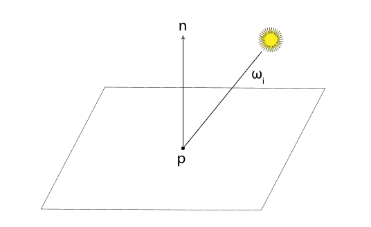
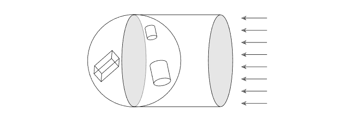
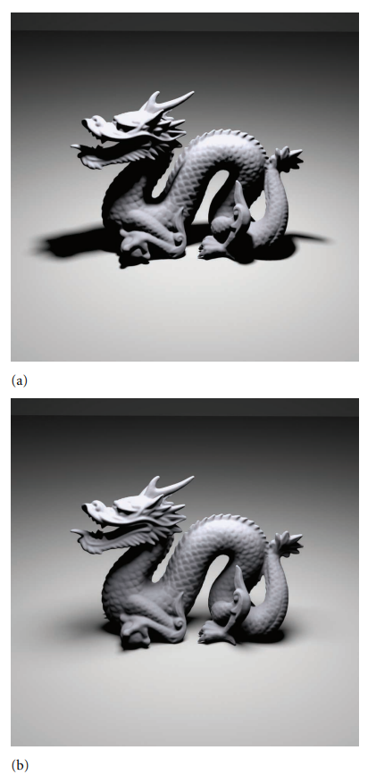
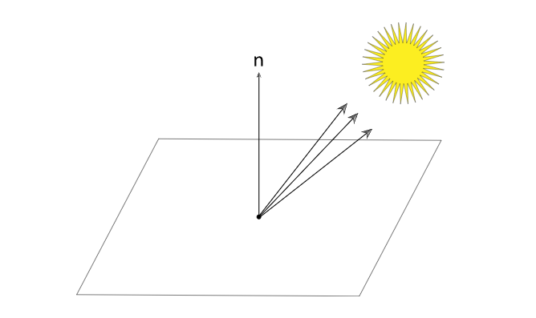
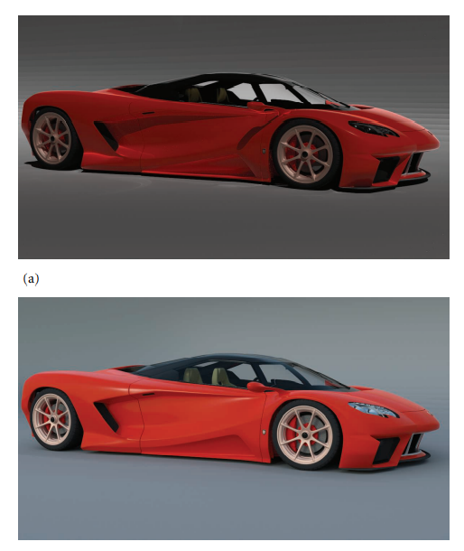
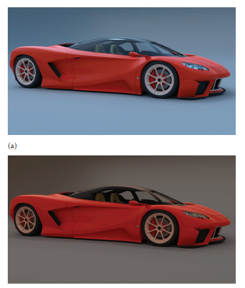

# PBRT 光源

**overview：**

为了使场景中的物体可见，必须有一个照明源，以便一些光从它们反射到相机传感器。本章首先描述导致光子发射的不同物理过程，然后介绍抽象的 Light 类，它定义了 pbrt 中用于光源的接口。下面是一些有用的光源的实现。因为不同类型灯光的实现都隐藏在精心设计的界面后面。

本章不包括针对所介绍的所有灯光类型的所有 Light 方法的实现。许多与复杂光源相关的量不能以封闭形式计算，因此需要蒙特卡洛积分。

介绍了各种各样的光源模型，尽管种类受到 pbrt 基于物理的设计的轻微限制。已经为计算机图形学开发了许多非物理光源模型，包括对属性的控制，例如光随距离衰减的速率、哪些对象被光照亮、哪些对象从光中投射出阴影等等。这些类型的控件与基于物理的光传输算法不兼容，因此无法在此处的模型中提供。作为此类照明控制带来的问题的一个示例，考虑一个不投射阴影的灯：随着更多表面的添加，到达场景中表面的总能量无限制地增加。考虑围绕这种光的一系列同心球壳；如果忽略遮挡，每个添加的外壳都会增加接收到的总能量。这直接违反了到达被光照射表面的总能量不能大于光发射的总能量的原则。


## 光源接口

所有灯光共享四个通用参数：
1. flags 参数指示基本光源类型——例如，光是否由 delta 分布描述。 （此类灯的示例包括点灯，它从一个点发射照明，以及定向灯，所有光都从同一方向到达。）从光源采样照明的蒙特卡洛算法需要知道描述了哪些灯通过 delta 分布，因为这会影响它们的一些计算。
2. 定义灯光相对于世界空间的坐标系的变换。与形状一样，能够在假设特定坐标系的情况下实现灯光通常很方便（例如，聚光灯始终位于其灯光空间的原点，沿着轴$+z$照射）。灯光到世界的转换使得将此类灯光放置在场景中的任意位置和方向成为可能。
3. 描述光源内部和外部的参与介质的 MediumInterface。对于本身没有“内部”和“外部”的灯光（例如，点光源），两侧都有相同的介质。 （两个 Medium 指针的 nullptr 值表示真空。）
4. nSamples 参数用于区域光源，在这种情况下可能需要将多个阴影光线跟踪到灯光以计算软阴影；它允许用户更细粒度地控制基于每个光源采集的样本数量。默认取的光源样本数为1；因此，只有明智地采取多个样本的灯光实现需要将显式值传递给 Light 构造函数。并非所有积分器都关注此值。
```c++
class Light {
  public:
    // Light Interface
    virtual ~Light();
    Light(int flags, const Transform &LightToWorld,
          const MediumInterface &mediumInterface, int nSamples = 1);
    virtual Spectrum Sample_Li(const Interaction &ref, const Point2f &u,
                               Vector3f *wi, Float *pdf,
                               VisibilityTester *vis) const = 0;
    virtual Spectrum Power() const = 0;
    virtual void Preprocess(const Scene &scene) {}
    virtual Spectrum Le(const RayDifferential &r) const;
    virtual Float Pdf_Li(const Interaction &ref, const Vector3f &wi) const = 0;
    virtual Spectrum Sample_Le(const Point2f &u1, const Point2f &u2, Float time,
                               Ray *ray, Normal3f *nLight, Float *pdfPos,
                               Float *pdfDir) const = 0;
    virtual void Pdf_Le(const Ray &ray, const Normal3f &nLight, Float *pdfPos,
                        Float *pdfDir) const = 0;
public:
    // Light Public Data
    const int flags;
    const int nSamples;
    const MediumInterface mediumInterface;

  protected:
    // Light Protected Data
    const Transform LightToWorld, WorldToLight;
};
```

灯光必须实现的一个关键方法是 Sample_Li()。 调用者传递一个交互，该交互提供场景中参考点的世界空间位置和与之关联的时间，并且灯光返回由于该灯光而到达该点的辐射，假设之间没有遮挡对象，如图。 pbrt 中的灯光实现目前不支持动画 - 灯光本身位于场景中的固定位置。但是，需要来自交互的时间值来设置跟踪可见性光线中的时间参数，以便正确解析存在移动物体时的光可见性。
```c++
virtual Spectrum Sample_Li(const Interaction &ref, const Point2f &u, Vector3f *wi, Float *pdf, VisibilityTester *vis) const = 0;
```


Light 实现还负责初始化光源的入射方向$\omega_i$和初始化 VisibilityTester 对象，该对象保存有关必须跟踪的shadow ray的信息，以验证光源和参考点之间没有遮挡对象。由于参考点在聚光灯的照明锥之外。在这种情况下，可见性无关紧要。

对于某些类型的灯，光可能会从多个方向到达参考点，而不仅仅是像点光源那样从单个方向到达。对于这些类型的光源，Sample_Li() 方法对光源表面上的一个点进行采样，因此可以使用 Monte Carlo 积分来找到该点处由于光的照射而产生的反射光。这些方法使用 Point2f u 参数，pdf 输出参数存储所采集的灯光样本的概率密度。对于本章中的所有实现，样本值都被忽略并且 pdf 设置为 1。


## 可见性测试 Visibility Testing

VisibilityTester 是一个闭包——一个封装少量数据和一些尚未完成的计算的对象。 它允许灯光在参考点和光源相互可见的假设下返回一个辐射值。 然后，积分器可以在产生跟踪阴影光线的成本之前确定来自入射方向的照明是否相关 - 例如，入射到不透明表面背面的光对来自另一侧的反射没有任何贡献。 如果实际上需要实际到达的照明量，则调用可见性测试器的方法之一会导致跟踪必要的阴影光线。
```c++
class VisibilityTester
{
  public:
    VisibilityTester() {}
    // VisibilityTester Public Methods
    VisibilityTester(const Interaction &p0, const Interaction &p1)
        : p0(p0), p1(p1) {}
    const Interaction &P0() const { return p0; }
    const Interaction &P1() const { return p1; }
    bool Unoccluded(const Scene &scene) const;
    Spectrum Tr(const Scene &scene, Sampler &sampler) const;
  private:
    Interaction p0, p1;
};
```


因为它只返回一个布尔值，所以 Unoccluded() 也忽略了光线穿过的任何散射介质对其携带的辐射度的影响。 当集成商需要考虑这种影响时，他们使用 VisibilityTester 的 Tr() 方法来代替。 VisibilityTester::Tr() 计算光束透射率，公式（11.1），沿两点之间的线段透射的辐射率。 它既考虑了参与介质中的衰减，也考虑了完全阻挡光线的任何表面。
```c++
Spectrum VisibilityTester::Tr(const Scene &scene, Sampler &sampler) const {
    Ray ray(p0.SpawnRayTo(p1));
    Spectrum Tr(1.f);
    while (true) {
        SurfaceInteraction isect;
        bool hitSurface = scene.Intersect(ray, &isect);
        // Handle opaque surface along ray's path
        if (hitSurface && isect.primitive->GetMaterial() != nullptr)
            return Spectrum(0.0f);

        // Update transmittance for current ray segment
        if (ray.medium) Tr *= ray.medium->Tr(ray, sampler);

        // Generate next ray segment or return final transmittance
        if (!hitSurface) break;
        ray = isect.SpawnRayTo(p1);
    }
    return Tr;
}
```

如果沿着射线段发现一个交点并且命中表面是不透明的，那么射线被阻挡并且透射率为零。

否则，Tr() 方法将光线的透射率累积到表面交点或端点 p1。 （如果与非透明表面相交，则 Ray::tMax 值已相应更新；否则它对应于 p1。）在任何一种情况下，Medium::Tr() 都会计算直到 Ray:: 的光束透射率 tMax，

如果没有找到交点，则光线到达 p1，我们已经累积了完整的透射率。 否则，光线与不可见的表面相交，循环再次运行，从该交点开始向 p1 追踪光线。


## 点光源 Point Lights

光源发出的总功率可以通过对整个方向范围内的强度进行积分来计算：

$$
\Phi=\int_{\bf S^{2}}I\,\mathrm{d}\omega=I\int_{\bf S^{2}}\mathrm{d}\omega=4\pi I \\
$$


## 聚光灯

Sample_Li() 方法的大部分实现都很简单：对于远处的光，入射方向和辐射度始终相同。 唯一有趣的一点是 VisibilityTester 的初始化：在这里，阴影光线的第二个点沿远处光线的入射方向设置，距离是场景边界球体半径的两倍，确保第二个点位于场景边界之外界限

远处的光是不寻常的，因为它发出的能量与场景的空间范围有关。 事实上，它与场景接收光的面积成正比。 要了解为什么会这样，请考虑一个由具有发射辐射的远处光照射的区域圆盘，其中入射光沿着圆盘的法线方向到达。 到达磁盘的总功率为 。 随着接收表面大小的变化，功率也成比例地变化。

要找到 DistantLight 的发射功率，计算对光可见的物体的总表面积是不切实际的。 相反，我们将使用场景边界球内的一个圆盘来近似这个区域，该圆盘面向光的方向。 这总是会高估实际面积，但足以满足系统其他地方的代码需求
```c++
// <<DistantLight Method Definitions>>
Spectrum DistantLight::Power() const {
    return L * Pi * worldRadius * worldRadius;
}
```


## 区域光 Area Lights

区域光是由一个或多个从其表面发射光的形状定义的光源，在表面上的每个点具有某种方向性的辐射分布。 通常，计算与区域光相关的辐射量需要计算光表面上的积分，而这通常无法以封闭形式计算。 蒙特卡洛积分技术解决了这个问题。 这种复杂性（和计算成本）的回报是柔和的阴影和更逼真的照明效果，而不是来自点光源的硬阴影和鲜明的照明。 

(1) 圆盘半径较小； 阴影有柔和的半影，但除此之外，图像看起来与带有点光源的图像相似。 (2) 使用更大的圆盘的效果：不仅半影变得更大，几乎消除了完全在阴影中的区域，而且注意像龙的脖子和下巴这样的区域有明显的不同 从更广泛的方向照明时的外观:




DiffuseAreaLight::Sample_Li() 方法不像迄今为止描述的其他光源那样简单。 具体来说，在场景中的每个点，区域灯光的辐射可以从多个方向入射，而不仅仅是一个方向:



## 无限区域灯 Infinite Area Lights

另一种有用的光是无限区域光——一种无限远的区域光源，围绕着整个场景。 将这种光可视化的一种方法是将光从各个方向投射到场景中的巨大球体。 无限区域光的一个重要用途是用于环境照明，其中表示环境中照明的图像用于照亮合成对象，就好像它们在该环境中一样。 图比较了使用标准区域光照亮汽车模型与使用一些环境贴图（模拟一天中不同时间的天空照明）照亮汽车模型:


  

(1) 使用区域光和定向光照明，(2) 使用环境地图中的早晨天窗照明，(3) 使用正午天窗分布，以及 (4) 使用日落环境地图。 使用逼真的照明分布可提供更具视觉吸引力的图像。 特别是，随着来自各个方向的照明，油漆的光泽反射特性在视觉上更加明显。


与其他灯光一样，InfiniteAreaLight 采用变换矩阵； 在这里，它的用途是定位图像映射。 然后它使用球坐标从球体上的方向$(\theta)$映射到方向$(u,v)$，然后从那里映射到纹理坐标。 因此，所提供的转换决定了哪个方向是“向上”的。


与 DistantLights 一样，由于灯光被定义为无限远，因此无限区域灯光的 MediumInterface 的 Medium *s 必须具有 nullptr 值，对应于真空。


因为无限区域的灯光需要能够为不撞击场景中任何几何体的光线贡献辐射，我们将向基础 Light类添加一个方法，该方法返回由于该光线沿着逃离场景的光线而发出的辐射界限。（其他灯光的默认实现不返回辐射。）积分器有责任为这些光线调用此方法。
```c++
// <<Light Method Definitions>>+= 
Spectrum Light::Le(const RayDifferential &ray) const {
    return Spectrum(0.f);
}
```

**参考资料：**

1. [Area Lights] (https://www.pbr-book.org/3ed-2018/Light_Sources/Area_Lights)

