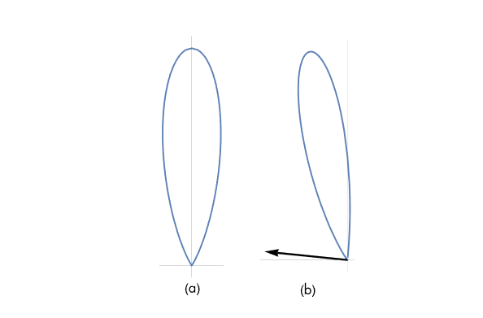
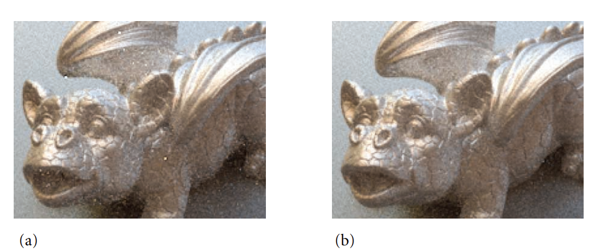

# PBRT 光线传输之表面反射

## Overview 
散射方程：它的值可以用蒙特卡洛估计：
$$
\begin{aligned}
L_{\mathrm{o}}\left(\mathrm{p}, \omega_{\mathrm{o}}\right) &=\int_{\mathrm{S}^{2}} f\left(\mathrm{p}, \omega_{\mathrm{o}}, \omega_{\mathrm{i}}\right) L_{\mathrm{i}}\left(\mathrm{p}, \omega_{\mathrm{i}}\right)\left|\cos \theta_{\mathrm{i}}\right| \mathrm{d} \omega_{\mathrm{i}} \\
& \approx \frac{1}{N} \sum_{j=1}^{N} \frac{f\left(\mathrm{p}, \omega_{\mathrm{o}}, \omega_{j}\right) L_{\mathrm{i}}\left(\mathrm{p}, \omega_{j}\right)\left|\cos \theta_{j}\right|}{p\left(\omega_{j}\right)}
\end{aligned}\\
$$

从具有 PDF分布的立体角$p(\omega_j)$中采样的$\omega_j$方向。在实践中，希望从近似于 BSDF 的分布中抽取一些样本，从近似于光源入射辐射的分布中抽取一些样本，然后使用多重重要性采样对样本进行加权。 接下来推导从 BSDF 和光源采样的方法。


## 1.采样反射函数

在基于微面的反射模型基于微面的分布， 其中每个微面都表现出完美的镜面反射或透射。首先从微平面分布中采样特定的微平面方向，然后`使用镜面反射或透射公式找到入射方向`。 因此需要实现一种从法线向量分布中采样的方法。

采样微面方向的经典方法是 直接采样。将首先展示对各向同性贝克曼Beckmann-Spizzichino 分布的这种方法的推导，然后描述一种更有效的采样方法，该方法从给定的出射方向从可见微面的分布中采样。

**Beckmann-Spizzichino 法线分布**
公式如下：
$$D(\omega_{\mathrm{h}})=\frac{\mathrm{e}^{-\mathrm{tan}^{2}\theta_{\mathrm{h}}/\alpha^{2}}}{\pi\alpha^{2}\cos^{4}\theta_{\mathrm{h}}}\\
$$
为了推导出采样方法，将考虑以球坐标表示。作为各向同性分布，$\phi$和$\theta$彼此独立(引出概率论知识当$\phi$和$\theta$彼此独立时，有$p_h(\theta, \phi) = p_h(\theta)\cdot p_h(\phi)$ 参考[事件独立性](https://zhuanlan.zhihu.com/p/554994259))，因此该分布的PDF, $p_h(\theta, \phi)$可分为$p_h(\theta)$和$p_h(\phi)$。其中$p_h(\theta)$是常数，值为$1/2\pi$，因此$\phi=2\pi\xi$，可以通过以下方式对值进行采样:
$$p_{\mathrm{h}}(\theta)=\frac{2\mathrm{e}^{-\mathrm{tan}^{2}\,\theta/\alpha^{2}\,\mathrm{sin}\,\theta}}{\alpha^{2}\,\mathrm{cos}^{3}\,\theta}  \tag{1.1}\\
$$

其中$\alpha$是粗糙度系数。可以应用inversion method(详细过程看前面的[不同分布函数之间的转换](https://zhuanlan.zhihu.com/p/552773776))来找到如何在给定均匀随机数的情况下从这个分布中采样一个$\theta^\prime$方向。首先，从方程 ( 1.1 ) 中获取 PDF，并积分以找到 CDF $P_{\mathrm{h}}(\theta^{\prime})$，有：
$$
\begin{align*}
    P_{\mathrm{h}}(\theta^{\prime}) &=\int_{0}^{\theta^{\prime}}\frac{2\mathrm{e}^{-\mathrm{tan}^{2}\,\theta/\alpha^{2}}\,\mathrm{sin}\,\theta}{\alpha^{2}\,\mathrm{cos}^{3}\,\theta}\,\mathrm{d}\theta\\
    & = 1-e^{-}\mathrm{tan}^{2}\,\theta^{\prime}/\alpha^{2}\\
\end{align*}\\
$$

为了找到采样技术，需要计算：
$$\xi=1-\mathrm{e}^{-\mathrm{tan}^{2}\,\theta^{\prime}/\alpha^{2}}\\$$

$\xi$对于$\theta^\prime$而言。在这种情况下，$\tan^2 \theta^\prime$足以找到微面方向并且计算效率更高，因此将计算：
$$\tan^{2}\theta^{\prime}=-\alpha^{2}\log(1-\xi)\\$$

给定$\tan^{2}\theta$，可以使用恒等式$\tan^{2}\theta=\sin^{2}\theta/\cos^{2}\theta$和$\sin^{2}\theta+\cos^{2}\theta=1.$来计算$\cos\theta$。 接下来，有足够的信息来使用球坐标公式计算微平面方向。因为将反射坐标系中将法线转换为（0，0，1），所以几乎可以直接使用从球坐标计算的方向。最后一个要处理的细节是，如果$\omega_o$它位于与法线相反的半球，则需要翻转半角矢量以使其也位于该半球。 采样代码如下：
```c++
Float cosTheta = 1 / std::sqrt(1 + tan2Theta);
Float sinTheta = std::sqrt(std::max((Float)0, 1 - cosTheta * cosTheta));
Vector3f wh = SphericalDirection(sinTheta, cosTheta, phi);
if (!SameHemisphere(wo, wh)) wh = -wh;
```

**阴影遮蔽函数分布**
关于加入阴影遮蔽函数项参考[掩蔽和阴影](https://zhuanlan.zhihu.com/p/554905095)

虽然从完整的微面分布中对微面方向进行采样可以得到正确的结果，但这种方法的效率受到以下事实的限制：整个微面 BSDF中只有$D(\omega_h)$中某一项被考虑在内。一个更好的方法是选择通过观察从给定方向$\omega$可见的微面分布。加入几何函数获得新的法线分布：（因为是从观察方向，所以这里的$\omega = \omega_o$）
$$
D_{\omega}(\omega_{\mathrm{h}})={\frac{D(\omega_{\mathrm{h}})\,G_{1}(\omega,\omega_{\mathrm{h}})\,\mathrm{max}(0,\omega\cdot\omega_{\mathrm{h}})}{\cos\theta}}  \tag{1.2}\\
$$

在这里，$G_1$代表微面自阴影，并且该$max(0,(\omega\cdot\omega_{\mathrm{h}}))/\cos\theta$项解释了自阴影（挡住外部光线）和遮挡（内部光线反射不出去）和在观察方向上投影。

下图比较了使用 Beckmann-Spizzichino 模型的微平面的整体分布以及从相当倾斜的观察方向的可见分布。请注意，许多方向根本不再可见（因为它们是背面）并且在传出方向$\omega_o$附近的微平面方向比它们在整体分布中的可见概率$D(\omega_h)$更高:



事实证明: 样本可以直接从方程（1.2）定义的分布中提取；因为这种分布比单独的$D(\omega_h)$分布更好地匹配完整的 Torrance-Sparrow 模型（[微表面模型 Microfacet Models](https://zhuanlan.zhihu.com/p/554905095)），所以图像的(蒙特卡洛估计)方差要小得多（见下图）.

新的可见性$D_w(w_h)$分布采样代码：

该实现首先使用Sample_wh()来查找微平面方向并反映关于微平面法线的传出方向。如果反射方向与 位于相反的半球 ，则其方向在表面下方，没有光被反射

```c++
Float MicrofacetDistribution::Pdf(const Vector3f &wo,
        const Vector3f &wh) const {
    if (sampleVisibleArea)
        return D(wh) * G1(wo) * AbsDot(wo, wh) / AbsCosTheta(wo);
    else
        return D(wh) * AbsCosTheta(wh);
}
//BRDF 使用Sample_wh()来查找微平面方向并求取关于微平面法线的反射方向
Spectrum MicrofacetReflection::Sample_f(const Vector3f &wo, Vector3f *wi,
        const Point2f &u, Float *pdf, BxDFType *sampledType) const {
    //<<Sample microfacet orientation  and reflected direction >> 
       Vector3f wh = distribution->Sample_wh(wo, u);
       *wi = Reflect(wo, wh);
       if (!SameHemisphere(wo, *wi)) return Spectrum(0.f);
    //<<Compute PDF of wi for microfacet reflection>> 
       *pdf = distribution->Pdf(wo, wh) / (4 * Dot(wo, wh));
    return f(wo, *wi);
}
```

在计算采样方向的 PDF 值时，需要注意一个重要的细节。微面分布给出了法线在半角向量周围的分布，但反射积分是相对于传入向量的。这些分布并不相同，必须将半角PDF转换为传入角PDF。换句话说，必须将密度从$\omega_h$变为$\omega_i$([不同分布函数之间的转换](https://zhuanlan.zhihu.com/p/552773776))。这样做需要对变量$\text{d}\omega_h / \text{d}\omega_i$的变化进行调整。最终根据几何关系得出： (具体推导参考[The Torrance–Sparrow Model](https://zhuanlan.zhihu.com/p/554905095))
$$
p(\theta)=\frac{p_{\mathrm{h}}(\theta_{h})}{4(\omega_{\mathrm{e}}\cdot\omega_{\mathrm{h}})}\\
$$

## 2. 菲涅耳混合光照模型 Fresenel Blend model
FresnelBlend类是Diffuse漫反射和glossy(也有叫specular)光泽的混合（比较像常见的phong， blin-phong等经验光照模型）。对该 BRDF 进行采样的一种直接方法是从cosine-weighted distribution(详见[半球上均匀采样](https://zhuanlan.zhihu.com/p/552773776))和微平面分布中进行采样。这里的实现基于$\xi_1$是小于还是大于0.5，以相等的概率在两者之间进行选择。在这两种情况下，它都会在使用它做出此决定后重新映射$\xi_1$以覆盖范围[0,1)。（否则，例如，用于cosine-weighted sampling的值$\xi_1$总是小于0.5。）以这种方式将样本$\xi_1$用于两个目的会略微降低实际用于抽样方向的值的分层质量
```C++
Spectrum FresnelBlend::Sample_f(const Vector3f &wo, Vector3f *wi, const Point2f &uOrig, Float *pdf, BxDFType *sampledType) const
{
    Point2f u = uOrig;
    if (u[0] < .5) {
        u[0] = std::min(2 * u[0], OneMinusEpsilon);
        // Cosine-sample the hemisphere, flipping the direction if necessary
        *wi = CosineSampleHemisphere(u);
        if (wo.z < 0) wi->z *= -1;
    } else {
        u[0] = std::min(2 * (u[0] - .5f), OneMinusEpsilon);
        // Sample microfacet orientation $\wh$ and reflected direction $\wi$
        Vector3f wh = distribution->Sample_wh(wo, u);
        *wi = Reflect(wo, wh);
        if (!SameHemisphere(wo, *wi)) return Spectrum(0.f);
    }
    *pdf = Pdf(wo, *wi);
    return f(wo, *wi);
}
```

## 3. 镜面反射和透射 Specular Reflection and Transmission

之前用于定义镜面反射的 BRDF 和镜面透射的 BTDF 的 Dirac delta 分布（详细参考[根据反射现象建立BRDF模型](https://zhuanlan.zhihu.com/p/545564030)）很好地适合这个采样框架（如上）。新的BSDF变成：
$$
\frac{1}{N} \sum_{i}^{N} \frac{f_{\mathrm{r}}\left(\mathrm{p}, \omega_{0}, \omega_{i}\right) L_{\mathrm{i}}\left(\mathrm{p}, \omega_{i}\right)\left|\cos \theta_{i}\right|}{p\left(\omega_{i}\right)}=\frac{1}{N} \sum_{i}^{N} \frac{\rho_{\mathrm{hd}}\left(\omega_{\mathrm{o}}\right) \frac{\delta\left(\omega-\omega_{i}\right)}{\left|\cos \theta_{i}\right|} L_{\mathrm{i}}\left(\mathrm{p}, \omega_{i}\right)\left|\cos \theta_{i}\right|}{p\left(\omega_{i}\right)}\\
$$

其中$\rho_{hd}(\omega_o)$是半球方向反射率， $\omega$是完美镜面反射或透射的方向。 因为 PDF $p(\omega_i)$也有一个 delta 项，$p(\omega_{i})=\delta(\omega-\omega_{i})$,所以两个 delta 分布相互抵消，估计量为 
$$\rho_{\mathrm{hd}}(\omega_{0})L_{\mathrm{i}}(\mathbf{p},\omega)\\$$

因此，此处的实现在使用Sample_f()采样时为镜面反射和透射的 PDF 返回一个常量值 1，按照惯例，对于镜面反射 BxDF，PDF 值中存在隐含的 delta 分布，当评估估计器时，预计会与 BSDF 值中的隐含 delta 分布相抵消。 因此，各个 Pdf() 方法对所有方向都返回 0，因为另一种采样方法从 delta 分布中随机找到方向的概率为零。

```c++
//<<SpecularReflection Public Methods>>+= 
Float Pdf(const Vector3f &wo, const Vector3f &wi) const {
    return 0;
}
//<<SpecularTransmission Public Methods>>+= 
Float Pdf(const Vector3f &wo, const Vector3f &wi) const {
    return 0;
}
```

这种约定有一个潜在(pitfall)的缺陷：当使用多重重要性采样来计算权重时，包含这些隐式delta分布(implicit delta distributions)的 PDF 值不能与常规 PDF 值自由混合。这在实践中不是问题，因为当被积函数中存在 delta 分布时，没有理由应用 MIS。
FresnelSpecular 类封装了镜面反射和透射，其相对贡献由电介质菲涅尔项调制。通过将这两者结合在一起，它能够使用出射方向$\omega_o$的菲涅耳项的值来确定要采样的分量——例如，对于反射高的掠射角，它更有可能返回反射方向而不是透射方向方向。这种方法在使用这些类型的表面渲染场景时提高了蒙特卡罗效率，因为被采样的光线往往对最终结果有更大的贡献。
```c++
Spectrum FresnelSpecular::Sample_f(const Vector3f &wo,
        Vector3f *wi, const Point2f &u, Float *pdf,
        BxDFType *sampledType) const {
    Float F = FrDielectric(CosTheta(wo), etaA, etaB);
    if (u[0] < F) {
        //<<Compute specular reflection for FresnelSpecular>> 
        // Compute perfect specular reflection direction
        *wi = Vector3f(-wo.x, -wo.y, wo.z);
        if (sampledType)
            *sampledType = BxDFType(BSDF_SPECULAR | BSDF_REFLECTION);
        *pdf = F;
        return F * R / AbsCosTheta(*wi);
    } else {
        //<<Compute specular transmission for FresnelSpecular>> 
           return ft / AbsCosTheta(*wi);
    }
}
```

## 4.反射率估计 Estimating Reflectance

至此，已经介绍了pbrt中大多数BxDF的BxDF采样例程。现在将展示如何使用这些采样例程来计算任意 BRDF 定义的反射积分的估计值。半球方向反射率是:
$$
\rho_{\mathrm{hd}}(\omega_{0})=\int_{\mathrm{H^{2}(n)}}f_{\mathrm{r}}(\omega_{0},\omega_{\mathrm{i}})|\cos\theta_{\mathrm{i}}|\,\mathrm{d}\omega_{\mathrm{i}}\\
$$

实际上:`评估估计器(计算反射率reflectance)是对反射函数的分布进行采样、找到其值并将其除以 PDF 值的问题`。估计量的每一项
$$
\frac{1}{N}\sum_{j}^{N}\frac{f_{\mathrm{r}}(\omega,\omega_{j})\left|\cos\theta_{j}\right|}{p(\omega_{j})}\\
$$

**可以类似地估计半球-半球（hemispherical–hemispherical）反射率**。给定：
$$
\rho_{\mathrm{hh}}=\frac{1}{\pi}\int_{\mathrm{H^{2}(n)}}\int_{\mathrm{H^{2}(n)}}f_{\mathrm{r}}(\omega^{\prime},\omega^{\prime\prime})\,|\cos\theta^{\prime}\cos\theta^{\prime\prime}|\,\mathrm{d}\omega^{\prime}\,\mathrm{d}\omega^{\prime\prime}\\
$$

$\omega^\prime$和$\omega^{\prime\prime}$两个向量必须对估计的每一项进行采样 :
$$
\frac{1}{\pi N}\sum_{j}^{N}\frac{f_{\mathrm{r}}(\omega_{j}^{\prime},\omega_{j}^{\prime\prime})\left|\cos\theta_{j}^{\prime}\cos\theta_{j}^{\prime\prime}\right|}{p(\omega_{j}^{\prime})\,p(\omega_{j}^{\prime\prime})}\\
$$

这里的实现在半球上均匀地对第一个方向进行采样。 鉴于此，可以使用 BxDF::Sample_f() 对第二个方向进行采样。
```c++
Spectrum BxDF::rho(int nSamples, const Point2f *u1, const Point2f *u2) const 
{
    Spectrum r(0.f);
    for (int i = 0; i < nSamples; ++i) 
    {
        // <<Estimate one term of >> 
           Vector3f wo, wi;
           wo = UniformSampleHemisphere(u1[i]);
           Float pdfo = UniformHemispherePdf(), pdfi = 0;
           Spectrum f = Sample_f(wo, &wi, u2[i], &pdfi);
           if (pdfi > 0)
               r += f * AbsCosTheta(wi) * AbsCosTheta(wo) / (pdfo * pdfi);

    }
    return r / (Pi * nSamples);
}
```

## 5.Sampling BSDFs

给定这些采样单个 BxDF 的方法，现在可以为 BSDF 类定义一个采样方法，BSDF::Sample_f()。 该方法由 Integrators 调用，根据 BSDF 的分布进行采样； 它调用各个 BxDF::Sample_f() 方法来生成样本。 BSDF 存储指向一个或多个可以单独采样的单个 BxDF 的指针，将从它们各自密度的平均值的密度中采样：
$$
p(\omega)=\frac{1}{N}\sum_{i}^{N}p_{i}(\omega)\\
$$

`此方法首先确定用于此特定样本的 BxDF 的采样方法。` u[0] 样本用于确定要对哪个 BxDF 组件进行采样，所以不能在调用组件的 Sample_f() 方法时直接重用它——它不再是均匀分布的。 （例如，如果有两个匹配的组件，那么第一个只能看到 0 和 0.5 之间的 u[0] 值，如果直接重用，第二个只能看到 0.5 和 1 之间的值。）但是，因为 u[0] 是 用于从离散分布中采样，可以从中恢复一个均匀的随机值：再次假设两个匹配的组件，希望将其第一个 BxDF 采样的时间从[0, 0.5)重新映射[0,1)和第二个 BxDF重[0,0.5)映射到[0, 1)的采样时间。 这种重新映射可以这样实现：
```c++
int matchingComps = NumComponents(type);
int comp = std::min((int)std::floor(u[0] * matchingComps), matchingComps - 1);
Point2f uRemapped(u[0] * matchingComps - comp, u[1]);
```

为了计算用于采样方向$\omega_i$的实际 PDF，需要 BxDF 的所有可能使用的 PDF 的平均值，给定传入的 BxDFType 标志。因为 *pdf 已经保存了采样分布的 PDF 值 从，只需要添加其他人的贡献。如果选择的 BxDF 是完全镜面反射的，会跳过计算步骤。，因为 PDF 在其中具有隐式delta分布。 将其他 PDF 值添加到该值是不正确的，因为它是用值 1 表示的增量项，而不是实际的delta分布。
```c++
// <<Compute overall PDF with all matching BxDFs>>= 
if (!(bxdf->type & BSDF_SPECULAR) && matchingComps > 1)
    for (int i = 0; i < nBxDFs; ++i)
        if (bxdfs[i] != bxdf && bxdfs[i]->MatchesFlags(type))
            *pdf += bxdfs[i]->Pdf(wo, wi);
if (matchingComps > 1) *pdf /= matchingComps;
...
// <<Compute value of BSDF for sampled direction>> 
       if (!(bxdf->type & BSDF_SPECULAR) && matchingComps > 1) {
           bool reflect = Dot(*wiWorld, ng) * Dot(woWorld, ng) > 0;
           f = 0.;
           for (int i = 0; i < nBxDFs; ++i)
               if (bxdfs[i]->MatchesFlags(type) &&
                   ((reflect && (bxdfs[i]->type & BSDF_REFLECTION)) ||
                   (!reflect && (bxdfs[i]->type & BSDF_TRANSMISSION))))
                   f += bxdfs[i]->f(wo, wi);
       }
       return f;
```
当BxDF 是完全镜面反射时，使用函数f函数计算结果：
```c++
Spectrum BSDF::f(const Vector3f &woW, const Vector3f &wiW,BxDFType flags) const 
{
    Vector3f wi = WorldToLocal(wiW), wo = WorldToLocal(woW);
    if (wo.z == 0) return 0.;
    bool reflect = Dot(wiW, ng) * Dot(woW, ng) > 0;
    Spectrum f(0.f);
    for (int i = 0; i < nBxDFs; ++i)
        if (bxdfs[i]->MatchesFlags(flags) &&
            ((reflect && (bxdfs[i]->type & BSDF_REFLECTION)) ||
             (!reflect && (bxdfs[i]->type & BSDF_TRANSMISSION))))
            f += bxdfs[i]->f(wo, wi);
    return f;
}
```


**参考资料:**

1. [《Importance Sampling Microfacet-Based BSDFs with the Distribution of Visible Normals》分析微表面的经典论文] (https://hal.inria.fr/hal-00996995v2/file/supplemental1.pdf)
2. [phong-model-and-physically-based] (https://techsingular.net/2020/04/25/phong-model-and-physically-based/)
3. [金属，塑料，傻傻分不清楚] (https://zhuanlan.zhihu.com/p/21961722)
