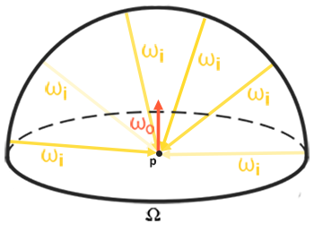
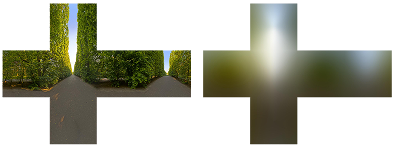

# 记录 IBL 光照的几个核心问题

## 算法思想
environment map的每个像素可以理解为一个小的太阳光（**radiance**）， 然后对environment map做 prefilter 得到**irradiance map**。 再乘以shading point的 **brdf就可以算出radiance**。   

## 渲染方程
$$
\begin{aligned}
L_o\left(p, \omega_o\right) &=\int_{\Omega}\left(\frac{F D G}{4\left(\omega_o \cdot n\right)\left(\omega_i \cdot n\right)}\right) L_i\left(p, \omega_i\right) n \cdot \omega_i d \omega_i \\
&=\int_{\Omega}\left(k_d \frac{c}{\pi}+k_s \frac{D G}{4\left(\omega_o \cdot n\right)\left(\omega_i \cdot n\right)}\right) L_i\left(p, \omega_i\right) n \cdot \omega_i d \omega_i \\
&=\int_{\Omega}\left(k_d \frac{c}{\pi}\right) L_i\left(p, \omega_i\right) n \cdot \omega_i d \omega_i+\int_{\Omega}\left(k_s \frac{D F G}{4\left(\omega_o \cdot n\right)\left(\omega_i \cdot n\right)}\right) L_i\left(p, \omega_i\right) n \cdot \omega_i d \omega_i \\
\end{aligned}
$$

> Note:
> * 菲涅尔F项描述了： **反射光占入射光的比例**，即 $k_s$ 值。 （很多教程将 $F$ 项重复计算了）


## 一. 漫反射部分

### 1. 数学公式
$$
L_o\left(p, \omega_o\right)=k_d \frac{c}{\pi} \int_{\Omega} L_i\left(p, \omega_i\right) n \cdot \omega_i d \omega_i \\
$$
漫反射项等于对半球周围做积分计算。


### 2. 分析漫反射环境光
把环境光照相对于shading point无限远， 所以计算只与normal相关，与position无关。 所以可以在半球方向上对environment lighting map做convolution。
$$
L_o\left(p, \omega_o\right)=k_d \frac{c}{\pi} \int_{\Omega} L_i\left(\omega_i\right) n \cdot \omega_i d \omega_i \\
$$


### 3.  预计算 prefiler irradiance map
预计算每个Normal对应的 Radaince $L_o\left(p, \omega_o\right)$。
利用黎曼和Riemann sum 进行卷积计算
* 对立方体贴图进行卷积等于计算沿 N 定向的半球 Ω 中每个方向 wi 的 total averaged radiance。


$$
\begin{aligned}
L_o\left(p, \phi_o, \theta_o\right) &=k_d \frac{c}{\pi} \int_{\phi=0}^{2 \pi} \int_{\theta=0}^{\frac{1}{2} \pi} L_i\left(p, \phi_i, \theta_i\right) \cos{\theta} \sin{\theta} d \phi d \theta \\
&=k_d \frac{c}{\pi}  \sum_{\phi=0}^{n_1}  \sum_{\theta=0}^{n_2} L_i\left(p, \phi_i, \theta_i\right) \cos{\theta} \sin{\theta} \frac{2\pi}{n_1} \frac{\pi}{2 n_2}\\
&=k_d \frac{c \pi}{n_1 n_2} \sum_{\phi=0}^{n_1} \sum_{\theta=0}^{n_2} L_i\left(p, \phi_i, \theta_i\right) \cos{\theta} \sin{\theta}\\
\end{aligned}\\
$$
相对应的irradiance map计算如下：
$$
E(p) = \frac{\pi^2}{n_1 n_2} \sum_{\phi=0}^{n_1} \sum_{\theta=0}^{n_2} L_i\left(p, \phi_i, \theta_i\right) \cos{\theta} \sin{\theta}\\
$$

因此着色点的radiance有：
$$
\begin{aligned}
    L(p, \omega_o) &= f_r \cdot E(p) \\
    & = \frac{albedo}{\pi} \cdot E(p) \\
\end{aligned}
$$
presudo code
```c++
//cpu code
for (map &map : irradianceMap)
{
//GPU shader
    uniform samplerCube environmentMap;

    for (normal &N : map)
    {
        vec3 N = normalize(N);
        vec3 irradiance = vec3(0.0);

        // tangent space calculation from origin point
        vec3 up = vec3(0.0, 1.0, 0.0);
        vec3 right = normalize(cross(up, N));
        up = normalize(cross(N, right));

        float sampleDelta = 0.025;
        float nrSamples = 0.0;
        for (float phi = 0.0; phi < 2.0 * PI; phi += sampleDelta)
        {
            for (float theta = 0.0; theta < 0.5 * PI; theta += sampleDelta)
            {
                // spherical to cartesian (in tangent space)
                vec3 tangentSample = vec3(sin(theta) * cos(phi), sin(theta) * sin(phi), cos(theta));
                // tangent space to world
                vec3 sampleVec = tangentSample.x * right + tangentSample.y * up + tangentSample.z * N;

                irradiance += texture(environmentMap, sampleVec).rgb * cos(theta) * sin(theta);
                nrSamples++;
            }
        }
        irradiance = PI * irradiance * (1.0 / float(nrSamples));
        map.FragColor = vec4(irradiance, 1.0);
    }
}
```
得到 **irradiance map** :


### 着色计算

对shading point计算 radiance
```c++
// IBL
uniform samplerCube irradianceMap;

int main()
{
    vec3 irradiance = texture(irradianceMap, N).rgb;
    vec3 diffuse      = irradiance * albedo;
    vec3 ambient = (kD * diffuse) * ao;
    
    // vec3 ambient = vec3(0.002);
    // reflectance equation
    vec3 Lo = vec3(0.0);

    vec3 color = ambient + Lo;

    // HDR tonemapping
    color = color / (color + vec3(1.0));
    // gamma correct
    color = pow(color, vec3(1.0/2.2)); 

    FragColor = vec4(color , 1.0);
}
```

## 镜面反射部分

具体数学推导过程参考[球谐光照笔记：Glossy光照](https://zhuanlan.zhihu.com/p/606198677) 


##  参考资料

1. [IBL] (https://learnopengl.com/PBR/IBL/Diffuse-irradiance)

