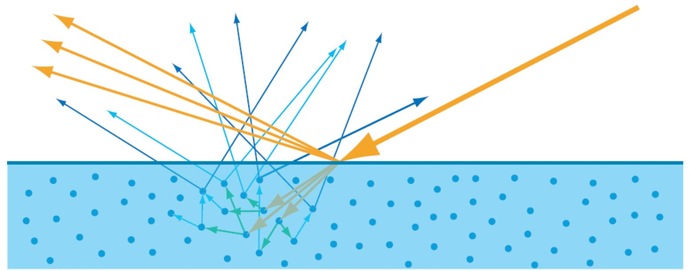
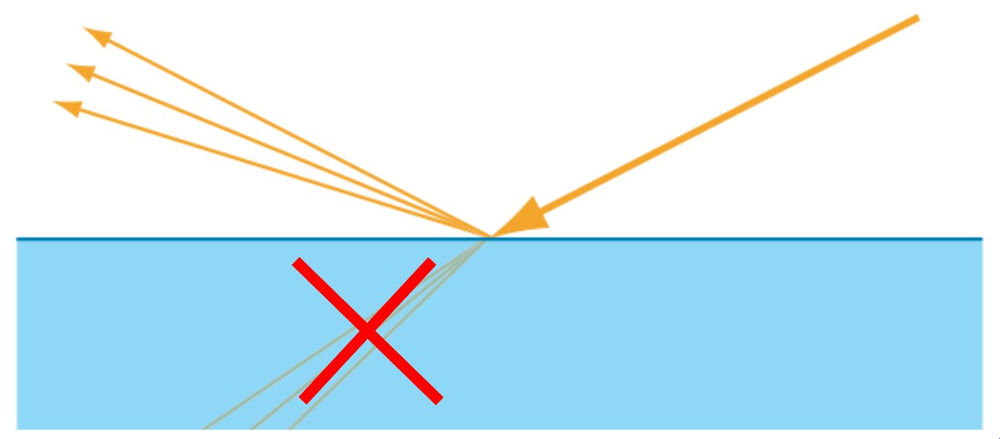

# PBR材质关键点梳理

### overview
总结在pbr实践中遇到的一些问题, 包括灯光，材质等，持续更新。。。

### 1. 理解反射率（Reflectance）与反照率（Albedo）
反射率（reflection）
* 又称光谱反射率，是波长的函数，又称为光谱反射率ρ(λ)，定义为反射能与入射能之比：
$$
\rho(\lambda)=\frac{E_R(\lambda)}{E_I(\lambda)}=\frac{\pi L(\lambda)}{E_I(\lambda)}\\
$$

反照率（albedo）
* 是指地表在太阳辐射的影响下，反射辐射通量与入射辐射通量的比值

**区别**
反射率（reflectance)是指某一波段向一定方向的反射，因而反照率是反射率在所有方向上的积分；反射率是波长的函数，不同波长反射率不一样，反照率是对全波长而言的。
反射率，用来表示某一个波长的反射能量与入射能量之比。
反照率，用来表示全波段的反射能量与入射能量之比。
比如：在TM1 band一般说反射率是多少。但到了可见光波段一般说反照率是多少。

### 金属Metallic/ roughness工作流

#### 金属和非金属的区别
详细参考[菲涅尔反射](https://zhuanlan.zhihu.com/p/545564030), 深蓝色和浅蓝色表示diffuse（分别来自于single scattering和multiple scattering）,金黄色表示specular. 而specular是光线在物体表面直接反射的结果（非金属和金属都具有）
* 非金属： 光线折射入物体后，在内部经过散射，有一部分会重新穿出表面。
* 金属： 折射入物体的光子会被完全吸收掉，没有diffuse。

#### 材质BRDF表达
金属（无diffuse）： 
$$
\mathrm{BRDF}_{\text {metal }}=\frac{F\left(F_{0 \text { metal }} , \cos\theta_i \right) D G}{4(n \cdot l)(n \cdot v)}\\
$$
非金属： $\mathrm{kd}$为折射光能比例, 为了能量守恒（$\mathrm{kd} = 1 - \mathrm{Metallic}$）
$$
\mathrm{BRDF}_\text{non-metal}=k_d \frac{\text { albedo }}{\pi}+\frac{F\left(F_{0 \text { non-metal }}\right) D G}{4(n \cdot l)(n \cdot v)}\\
$$

通用材质： 由于真实世界中物体是并非100%纯度的，即使是金属物体，表面也会有非金属材质；同样非金属表面也有一定金属材质。 通过对两者的**反射率$\mathrm{F}_0$**插值得到更为通用的$\mathrm{BRDF}$反射模型。

其中，
$$
\begin{align*}
    F_{0\_Metal} &=\operatorname{lerp}\left(F_{0\_\text {NonMetal}}, F_{0\_\text { Metal }}, metallic \right)\\
    F_{0\_NonMetal} &=\operatorname{lerp}\left(F_{0\_\text {Metal }}, F_{0\_\text{NonMetal}}, metallic \right)  
\end{align*}
$$
在具体引擎PBR流程设计过程中，对于金属（Metal）材质，diffuse很弱，非金属材质，specular很弱，了材质表达的统一，都用0.04这个常量。因此表达改成如下形式：
$$
F_0=\operatorname{lerp}\left(0.04, F_{0 \text {Albedo}}, metallic \right)\\
$$
>Note: 由上述公式可知。 
>* 对于金属Albedo： 存的是rgb反射率$\bf F_0$。
>* 对于非金属Albedo ： 存入的是rgb反照率$\bf albedo$。

通用BRDF格式: 通过金属度metallic混合二者。
$$
\begin{aligned}
B R D F &=\operatorname{lerp}\left(B R D F_{\text {non-metal }}, B R D F_{\text {metal }}, \text { metallic }\right) \\
&=k_d \frac{\text { albedo }}{\pi}(1-\text { metallic })+\frac{F\left(F_0, \cos\theta_i\right) D G}{4(n \cdot l)(n \cdot v)} \\
&=k_d \frac{\text { albedo }}{\pi}(1-\text { metallic })+ k_s\frac{D G}{4(n \cdot l)(n \cdot v)} \\
\end{aligned} \\
$$

* $F(F_0, \,\cos\theta_i)$
* $k_d = 1- k_s$

### Todo 

## 参考资料
1. [反照率](https://zh.wikipedia.org/zh-cn/%E5%8F%8D%E7%85%A7%E7%8E%87)
2. [反射率](https://zh.m.wikipedia.org/zh-hans/%E5%8F%8D%E5%B0%84%E7%8E%87)
3. [金属，塑料，傻傻分不清楚](https://zhuanlan.zhihu.com/p/21961722)
