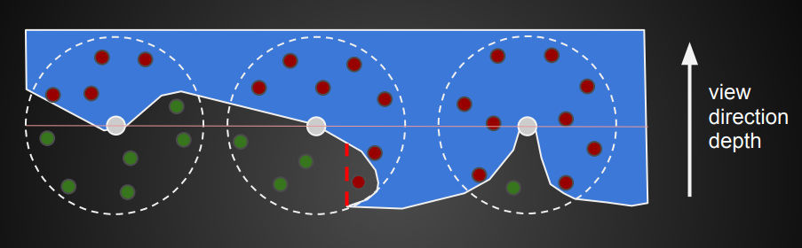
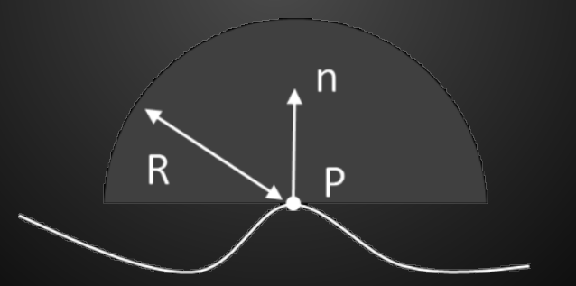
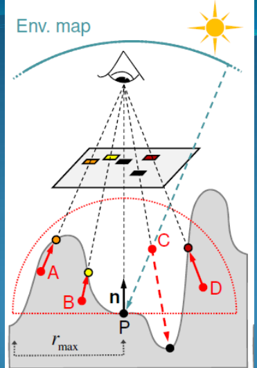
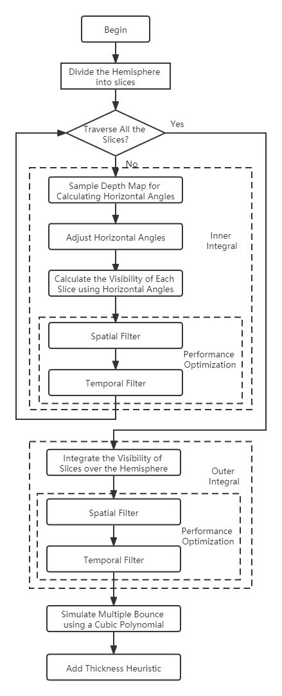
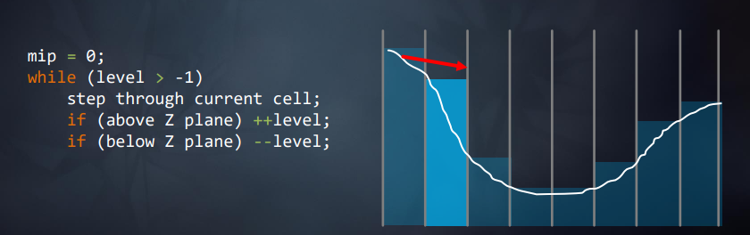

# SSGI 

## World Space VS Screen Space

**world Space：**
* 需要Geometry空间信息
* 需要复杂的 spatial data structures
* 场景的复杂度和geometry数量相关

**Screen Space：**
* 可以在post-rendering pass
* 只与屏幕空间相关，与场景geometry复杂度无关。
* 简单
* 非物理正确，超出屏幕空间就无法计算。


## UE4的SSGI流程


## 一. occlusion ambient

### 1. SSAO
**Diagram:**


#### 1.1 计算公式
**Irradiance from ambient light without ambient occlusion**
$$
E(\boldsymbol{p}, \boldsymbol{n})=\int_{\Omega} L_A \cos \theta_i d \omega_i=\pi L_A \\
$$

**with ambient occlusion:**
$$
E(\mathbf{p}, \mathbf{n})=L_A \int_{\Omega} v(\mathbf{p}, \mathbf{l}) \cos \theta_i d \omega_i \\
$$
>Note:
>* $v(\mathbf{p}, \mathbf{l})$ is 0  or 1 depending on if the direction l is occluded or not.

#### 1.2 Occlusion Factor
$$
k_A(\mathbf{p})=\frac{1}{\pi} \int_{\Omega} v(\mathbf{p}, \mathbf{l}) \cos \theta_i d \omega_i
$$

**irradiance equation:**
$$
E(\mathbf{p}, \mathbf{n})=k_A(\mathbf{p}) \pi L_A \\
$$

#### 1.4 SSAO改进

**HBAO： normally based**

$$
A(p)=1-\frac{1}{2 \pi} \int_{\Omega} V(\vec{\omega}) W(\vec{\omega}) d \omega \\
$$
离散计算：半球方向随机生成三维点，比较三维点的z值和对应的深度值。 遮挡了Occlusion就1
$$
A(p)=1-\frac{\text { Occlusion }}{N} \\
$$

>Note:
>* V is the visibility function, 0 or 1.
>* W is an attenuation function.

**SSDO：Screen Space Directional Occlusion**

Indirect Bounces:
* provide color bleeding simulation: 
* To include one indirect bounce of light, the direct light stored in the framebuffer from the previous pass can be used（一般使用上一帧的信息）.


shading point 的周围点（the sender radiance of a small patchABD）间接光照的计算：
$$
L_{\mathrm{ind}}(\mathbf{P})=\sum_{i=1}^N \frac{\rho}{\pi} L_{\mathrm{pixel}}\left(1-V\left(\omega_i\right)\right) \frac{A_{\mathrm{s}} \cos \theta_{\mathrm{s}_i} \cos \theta_{\mathrm{r}_i}}{d_i^2} \\
$$

#### 1.5 Implementation Details

**visibility test：**
* 从camera观察 随机点的遮挡情况。

**geometry-sensitive blur**
to remove the noise：
* reduction of samples per pixel.

### UE4 代码分析
SSAO入口代码:
```c++
// @param Levels 0..3, how many different resolution levels we want to render
static FScreenPassTexture AddPostProcessingAmbientOcclusion(
	FRDGBuilder& GraphBuilder,
	const FViewInfo& View,
	const FSSAOCommonParameters& CommonParameters,
	FScreenPassRenderTarget FinalTarget)
```

### GTAO原理

#### 1. 算法框架


#### 2. details

代码如下：
```c++
//AO is visibility
float3 GTAOMultiBounce( float3 BaseColor, float AO )
{
	float3 a =  2.0404 * BaseColor - 0.3324;
	float3 b = -4.7951 * BaseColor + 0.6417;
	float3 c =  2.7552 * BaseColor + 0.6903;
	return max( AO, ( ( AO * a + b ) * AO + c ) * AO );
}
```

## 二. SSR解决镜面反射项

### 1. 算法框架：
需要做world space 到 screen Space空间的转换。


### 2. 加速ray tracing结构
Hierarchical tracing:


### 3. 光照计算：
**SSR Integration:**
```c++
result =0.0
weightSum =0.0
for pixel in neighborhood:
{
    weight = localBrdf(pixel.hit) / pixel.hitPdf
    result += color (pixel.hit) $*$ weight
    weightSum += weight
}
result /= weightSum
```


## 漫反射项

### UE4 源码分析
```c++
void FDeferredShadingSceneRenderer::RenderDiffuseIndirectAndAmbientOcclusion(
	FRDGBuilder& GraphBuilder,
	TRDGUniformBufferRef<FSceneTextureUniformParameters> SceneTexturesUniformBuffer,
	FRDGTextureRef SceneColorTexture,
	FRDGTextureRef LightingChannelsTexture,
	FHairStrandsRenderingData* InHairDatas)
```
#### 1. Detail
* r.SSGI.LeakFreeReprojection为1,表示是使用原生的上一帧的SceneColor。


## 参考资料：
1. [approximating dynamic global illumination in image space] (https://dl.acm.org/doi/pdf/10.1145/1507149.1507161)
2. [剖析虚幻渲染体系] (https://zhuanlan.zhihu.com/p/551128453)
3. [游戏中的全局光照(五) Reflection Probe、SSR和PPR] (https://zhuanlan.zhihu.com/p/313845354)
4. [GTAO原理&UE4移动端GTAO实现分析] (https://zhuanlan.zhihu.com/p/473737959)