# Games103 布料模拟

### 效果实现
总结：同时实现了用基于隐式积分方法和基于pdb方法的的布料模拟，从效果上看，隐式积分方法自相交更少且速度更快，但是目前都是基于CPU端。　GPU端，隐式积分方法可以用chebyshev加速并行，而欧拉方法同样也可以使用Jacobi Approach使用GPU端并行。 暂时没有测试实际效果。
#### 隐式布料求解器 

**隐式求解效果：**

##### 1. 初始设置：
* 对于每个顶点，对速度应用阻尼：$\mathbf{v}_i *= damping$ 计算：$\hat{\mathbf{x}}_i=\mathbf{x}_i+\Delta t \mathbf{v}_i$。之后，将$\mathbf{x}_i$设置为其初始猜测：$\mathbf{x}_i=\hat{\mathbf{x}}_i$。 （注意$\mathbf{x}_i$是初步猜测，不是真正的更新。无论如何初始化$\mathbf{x}_i$，求解器都能正常工作，但是一个糟糕的初始猜测会使求解器花费更多的迭代来收敛。您可以尝试其他初始猜测以查看差异。例如，什么都不做。） 
##### 2. 梯度计算
* 接下来，编写一个梯度函数来计算目标函数的梯度。该函数的输入是$\mathbf{x}$, $\hat{\mathbf{x}}_i$和时间步长$\Delta t$。输出是梯度 $\bf g$。根据讲义，梯度为： 
$$
\mathbf{g}=\frac{1}{\Delta t^2} \mathbf{M}(\mathbf{x}-\hat{\mathbf{x}})-\mathbf{f}(\mathbf{x}) \\
$$
* 其中 $\bf f(x)$是重力向量。计算方程式的第一部分,遍历所有的顶点：$\mathbf{g}_i \leftarrow \frac{1}{\Delta t^2} \mathbf{m}_i\left(\mathbf{x}_i-\hat{\mathbf{x}}_i\right)$。为了施加负弹簧力，遍历边 $e$连接 $i$ 和 $j$ 并添加到$\bf g$
$$
\left\{\begin{array}{l}
\mathbf{g}_i \leftarrow \mathbf{g}_i+k\left(1-\frac{L_e}{\left\|\mathbf{x}_i-\mathbf{x}_j\right\|}\right)\left(\mathbf{x}_i-\mathbf{x}_j\right) \\
\mathbf{g}_j \leftarrow \mathbf{g}_j-k\left(1-\frac{L_e}{\left\|\mathbf{x}_i-\mathbf{x}_j\right\|}\right)\left(\mathbf{x}_i-\mathbf{x}_j\right)
\end{array}\right.\\
$$
##### 3. 完成
*  使用牛顿法求解隐式布料积分的非线性优化问题。实际上，有两个障碍：1）Hessian 矩阵构造复杂；1) 线性求解器在 Unity 上难以实现。相反，通过将 Hessian 视为对角矩阵来选择更简单的方法。这产生了对每个顶点的简单更新： （**ps：这里其实是将弹簧系统的Hessian矩阵进行了$\mathbf{H}(x^{k}) = 4k$ 简化，为什么是这样的，因为弹簧的Hessian就是弹簧力的梯度，即刚度stiffness**）
$$
\mathbf{x}_i \leftarrow \mathbf{x}_i-\left(\frac{1}{\Delta t^2} m_i+4 k\right)^{-1} \mathbf{g}_i\\
$$
这种方法的工作原理类似于牛顿法：首先计算梯度$\bf g$；然后通过方程式更新所有顶点。 3. 重复这个过程 32 次，使$\bf x$可以足够好。最后，计算速度$\mathbf{v} \leftarrow \mathbf{v}+\frac{1}{\Delta t}(\mathbf{x}-\tilde{\mathbf{x}})$并将$\bf x$分配给 mesh.vertices。 

##### 4.Chebyshev 切比雪夫加速度(基于雅可比方法)
*  将Chebyshev 半迭代法用于非线性优化$\mathbf{A} \Delta \mathbf{x}=\mathbf{b}$。
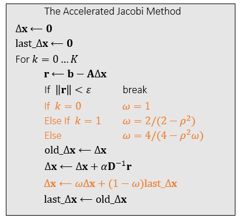
* $\rho(\rho<1)$是迭代矩阵的估计谱半径。
##### 5. Sphere Collision
* 在 Collision Handling 函数中，计算每个顶点到球体中心的距离，并用它来检测顶点是否发生碰撞。要获得球心 c. 
$$
\mathbf{v}_i \leftarrow \mathbf{v}_i+\frac{1}{\Delta t}\left(\mathbf{c}+r \frac{\mathbf{x}_i-\mathbf{c}}{\left\|\mathbf{x}_i-\mathbf{c}\right\|}-\mathbf{x}_i\right), \quad \mathbf{x}_i \leftarrow \mathbf{c}+r \frac{\mathbf{x}_i-\mathbf{c}}{\left\|\mathbf{x}_i-\mathbf{c}\right\|} \\
$$

#### PDB方法求解器

**PDB实现效果**

##### 1. 初始设置：
* 在更新函数中，将PBD求解器设置为粒子系统。 具体来说，对于每个顶点应用阻尼速度$\mathbf{v}_i *= damping$，通过重力更新速度，最后更新位置：$\mathbf{x}_i \leftarrow \mathbf{x}_i+\Delta t \mathbf{v}_i$。

#### 2. 应变限制
* 在应变限制功能中，以 Jacobi 方式实现基于位置的动力学。 基本思想是定义两个临时数组 $\bf sum_x[]$ 和 $\bf sum_n[]$ 来存储顶点位置更新和顶点计数更新的总和。 在函数的开头，将两个数组都设置为零。 之后，对于连接 $i$ 和 $j$ 的每条边 $e$，更新数组：
$$
\begin{aligned}
sum\_\mathbf{x}_i &\leftarrow sum\_\mathbf{x}_i+\frac{1}{2}\left(\mathbf{x}_i+\mathbf{x}_j+L_e \frac{\mathbf{x}_i-\mathbf{x}_j}{\left\|\mathbf{x}_i-\mathbf{x}_j\right\|}\right), \qquad sum\_\mathbf{n}_i = sum\_\mathbf{n}_i +1  \\
sum\_\mathbf{x}_j &\leftarrow sum\_\mathbf{x}_j +\frac{1}{2}\left(\mathbf{x}_i+\mathbf{x}_j-L_e \frac{\mathbf{x}_i-\mathbf{x}_j}{\left\|\mathbf{x}_i-\mathbf{x}_j\right\|}\right), \qquad  sum\_\mathbf{n}_j = sum\_\mathbf{n}_j +1 \\
\end{aligned} \\
$$
* 最后，将每个顶点更新为：
$$
\mathbf{v}_i \leftarrow \mathbf{v}_i+\frac{1}{\Delta t}\left(\frac{0.2 \mathbf{x}_i+sum\_\mathbf{x}_i}{0.2+ sum\_\mathbf{n}_i}-\mathbf{x}_i\right), \quad \mathbf{x}_i \leftarrow \frac{0.2 \mathbf{x}_i+s u m_{-} \mathbf{x}_i}{0.2+ sum\_\mathbf{n}_i}
$$

>Note: 
>
>* 应该多次执行此函数以确保边长  度得到很好的保留。 否则，您可能会看到过度拉伸的artifacts

### 物理建模
#### 质点弹簧系统

理想的弹簧满足胡克定律：弹簧力试图恢复静止长度，具体数学原理参考[质点弹簧系统](https://zhuanlan.zhihu.com/p/557061822)
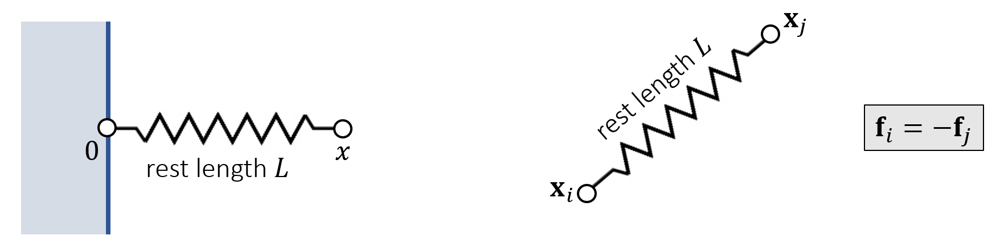

**多个弹簧**

当有许多弹簧时，能量和力量可以简单地总结：
$$
\begin{aligned}
E &=\sum_{e=0}^3 E_e=\sum_{e=0}^3\left(\frac{1}{2} k\left(\left\|\mathbf{x}_i-\mathbf{x}_e\right\|-L_e\right)^2\right) \\
\mathbf{f}_i &=-\nabla_i E=\sum_{e=0}^3\left(-k\left(\left\|\mathbf{x}_i-\mathbf{x}_e\right\|-L_e\right) \frac{\mathbf{x}_i-\mathbf{x}_e}{\left\|\mathbf{x}_i-\mathbf{x}_e\right\|}\right)\\
& = \sum_{e=0}^3\left(-k\left( 1 - \frac{L_e}{\|\mathbf{x}_i-\mathbf{x}_e\|} \right) (\mathbf{x}_i-\mathbf{x}_e) \right) \\
\end{aligned}\\
$$

**网格结构**

结构化弹簧网络：相互错开，避免**偏向性**
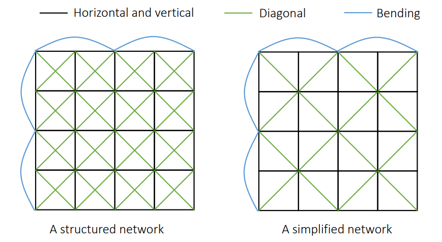

非结构化弹簧网格： 连接相邻的三角形相对的两个顶点
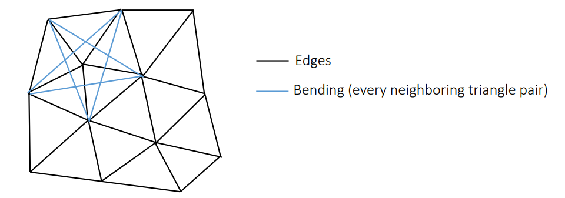

三角形网格：顶点列表 + 索引列表
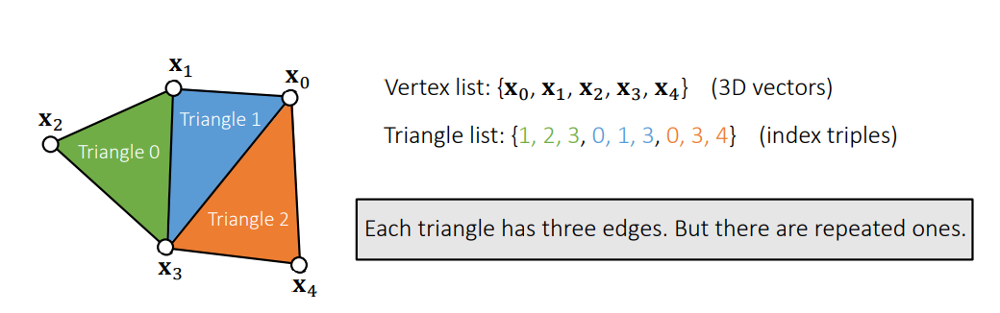

拓扑结构: 
* 仅有三角形网格是不够的，还需要边，内部边(内部边被两个三角形共享)的信息， 以及去掉重边(内部边)。
* 拓扑构造的关键是对三角形边三元组进行排序（如图）。
* 每个三元组包含：边顶点1，顶点2，三角形序号（边索引需要排序）。

**构造三元组列表（Triple list）过程如下：**

* 描述边信息的三元组结构：(顶点1 <  顶点2，三角形序号)

* 对这个三元组列表进行排序
  * 排序规则：逐个比较三元组中的元素
  * 排序之后重复的边位置会相邻
* 去除重复边，与此同时得到弯曲边
  * 重复边：顶点1、2的索引都相同
  * 弯曲边：重复边对应一条弯曲边
* 可以获取到相邻的两个三角形的信息
* 检查这两个三角形，获取到 Bending Edge
  * 可以直接保存弯曲边，也可以保存相邻三角形对

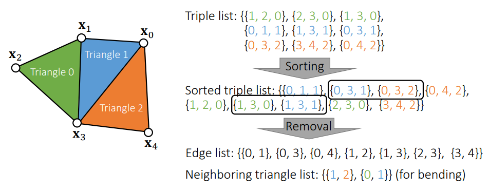

#### 显式积分法Explicit Integration
先简单的看成一个**粒子系统**， 有了各种边的信息后可以开始一个模拟系统了。将弹簧系统插入力的计算中。

计算步骤：
预计算：

* 对每个顶点计算初始的力，保存成一个数组$\rm F[i]$

遍历：
* 对于每一个结点，计算他所受到的力
    * 遍历每一根弹簧，把力叠加到结点上$\mathbf{f}_i \leftarrow \mathbf{f}_i+\mathbf{f}$。
* 通过力计算加速度
* 更新速度
* 更新位置
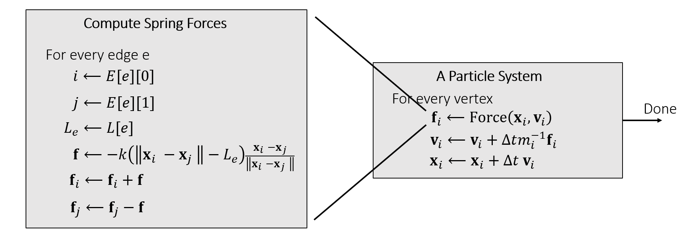

**存在的问题**

数值不稳定：当刚度$k$和/或时间步长$\Delta t$太大时，显式积分会受到由过冲(overshooting)引起的数值不稳定的影响。
一个简单的解决方案是使用一个小的$\Delta t$。 但这会减慢模拟速度

> Note: 我理解的原因,因为实际过程中在$\rm \delta t$时间内，$\rm f$其实应该是要有能量损失的，但是这里假定$\rm f$恒定。就会有导致能量不守恒（越来越大）。

#### 隐式积分法
隐式积分是解决数值不稳定性的更好方法。 这个想法是隐式整合$x$和$v$: 建立位移力 $\bf f$和 位移 $\bf x$ 的关系式。 
$$
\left\{\begin{array} { l } 
{ \mathbf { v ^\prime} = \mathbf { v } ^ { [ 0 ] } + \Delta t \mathbf { M } ^ { - 1 } \mathbf { f } ^ { [ 1 ] } } \\
{ \mathbf { x } ^ { [ 1 ] } = \mathbf { x } ^ { [ 0 ] } + \Delta t \mathbf { v^\prime}  }
\end{array} \quad \Longrightarrow \quad \left\{\begin{array}{l}
\mathbf{x}^{[1]}=\mathbf{x}^{[0]}+\Delta t \mathbf{v}^{[0]}+\Delta t^2 \mathbf{M}^{-1} \mathbf{f}^{[1]} \\
\mathbf{v}^{[1]}=\left(\mathbf{x}^{[1]}-\mathbf{x}^{[0]}\right) / \Delta t
\end{array}\right.\right.\\
$$

假定力$\bf f$是holonomic（只和位置相关称为holonomic），上式转化成：
$$
\mathbf{x}^{[1]}=\mathbf{x}^{[0]} + \Delta t \mathbf{v}^{[0]}+\Delta t^2 \mathbf{M}^{-1} \mathbf{f}\left(\mathbf{x}^{[1]}\right)\\
$$

#### 将求解隐私积分问题转化成求解优化问题
* 由能量守恒，可以将上述等式，对力$\mathbf{f}\left(\mathbf{x}^{[1]}\right)$积分，得到包含能量$E(\mathbf{x})$的函数。（能量的梯度数值就是弹力大小，方向相反）
* 数学表达式： $\|\mathbf{x}\|_{\mathbf{M}}^2=\mathbf{x}^{\mathbf{T}} \mathbf{M} \mathbf{x}$
$$
\begin{gathered}
F(\mathbf{x})=\frac{1}{2 \Delta t^2}\left\|\mathbf{x}-\mathbf{x}^{[0]}- \Delta t \mathbf{v}^{[0]}\right\|_{\mathbf{M}}^2+E(\mathbf{x}) \\
\mathbf{x}^{[1]}=\text{argmin} F(\mathbf{x})\\
\end{gathered}\\
$$
在优化问题中： $\nabla F\left(\mathbf{x}^{[1]}\right)=\frac{1}{\Delta t^2} \mathbf{M}\left(\mathbf{x}^{[1]}-\mathbf{x}^{[0]}-\Delta t \mathbf{v}^{[0]}\right)-\mathbf{f}\left(\mathbf{x}^{[1]}\right)=\mathbf{0}$可以找到最优解。

>Note: 
>* 采用优化问题：可以站在更高的维度看待问题，这个方法不仅仅能够使用在弹簧系统中，也适用于其他系统
>* 根据一阶导数和二阶导数找到极大值或极小值（最优解）
>* 该方法还取决于函数的性质（如正定性分析），有时候可能会陷入局部最优的问题。

**牛顿-拉夫森法:**

Newton-Raphson 方法，俗称牛顿法，解决优化问题：$\mathbf{x}^{[1]}=\text{argmin} F(\mathbf{x})$ 。 给定一个𝑥(𝑘)，通过以下方式近似目标:  

$$f^{\prime}\left(x_n\right)=\frac{f\left(x_n\right)-0}{x_n-x_{n+1}} \Longrightarrow x_{n+1}=x_n-\frac{f\left(x_n\right)}{f^{\prime}\left(x_n\right)}\\$$
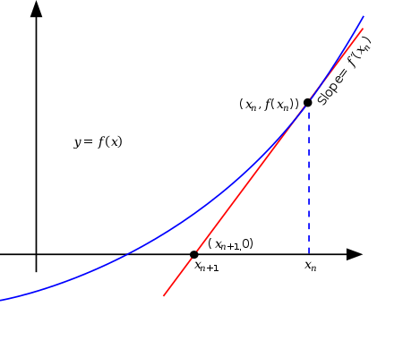
对于弹簧网格有公式：(可以从几何上理解，也可以从泰勒展开上理解)
$$
\begin{aligned}
0=F^{\prime}(x) & \approx F^{\prime}\left(x^{(k)}\right)+F^{\prime \prime}\left(x^{(k)}\right)\left(x-x^{(k)}\right)\\
 x& =  x^{(k)} - \frac{1}{F^{\prime \prime}(x^{(k)})} F^{\prime}(x^{(k)})  
\end{aligned}\\
$$
牛顿法迭代求解：
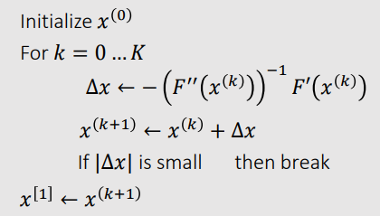

求解未知量：
* $F^{\prime}(x^{(k)}) = \nabla F\left(\mathbf{x}^{(k)}\right)=\frac{1}{\Delta t^2} \mathbf{M}\left(\mathbf{x}^{(k)}-\mathbf{x}^{[0]}-\Delta t \mathbf{v}^{[0]}\right)-\mathbf{f}\left(\mathbf{x}^{(k)}\right)$
* $F^{\prime\prime}(x^{(k)}) = \frac{\partial^2 F\left(\mathbf{x}^{(k)}\right)}{\partial \mathbf{x}^2}=\frac{1}{\Delta t^2} \mathbf{M}+\mathbf{H}\left(\mathbf{x}^{(k)}\right)$
* 关于hessian矩阵$\mathbf{H}\left(\mathbf{x}^{(k)}\right)$推导可以参考[质点弹簧系统](https://zhuanlan.zhihu.com/p/557061822)部分

将以上带入优化方程中有算法,其中$\Delta \mathbf{x} = \mathbf{x}^{(k+1)} - \mathbf{x}^{(k)}$：
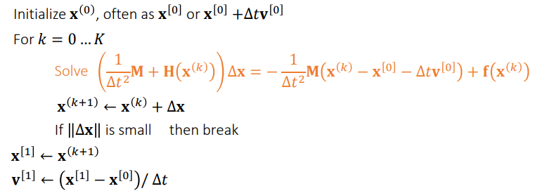

**求解线性系统**

对Solve $\left(\frac{1}{\Delta t^2} \mathbf{M}+\mathbf{H}\left(\mathbf{x}^{(k)}\right)\right) \Delta \mathbf{x}=-\frac{1}{\Delta t^2} \mathbf{M}\left(\mathbf{x}^{(k)}-\mathbf{x}^{[0]}-\Delta t \mathbf{v}^{[0]}\right)+\mathbf{f}\left(\mathbf{x}^{(k)}\right)$简化得到线性方程：
$$
\mathbf{A} \Delta \mathbf{x}=\mathbf{b}\\
$$
求解方法，具体可以参考[线性方程组数值解法](https://zhuanlan.zhihu.com/p/557061822)：
* 方法一， 直接法： 
  * LU 分解、LDLT 分解、Cholesky 分解
  * 代价高，得到精确解
  * 对矩阵  限制少
  * 适合 CPU 计算
* 方法二： 迭代法：是多次求解，直到满足容差
  * 如果需要得到精确解的话代价大，但是可以根据容差控制
  * 要让方法收敛的话，对矩阵  有比较严格的限制（例如正定）
  * CPU、GPU 都行
  * 实现比较容易
  * 有很多加速算法

**Hessian 的正定性 Positive Definiteness of Hessian**

求解Hessian 矩阵 $\mathbf{H}\left(\mathbf{x}^{(k)}\right)$
$$
\mathbf{H}(\mathbf{x})=\sum_{e=\{i, j\}}\left[\begin{array}{cc}
\frac{\partial^2 E}{\partial \mathbf{x}_i^2} & \frac{\partial^2 E}{\partial \mathbf{x}_i \partial \mathbf{x}_j} \\
\frac{\partial^2 E}{\partial \mathbf{x}_i \partial \mathbf{x}_j} & \frac{\partial^2 E}{\partial \mathbf{x}_j^2}
\end{array}\right]=\sum_{e=\{i, j\}}\left[\begin{array}{cc}
\mathbf{H}_e & -\mathbf{H}_e \\
-\mathbf{H}_e & \mathbf{H}_e
\end{array}\right]
$$
其中有：
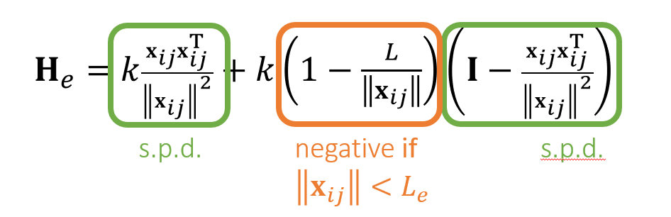
因为对于任意的$\mathbf{x}_{i j}, \mathbf{v} \neq \mathbf{0}$，绿色矩阵是正定的：
$$
\mathbf{v}^{\mathrm{T}} \frac{\mathbf{x}_{i j} \mathbf{x}_{i j}{ }^{\mathrm{T}}}{\left\|\mathbf{x}_{i j}\right\|^2} \mathbf{v}=\left\|\mathbf{x}_{i j}{ }^{\mathrm{T}} \mathbf{v}\right\|^2\|\|^2>0  \qquad \mathbf{v}^{\mathrm{T}}\left(\mathbf{I}-\frac{\mathbf{x}_{i j} \mathbf{x}_{i j}{ }^{\mathrm{T}}}{\left\|\mathbf{x}_{i j}\right\|^2}\right) \mathbf{v}=\frac{\left\|\mathbf{x}_{i j}\right\|^2\|\mathbf{v}\|^2-\left\|\mathbf{x}_{i j}{ }^{\mathrm{T}} \mathbf{v}\right\|^2}{\left\|\mathbf{x}_{i j}\right\|^2} \geq 0
$$

* 当弹簧被拉伸时候，橙色部分大于等于0（弹簧被拉伸），$\bf H_e$是正定矩阵，当压缩时候，橙色小于0，就无法却确定$\bf H_e$的正定性。
* 而对于A矩阵而言也是无法确定正定性：
$$
\mathbf{A}=\frac{1}{\Delta t^2} \mathbf{M}+\mathbf{H}(\mathbf{x})=\frac{1}{\Delta t^2} \mathbf{M}+\sum_{e=\{i, j\}}\left[\begin{array}{ccccc}
\ddots & \vdots & \vdots & \vdots \\
\vdots & \mathbf{H}_e & -\mathbf{H}_e & \vdots \\
\vdots & -\mathbf{H}_e & \mathbf{H}_e & \vdots \\
\vdots & \vdots & \vdots & \ddots
\end{array}\right]\\
$$

为什么需要正定性判断；
* Spring Hessian 是半正定的，那么函数存在唯一解，是极小值
* 同时关于A矩阵$\Delta t$越小，正定可能性越大。

**弹簧压缩的情况**

当弹簧被压缩时，Hessian 弹簧可能不是正定的。 这意味着可以有多个局部最小值（结果）。
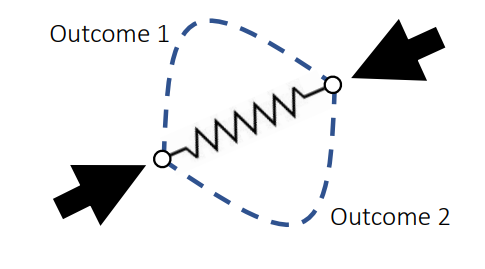

然而，如果$\mathbf{A} \Delta \mathbf{x}=\mathbf{b}$中的矩阵$\bf A$不是正定矩阵，一些线性求解器可能无法工作。
* 一种解决方案是在$\left\|\mathbf{x}_{i j}\right\|<L_e$时简单地删除后面一项。（粗暴的近似，也可以work）
* 其他方法：Choi and Ko. 2002. Stable But Responive Cloth. TOG (SIGGRAPH)
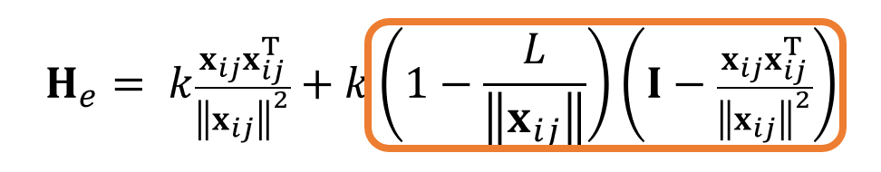

#### 弹簧弯曲和锁定
##### 网格弯曲问题

解决思路：
在弹簧质点系统中，加上一条对角边弹簧。下图蓝色部分。
  * 当网格接近平面时，对角边长度几乎没有什么变化，弹簧几乎没有阻力，因此在稳态下，也会有网格翘起现象。（对角边弹簧不能完全复原）
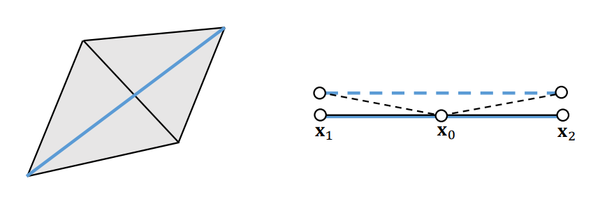

解决方法: 

**二面角模型**

Dihedral Angle Model： 二面角模型将弯曲力定义为$\theta$的函数：$\mathbf{f}_i=f(\theta) \mathbf{u}_i$
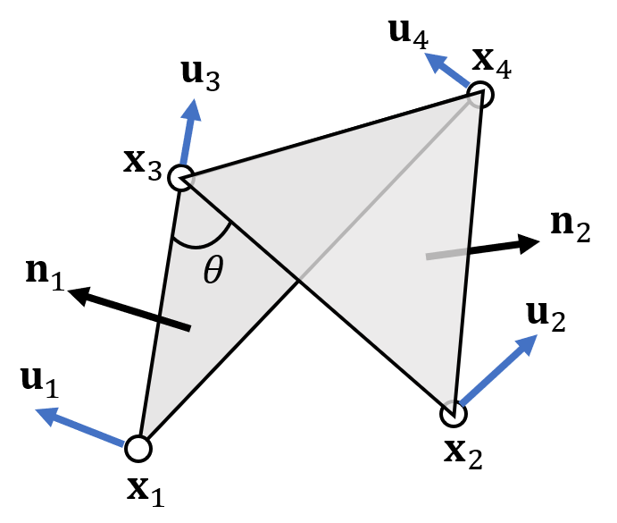 
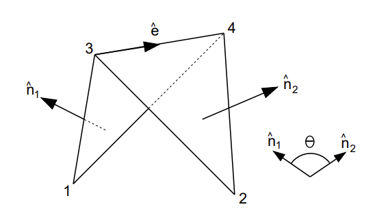
* 首先，$\bf u_1$和$\bf u_2$应该在法线方向$\bf n_1$和$\bf n_2$。
* 其次，弯曲不会拉伸边缘$\bf X_3X_4$，因此$\bf u_4 - u_3$应该与边缘正交，即在$\bf n_1$和$\bf n_2$的线性组合。
* 最后，由牛顿定律合力应该为0，$\mathbf{u}_1+\mathbf{u}_2+\mathbf{u}_3+\mathbf{u}_4=\mathbf{0}$，这意味着$\bf u_3$和$\bf u_4$在$\bf n_2$和$\bf n_1$的线性组合.
* $\mathbf{N}_1=\left(\mathbf{x}_1-\mathbf{x}_3\right) \times\left(\mathbf{x}_1-\mathbf{x}_4\right) \quad \mathbf{N}_2=\left(\mathbf{x}_2-\mathbf{x}_4\right) \times\left(\mathbf{x}_2-\mathbf{x}_3\right) \quad E=\mathbf{x}_4-\mathbf{x}_3$

综上所述计算出结果：
$$
\begin{aligned}
\mathbf{u}_1&=\|\mathbf{E}\| \frac{\mathbf{N}_1}{\left\|\mathbf{N}_1\right\|^2}\\
\mathbf{u}_2&=\|\mathbf{E}\| \frac{\mathbf{N}_2}{\left\|\mathbf{N}_2\right\|^2}\\
\mathbf{u}_3 &=\frac{\left(\mathbf{x}_1-\mathbf{x}_4\right) \cdot \mathbf{E}}{\|\mathbf{E}\|} \frac{\mathbf{N}_1}{\left\|\mathbf{N}_1\right\|^2}+\frac{\left(\mathbf{x}_2-\mathbf{x}_4\right) \cdot \mathbf{E}}{\|\mathbf{E}\|} \frac{\mathbf{N}_2}{\left\|\mathbf{N}_2\right\|^2} \\
\mathbf{u}_4 &=-\frac{\left(\mathbf{x}_1-\mathbf{x}_3\right) \cdot \mathbf{E}}{\|\mathbf{E}\|} \frac{\mathbf{N}_1}{\left\|\mathbf{N}_1\right\|^2}-\frac{\left(\mathbf{x}_2-\mathbf{x}_3\right) \cdot \mathbf{E}}{\|\mathbf{E}\|} \frac{\mathbf{N}_2}{\left\|\mathbf{N}_2\right\|^2}\\
\end{aligned}
$$
所以得到如下关于力的函数：
Planer case: 
$$
\mathbf{f}_i=k \frac{\|\mathbf{E}\|^2}{\left\|\mathbf{N}_1\right\|+\left\|\mathbf{N}_2\right\|} \sin \left(\frac{\pi-\theta}{2}\right) \mathbf{u}_i
$$
Non-planar case:
$$
\mathbf{f}_i=k \frac{\|\mathbf{E}\|^2}{\left\|\mathbf{N}_1\right\|+\left\|\mathbf{N}_2\right\|}\left(\sin \left(\frac{\pi-\theta}{2}\right)-\sin \left(\frac{\pi-\theta_0}{2}\right)\right) \mathbf{u}_i
$$
总结：
* 因此可以知道二面角模型是基于力学得到的，易于做显示积分，隐式积分比较麻烦。
* 延申阅读： Bridson et al. 2003. Simulation of Clothing with Folds and Wrinkles. SCA
  * 使用了显示积分方法
  * 导数难以计算

**二次弯曲模型 Quadratic Bending Model**

二次弯曲模型有两个假设： 
* 静止的时候是平面（对布料模拟而言是ok的）
* 三角形 拉伸非常小，只有弯曲导致的形变

根据拉普拉斯变换推导能量表示：
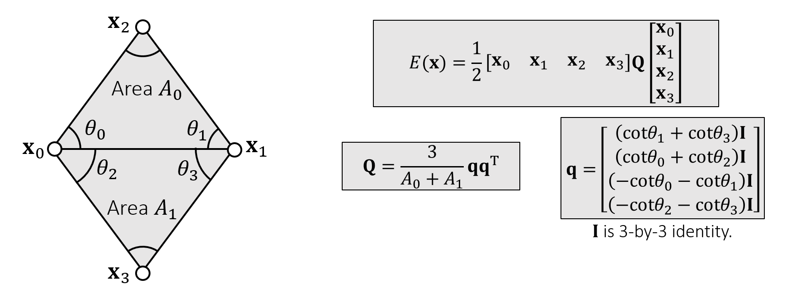
* $\mathbf{q \in R^{12 \times 3}}$, 需要注意是一个12x3的矩阵。
* 表达式简写如下： $\|\mathbf{q}^{\mathrm{T}} \mathbf{x}\|$这个因子是计算两个三角形的拉普拉斯变换，平方就是两个三角形之间的曲率大小。
$$
E(\mathbf{x})=\frac{3\left\|\mathbf{q}^{\mathrm{T}} \mathbf{x}\right\|^2}{2\left(A_0+A_1\right)}
$$
* 当两个三角面是平的时候，曲率为 0， $E(\mathbf{x})=0$。
* 推导是基于数学曲率含义的，而非基于物理意义。二面角是基于力学。

UE4代码没研究过，你可以自己看看他是怎么设计的。估计差不多吧。
**Pros and Cons：**
* 是一个二次函数，相比于二面角模型简单好计算。
$$
\mathbf{f}(\mathbf{x})=-\nabla E(\mathbf{x})=-\mathbf{Q}\left[\begin{array}{l}
\mathbf{x}_0 \\
\mathbf{x}_1 \\
\mathbf{x}_2 \\
\mathbf{x}_3
\end{array}\right] \quad \mathbf{H}(\mathbf{x})=\frac{\partial^2 E(\mathbf{x})}{\partial \mathbf{x}^2}=\mathbf{Q}\\
$$
* 便于使用隐式积分求解。
* 如果布料拉伸得很大，则不再有效。
* 如果其余配置不是平面的，则可以采用：
  * 改进：cubic shell model
  * 其他： projective dynamics model 投影动力学模型。
* 参考论文：Bergou et al. 2006. A Quadratic Bending Model for Inextensible Surfaces. SCA.

#### lock issue 
质点弹簧模型和其他弯曲模型，假设布料平面变形（伸缩）和布料弯曲变形是独立的，相互不影响，但是实际上并非如此。
Locking issue： 如下图，当弹簧stiffnes很大（即很难形变的时候），右边的网格很难弯曲。
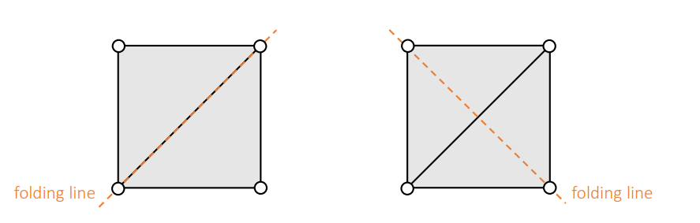

**弹簧网格自由度**
造成上面现象的原因就是自由度的丢失
Euler Fomula： 
* 对于 manifold mesh，边数 = 3 x 顶点数 - 3 - 边缘上的边数（#edges=3#vertices-3-#boundary_edges）
* 自由度Dofs = 变量3N（3x顶点数）- 约束 = 3+边缘上的边数。（这里约束时边数，所以： DoFs are only: 3+ #boundary_edges（最外层边））

解决方式：
* 弹簧在压缩的时候，弹性系数stiffness设置的小一点。
* 弹簧在一定范围内没有力，可以自由伸缩
* 自由度设置在边上： 《English and Bridson. 2008. Animating Developable Surfaces Using Nonconforming Elements. SIGGRAPH. (optional)》
* stiffness很强，即弹性很弱，网格密度小，locking issue会很明显。 

#### Stiffness Issue

**材质角度**：现实世界的织物一旦拉伸超过一定限度，就会强烈抵抗拉伸限制。
* 但是，增加刚度会导致问题。
  * 显式积分器将不稳定。解决方案：更小的时间步长和更多的计算时间。
  * 隐式积分器中涉及的线性系统将是病态的。解决方案：更多的迭代和计算时间。

**力学方程角度**：如果使用基于力的方法，在检测到碰撞之后，需要计算由于物体穿透导致的碰撞力，然后根据该力求解出速度和位置信息。这种方法需要计算三个步骤(1)力（2）速度（3）位置才能最终更新物体位置
* 这样一来就有明显的反应延迟。
* 计算碰撞力的时候需要选择一个刚度（stiffness）参数，而刚度系数很难调，刚度值太小会导致物体穿透明显，而刚度值太大则容易造成整个方程组呈现刚性（**ps：即方程组的雅克比矩阵，矩阵中元素相差较大**），也就是说需要很小的步长才能对方程组进行准确的数值求解。

能否以较低的计算成本实现高刚度？
* 因此pbd（Position Based Dynamics）方法孕育而生！

### Position Based Dynamics
如果弹簧的刚度无限大，可以将长度视为约束$\phi(\mathbf{x})=\left\|\mathbf{x}_i-\mathbf{x}_j\right\|-L=0\\$并定义投影函数。

#### 单根弹簧

投影函数的约束的作用下总是趋向于原长（基于动量守恒？）。
* 超过原长度就产生收缩力
* 小于原长度就产生伸展力
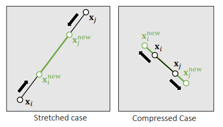

投影函数图解：
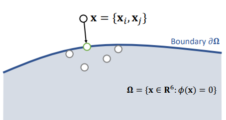
* 其表示就是将6维空间中的点（$\mathbf{x}=\left\{\mathbf{x}_i, \mathbf{x}_j\right\}$），移动到6维空间中的可行区域中，且**移动距离最小**。
  * 第一：挪动$\mathbf{x}=\left\{\mathbf{x}_i, \mathbf{x}_j\right\}$且满足约束$\phi(\mathbf{x})=\left\|\mathbf{x}_i-\mathbf{x}_j\right\|-L=0\\$
  * 第二：挪动的距离最小
  * 可以理解为一个梯度下降问题（其实就是沿着$\mathbf{x}=\left\{\mathbf{x}_i, \mathbf{x}_j\right\}$向量方向移动）。

将其转化为数学优化问题：
$$
\left\{\mathbf{x}_i^{\text {new }}, \mathbf{x}_j^{\text {new }}\right\}=\operatorname{argmin} \frac{1}{2}\left\{m_i\left\|\mathbf{x}_i^{\text {new }}-\mathbf{x}_i\right\|^2+m_j\left\|\mathbf{x}_j^{\text {new }}-\mathbf{x}_j\right\|^2\right\}
$$
其实直观上也很好理解这个问题：
* 质心不变
* 点移动的量由他们的质量关系决定的

Projection Function投影函数求解结果：
$$
\begin{aligned}
&\mathbf{x}_i^{\mathrm{new}} \longleftarrow \mathbf{x}_i-\frac{m_j}{m_i+m_j}\left(\left\|\mathbf{x}_i-\mathbf{x}_j\right\|-L\right) \frac{\mathbf{x}_i-\mathbf{x}_j}{\left\|\mathbf{x}_i-\mathbf{x}_j\right\|} \\
&\mathbf{x}_j^{\text {new }} \longleftarrow \mathbf{x}_j+\frac{m_i}{m_i+m_j}\left(\left\|\mathbf{x}_i-\mathbf{x}_j\right\|-L\right) \frac{\mathbf{x}_i-\mathbf{x}_j}{\left\|\mathbf{x}_i-\mathbf{x}_j\right\|}\\
&\mathbf{x}_i^{\mathrm{new}} - \mathbf{x}_j^{\text {new }} = (\mathbf{x}_i - \mathbf{x}_j ) - \left\|\mathbf{x}_i-\mathbf{x}_j\right\| \frac{\mathbf{x}_i-\mathbf{x}_j}{\left\|\mathbf{x}_i-\mathbf{x}_j\right\|} + L \frac{\mathbf{x}_i-\mathbf{x}_j}{\left\|\mathbf{x}_i-\mathbf{x}_j\right\|} = \vec{L}\\
\end{aligned}\\
$$
* 默认情况下$m_i=m_j$, 令$m_i=\infty$也可以为静止节点。

#### 多根弹簧

##### 高斯塞达尔方法
* 高斯塞达尔方法（A Gauss-Seidel Approach）:分别处理每根弹簧，因为处理完一根弹簧之后，会影响其他弹簧的位置，因此是一个反复迭代更新的过程
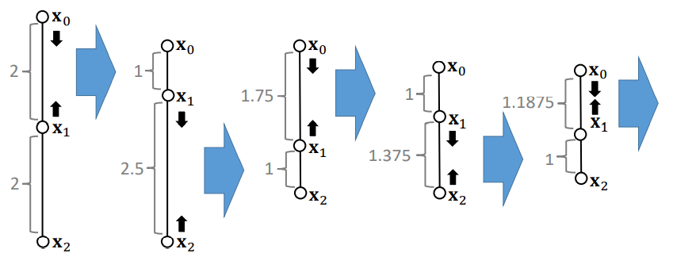
* 不能确保满足每一个约束。 但是使用的迭代越多，这些约束得到的满足就越好。
* 虽然名称与 Gauss-Seidel 有关，但与 Gauss-Seidel 不同。 这是更多与随机梯度下降相关（在机器学习中）。
* 弹簧边的顺序很重要,的时候对边顺序有依赖性。
  * 可能会导致偏差（bias）
  * 并影响收敛行为（convergence）

算法流程：
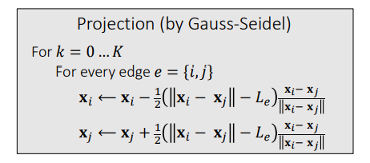

##### Jacobi Approach
Jacobi是对高斯塞达尔算法的改进，主要是为了。
* 减少由于边的顺序带来的bias
* 可以实现并行

Jacobi 方法同时投影所有边缘，每条边计算得到的偏移量不直接更新，而是记录下来，最后计算完了再加权更（线性混合结果）。
* 问题是收敛速度更低。
* 同样，它使用的迭代次数越多，强制执行的约束就越好。

算法流程：
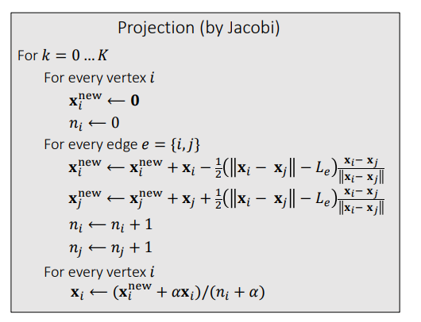

#####  Position Based Dynamics (PBD)算法
PBD先构建约束，然后通过对约束进行投影(constraint projection)得出位置信息，并依此更新速度值。
**特点：**

没有前面哪些能量，力的概念。是基于刚度行为（stiffness），即强制执行约束的紧密程度，并非完全基于物理的。
* stiffness通过迭代次数体现： 迭代次数越多，约束满足的越好，显得弹性系数stiffness很大（硬）
* 网格分辨率： 顶点数量很少，则能够很快收敛，显得弹性系数很大（硬）
* 需要考虑原始速度。
* 此方法也适用于其他约束，包括三角形约束、体积约束和碰撞约束，只需定义它们的投影函数

算法流程：
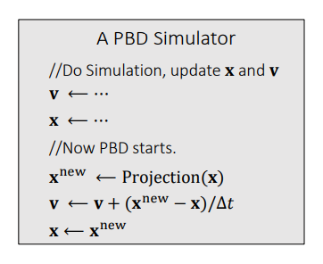

**Pros and Cons of PBD**
优点
* 可在 GPU 上并行 (PhysX)
* 易于实施
* 低分辨率快速
* 通用，可以处理其他耦合和约束，包括流体

缺点
* 不是基于物理的。弹性系数受到网格点，迭代次数的影响。
* 高分辨率下性能低下
  * 分层方法（可能导致振荡和其他问题……）
  * 加速方法，如切比雪夫Chebyshev

延申阅读：《Muller. 2008. Hierarchical Position Based Dynamics. VRIPHYS.》

### 应变限制Strain Limiting
应变限制旨在对投影函数进行校正：
* 整个思想的提出比 PBD 要早
* 这个方法可以认为是 PBD 的改进版， 把模拟分成两个步骤：第一步做正常的模拟，第二步做投影。 和pdb不同的第一步不是简单的做一个粒子系统，可以做正常的模拟（如，弹簧系统，隐式积分，有限元等），第二步，仅仅的纠错，保证模拟稳定。
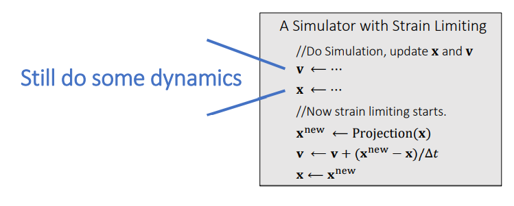

将弹簧应变($\approx \sigma$)，即拉伸比 $\sigma = \frac{1}{L}\left\|\mathbf{x}_i-\mathbf{x}_j\right\|$ 设置在一个限制范围内:
* 定义拉伸比： 长度除以原长。
* 拉伸比范围： $\sigma^{\min } \leq \, \sigma \, \leq \sigma^{\max }$

投影函数如下：
* $\sigma \equiv 1$可以认为就是pdb
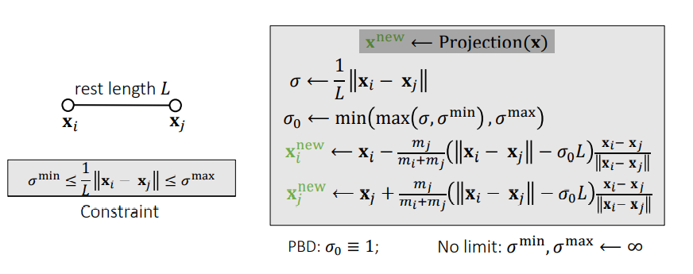

##### 三角形应变限制
和前面一样，质心不变，进行缩放
* 数学上： 质心不变，就是三个顶点的运动量最小
* 物理上： 没有新的动量， 不会因为约束而产生奇怪的运动。

数学模型：
* 面积落在：$A^{\min } \leq A \leq A^{\max }$
* 目标函数：
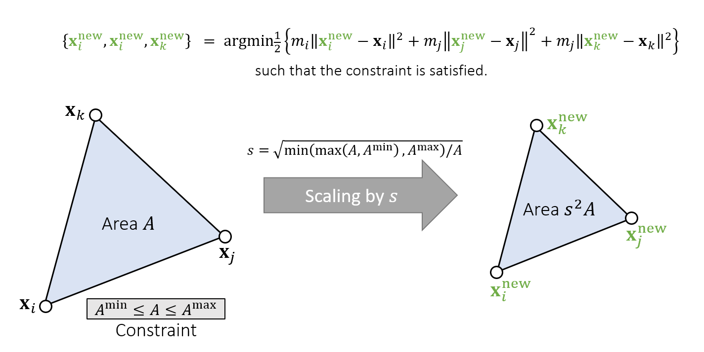

**计算过程：**
* 投影函数：$\mathbf{x}^{\text {new }} \leftarrow$ Projection $(\mathbf{x})$
$$
\begin{aligned}
&A \leftarrow \frac{1}{2}\left\|\left(\mathbf{x}_j-\mathbf{x}_i\right) \times\left(\mathbf{x}_k-\mathbf{x}_i\right)\right\| \\
&s \leftarrow \sqrt{\min \left(\max \left(A, A^{\min }\right), A^{\max }\right) / A} \\
&\mathbf{c} \leftarrow \frac{1}{m_i+m_j+m_k}\left(m_i \mathbf{x}_i+m_j \mathbf{x}_j+m_k \mathbf{x}_k\right) \\
&\mathbf{x}_i^{\text {new }} \leftarrow \mathbf{c}+s\left(\mathbf{x}_i-\mathbf{c}\right) \\
&\mathbf{x}_j^{\text {new }} \leftarrow \mathbf{c}+s\left(\mathbf{x}_j-\mathbf{c}\right) \\
&\mathbf{x}_k^{\text {new }} \leftarrow \mathbf{c}+s\left(\mathbf{x}_k-\mathbf{c}\right)
\end{aligned}
$$

**总结：**

* 应变限制广泛用于基于物理的模拟，通常用于避免由于大变形导致的instability and artifacts。
* 应变限制以双相方式对非线性问题有效。
* 应变限制也有助于解决locking issue。
  * 形变比较小的时候使用其他方法，比较大的时候使用 strain limiting 能够帮助解决 locking issue
  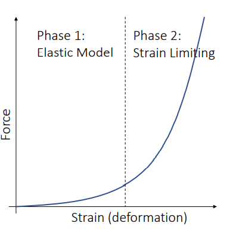

* 延申论文：Provot. 1995. Deformation Constraints in a Mass-Spring Model to Describe Rigid Cloth Behavior. Graphics Interface.

### 其他约束方法
Projective Dynamics
* PBD 中使用投影函数直接改变顶点位置
* PD 利用投影函数计算出来的新位置定义一个二次能量函数（而不是直接修改顶点位置），利用构造出来的能量函数进行模拟

## Todo。。。
可以扩展学习一下《微分几何》中曲面论章节。
参考资料[《离散微分几何 Discrete Differntial Geometry 2021》](https://brickisland.net/DDGSpring2021/)

**参考资料：**

1. [Choi and Ko. 2002. Stable But Responive Cloth. TOG (SIGGRAPH)](https://citeseerx.ist.psu.edu/viewdoc/download?doi=10.1.1.518.8136&rep=rep1&type=pdf)
2. [Baraff and Witkin. 1998. Large Step in Cloth Simulation. SIGGRAPH (最早使用隐式积分做布料模拟)](https://www.cs.cmu.edu/~baraff/papers/sig98.pdf)
3. [Dihedral angle](https://en.wikipedia.org/wiki/Dihedral_angle)
4. [Bridson et al. 2003. Simulation of Clothing with Folds and Wrinkles. SCA (解决了弯曲和自碰撞问题)](https://www.cs.ubc.ca/~rbridson/docs/cloth2003.pdf)
5. [Bergou et al. 2006. A Quadratic Bending Model for Inextensible Surfaces. SCA.](https://cims.nyu.edu/gcl/papers/bergou2006qbm.pdf)
6. [Muller. 2008. Hierarchical Position Based Dynamics. VRIPHYS](https://matthias-research.github.io/pages/publications/hpbd.pdf)
7. [Matthias Müller, Position Based Dynamics, 2006](https://matthias-research.github.io/pages/publications/posBasedDyn.pdf)
8. [Provot. 1995. Deformation Constraints in a Mass-Spring Model to Describe Rigid Cloth Behavior. Graphics Interface](https://citeseerx.ist.psu.edu/viewdoc/download?doi=10.1.1.84.1732&rep=rep1&type=pdf)
