# 有限元模拟弹性体

#### Prerequisite
建议阅读先阅读完这篇文章[理解物理模拟 应力-应变](https://zhuanlan.zhihu.com/p/565040287)
### 效果实现
#### 实验步骤：
##### 1.基本设置
在 Update 函数中，将房子的模拟写成一个简单的粒子系统。 每个顶点都有自己的位置 x 和速度 v，速度受重力影响。 实现每个顶点与地板之间的摩擦接触。之后，该函数包含将顶点位置发送到房屋网格中进行显示的代码。

##### 2.Edge matrices
接下来，编写一个 Build Edge Matrix 函数，该函数返回边缘四面体的矩阵。 在 Start 函数中，调用此函数计算 inv_Dm，即每个四面体的参考边矩阵的逆矩阵。

##### 3.弹力 
按照幻灯片实施基于有限元方法的弹力。具体来说，对于每个四面体，计算变形梯度 F，格林应变$\mathbf{G}=\frac{1}{2}\left(\mathbf{F}^{T} \mathbf{F}-\mathbf{I}\right)$ Second-Piola-Kirchhoff 应力 $\mathbf{S}=2 s_1 \mathbf{G}+s_0 \operatorname{tr}(\mathbf{G}) \mathbf{I}$，最后是四个顶点的力。 

##### 4.拉普拉斯平滑
由于使用显式时间积分，因此模拟容易受到数值不稳定的影响。 1.a 中实施的阻尼对数值稳定性至关重要，但它不能消除高频振荡。为了解决这个问题，请在顶点速度上实现拉普拉斯平滑。为此，对于每个顶点，将其所有邻居的速度相加，然后将其混合到自己的速度中

#### 使用SVD分解方法
计算应力的另一种方法是将应变能密度视为矩阵不变量或主拉伸的函数。这使能够更方便地采用任意超弹性模型。鉴于已经提供了 SVD 函数，使用 StVK 模型证明结果是等价。 

### 线性有限元法
线性有限元法(Linear Finite Element Method): 简而言之，线性 FEM 假设对于参考三角形中的任何点$\bf x$，其变形对应关系为：$\mathbf{x}=\mathbf{F X}+\mathbf{c}$
* 对于两点之间的任何向量，可以使用$\bf F$将其从参考转换为变形：
  * $\mathbf{x}_{b a}=\mathbf{x}_b-\mathbf{x}_a=\mathbf{F X}_b+\mathbf{c}-\mathbf{F} \mathbf{X}_a-\mathbf{c}=\mathbf{F X}_{b a}$
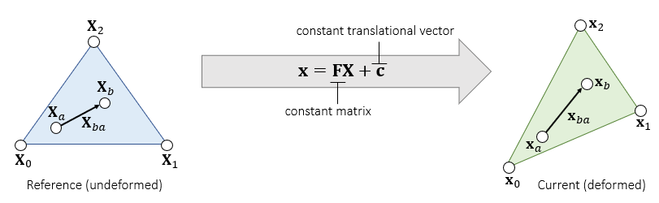

####  Deformation Gradient
计算：$\mathbf{F}=\partial \mathbf{x} / \partial \mathbf{X}$: 
$$
\begin{aligned}
&\left\{\begin{array}{l}
\mathbf{F X}_{10}=\mathbf{x}_{10} \\
\mathbf{F X}_{20}=\mathbf{x}_{20}
\end{array}\right.\\
&\mathbf{F}\left[\begin{array}{ll}
\mathbf{X}_{10} & \mathbf{X}_{20}
\end{array}\right]=\left[\begin{array}{ll}
\mathbf{x}_{10} & \mathbf{x}_{20}
\end{array}\right]\\
&\Downarrow \\
&\mathbf{F}=\left[\begin{array}{ll}
\mathbf{x}_{10} & \mathbf{x}_{20}
\end{array}\right]\left[\begin{array}{ll}
\mathbf{X}_{10} & \mathbf{X}_{20}
\end{array}\right]^{-1} \\
\end{aligned} \\
$$
* 问题：𝐅与变形有关，但它包含旋转。

####  The Green-Lagrange strain tensor
理想情况下，只需要一个张量来描述形状变形。 回想一下，SVD 给出了$\mathbf{F}=\mathbf{U D V}^{\mathrm{T}}$，其中只有 $\bf V^T$ 和 $\bf D$ 与变形有关。
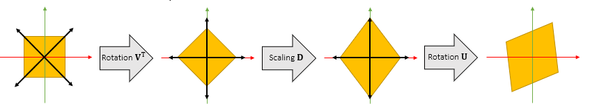
去掉旋转分量的影响，得到Green strain：
$$
\mathbf{G}=\frac{1}{2}\left(\mathbf{F}^{\mathrm{T}} \mathbf{F}-\mathbf{I}\right)=\frac{1}{2}\left(\mathbf{V} \mathbf{D}^2 \mathbf{V}^{\mathrm{T}}-\mathbf{I}\right)=\left[\begin{array}{ll}
\varepsilon_{u u} & \varepsilon_{u v} \\
\varepsilon_{u v} & \varepsilon_{v v}
\end{array}\right] \\
$$ 
* 如果没有变形，$\mathbf{G}=\mathbf{0}$ ; 如果变形增加，$\|\mathbf{G}\|$增加。
* $\mathbf{G}$是对称矩阵， 三种变形模式：$\varepsilon_{u u}, \varepsilon_{v v}$ and $\varepsilon_{u v}$。
* $\mathbf{G}$是旋转不变的：如果额外旋转 𝐑，那么变形梯度是 𝐑𝐅 但绿色应变相同：
  * $\mathbf{G}=\frac{1}{2}\left(\mathbf{F}^{\mathrm{T}} \mathbf{R}^{\mathrm{T}} \mathbf{R F}-\mathbf{I}\right)=\frac{1}{2}\left(\mathbf{V D}^2 \mathbf{V}^{\mathrm{T}}-\mathbf{I}\right)$。

####  Strain Energy Density Function
The Saint Venant-Kirchhoff Model (StVK) ：应变能密度函数（Strain Energy Density Function），将每个参考区域的能量密度视为 $W(\mathbf{G})$。
**能量密度积分计算：**
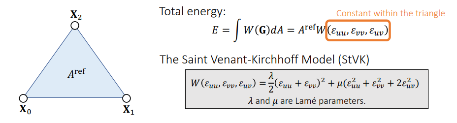
**应力张量 stress tensor:**
Second Piola-Kirchhoff tress tensor: 本质就是能量密度对于形变的一个导数，能量对位移求导力是力。那么能量密度对于形变本质上也是一种位移，它其实算出来的是力的密度。
$$
\frac{\partial W}{\partial \mathbf{G}}=\begin{bmatrix}
\frac{\partial W}{\partial \varepsilon_{u u}} & \frac{1}{2} \frac{\partial W}{\partial \varepsilon_{u v}}\\
\\
\frac{1}{2} \frac{\partial W}{\partial \varepsilon_{u v}} & \frac{\partial W}{\partial \varepsilon_{v v}}\\
\end{bmatrix}=\left[\begin{array}{cc}
2 \mu \varepsilon_{u u}+\lambda \varepsilon_{u u}+\lambda \varepsilon_{v v} & 2 \mu \varepsilon_{u v} \\
2 \mu \varepsilon_{u v} & 2 \mu \varepsilon_{v v}+\lambda \varepsilon_{u u}+\lambda \varepsilon_{v v}
\end{array}\right]=2 \mu \mathbf{G}+\lambda \operatorname{trace}(\mathbf{G}) \mathbf{I}=\mathbf{S}\\
$$
####  应力计算：
计算力的方式：（此步骤是核心点，需要重点理解）
* 对能量求导，得到力（此处利用了微分形式不变性）

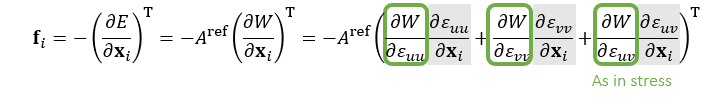
计算步骤：
**$a, b, c, d$作为形式参数，令$\left[\begin{array}{ll}
\mathbf{X}_{10} & \mathbf{X}_{20}
\end{array}\right]^{-1} = \left[\begin{array}{ll}
a & b \\
c & d
\end{array}\right]$. 得到**：
$$
\mathbf{F}=\left[\begin{array}{ll}
\mathbf{x}_{10} & \mathbf{x}_{20}
\end{array}\right]\left[\begin{array}{ll}
\mathbf{X}_{10} & \mathbf{X}_{20}
\end{array}\right]^{-1}=\left[\begin{array}{ll}
\mathbf{x}_{10} & \mathbf{x}_{20}
\end{array}\right]\left[\begin{array}{ll}
a & b \\
c & d
\end{array}\right]=\left[\begin{array}{ll}
a \mathbf{x}_{10}+c \mathbf{x}_{20} & b \mathbf{x}_{10}+d \mathbf{x}_{20}
\end{array}\right]\\
$$
由上式中**Green Strain**的定义：
$$
\mathbf{G}= \left[\begin{array}{ll}
\varepsilon_{u u} & \varepsilon_{u v} \\
\varepsilon_{u v} & \varepsilon_{v v}
\end{array}\right] =\frac{1}{2}\left(\mathbf{F}^{\mathrm{T}} \mathbf{F}-\mathbf{I}\right)=\left[\begin{array}{cc}
\frac{1}{2}\left(a \mathbf{x}_{10}+c \mathbf{x}_{20}\right)^{\mathrm{T}}\left(a \mathbf{x}_{10}+c \mathbf{x}_{20}\right)-\frac{1}{2} & \frac{1}{2}\left(a \mathbf{x}_{10}+c \mathbf{x}_{20}\right)^{\mathrm{T}}\left(b \mathbf{x}_{10}+d \mathbf{x}_{20}\right) \\
\frac{1}{2}\left(a \mathbf{x}_{10}+c \mathbf{x}_{20}\right)^{\mathrm{T}}\left(b \mathbf{x}_{10}+d \mathbf{x}_{20}\right) & \frac{1}{2}\left(b \mathbf{x}_{10}+d \mathbf{x}_{20}\right)^{\mathrm{T}}\left(b \mathbf{x}_{10}+d \mathbf{x}_{20}\right)-\frac{1}{2}
\end{array}\right]\\
$$
因此得到公式：
$$
\begin{array}{lll}
\frac{\partial \varepsilon_{u u}}{\partial \mathbf{x}_1}=a\left(a \mathbf{x}_{10}+c \mathbf{x}_{20}\right)^{\mathrm{T}} & \frac{\partial \varepsilon_{v v}}{\partial \mathbf{x}_1}=b\left(b \mathbf{x}_{10}+d \mathbf{x}_{20}\right)^{\mathrm{T}} & \frac{\partial \varepsilon_{u v}}{\partial \mathbf{x}_1}=\frac{1}{2} a\left(b \mathbf{x}_{10}+d \mathbf{x}_{20}\right)^{\mathrm{T}}+\frac{1}{2} b\left(a \mathbf{x}_{10}+c \mathbf{x}_{20}\right)^{\mathrm{T}} \\
\frac{\partial \varepsilon_{u u}}{\partial \mathbf{x}_2}=c\left(a \mathbf{x}_{10}+c \mathbf{x}_{20}\right)^{\mathrm{T}} & \frac{\partial \varepsilon_{v v}}{\partial \mathbf{x}_2}=d\left(b \mathbf{x}_{10}+d \mathbf{x}_{20}\right)^{\mathrm{T}} & \frac{\partial \varepsilon_{u v}}{\partial \mathbf{x}_2}=\frac{1}{2} c\left(b \mathbf{x}_{10}+d \mathbf{x}_{20}\right)^{\mathrm{T}}+\frac{1}{2} d\left(a \mathbf{x}_{10}+c \mathbf{x}_{20}\right)^{\mathrm{T}}
\end{array}
$$
对公式进行简化：
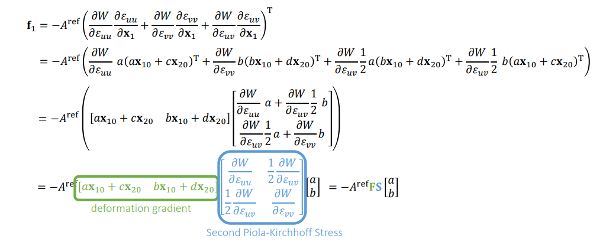
综合上述公式，有： 
$$
\left[\begin{array}{ll}
\mathbf{f}_1 & \mathbf{f}_2
\end{array}\right]=-A^{\mathrm{ref}} \mathrm{FS}\left[\begin{array}{ll}
\mathbf{X}_{10} & \mathbf{X}_{20}
\end{array}\right]^{-\mathrm{T}} \\
$$
>Note: $[\mathbf{X}_{10}\,, \mathbf{X}_{20}]^{\mathrm{T}}$， 边的转置等于
>* stiffness刚度分量，取决于应变-应力刚度(strain-stress stiffness) $\partial \sigma / \partial \varepsilon_{\text {。 }}$
>* 几何分量，取决于应力值(e stress value) $\sigma$ 。
>* 另外一个点的力，可以通过合力为 0 求得: $\mathbf{f}_0=-\mathbf{f}_1-\mathbf{f}_2$ 。
####  实现细节
* 详细参考论文：
  * Volino et al. 2009. A simple approach to nonlinear tensile stiffness for accurate cloth simulation. TOG
  * 仅仅谈论布料模拟
* 四面体呢（3D参考-> 3D变形）
  - Same idea, but everything is now in 3D.
  - Deformation gradient $\mathbf{F} \in \mathbf{R}^{3 \times 3}$
  - Green strain $\mathbf{G} \in \mathbf{R}^{3 \times 3}$
  - Stress tensor $\mathbf{S} \in \mathbf{R}^{3 \times 3}$
  - Forces $\mathbf{f}_i \in \mathbf{R}^3$

### 有限体积法
**有限体积法 Finite Volume Method：** FVM 从积分的角度考虑力计算，而不是从微分的角度
####  牵引力和应力
牵引力和应力（Traction and Stress）： 首先，让考虑牵引力 t：单位长度（或面积）内力。
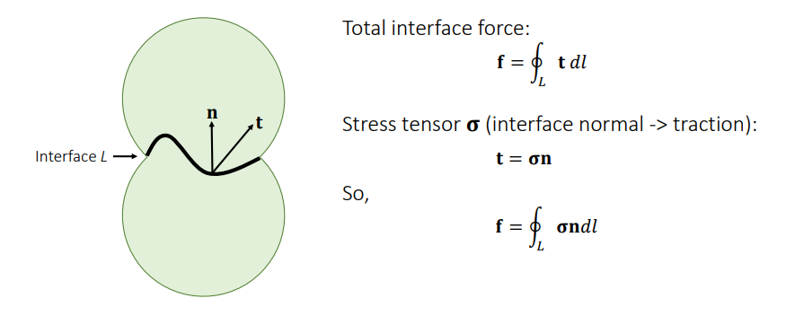
二维情况：
* 假设穿过边的中点, 力对 3 个顶点的作用是平均的.
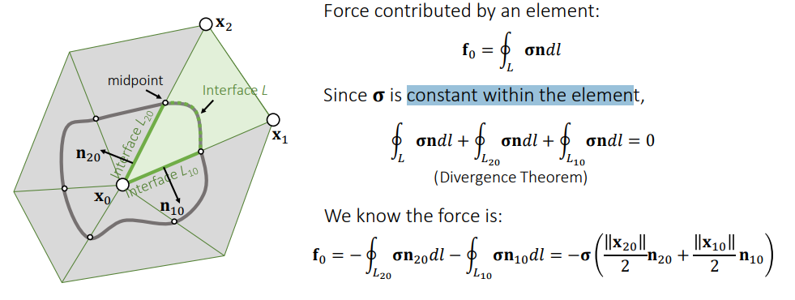

三维情况：
* 其中 $\frac{1}{3}$ 也是想让面上的力对 3 个顶点的作用一样
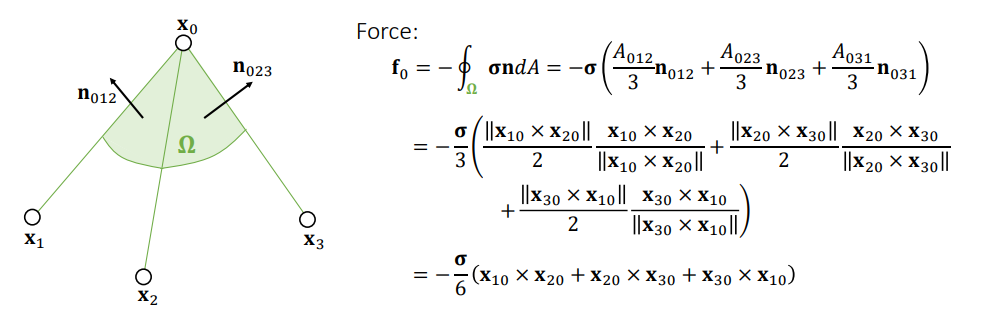

###  不同参考下的应力张量
虽然使用应力张量是一样的：从界面法线映射到牵引力(normal to the traction)，但他们的参考条件却是不同的。
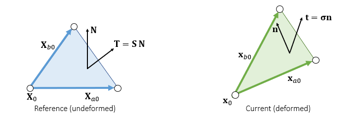

#### 计算各种应力张量的关系
变换前后 $A$ 之间的关系  $A^{ref}\mathbf{N}$ 和 $A \mathbf{n}$， 两个区域加权法线对比：
形变前：
$$
2 A^{\mathrm{ref}} \mathbf{N}=\mathbf{X}_{a 0} \times \mathbf{X}_{b 0}
$$
形变后：
$$
\begin{aligned}
2 A \mathbf{n} &=\mathbf{x}_{a 0} \times \mathbf{x}_{b 0}=\mathbf{F} \mathbf{X}_{a 0} \times \mathbf{F} \mathbf{X}_{b 0}=\left(\mathbf{U D V}^{\mathrm{T}} \mathbf{X}_{a 0}\right) \times\left(\mathbf{U D V}^{\mathrm{T}} \mathbf{X}_{b 0}\right) \\
&=\mathbf{U}\left(\left(\mathbf{D V}^{\mathrm{T}} \mathbf{X}_{a 0}\right) \times\left(\mathbf{D V}^{\mathrm{T}} \mathbf{X}_{b 0}\right)\right) \\
&=\mathbf{U}\left[\begin{array}{lll}
d_1 d_2 & & \\
& d_0 d_2 & \\
& & d_0 d_1 \\
\end{array}\right]\left(\left(\mathbf{V}^{\mathrm{T}} \mathbf{X}_{a 0}\right) \times\left(\mathbf{V}^{\mathrm{T}} \mathbf{X}_{b 0}\right)\right)\\
&=\mathbf{U}\left[\begin{array}{lll}
d_1 d_2 & & \\
& d_0 d_2 & \\
& & d_0 d_1
\end{array}\right] \mathbf{V}^{\mathrm{T}}\left(\mathbf{X}_{a 0} \times \mathbf{X}_{b 0}\right)=d_0 d_1 d_2 \mathbf{U}\left[\begin{array}{ccc}
1 / d_0 & & \\
& 1 / d_1 & \\
& & 1 / d_2
\end{array}\right] \mathbf{v}^{\mathrm{T}}\left(\mathbf{X}_{a 0} \times \mathbf{X}_{b 0} \right)\\
&=\operatorname{det}(\mathbf{F}) \mathbf{F}^{-\mathrm{T}}\left(\mathbf{X}_{a 0} \times \mathbf{X}_{b 0}\right)=\operatorname{det}(\mathbf{F}) \mathbf{F}^{-\mathrm{T}}\left(2 A^{\mathrm{ref}} \mathbf{N}\right) \\
\end{aligned}
$$
#### 总结
所以有：
$$
A \mathbf{n}=\operatorname{det}(\mathbf{F}) \mathbf{F}^{-\mathrm{T}}\left(A^{\mathrm{ref}} \mathbf{N}\right)\\
$$
使用两种不同的应力来计算力：
$$
\mathbf{f}=-\frac{1}{3} \sum A^{\mathrm{ref}} \mathbf{P N}=-\frac{1}{3} \sum A \boldsymbol{\sigma} \mathbf{n}
$$
因此可以得到:
* 这里使用了Nanson’s formula[南森公式](https://engcourses-uofa.ca/books/introduction-to-solid-mechanics/linear-algebra/2-2-linear-maps-between-vector-spaces/basic-definitions/#NansonFormula) ：
$$
\begin{aligned}
\mathbf{P}\left(A^{\mathrm{ref}} \mathbf{N}\right) &=\boldsymbol{\sigma} \operatorname{det}(\mathbf{F}) \mathbf{F}^{-\mathrm{T}}\left(A^{\mathrm{ref}} \mathbf{N}\right) \\
\operatorname{det}^{-1}(\mathbf{F}) \mathbf{P F}^{\mathrm{T}} &=\boldsymbol{\sigma}
\end{aligned}\\
$$

#### 得到各种状态下的应力转换图

* 在 FEM 中，定义了参考状态下的能量密度 $W$ 。因此，这种应力 $\mathrm{S}$ 是从法线 $\mathrm{N}$ 到牵引力 $\mathrm{T}$ 的映射，两者都处于参考状态。
* 而FVM法线是基于参考状态，而Traction是基于形变状态。

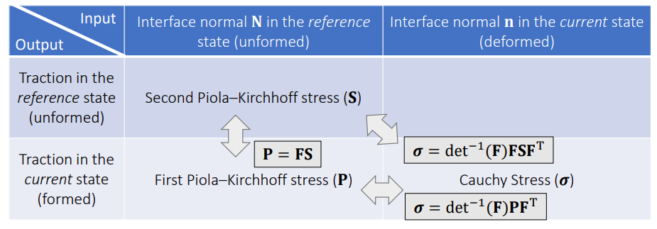

#### 计算内力
柯西应力（cauchy stress）到 Second Piola stress的转化：
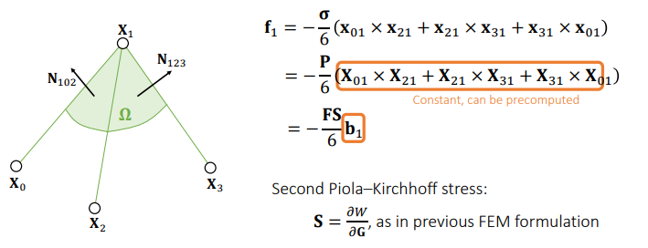

将$\mathbf{b}_1 = (\mathbf{X}_{01} \times \mathbf{X}_{21}+\mathbf{X}_{21} \times \mathbf{X}_{31}+\mathbf{X}_{31} \times \mathbf{X}_{01})$与$\mathbf{X}^T$相乘, 得到如下结果：
$$
\begin{aligned}
\mathbf{X}_{10}^{\mathrm{T}} \mathbf{b}_1 &=\mathbf{X}_{10}^{\mathrm{T}}\left(\mathbf{X}_{01} \times \mathbf{X}_{21}+\mathbf{X}_{21} \times \mathbf{X}_{31}+\mathbf{X}_{31} \times \mathbf{X}_{01}\right)=\mathbf{X}_{10}^{\mathrm{T}}\left(\mathbf{X}_{21} \times \mathbf{X}_{31}\right) \\
&=\mathbf{X}_{01}^{\mathrm{T}}\left(\mathbf{X}_{31} \times \mathbf{X}_{21}\right)=6 \mathrm{Vol} \\
\mathbf{X}_{20}^{\mathrm{T}} \mathbf{b}_1 &=\mathbf{X}_{20}^{\mathrm{T}}\left(\mathbf{X}_{01} \times \mathbf{X}_{21}+\mathbf{X}_{21} \times \mathbf{X}_{31}+\mathbf{X}_{31} \times \mathbf{X}_{01}\right) \\
&=\mathbf{X}_{20}^{\mathrm{T}}\left(\mathbf{X}_{20} \times \mathbf{X}_{10}+\mathbf{X}_{20} \times \mathbf{X}_{31}\right)=0 \\
\mathbf{X}_{30}^{\mathrm{T}} \mathbf{b}_1 &=\mathbf{X}_{30}^{\mathrm{T}}\left(\mathbf{X}_{01} \times \mathbf{X}_{21}+\mathbf{X}_{21} \times \mathbf{X}_{31}+\mathbf{X}_{31} \times \mathbf{X}_{01}\right) \\
&=\mathbf{X}_{30}^{\mathrm{T}}\left(\mathbf{X}_{21} \times \mathbf{X}_{30}+\mathbf{X}_{10} \times \mathbf{X}_{30}\right)=0 \\
\end{aligned} \\
$$

因此有：(其中 $\bf b_1$ 代表形变之后点的叉乘集合)
$$
\begin{align*}
\left[\begin{array}{lll}
\mathbf{b}_1 & \mathbf{b}_2 & \mathbf{b}_3
\end{array}\right] &=6 \operatorname{Vol}\left[\begin{array}{lll}
\mathbf{X}_{10} & \mathbf{X}_{20} & \mathbf{X}_{30}
\end{array}\right]^{-\mathrm{T}}\\
&=\frac{1}{\operatorname{det}\left(\left[\begin{array}{lll}
\mathbf{X}_{10} & \mathbf{X}_{20} & \mathbf{X}_{30}
\end{array}\right]^{-1}\right)}\left[\begin{array}{lll}
\mathbf{X}_{10} & \mathbf{X}_{20} & \mathbf{X}_{30}
\end{array}\right]^{-\mathrm{T}} \\
\Downarrow \\
\left[\begin{array}{lll}
\mathbf{f}_1 & \mathbf{f}_2 & \mathbf{f}_3
\end{array}\right] &=-\frac{\mathrm{ FS }}{6}[\mathbf{b}_1 \qquad \mathbf{b}_2 \qquad \mathbf{b}_3 ] \\
&=\frac{-1}{6\operatorname{det}\left(\left[\begin{array}{lll}
\mathbf{X}_{10} & \mathbf{X}_{20} & \mathbf{X}_{30}
\end{array}\right]^{-1}\right)} \mathrm{ FS } \left[\begin{array}{lll}
\mathbf{X}_{10} & \mathbf{X}_{20} & \mathbf{X}_{30}
\end{array}\right]^{-\mathrm{T}} \\
\end{align*}
$$

FEM/FVM算法框架： 
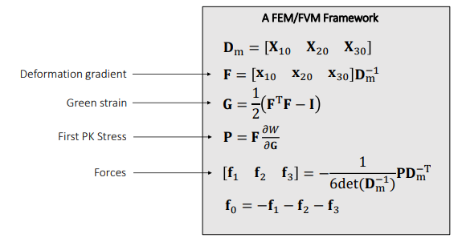

**延申阅读**
* Teran et al. 2003. Finite Volume Methods for the Simulation of Skeleton Muscles. SCA.
  * 解释FVM方法
* Volino et al. 2009. A Simple Approach to Nonlinear Tensile Stiffness for Accurate Cloth Simulation. TOG
  * 用有限元做衣服的模拟
  
### 构造通用的材料模型

#### Hyperelastic Models
Stvk 模型存在很多局限性：
* 不合符真实世界的材料性质
* 图形学中为了简化，使用的比较多

通用模型：Hyperelastic models
* 模型是通过能量密度来推出来的，就是怎么样利用这个能量密度提供了一个从 G(strain)到S（stress）的映射 。
* 其实也是针对大形变。

#### 各项同性材质
各项同性材质(isotropic material)推导: 
* first piola-kirchhoff stress 是 $F$ 的一个函数:
  * $\mathbf{f}_0=-\frac{\mathbf{P}(\mathbf{F})}{6}\left(\mathbf{X}_{10} \times \mathbf{X}_{20}+\mathbf{X}_{20} \times \mathbf{X}_{30}+\mathbf{X}_{30} \times \mathbf{X}_{10}\right)$
  * 它将参考状态下的界面法线 $N$ 转换为变形状态下的牵引力 $t$ 。
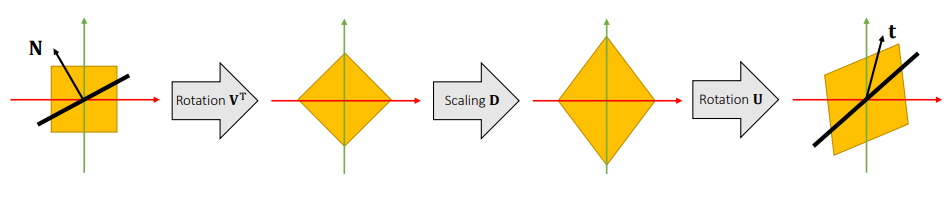
* 对于各向同性的材质来说，应力张量 $\mathbf{P}$ 对于 $\mathbf{U}$ 是旋转不变的，可以把旋转项$\mathbf{U}$去掉。
  * $\mathbf{t}=\mathbf{P}(\mathbf{F}) \mathbf{N}=\mathbf{P}\left(\mathbf{U D V}^{\mathrm{T}}\right) \mathbf{N} = \mathbf{U P}\left(\mathbf{D V}^{\mathrm{T}}\right) \mathbf{N}$
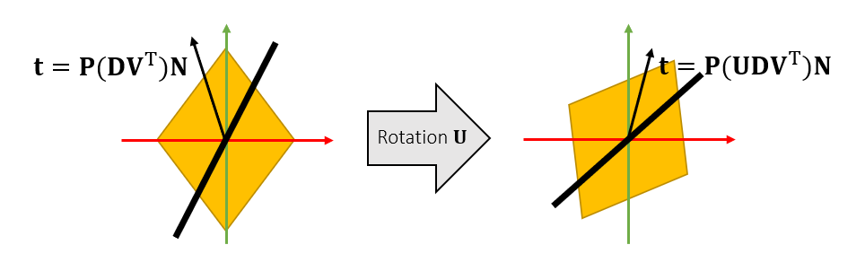
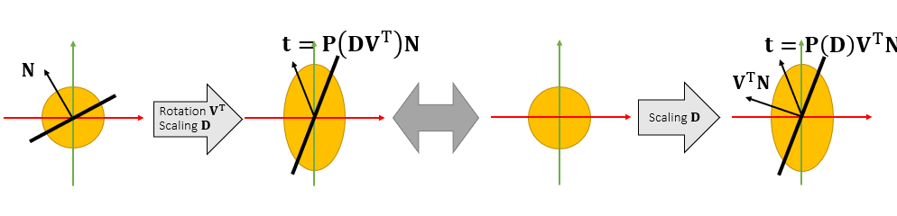
* 表达主要拉伸 $\bf F$的奇异值
  * $\mathbf{P}(\mathbf{F})=\mathbf{P}\left(\mathbf{U D V}^{\mathrm{T}}\right)=\mathbf{U P}\left({\lambda_0}, \lambda_1, \lambda_2\right) \mathbf{V}^{\mathrm{T}}$

#### Isotropic Models
**The Saint Venant-Kirchhoff model (StVK) vs The neo-Hookean model**
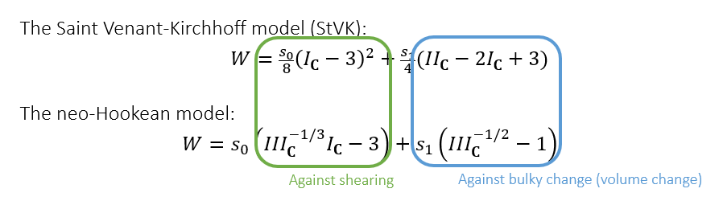
* 第一项(绿色)是抵抗拉伸， 第二项（蓝色）是为了阻止体积或者面积的改变（泊松效应 Possion issue）
* neo-Hookean 模型在真实的材料力学中使用
* 在论文中,通过主不变量参数化表达 traction $\mathbf{P}\left(I_{\mathbf{C}}, I I_{\mathbf{C}}, I I I_{\mathbf{C}}\right)$:
  * $\mathbf{C}=\mathbf{U}^{\mathrm{T}} \mathbf{U}$ is the right Cauchy-Green deformation tensor
$$
\begin{align*}
  I_C&=\operatorname{trace}(\mathbf{C})=\lambda_0^2+\lambda_1^2+\lambda_2^2\\
  III_{\mathbf{C}} &=\operatorname{det}\left(\mathbf{C}^2\right)=\lambda_0^4+\lambda_1^4+\lambda_2^4\\
  II_{\mathbf{C}}&=\frac{1}{2}\left(\operatorname{trace}^2(\mathbf{C})-\operatorname{trace}\left(\mathbf{C}^2\right)\right)=\lambda_0^2 \lambda_1^2+\lambda_0^2 \lambda_2^2+\lambda_1^2 \lambda_2^2
\end{align*}
$$
  * 计算矩阵的迹，由$\operatorname{trace}(\mathbf{A B})=\operatorname{trace}(\mathbf{B A})$， 得：
$$
\begin{aligned}
\operatorname{trace}\left(\mathbf{F}^{\mathbf{T}} \mathbf{F}\right) &=\operatorname{trace}\left(\mathbf{U D V}^{\mathbf{T}} \mathbf{V} \mathbf{D} \mathbf{U}^{\mathbf{T}}\right) =\operatorname{trace}\left(\mathbf{U D}^2 \mathbf{U}^{\mathbf{T}}\right)=\operatorname{trace}\left(\mathbf{U}^{\mathbf{T}} \mathbf{U D}^2\right) \\
&=\operatorname{trace}\left(\mathbf{D}^2\right)\\
\operatorname{trace}\left(\mathbf{C}^2\right) &=\operatorname{trace}\left(\mathbf{U D}^2 \mathbf{U}^{\mathbf{T}} \mathbf{U D}^2 \mathbf{U}^{\mathbf{T}}\right) =\operatorname{trace}\left(\mathbf{U D}^4 \mathbf{U}^{\mathbf{T}}\right) =\operatorname{trace}\left(\mathbf{U}^{\mathbf{T}} \mathbf{U D}^4\right) \\
&=\operatorname{trace}\left(\mathbf{D}^4\right)
\end{aligned}\\
$$

**使用主要拉伸量进行计算计算Traction ：**
$$
\mathbf{P}\left(\lambda_0, \lambda_1, \lambda_2\right)=\left[\begin{array}{lll}
\frac{\partial W}{\partial \lambda_0} & & \\
& \frac{\partial W}{\partial \lambda_1} & \\
& & \frac{\partial W}{\partial \lambda_2}
\end{array}\right] \\
$$

**其他能量密度模型：**
* the Mooney-Rivlin model：neo-Hookean 的增强版、模拟橡胶
  * $W=s_0\left(I I I_{\mathbf{C}}^{-1 / 3} I_{\mathbf{C}}-3\right)+s_1\left(I I I_{\mathbf{C}}^{-1 / 2}-1\right)+s_2\left(\frac{1}{2} I I I_{\mathbf{C}}^{-2 / 3}\left(I_{\mathbf{C}}^2-I_{\mathbf{C}}\right)-3\right)$
* the Fung model：模仿人体组织
  * $W=s_0\left(I I I_{\mathbf{C}}^{-1 / 3} I_{\mathbf{C}}-3\right)+s_1\left(I I I_{\mathbf{C}}^{-1 / 2}-1\right)+s_2\left(e^{s_3\left(I I I_{\mathbf{C}}^{-1 / 3} I_{\mathbf{C}}-3\right)}-1\right)$

**各种能量密度模型效果对比**

**A FEM/FVM Framework**
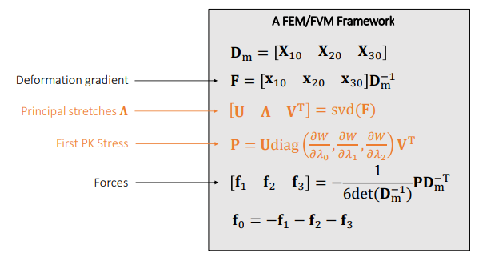

有限元做隐式积分
* Xu et al. 2015. Nonlinear Material Design Using Principal Stretches. TOG (SIGGRAPH).

### 参考资料：
1. [Volino et al. 2009. A simple approach to nonlinear tensile stiffness for accurate cloth simulation. TOG](https://hal.inria.fr/inria-00394466/document)
2. [Hyperelastic material](https://en.wikipedia.org/wiki/Hyperelastic_material)
3. [Nonlinear Material Design Using Principal Stretches](https://mike323zyf.github.io/report/stretch_editting.pdf)
4. [Invertible Finite Elements For Robust Simulation of Large Deformation](https://www.math.ucla.edu/~jteran/papers/ITF04.pdf)
