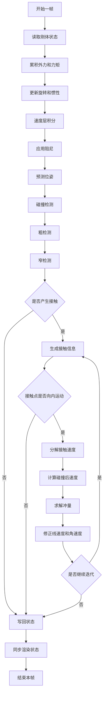

# 刚体模拟流程总结

这份流程基于 `rigid_body.md` 中的 Games103 笔记，并结合常见实时物理引擎的做法整理。刚体模拟的核心是只维护整体状态，而不是直接修改每个顶点：位置 `x`、线速度 `v`、姿态 `q`、角速度 `omega`，再由这些状态间接得到任意顶点的位置和速度。

## 核心状态与物理量

- 状态变量：`x, v, q, omega`
- 固有属性：质量 `M`、参考惯性张量 `I_ref`、碰撞形状、摩擦系数、恢复系数
- 每帧临时量：合力 `F`、合力矩 `tau`、世界惯性 `I = R I_ref R^T`、接触点、接触法线、冲量 `j`

## 单步模拟流程

图中关键计算可以对应为：

- 读取刚体状态：`x, v, q, omega`
- 世界惯性张量：`I = R I_ref R^T`
- 速度层积分：`v1 = v0 + dt M^-1 F`，`omega1 = omega0 + dt I^-1 tau`
- 位姿预测：`x1 = x0 + dt v1`，`q1 = q0 + 0.5 dt quat(omega1) q0`
- 接触点速度：`v_contact = v + omega x Rr`
- 冲量求解：`K j = v_new - v_old`
- 速度修正：`v1 = v1 + j / M`，`omega1 = omega1 + I^-1 ((Rr) x j)`

## 实现要点

1. 使用固定时间步。实时引擎通常用固定 `dt` 推进物理世界，变步长容易让碰撞和约束求解出现抖动。
2. 先更新速度，再用新速度更新位置。这就是笔记中使用的 semi-implicit Euler / Leapfrog 思路，通常比完全显式欧拉更稳定。
3. 姿态推荐用四元数积分，并在写回前归一化，避免长期累计误差。
4. 顶点不是刚体状态变量。碰撞可以检测顶点或形状特征，但响应应回写到质心线速度 `v` 和角速度 `omega`，否则会破坏刚体形状。
5. 碰撞检测通常拆成粗检测和窄检测。粗检测筛掉大多数不可能碰撞的对象；窄检测再计算具体接触点、法线和穿透信息。
6. 单个接触点可用冲量直接修正速度。多点接触时，简单作业里可取平均接触点；更完整的物理引擎会把接触和关节统一成约束系统，并用迭代求解器处理。
7. 摩擦和恢复系数应在速度层处理。法向速度决定反弹，切向速度决定滑动/摩擦衰减。
8. 为减少落地抖动，可使用恢复系数衰减、睡眠机制、位置修正、接触偏移或多次迭代求解。

## 与笔记内容的对应关系

- 位置和姿态更新：对应 `Update()` 中的 Leapfrog 位置更新与四元数姿态更新。
- 速度更新：对应重力、线速度衰减、角速度衰减。
- 碰撞检测：对应遍历网格顶点，计算 `X_i = x + R r_i` 和 `V_i = v + omega x Rr_i`，再用平面/SDF 判断接触。
- 碰撞响应：对应把接触速度分解为法向和切向，计算 `V_new`，再通过 `K^-1 (V_new - V_old)` 得到冲量 `J`。
- 多点接触：笔记采用碰撞点平均值；工业引擎通常使用接触流形和迭代约束求解器。

## 参考资料

- 本地笔记：`Physically_Simulation/rigid_body.md`
- Box2D Documentation: https://box2d.org/documentation/
- NVIDIA PhysX Rigid Body Dynamics: https://nvidia-omniverse.github.io/PhysX/physx/5.4.1/docs/RigidBodyDynamics.html
- NVIDIA PhysX Simulation Loop: https://nvidia-omniverse.github.io/PhysX/physx/5.4.1/docs/Simulation.html
- NVIDIA PhysX Rigid Body Collision: https://nvidia-omniverse.github.io/PhysX/physx/5.4.1/docs/RigidBodyCollision.html
- Gilbert, Johnson, Keerthi. A fast procedure for computing the distance between complex objects in three-dimensional space: http://graphics.stanford.edu/courses/cs164-09-spring/Handouts/paper_GJKoriginal.pdf
