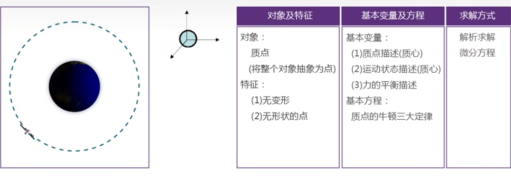
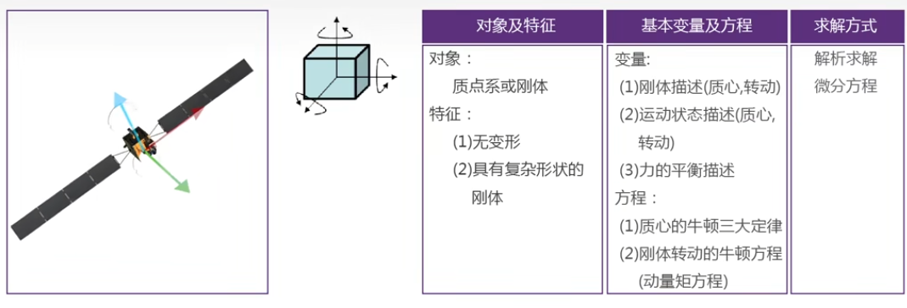
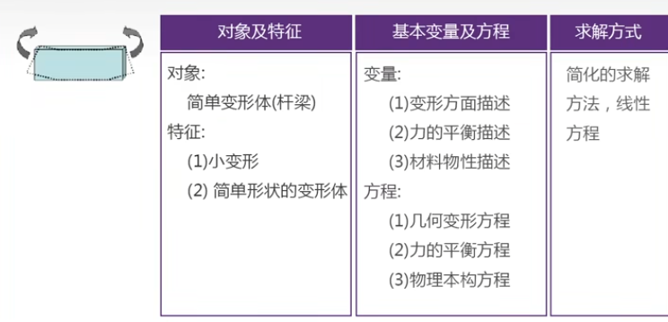
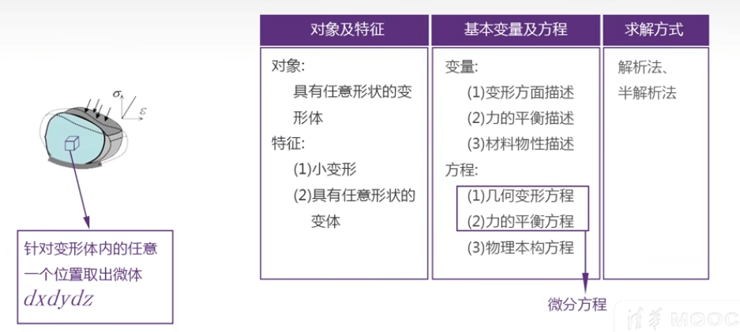
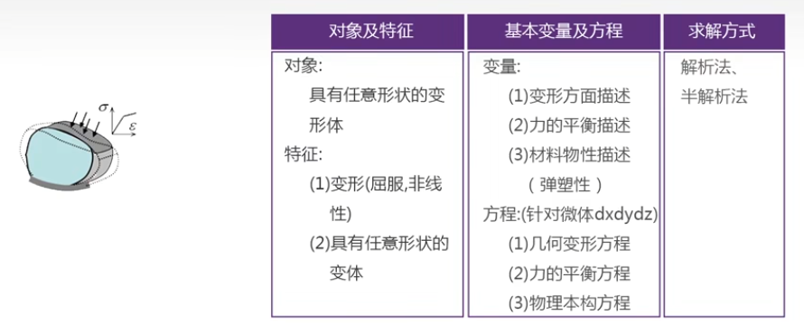
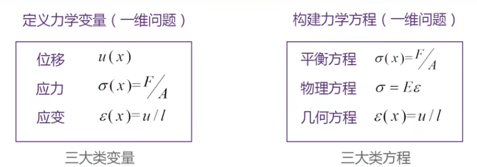
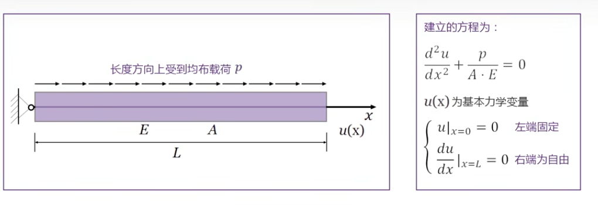
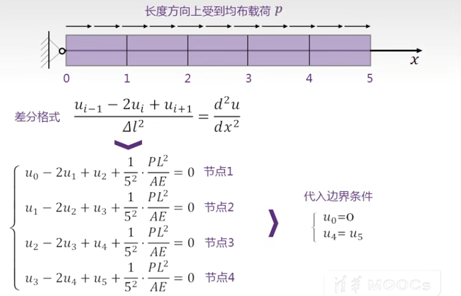
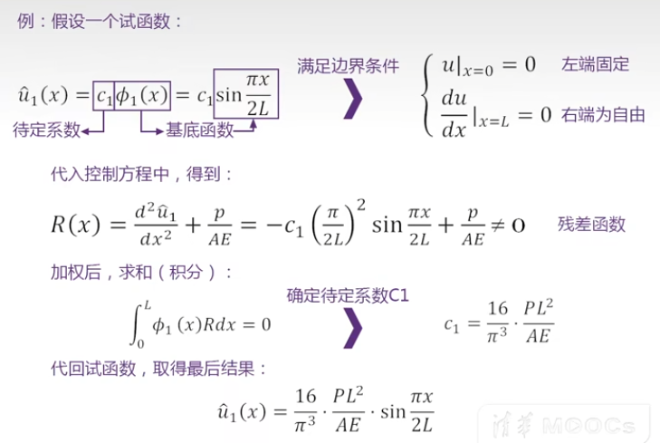

# 有限元分析

## 力学的分类 : 质点、刚体、变形体的力学

#### 理论力学
质点力学

刚体力学

变形体
* 简单形状：

* 复杂形状：

#### 弹塑性力学 
复杂形状变形体

### 变形体力学的要点

### 微分方程求解方法
2维情况：

位移场方程：由应变关系建立方程$\varepsilon(x)=\frac{u}{x} \Longrightarrow \frac{\text{d}u}{\text{d}x} + $
* 这里 $x$ 或 $l$ 代表原长， $p$ 或$F$ 代表力。
* 利用几何关系，平衡关系和物理关系建立方程组

#### 1.解析方法：
$$
u(x)=-\frac{1}{2} \frac{p}{A E} x^2+\frac{p}{A E} L x
$$

#### 2. 差分方法：

#### 3. 近似方法：
设定试函数$\hat{u}_1(x)$(含有待定系数 )， 代入控制方程得到残差函数，使与原方程的误差残值最小来确定试函数中的待定系数。

**求解精度对比：**
* (1) 解析解得到的结果是完全精确的
* (2) 差分法求解精度依赖于分段数，分段越多解的精度越高
* (3) 试函数法求解精度依靠选取的试 函数模式，试函数所选基底函数 越多解的精度越高

### todo
...

### 参考资料

1. [《有限元分析及应用》清华大学 曾攀老师主讲](https://www.bilibili.com/video/BV1d4411i7Wr/?share_source=copy_web&vd_source=e84f3d79efba7dc72e6306f35613222e)