# 理解物理模拟 应力-应变

### 前置知识
需要提前了解一部分材料力学知识。物体的材料力学特性是深入理解物理模拟各种公式的基础， 因此对在学习物理模拟中涉及到的材料力学知识做一个记录。。。

### 杆单元的应力和应变（Stress and Strain）
#### 应力张量
描述物体内力分布的量，在连续介质力学中，应力是用来表示连续材料内部的相邻粒子之间的相互作用力的物理量。 但会出现一些复杂性，因为力矢量与表面法线的相对方向决定了应力的类型，如图所示: 
* 应力是单位面积内力的量度，因此单位为$\frac{N}{m^2}$。
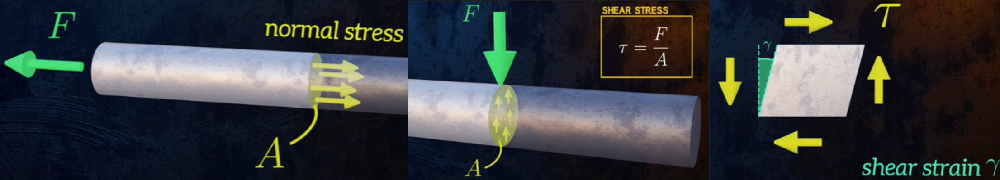

**法相应力:** 当力矢量垂直于表面时,应力称为法向应力，表示为 $\sigma$
$$
\sigma=\frac{F_{\text {normal }}}{A} \\
$$

**切向应力：** 当力矢量平行于表面时，应力称为剪应力(shear force)，表示为 $\tau$. 
$$
\tau=\frac{F_{\text {parallel }}}{A}\\
$$

**剪切模量：** 剪力造成的形变$G$ : 
$$
\tau=G \gamma
$$

####  应变
**正常应变：** 正常应变是指由法向应力引起的物体的直接长度变化拉伸（或压缩）。它通常被定义为：
$$
\varepsilon=\frac{\Delta L}{L_o} \\
$$

**剪切应变 VS 纯剪切应变**
剪切应变通常表示为 $\gamma$ 并定义为:
$$
\gamma=\frac{D}{T}\\
$$
纯剪切应变: (当位移和应变较小时，这两种定义会导致相同的结果: $\Delta x=\Delta y=\frac{D}{2}$ (small strains))
$$
\gamma=\frac{\Delta x+\Delta y}{T}\\
$$
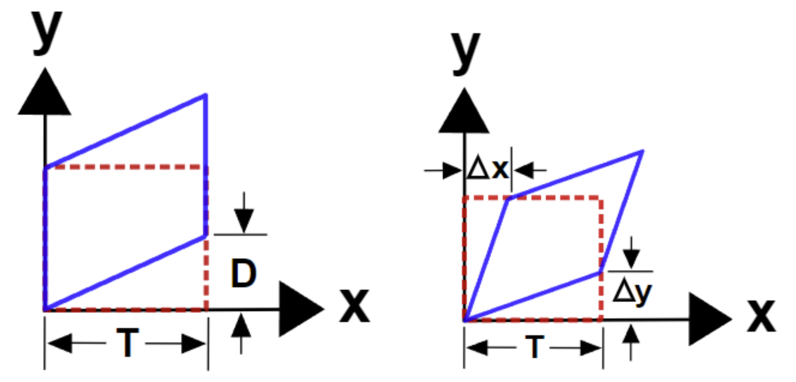

**一般定义：** 当一旦应变分量同时存在 $\epsilon_x, \epsilon_y, \epsilon_z, \gamma_{x y}$ 等等，需要使用微积分来表达。该方法是根据位移场 $u(X)$ 的偏导数来定义各种应变。
$$
\epsilon_x=\frac{\partial u_x}{\partial X} \quad \epsilon_y=\frac{\partial u_y}{\partial Y} \quad \epsilon_z=\frac{\partial u_z}{\partial Z}\\
$$

#### 内力平衡状态
**二维应力状态图：**
左图和右图之间的主要区别是剪切应力。
* 法向应力， $\sigma_{x x}$ 和 $\sigma_{y y}$. 注意 $x$ 法向应力， $\sigma_{x x}$, 存在于每个正方形的左右两侧，以保持水平平衡。这些 $\mathrm{x}$ 法向应力代表张力，因为它们指向正方形。拉伸法向应力具有正值，压缩法向应力具有负值。
$\mathrm{y}$ 法向应力， $\sigma_{y y}$ ，也存在于两个表面，顶部和底部，以保持垂直平衡。喜欢 $\sigma_{x x}, \sigma_{y y}$ 也被绘制来代表张力，这是积极的。
* 左图和右图的区别在于 $\tau_{y x}$ 左图中的替换为 $\tau_{x y}$在右图中。左图包含两个剪切应力值， $\tau_{x y}$ ，它逆时针旋转正方形，并且 $\tau_{y x}$ ，它顺时针旋转正方形。但如果两个剪切值不相等，则正方形将不处于旋转平衡状态。**保持旋转平衡的唯一方法是 $\tau_{x y}$ 平等 $\tau_{y x}$.**  所以没有必要有两个单独的变量。右图只包含一 个, $\tau_{x y}$
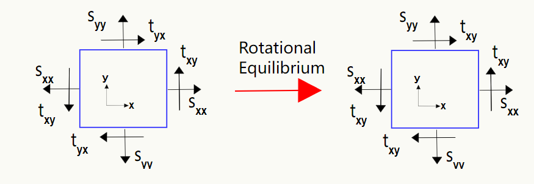

#### 应力三维表示
**应力张量:** 
* 内部作用力实际上不依赖于参考界面的选取，将同一个点所有平面上的牵引力用选取的三个正交平面（如xy、xz和yz平面）上的牵引力线性表示。
* 在小应变情况下，我们可以将这三个正交平面上的牵引力分类（包含三个正交平面上的正方向&剪切方向）组装起来，这就得到了 柯西应力张量（Cauthy stress tensor）
* 当力矢量介于两者之间时，使用应力张量计算法向分量和平行分量: 因为要保持旋转平衡，需要$\tau_{x y}=\tau_{y x }, \tau_{x z}=\tau_{z x}$和 $\tau_{y z}=\tau_{z y}$ 这也会产生对称张量。
$$
\boldsymbol{\sigma}=\left[\begin{array}{lll}
\sigma_{11} & \sigma_{12} & \sigma_{13} \\
\sigma_{12} & \sigma_{22} & \sigma_{23} \\
\sigma_{13} & \sigma_{23} & \sigma_{33}
\end{array}\right]=\left[\begin{array}{lll}
\sigma_{x x} & \sigma_{x y} & \sigma_{x z} \\
\sigma_{x y} & \sigma_{y y} & \sigma_{y z} \\
\sigma_{x z} & \sigma_{y z} & \sigma_{z z}
\end{array}\right]=\left[\begin{array}{lll}
\sigma_{x x} & \tau_{x y} & \tau_{x z} \\
\tau_{x y} & \sigma_{y y} & \tau_{y z} \\
\tau_{x z} & \tau_{y z} & \sigma_{z z}
\end{array}\right]\\
$$
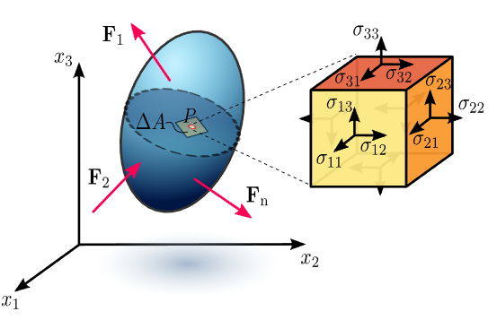

>Note: 在具有大变形（和旋转）的非线性问题中，事情可能会变得复杂，因为最终变形区域可能与初始区域不同，等等。现在将忽略所有这些复杂性，并假设前后差异可以忽略不计。因此，无需指定力和面积是针对未变形还是变形条件。
> * 小应变需要排除旋转分量

#### 杨氏模量
杨氏模量$E$： 
* 本质上是衡量材料硬度的指标。 杨氏模量越高，材料越硬
* 分为两个区域 - 弹性区域和塑性区域。
* 应力，应变，杨氏模量的关系：$\sigma=E \varepsilon\\$

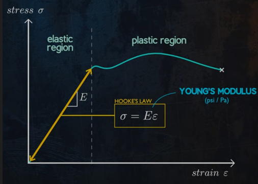

从原子作用力理解样式模量：

弹簧系统之所以被常用于物理模拟中，原因在于微观世界中粒子之间的作用力也可以简化成弹簧力。

### 牵引力向量Traction Vectors
牵引力矢量$\mathbf{T}$, 只是横截面上的内力矢量除以该横截面的面积。
* 物理意义：物理意义是材料内部其他点对点 $P$ 的作用力之和, $\mathbf{t}^{(n)}=\lim _{\Delta A \rightarrow 0} \frac{\Delta F}{\Delta A}$ 。
* 所以$\mathbf{T}$具有应力单位，例如兆帕$MPa$，但它绝对是向量，而不是应力张量。所以向量的所有常用规则都适用于它。例如，可以应用点积、叉积和坐标变换。
* 牵引矢量的方向始终与内力矢量相同, 只有它的大小随切割角度而变化
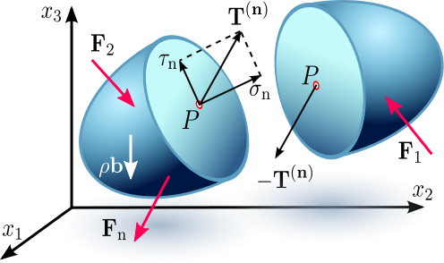

#### 牵引力向量
牵引矢量与某一点的应力状态之间的关系直接源于将物体上的力的总和设置为零，即施加平衡。
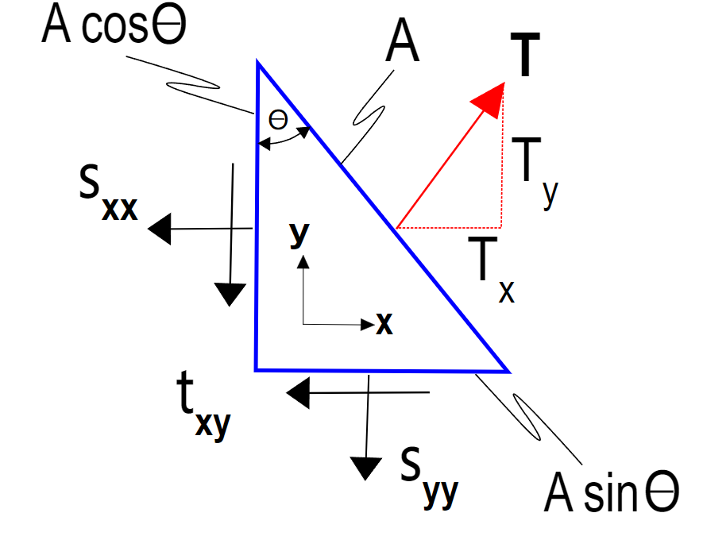
$$
\begin{gathered}
\sigma_{x x} A \cos \theta+\tau_{x y} A \sin \theta=T_x A \\
\tau_{x y} A \cos \theta+\sigma_{y y} A \sin \theta=T_y A\\
\end{gathered}\\
$$
**可以将 $T$ 理解成 $T_x, T_y$ 方向应力贡献量的集合**, $\cos \theta$ 和 $\sin \theta$ 是单元的垂直于表面的分量， $\mathbf{n}=(\cos \theta, \sin \theta)$ ，令 $\cos \theta = n_x$ 和 $\sin \theta=n_y$， 有： 
$$
\begin{gathered}
T_x = \sigma_{x x} n_x+\tau_{x y} n_y \\
T_y = \tau_{x y} n_x+\sigma_{y y} n_y\\
\end{gathered}\\
$$
两个方程可以概括为:
$$
\mathbf{T}= 
\begin{bmatrix}
  \sigma_{x x} & \tau_{x y}\\
  \tau_{x y} & \sigma_{y y} \\
\end{bmatrix} \cdot \mathbf{n} = 
\boldsymbol{\sigma} \cdot \mathbf{n}
$$
**二维牵引力计算**
或以张量表示法(有的地方叫标记法)为:
$$
T_i=\sigma_{i j} n_j \\
$$
**三维牵引力计算**
有了柯西应力张量，点 $P$ 处法向为 $n$ 的截面上的牵引力的式子就可以统一表示为 
$$\mathbf{T} = \mathbf{t}^{\mathbf(n)}=  \mathbf{\sigma} \mathbf{n}\\$$

>Note: 应力 = 应力张量乘以面的法向量。

#### 力的计算
一维横截面上的力：
$$
\mathbf{F}=\int \mathbf{T} d A=\int \boldsymbol{\sigma} \cdot \mathbf{n} d A \\
$$

### 胡克定律
是力学弹性理论中的一条基本定律，表述为：固体材料受力之后，材料中的应力与应变（单位变形量）之间线性的，材料是各向同性的。（各向同性意味着它在每个方向上都具有相等的刚度）。满足胡克定律的材料称为线弹性或胡克型（英文Hookean）材料。

单向力作用的情况：
* 弹簧给予物体的力F与长度变化量$\Delta x$成线性关系
* 可以表示为弹簧施加在拉动其自由端的任何物体上的恢复力
$$
F_s=-k \Delta x\\
$$

非单向力做的情况：
* $\nu=\frac{-\varepsilon_{\text {lateral }}}{\varepsilon_{\text {longitudinal }}}$， $\nu$是Poisson's ratio（纵向应变和横向应变之比，是一个材料常数）。
* $\varepsilon_y=\varepsilon_z$
$$
\begin{array}{ll}
\varepsilon_y \propto \varepsilon_x \\
\varepsilon_z \propto \varepsilon_x
\end{array} \quad \frac{\varepsilon_y}{\varepsilon_x}=\frac{\varepsilon_z}{\varepsilon_x}=\text { material constant }
$$

胡克定律张量表示：
$$
\begin{aligned}
\epsilon_{x x} &=\frac{1}{E}\left[\sigma_{x x}-\nu\left(\sigma_{y y}+\sigma_{z z}\right)\right] \\
\epsilon_{y y} &=\frac{1}{E}\left[\sigma_{y y}-\nu\left(\sigma_{x x}+\sigma_{z z}\right)\right] \\
\epsilon_{z z} &=\frac{1}{E}\left[\sigma_{z z}-\nu\left(\sigma_{x x}+\sigma_{y y}\right)\right]
\end{aligned}\\
$$

#### 单点弹簧系统：
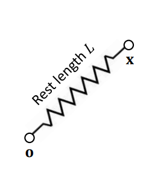
* Engegy: 根据物理定义其实就是弹性势能
$$
E(\mathbf{x})=\frac{k}{2}(\|\mathbf{x}\|-L)^{2}\\
$$
* Force: 弹簧力是能量减小最快的方向，即梯度。（能量减小最快的方向与弹力方向相反）
$$
\begin{aligned}
\mathbf{f}(\mathbf{x})=-\nabla E(\mathbf{x}) &=-k(\|\mathbf{x}\|-L)\left(\frac{\partial\|\mathbf{x}\|}{\partial \mathbf{x}}\right)^{\mathrm{T}} \\
&=-k(\|\mathbf{x}\|-L) \frac{\mathbf{x}}{\|\mathbf{x}\|}
\end{aligned}\\
$$
* Tangent stiffness: 刚度是弹簧力的梯度
  * $\mathbf{H}(\mathbf{x})$其实就是刚度在张量空间下的表示，在标量空间刚度的表达就是$k$。 

$$
\begin{aligned}
\mathbf{H}(\mathbf{x}) &=-\frac{\partial \mathbf{f}(\mathbf{x})}{\partial \mathbf{x}}=k \frac{\mathbf{x} \mathbf{x}^{\mathrm{T}}}{\|\mathbf{x}\|^{2}}+k(\|\mathbf{x}\|-L) \frac{\mathbf{I}}{\|\mathbf{x}\|}-k(\|\mathbf{x}\|-L) \frac{\mathbf{x} \mathbf{x}^{\mathrm{T}}}{\|\mathbf{x}\|^{2}\|\mathbf{x}\|} \\
&=k \frac{\mathbf{x} \mathbf{x}^{\mathrm{T}}}{\|\mathbf{x}\|^{2}}+k\left(1-\frac{L}{\|\mathbf{x}\|}\right)\left(\mathbf{I}-\frac{\mathbf{x x^T}}{\| \mathbf{x}\|^{2}}\right)
\end{aligned}\\
$$

**弹簧力的张量形式：**
$$
\mathbf{F}=\left[\begin{array}{l}
F_1 \\
F_2 \\
F_3\\
\end{array}\right]=\left[\begin{array}{lll}
\kappa_{11} & \kappa_{12} & \kappa_{13} \\
\kappa_{21} & \kappa_{22} & \kappa_{23} \\
\kappa_{31} & \kappa_{32} & \kappa_{33}
\end{array}\right]\left[\begin{array}{l}
X_1 \\
X_2 \\
X_3
\end{array}\right]=\mathbf{K} \mathbf{X}\\
$$
#### 双点弹簧系统：
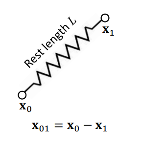
可以理解成在六维空间求梯度
* Energy：
$$
E(\mathbf{x})=\frac{k}{2}\left(\left\|\mathbf{x}_{01}\right\|-L\right)^{2}\\
$$
* Force:
$$
\begin{aligned}
\mathbf{f}(\mathbf{x}) &=-\nabla E(\mathbf{x})=\left[\begin{array}{c}
-\nabla_{0} E(\mathbf{x}) \\
-\nabla_{1} E(\mathbf{x})
\end{array}\right]=\left[\begin{array}{c}
\mathbf{f}_{e} \\
-\mathbf{f}_{e}
\end{array}\right] \\
\mathbf{f}_{e} &=-k\left(\left\|\mathbf{x}_{01}\right\|-L\right) \frac{\mathbf{x}_{01}}{\left\|\mathbf{x}_{01}\right\|}
\end{aligned}\\
$$
* Tangent stiffness:
$$
\begin{aligned}
&\mathbf{H}(\mathbf{x})=\left[\begin{array}{cc}
\frac{\partial^{2} E}{\partial \mathbf{x}_{0}^{2}} & \frac{\partial^{2} E}{\partial \mathbf{x}_{0} \partial \mathbf{x}_{1}} \\
\frac{\partial^{2} E}{\partial \mathbf{x}_{0} \partial \mathbf{x}_{1}} & \frac{\partial^{2} E}{\partial \mathbf{x}_{1}^{2}}
\end{array}\right]=\left[\begin{array}{cc}
\mathbf{H}_{e} & -\mathbf{H}_{e} \\
-\mathbf{H}_{e} & \mathbf{H}_{e}
\end{array}\right]\\
&\mathbf{H}_{e}=k \frac{\mathrm{x}_{01} \mathrm{x}_{01}^{\mathrm{T}}}{\left\|\mathrm{x}_{01}\right\|^{2}}+k\left(1-\frac{L}{\left\|\mathrm{x}_{01}\right\|}\right)\left(\mathbf{I}-\frac{\mathrm{x}_{01} \mathrm{x}_{01}^{\mathrm{T}}}{\left\|\mathrm{x}_{01}\right\|^{2}}\right)
\end{aligned}\\
$$
>Note: $\mathbf{H(x)}$的正定性由对角线上的$\mathbf{H}_{e}$正定性来决定的

#### 弹簧的刚度方程
弹簧的刚度方程，也叫平衡方程：
$$
\left[\begin{array}{cc}
k & -k \\
-k & k
\end{array}\right]\left[\begin{array}{l}
x_0 \\
x_1
\end{array}\right]=\left[\begin{array}{l}
F_0 \\
F_1
\end{array}\right]
$$

#### 一个两弹簧系统的分析
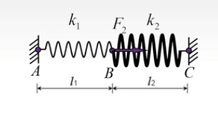
建立弹簧方程：
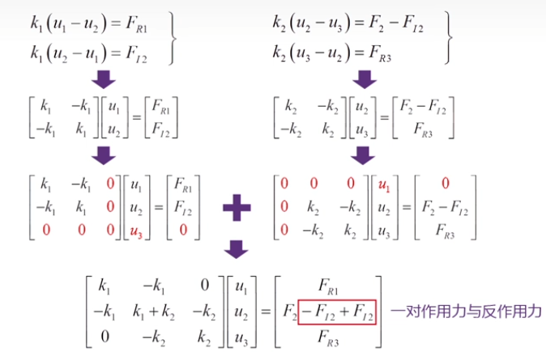
得到总体的平衡方程,其中边界条件：$u_1 = 0, u_3 = 0$
$$
\left[\begin{array}{ccc}
k_1 & -k_1 & 0 \\
-k_1 & k_1+k_2 & -k_2 \\
0 & -k_2 & k_2
\end{array}\right]\left[\begin{array}{l}
u_1 \\
u_2 \\
u_3
\end{array}\right]=\left[\begin{array}{c}
F_{R 1} \\
F_2 \\
F_{R 3}
\end{array}\right]\\
$$
最后求解：
$$
\left.\begin{array}{c}
u_2=\frac{F_2}{k_1+k_2} \\
F_{R 1}=-k_1 u_2=-\frac{k_1 F_2}{k_1+k_2} \\
F_{R 3}=-k_2 u_2=-\frac{k_2 F_2}{k_1+k_2}\\
\end{array}\right\}\\
$$

### 弹簧单元与杆单元的比较
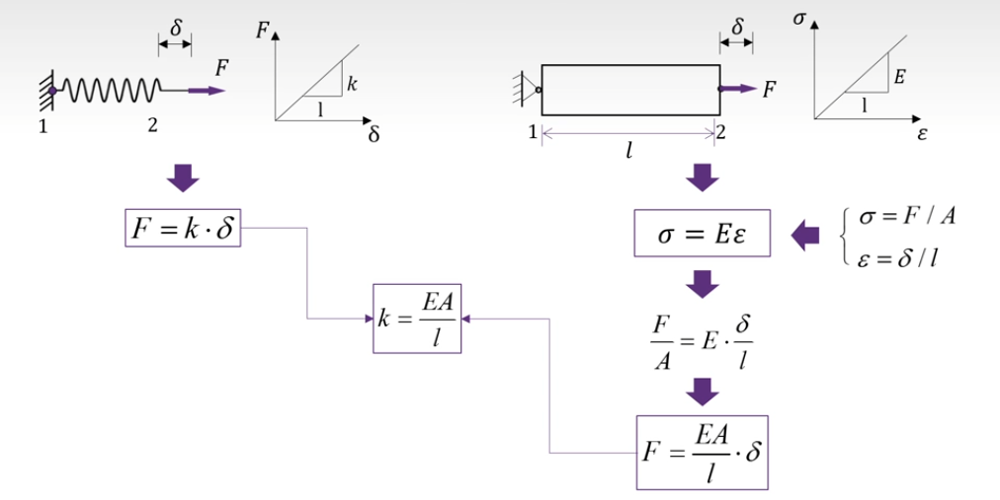
平衡方程的转换：
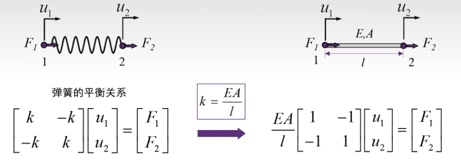
记 : 单元的节点位移 $\mathbf{q}^e=\left[\begin{array}{ll}u_1 & u_2\end{array}\right]^T$ 
记 : 单元的节点力 $\mathbf{F}^e=\left[\begin{array}{ll}F_1 & F_2\end{array}\right]^T$ 
记 : 单元的刚度矩阵 $\mathbf{K}^e=\frac{E A}{l}\left[\begin{array}{cc}1 & -1 \\ -1 & 1\end{array}\right]$

### 弹性势能（应变能）
弹性势能 ： 而在连续介质力学中，弹性能（也称为应变能（strain energy））可以由应变与应力求得：
定义 $\mathbf{W}$ 为单位体积的应变能（能量密度），则总体的弹性能为
$$
\mathbf{E}_{energy}= \int \mathbf{W} \,\text{d}V \\
$$

在线弹性模型下: $ \mathbf{W} =\frac{1}{2} \sigma \cdot\epsilon=\frac{1}{2} E_{stiffness} \cdot \epsilon \cdot \epsilon$ ，使用向量形式实际上是点积:
$$
U_0=\frac{1}{2}\left(\sigma_x \epsilon_x+\sigma_y \epsilon_y+\sigma_z \epsilon_z+\tau_{x y} \gamma_{x y}+\tau_{x z} \gamma_{x z}+\tau_{y z} \gamma_{y z}\right)\\
$$

### 总结

#### 物理模拟经常使用的材料力学公式：
牵引力 = 应力张量 x 法线（tracton = stress tensor x Normal）:
* $\mathbf{T} = \mathbf{\sigma} \, \mathbf{N}$

牵引力 = 内力 / 受力面积（tracton = internal force x Area）:
* $\mathbf{T} = \frac{\mathbf{F}}{\mathbf{A}}$

应力 = 刚度 x 应变 （stress = stiffness x strain ）:
* $\mathbf{\sigma} = \mathbf{E} \, \mathbf{\varepsilon}$

应变量 = 应变 x 原始长度
*  $\Delta L=\varepsilon L=\frac{F L}{A E}$

能量$W$ 正比于 刚度 x 应变的平方
* $\mathbf{W} \propto (\mathbf{\varepsilon}^2 \cdot \mathbf{E})$

#### 参考资料：
1. [GAMES103-基于物理的计算机动画入门](https://www.bilibili.com/video/BV12Q4y1S73g?p=2&share_source=copy_web&vd_source=e84f3d79efba7dc72e6306f35613222e)
2. [图解材料力学](https://youtu.be/DLE-ieOVFjI)
3. [《有限元分析及应用》](https://www.bilibili.com/video/BV1d4411i7Wr?p=14&vd_source=1a163e481fb12c5b6ca8a57f994c1d73)
4. [Finite Element Analysis](https://www.finiteelements.org/basicmechanics.html)
5. [从零开始的弹性仿真教程](https://zhuanlan.zhihu.com/p/413934057)
