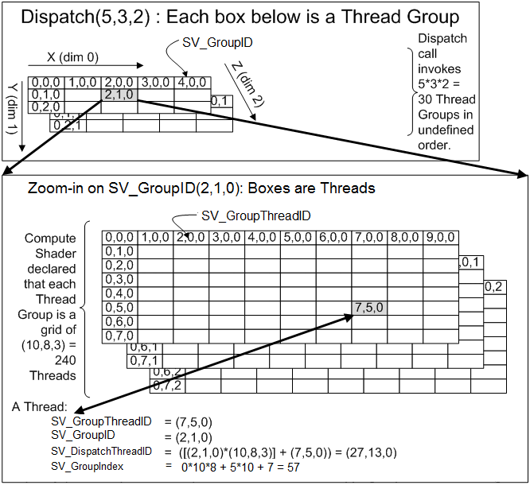
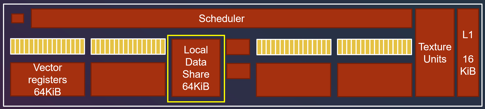
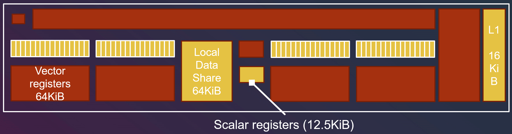

# UE4ComputeShader使用

## compute shader 结构
### 1. Diagram示例
**线程组构成的 3D 网格：**

上半部分代表的是线程组结构，下半部分代表的是单个线程组里的线程结构。因为他们都是由（X,Y,Z）来定义数量的，因此就像一个三维数组，下标都是从0开始。我们可以把它们看做是表格一样：有Z个一样的表格，每个表格有X列和Y行。例如线程组中的（2,1,0），就是第1个表格的第2行第3列对应的线程组，下半部分的线程也是同理

* SV_DispatchThreadID: 可以认为就是我们的像素位置。
* 
### 2. 任务分配
* SM 会将它从 Gigathread 引擎（NVIDIA 技术，专门管理整个流水线）那收到的大线程块，拆分成许多更小的堆，每个堆包含 32 个线程，这样的堆也被称为：warp (AMD 则称为 wavefront)。多处理器会以 SIMD32 的方式（即 32 个线程同时执行相同的指令序列）来处理 warp，每个 CUDA 核心都可处理一个线程。
* 在SM内部实际上还是按照逐个wrap去调度的。

### 3. 线程组之间的通信
跨线程组通信：
* 线程组之间并不能直接通信，可以使用L2 cache来通信，但是L2的性能不是特别好，尽量不要频繁操作

单个线程组内的通信
* 线程组内通信可以通过LDS（Local Data Share）来完成。 需要加上前缀 `groupshared `

### 4. 线程数据表示
**non-uniform ：**  线程独立拥有的变量， 即如果有64个线程就有64个变量。 数据存储到Vector Register （VGPR, vector general purpose register）。
**uniform：**  线程间共享的数据， 储存到 Scalar Register（SGPR, scalar general purpose register）

## 使用流程

### 1. 创建插件
创建好ComputeShader.uplugin插件。

### 2. Compute Shader文件虚拟地址映射绑定
找到ComputeShaderModule的.cpp将Computeshader文件的物理位置绑定至虚拟位置。

### 3. 创建globalshader文件

### 4. CPU与GPU之间的数据传递

### 参考资料
1. [Compute Shader 简介] (http://frankorz.com/2021/04/17/compute-shader/)
2. [ue4 Compute Shader] (https://www.notion.so/Compute-Shader-651791c5045c4521ae3f293e41a4cc0a)