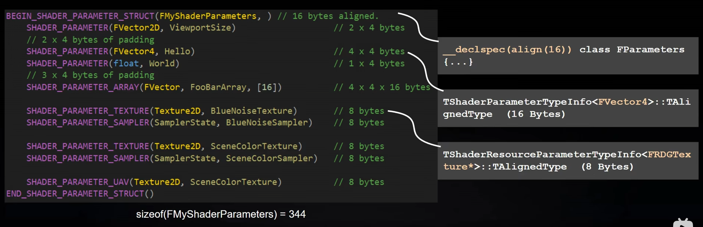
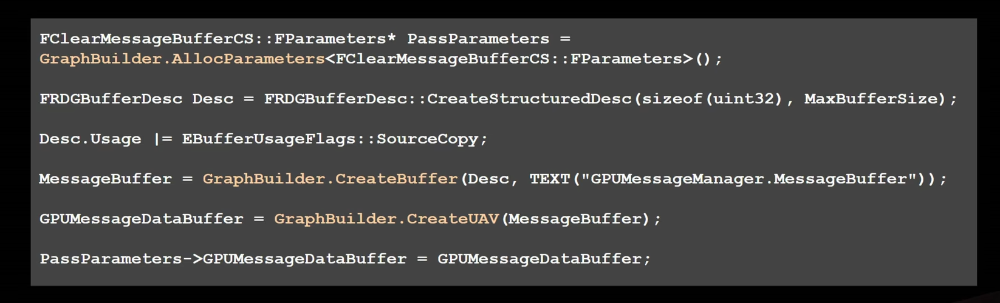
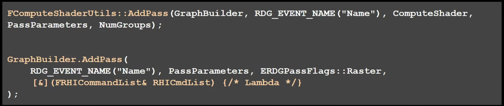
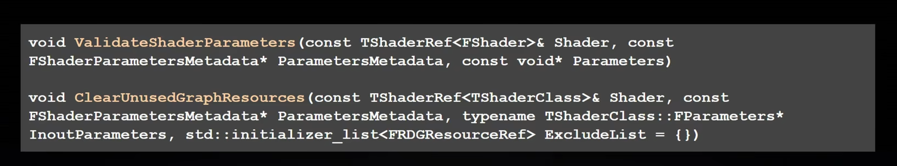
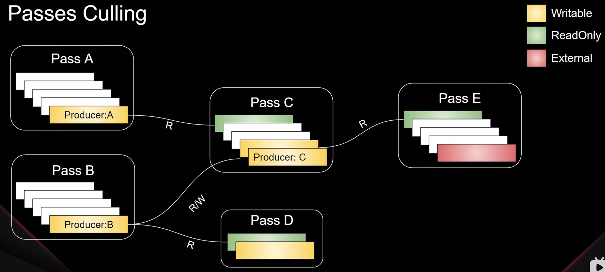
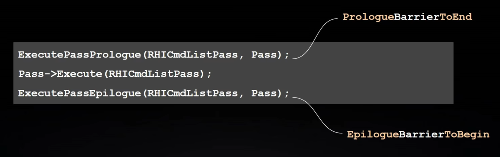

# UE4 RDG解析
RDG的全称是Rendering-Dependency Graph，也叫渲染依赖图，是基于有向无环图的调度系统，用于执行渲染管线的优化，目前引擎底层渲染的流程都是通过RDG来组织。 核心理念就是不在GPU上立即去执行pass，而是先收集所有先需要渲染的pass，然后按照依赖的顺序图对Pass图表进行编译和执行。
* 利用现代图形API实现自动的异步计算调度
* 更高效的内存管理和Barrier屏障管理。
## 一.  RDG 流程

### 1. 定义Shader Parameters
构造shader parameter，将shader的参数信息传入shader中。

### 2. Pass Setup
使用RDG Allocator来进行各类资源的申请，核心就是创建和更新RHI资源 （通过RDG来申请资源，方便RDG做资源管理）。
Parallel in RenderDependencyGraph
- Parallelize Pass Setup
- Compile(SetupPassResources)
- CompilePassBarriers
- SubmitBufferUploads
- CreateUniformBuffer
- CreatePassBarriers

### 3. Add Pass
将创建好的shader添加到RDG中。 
* pixelshader有：AddXXXPass() 之类的函数。 
* compute shader有：FComputeShaderUtils::AddPass() 或者 FComputeShaderUtils::Dispatch()。 

shader资源有效性验证和清理
* 通过遍历Parameter Matedata数据来判断是否有使用，

### 4. RDG Execution
**FRDGBuilder::Execute() 执行流程：**
- Passes Culling ：如果一个pass生成的数据（eg：buffer或者texture）没有被其他任何pass引用，那么这个pass可以被剔除（external资源除外，不受RDG的管理）。

- Passes Merge：
  - Resource Hazard：GPU 还没有开始写资源就被读取了。Vulkan有设置barrier来解决这个问题。
- Subresources State Merge
- Resources Collection
  - Transient Resource Allocator
- Barrier Collection/Creation

- ExecutePasses

## Shader Permutations

1. Unreal会根据不同用途将一个shader/material编译成多种permutation（组合）。

### Vertex Factory如何将数据发送到vertex shader中。
//todo...

$f(\theta) = \cos (\frac{2\theta_{max} \theta }{\pi}) \sin \theta$

### 参考资料
1. [【[UOD2022]Rendering Dependency Graph解析 | Epic 陈拓】 ] (https://www.bilibili.com/video/BV18K411Z7Jg/?share_source=copy_web&vd_source=e84f3d79efba7dc72e6306f35613222e)
2. [UE4 RDG系统速成课：RDG 101_ A Crash Course] (https://epicgames.ent.box.com/s/ul1h44ozs0t2850ug0hrohlzm53kxwrz)
3. [UE4 Rendering Part4: The Deferred Shading Pipeline] (Unreal Engine 4 Rendering Part 4: The Deferred Shading Pipeline)