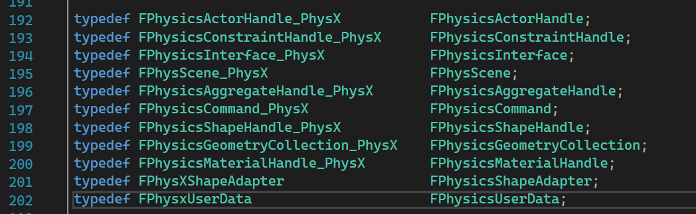

# UE4如何集成物理引擎

## Integration of Physics Engine

Game Object
- Rigid Body
- Renderable Object

Rigid Body Representation
- Shape
- Transform

Physics Scene

Updating Simulation

## Intro to PhysX integration
在PhysicsInterfaceDeclaresCore.h头文件中封装physx接口
