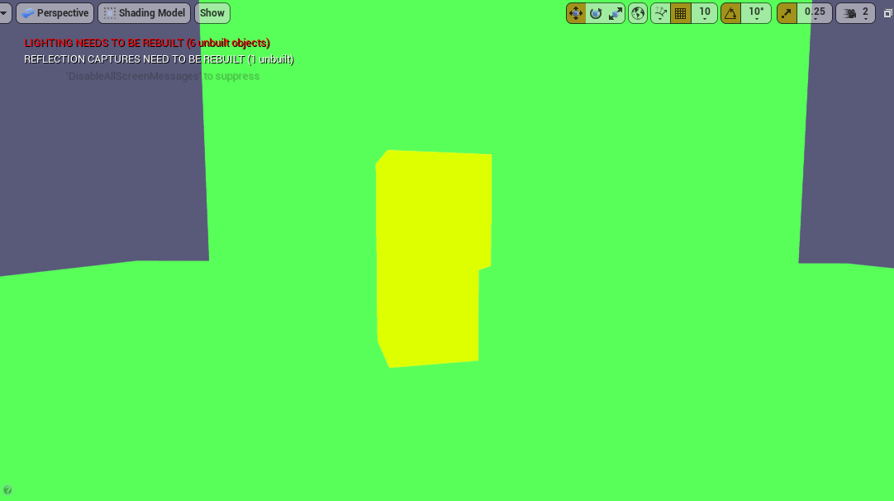
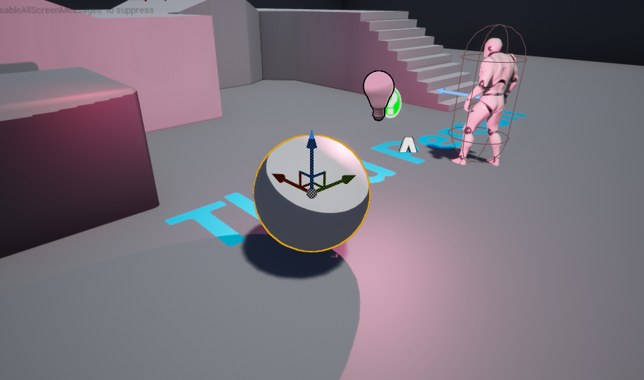

# 自ue4.27 定义着色模型

## GBuffer的数据结构
```c++
// all values that are output by the forward rendering pass
struct FGBufferData
{
	// normalized
	float3 WorldNormal;
	// normalized, only valid if HAS_ANISOTROPY_MASK in SelectiveOutputMask
	float3 WorldTangent;
	// 0..1 (derived from BaseColor, Metalness, Specular)
	float3 DiffuseColor;
	// 0..1 (derived from BaseColor, Metalness, Specular)
	float3 SpecularColor;
	// 0..1, white for SHADINGMODELID_SUBSURFACE_PROFILE and SHADINGMODELID_EYE (apply BaseColor after scattering is more correct and less blurry)
	float3 BaseColor;
	// 0..1
	float Metallic;
	// 0..1
	float Specular;
	// 0..1
	float4 CustomData;
	// Indirect irradiance luma
	float IndirectIrradiance;
	// Static shadow factors for channels assigned by Lightmass
	// Lights using static shadowing will pick up the appropriate channel in their deferred pass
	float4 PrecomputedShadowFactors;
	// 0..1
	float Roughness;
	// -1..1, only valid if only valid if HAS_ANISOTROPY_MASK in SelectiveOutputMask
	float Anisotropy;
	// 0..1 ambient occlusion  e.g.SSAO, wet surface mask, skylight mask, ...
	float GBufferAO;
	// 0..255 
	uint ShadingModelID;
	// 0..255 
	uint SelectiveOutputMask;
	// 0..1, 2 bits, use CastContactShadow(GBuffer) or HasDynamicIndirectShadowCasterRepresentation(GBuffer) to extract
	float PerObjectGBufferData;
	// in world units
	float CustomDepth;
	// Custom depth stencil value
	uint CustomStencil;
	// in unreal units (linear), can be used to reconstruct world position,
	// only valid when decoding the GBuffer as the value gets reconstructed from the Z buffer
	float Depth;
	// Velocity for motion blur (only used when WRITES_VELOCITY_TO_GBUFFER is enabled)
	float4 Velocity;

	// 0..1, only needed by SHADINGMODELID_SUBSURFACE_PROFILE and SHADINGMODELID_EYE which apply BaseColor later
	float3 StoredBaseColor;
	// 0..1, only needed by SHADINGMODELID_SUBSURFACE_PROFILE and SHADINGMODELID_EYE which apply Specular later
	float StoredSpecular;
	// 0..1, only needed by SHADINGMODELID_EYE which encodes Iris Distance inside Metallic
	float StoredMetallic;
};
```
##  自定义着色模型

### 1. 增加EMaterialShadingModel
修改ShadingModel枚举类EMaterialSamplerType，增加枚举类型。
```c++
UENUM()
enum EMaterialShadingModel
{
    //...
	//shadingModel 
	MSM_CarToon					UMETA(DisplayName = "Simple CarToon"),
	/** Number of unique shading models. */
	MSM_NUM						UMETA(Hidden),
	/** Shading model will be determined by the Material Expression Graph,
		by utilizing the 'Shading Model' MaterialAttribute output pin. */
    MSM_FromMaterialExpression	UMETA(DisplayName = "From Material Expression"),
    MSM_MAX
};
```

### 2. 将自定义的ShadingModel的生成相应的shader代码
调用HLSLMaterialTranslator.cpp的GetMaterialEnvironment()函数。
**OutEnvironment** 记录了设置好的`MATERIAL_SHADINGMODEL_CARTOON`卡通宏。
```c++
//add new Shadiing model
if (ShadingModels.HasShadingModel(MSM_CarToon))
{
    OutEnvironment.SetDefine(TEXT("MATERIAL_SHADINGMODEL_CARTOON"), TEXT("1"));
    NumSetMaterials++;
}
```

### 3. 扩展着色模型的参数入口 
增加输入：在Material.cpp材质中添加着色模型的参数IsPropertyActive_Internal()函数。
```c++
static bool IsPropertyActive_Internal
{
        //...
    case MP_SubsurfaceColor:
        Active = ShadingModels.HasAnyShadingModel({ MSM_Subsurface, MSM_PreintegratedSkin, MSM_TwoSidedFoliage, MSM_Cloth });
        break;
    case MP_CustomData0:
        // add CustomData0 Parameter to new  CarToon Model。
        Active = ShadingModels.HasAnyShadingModel({ MSM_ClearCoat, MSM_Hair, MSM_Cloth, MSM_Eye , MSM_CarToon });
        break;
    case MP_CustomData1:
        Active = ShadingModels.HasAnyShadingModel({ MSM_ClearCoat, MSM_Eye });
        break;
        //...
}
```

### 4. Inspector面板显示控制
有时候需要避免着色模型的参数出现混乱，需要隐藏一些参数模型。
1.处理像素着色器接受类的头文件。
在PixelInspectorResult.h中增加`PIXEL_INSPECTOR_SHADINGMODELID_CARTOON` 宏定义具体在PixelInspectorResult.cpp中的DecodeShadingModel()函数，这个数据将ID数据传输给usf文件。
```c++
#define PIXEL_INSPECTOR_SHADINGMODELID_HAIR 7
#define PIXEL_INSPECTOR_SHADINGMODELID_CLOTH 8
#define PIXEL_INSPECTOR_SHADINGMODELID_EYE 9
#define PIXEL_INSPECTOR_SHADINGMODELID_SINGLELAYERWATER 10
#define PIXEL_INSPECTOR_SHADINGMODELID_THIN_TRANSLUCENT 11
#define PIXEL_INSPECTOR_SHADINGMODELID_CARTOON 12
#define PIXEL_INSPECTOR_SHADINGMODELID_MASK 0xF
//...将PIXEL
EMaterialShadingModel PixelInspectorResult::DecodeShadingModel(float InPackedChannel)
{
    int32 ShadingModelId = ((uint32)FMath::RoundToInt(InPackedChannel * (float)0xFF)) & PIXEL_INSPECTOR_SHADINGMODELID_MASK;
    switch (ShadingModelId)
    {
    //...
    case PIXEL_INSPECTOR_SHADINGMODELID_CARTOON:
        return EMaterialShadingModel::MSM_CarToon;
    };
    return EMaterialShadingModel::MSM_DefaultLit;
}
```

在CustomizeDetails函数中去关闭一些细节参数面板
```c++
void FPixelInspectorDetailsCustomization::CustomizeDetails(IDetailLayoutBuilder& DetailBuilder)
{
    case MSM_Eye:
	{
		DetailBuilder.HideProperty(SubSurfaceColorProp);
		DetailBuilder.HideProperty(SubSurfaceProfileProp);
        //...
	}
	case MSM_CarToon:
	{
		//.... 控制细节面板的参数
	}
	break;
}
```

### 5. 在shader中定义ShadingModel的颜色
在ShadingCommon.ush定义对应的关键字，并修改数量。
```c++
//...
#define SHADINGMODELID_EYE					9
#define SHADINGMODELID_SINGLELAYERWATER		10
#define SHADINGMODELID_THIN_TRANSLUCENT		11
#define SHADINGMODELID_THIN_TRANSLUCENT		12
#define SHADINGMODELID_CARTOON				13
#define SHADINGMODELID_MASK					0xF	
```
在GetShadingModelColor设置ShadingModel的颜色
```c++
float3 GetShadingModelColor(uint ShadingModelID)
{
	switch(ShadingModelID)
	{
        //...
		case SHADINGMODELID_CARTOON: return float3(0.74f, 1.0f, 0.0f);  // Cartoon
		default: return float3(1.0f, 1.0f, 1.0f); // White
	}
}
```
最终呈现的颜色如下：


### 6. 设置Gbuffer接受CustomData的数据
在BasePassCommon.ush中修改WRITES_CUSTOMDATA_TO_GBUFFER，为新的着色模型中增加一个条件接收CustomData数据将其写入Gbuffer中。
```c++
// Only some shader models actually need custom data.
#define WRITES_CUSTOMDATA_TO_GBUFFER		(USES_GBUFFER && (MATERIAL_SHADINGMODEL_SUBSURFACE || MATERIAL_SHADINGMODEL_PREINTEGRATED_SKIN || MATERIAL_SHADINGMODEL_SUBSURFACE_PROFILE || MATERIAL_SHADINGMODEL_CLEAR_COAT || MATERIAL_SHADINGMODEL_TWOSIDED_FOLIAGE || MATERIAL_SHADINGMODEL_HAIR || MATERIAL_SHADINGMODEL_CLOTH || MATERIAL_SHADINGMODEL_EYE || MATERIAL_SHADINGMODEL_CARTOON))
```

### 7. 在Gbuffer中保存自定义数据
在ShadingModelsMaterial.ush文件中将MATERIAL_SHADINGMODEL_CARTOON的ID保存到GBuffer。注意这里的`MATERIAL_SHADINGMODEL_CARTOON`宏是前面c++设值OutEnvironment代码里的传入过来的。
```c++
void SetGBufferForShadingModel(
	in out FGBufferData GBuffer, 
	in const FMaterialPixelParameters MaterialParameters,
	const float Opacity,
	const half3 BaseColor,
	const half  Metallic,
	const half  Specular,
	const float Roughness,
	const float Anisotropy,
	const float3 SubsurfaceColor,
	const float SubsurfaceProfile,
	const float Dither,
	const uint ShadingModel)
{
    //...
#if MATERIAL_SHADINGMODEL_CARTOON
	else if (ShadingModel == SHADINGMODELID_CARTOON)
	{
		GBuffer.CustomData.x = GetMaterialCustomData0(MaterialParameters);
	}
#endif
}
```

### 8. 获取光源数据
**一定要记得传入灯光数据** 不然自定义着色模型全是黑色的。
在ClusteredDeferredShadingPixelShader.usf中的ClusteredShadingPixelShader 函数中添加新的着色模型函数以获取光源。
```c++
void ClusteredShadingPixelShader(
	in noperspective float4 UVAndScreenPos : TEXCOORD0,
	in float4 SvPosition : SV_Position,
	out float4 OutColor : SV_Target0)
{
    #if USE_PASS_PER_SHADING_MODEL
    //...
	GET_LIGHT_GRID_LOCAL_LIGHTING_SINGLE_SM(SHADINGMODELID_SINGLELAYERWATER, PixelShadingModelID, CompositedLighting, ScreenUV, CulledLightGridData, Dither, FirstNonSimpleLightIndex);
	GET_LIGHT_GRID_LOCAL_LIGHTING_SINGLE_SM(SHADINGMODELID_CARTOON, PixelShadingModelID, CompositedLighting, ScreenUV, CulledLightGridData, Dither, FirstNonSimpleLightIndex);
	// SHADINGMODELID_THIN_TRANSLUCENT - skipping because it can not be opaque
    #else // !USE_PASS_PER_SHADING_MODEL
}
```

### 9. 开启着色模型混合
与其他着色模型进行交互。
TiledDeferredLightShaders.usf中修改TiledDeferredLightShaders.usf 的 TiledDeferredLightingMain 函数中添加我们的着色模型
```c++
void TiledDeferredLightingMain(
	uint3 GroupId : SV_GroupID,
	uint3 DispatchThreadId : SV_DispatchThreadID,
    uint3 GroupThreadId : SV_GroupThreadID) 
{
        //...
		EXECUTE_SHADING_LOOPS_SINGLE_SM(SHADINGMODELID_SINGLELAYERWATER, PixelShadingModelID, CompositedLighting, PixelPos, NumLightsAffectingTile, NumSimpleLightsAffectingTile, CameraVector, WorldPosition);
		EXECUTE_SHADING_LOOPS_SINGLE_SM(SHADINGMODELID_CARTOON, PixelShadingModelID, CompositedLighting, PixelPos, NumLightsAffectingTile, NumSimpleLightsAffectingTile, CameraVector, WorldPosition);
}
```

### 10. 着色计算
在ShadingModels.ush 中的 IntegrateBxDF 函数增加具体CarToon着色计算函数
```c++
FDirectLighting IntegrateBxDF( FGBufferData GBuffer, half3 N, half3 V, half3 L, float Falloff, float NoL, FAreaLight AreaLight, FShadowTerms Shadow )
{
	switch( GBuffer.ShadingModelID )
	{
        //...
		case SHADINGMODELID_EYE:
			return EyeBxDF( GBuffer, N, V, L, Falloff, NoL, AreaLight, Shadow );
		case SHADINGMODELID_CARTOON:
			return CarToonBxDF(GBuffer, N, V, L, Falloff, NoL, AreaLight, Shadow);
		default:
			return (FDirectLighting)0;
	}
}
//具体的函数实现
CarToonBxDF(GBuffer, N, V, L, Falloff, NoL, AreaLight, Shadow)
{
    //... add Cartoon ShadingModel
	float CustomValue = GBuffer.CustomData.x * 0.5f;
	float diffValue = smoothstep(0.5f - CustomValue, 0.5 + CustomValue, Falloff * NoL);
	
	FDirectLighting Lighting;
	Lighting.Diffuse = AreaLight.FalloffColor * diffValue * Diffuse_Lambert(GBuffer.DiffuseColor);
}
```


### 11. 多光源支持

todo...


### 参考文章
1.[在UE4中创建新的Shading Model] (https://blog.csdn.net/qq_33967521/article/details/106949986)