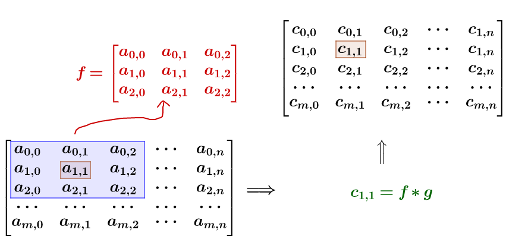
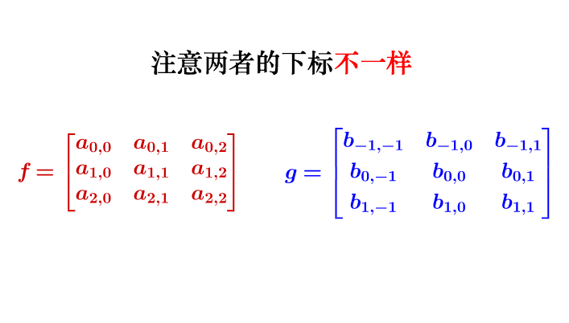
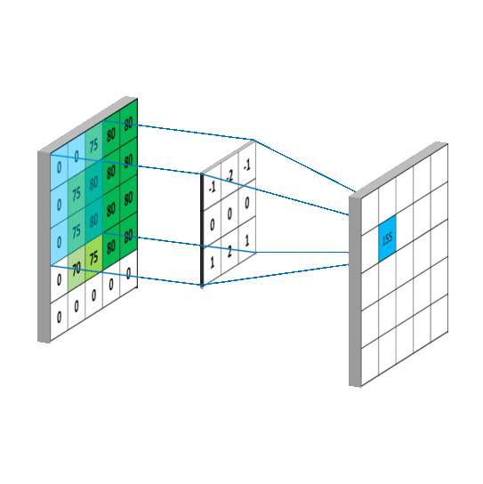
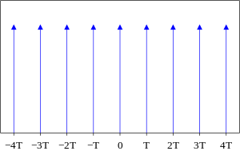
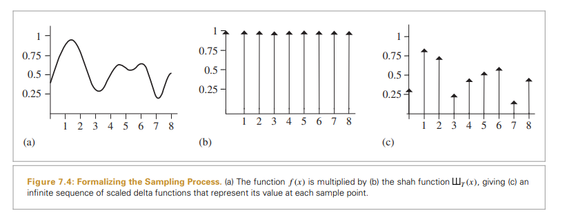
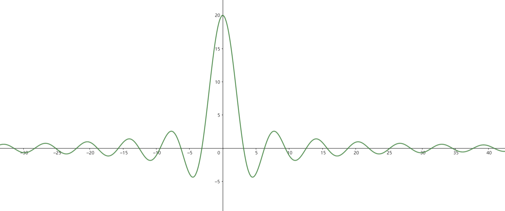
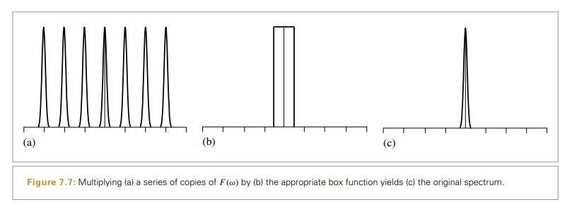

#! https://zhuanlan.zhihu.com/p/547407165
# Games101 采样理论知识补充

**Prerequisite:**

此文是在观看闫老师[《games101》](https://www.bilibili.com/video/BV1X7411F744?p=6&share_source=copy_web&vd_source=e84f3d79efba7dc72e6306f35613222e)课程，对自己采样理论知识的一个补充。

### 卷积定义：
（ps：以下都是省略前提条件的公式，具体定义看相关数学教科书）

**概率论卷积：** Z = X +Y， Z的概率密度为：$F_Z(z) =\int_{-\infty}^{+\infty}f_X(x ,z-x)\text{d}x$ 或 $F_Z(z) =\int_{-\infty}^{+\infty}f_X(z- y ,y)\text{d}y$，若X与Y独立。 下面公式称为独立卷积公式：
$$f_z(z) = \int_{-\infty}^{+\infty}f_X(x)f_Y(z-x)\text{d}x\\$$
**离散卷积：**
$$y(n) = \sum_{i = -\infty}^{+\infty}x(i)h(n - i)\\$$  

**复变函数卷积：**
$$f_1(t) \otimes f_2(t) = \int_{-\infty}^{+\infty} f_1(\tau)f_2(t-\tau)\text{d}\tau\\$$

**2D高斯卷积Guassian：** 
$$
\iint F\left(x, y\right) G_{2 D}\left(x_0-x, y_0-y\right) \mathrm{d} x \mathrm{~d} y=\int\left(\int F\left(x, y\right) G_{1 D}\left(x_0-x\right) \mathrm{d} x\right) G_{1 D}\left(y_0-y\right) \mathrm{d} y
$$

理解： 
1. `所谓两个函数的卷积，本质上就是先将一个函数翻转，然后进行逐步累加。`在连续情况下，就是对两
个函数的乘积求积分，在离散情况下就是加权求和。
1. 为什么要进行“卷”这个操作，本质就是施加一种约束，指定了“积”的范围。 例如在信号分析中，就是指定了某个特点的时间点；在空间分析中，限定了某些位置； 在图像处理中，限定了在像素哪些范围。“积”，就是这段约束内的效果叠加。

### 矩阵卷积

矩阵卷积计算细节：

主要矩阵的卷积计算实际上是：`将卷积矩阵沿着主对角线翻卷`，然后去进行矩阵运算，平均矩阵每个系数都一样，所以看起来像一一对应相乘。 
$$
g_n = 
\begin{bmatrix}
\frac{1}{n} & \cdots & \frac{1}{n} \\
\vdots & \ddots & \vdots \\
\frac{1}{n} & \cdots & \frac{1}{n} \\
\end{bmatrix}\\
$$

### 卷积定理推导
卷积定理； 存在两时域信号： $f(t), g(t)$, 时域函数的卷积相当于其频域函数的乘积，反之亦然
$$
\begin{align*}
    F{\{f(x)g(x)}\} &= F(w) G(w)\\
    F{\{f(x) \otimes g(x)}\} &= F(w) G(w)\\
\end{align*}\\
$$

>卷积定理证明过程：
>存在两时域信号： $f(t), g(t)$, 对于卷积有： 
>$$f(t) \otimes g(t) = \int_{-\infty}^{+ \infty}f(\tau)g(t - \tau)\text{d}\tau\\$$
>相应的傅里叶变换有：
>$$
>\begin{align*}
>    F(f(t) \otimes g(t)) &= \int_{-\infty}^{+ \infty}[\int_{-\infty}^{+ \infty}f(\tau)g(t - >\tau)\text{d}\tau]e^{-2\pi iwt}\text{d}t\\
>    & = \int_{-\infty}^{+ \infty}\int_{-\infty}^{+ \infty}f(\tau)g(t - \tau)e^{-2\pi iwt}\text>{d}t \text{d}\tau\\
>    & = \int_{-\infty}^{+ \infty}f(\tau)\int_{-\infty}^{+ \infty}g(t - \tau)e^{-2\pi iwt}\text>{d}t \text{d}\tau\\
>\end{align*}\\
>$$
>令$\phi = t - \tau \, \Longrightarrow \, t = \phi + \tau$, 带入公式：
>$$
>\begin{align*}
>    F(f(t) \otimes g(t)) &= \int_{-\infty}^{+ \infty}f(\tau)\int_{-\infty}^{+ \infty}g(\phi)e^>{-2\pi iw(\phi + \tau)}\text{d}(\phi + \tau) \text{d}\tau\\
>    & = \int_{-\infty}^{+ \infty}f(\tau) e^{-2\pi iw\tau}\text{d}\tau \int_{-\infty}^{+ \infty}g>(\phi)e^{-2\pi iwu}\text{d}(\phi + \tau) \\
>    & = F(\tau)F(\phi) \\
>    & = F_1(w)F_2(w)\\
>\end{align*}\\
>$$
至此就可以得出结论： 时域卷积等于频域乘积（至于时域的乘积等于频域的卷积，同样可以用上面方法证明，再次不细展开）

### 采样
参考：《PBRT  7.1 SAMPLING THEORY》

**狄拉克$\delta$函数（Dirac Delta Function）**
$$
\begin{align*}
    \int \delta(x)\text{d}x &= 1, \qquad  (x \ne 0, \delta(x) = 0)\\
    \int f(x)\delta(x) \text{d}x &= f(0)\\
\end{align*}\\
$$

**狄拉克梳状函数(Dirac comb)**
也叫shah函数， 脉冲函数，采样函数。 它其实就是关于狄拉克δ函数的用周期T间隔的无穷级数(多个δ函数的合并) ：

$$
\begin{align*}
    Shah(x) = Comb_T(x) = T\sum_{i = -N}^{N}\delta(x - iT)\\
    Shah(w) = Comb_{\frac{1}{T}}(x) = \frac{1}{T}\sum_{i = -N}^{N}\delta(w - \frac{T}{i})\\
\end{align*}\\
$$

**采样过程数学函数描述**
$$ Sample(x) = Shah(x)f(x) = T\sum_{i = -N}^{N}\delta(x - iT) f(iT)\\$$

由前面的卷积定理可知： 时域乘积等于频域卷积,所以有： 
$$
F_{fourier}(Shah(x)f(x)) = F_{Shah}(w) \otimes F_f(w)\\
$$
从公式中知道， 采样其实就是shah函数和f(x)在时域的卷积, 相当于按照频率$w = \frac{1}{T}$不断的复制$F_f(w)$，而信号重建就是从多个$F_f(w)$中利用`box filter`以原点为中心的频谱副本，再还原到时域中，形成新的图像。 如图所示(点击查看[Geogebra sinc(x)](https://www.geogebra.org/m/zfk2gbxt)): 

`box filter`: $sinc(x) = \frac{sin(x)}{x}$

图形中常用的替代方法box函数是使用平均 x 周围某个区域内的所有样本值，这其实是一种**错误的选择**。 这种不仅在选择中心频谱副本方面做的不好，而且也抹去掉了高频信息。

### 反走样

**走样原因:**
详细理论参考《PBRT  7.1.3 ALIASING》， 这里简单解释就是：`原始图像信号中的高频细节泄漏到重建信号频谱的低频区域，经过采样后的傅里叶频谱图发生混叠。`

**反走样技术：**
1. 非均匀抽样 Nonuniform Sampling
将要采样的图像函数已知具有无限的频率分量，因此无法从点样本中完美地重建，但可以通过以非均匀方式改变样本之间的间距来减少混叠的视觉影响。  然而，非均匀采样倾向于将常规的混叠伪影转化为噪声，从而减少对人类视觉系统的干扰。 在频率空间中，采样信号的副本最终也会随机移动，因此在执行重建时，结果是随机误差而不是相干混叠。

1. 自适应采样 Adaptive Sampling
识别出频率高于奈奎斯特极限的信号区域，在这些区域进行额外的采样。这种方法在实践中效果很好，因为很难找到所有需要超级采样的地方。大多数这样做的技术都是基于检查相邻的样本值并找到值之间存在显着变化的地方。如： 纹理过滤算法努力消除由于场景表面上的图像映射和程序纹理引起的锯齿。

2. 预过滤 Prefiltering
使用滤波器$r(x)$和采样样本做卷积做过滤后，再重建信号(一般使用box filter： $r(x) = sinc(x)$)：
$$\tilde{f} = (Shah(x)f(x)) \otimes r(x) = T\sum_{i = -N}^{N}f(iT)r(x - iT)\\$$
在采样之前将过高的信号(高于 Nyquist 极限的频率)给过滤掉， 将原始函数的频谱与选择宽度的盒式滤波器相乘，以便去除高于 Nyquist 极限的频率。 在空间域中，这对应于将原始函数与r(x) 滤波器进行卷积, 实际工程过程中采用的是一个均匀矩阵去进行卷积计算。

**参考资料：**

1. [Convolutional Neural Networks](https://mlnotebook.github.io/post/CNN1/)
2. [Convolution] (https://en.wikipedia.org/wiki/Convolution)
3. [相关数学教科书] (《高等数学同济第7版》等)
4. 《PBRT——7.1 SAMPLING THEORY》
5. [Dirac comb] (https://en.wikipedia.org/wiki/Dirac_comb)