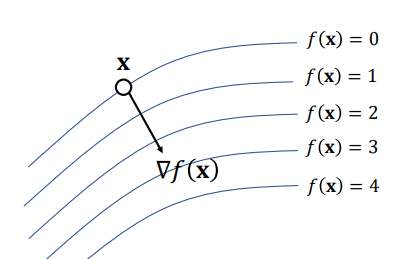

#! https://zhuanlan.zhihu.com/p/564642767
# 理解矩阵求导

### 矩阵求导定义
向量矩阵求导本质上就是多元函数求导，仅仅是把把函数的自变量，因变量以及标量求导的结果排列成了向量矩阵的形式（当然这种排列是人为指定的），方便表达与计算，更加简洁而已。
根据求导的自变量和因变量是标量，向量还是矩阵，有9种可能的矩阵求导定义:
|自变量\因变量 | 标量$y$| 向量$\bf y$|矩阵$\bf Y$|
|:--- |:--- |:---|:---|
|标量 $x$ |  $\frac{\partial y}{\partial x}$ | $\frac{\partial \bf y}{\partial x}$| $\frac{\partial \bf Y}{\partial x}$|
|向量 $\bf x$ | $\frac{\partial y}{\partial \bf x}$ | $\frac{\partial \bf y}{\partial \bf x}$| $\frac{\partial\bf Y}{\partial \bf x}$|
|矩阵 $\bf X$| $\frac{\partial y}{\partial \bf X}$ | $\frac{\partial \bf y}{\partial \bf X}$| $\frac{\partial \bf Y}{\partial \bf X}$|

#### 分子布局与分母布局
对于分子布局来说，求导结果的维度以分子为主，对于分母布局来说，求导结果的维度以分母为主。 分子布局和分母布局的结果来说，两者相差一个转置。
eg：有$\mathbf{y} = [y_1, y_2, \cdots , y_m]^T \qquad \mathbf{x} = [x_1, x_2, \cdots, x_n]^T$
分子布局有：结果就是一个mxn的矩阵，分子布局的向量对向量求导的结果矩阵，一般叫做**雅克比 (Jacobian)矩阵**。
$$
\frac{\partial \mathrm{y}}{\partial \mathrm{x}}=\left(\begin{array}{cccc}
\frac{\partial y_1}{\partial x_1} & \frac{\partial y_1}{\partial x_2} & \cdots & \frac{\partial y_1}{\partial x_n} \\
\frac{\partial y_2}{\partial x_1} & \frac{\partial y_2}{\partial x_2} & \cdots & \frac{\partial y_2}{\partial x_n} \\
\vdots & \vdots & \ddots & \vdots \\
\frac{\partial y_m}{\partial x_1} & \frac{\partial y_m}{\partial x_2} & \cdots & \frac{\partial y_m}{\partial x_n}
\end{array}\right)\\
$$

分母布局：求导的结果矩阵的第一维度会以分母为准，结果是一个nxm的矩阵，叫做**梯度矩阵**。
$$
\frac{\partial \mathrm{y}}{\partial \mathrm{x}}=\left(\begin{array}{cccc}
\frac{\partial y_1}{\partial x_1} & \frac{\partial y_2}{\partial x_1} & \cdots & \frac{\partial y_m}{\partial x_1} \\
\frac{\partial y_1}{\partial x_2} & \frac{\partial y_2}{\partial x_2} & \cdots & \frac{\partial y_m}{\partial x_2} \\
\vdots & \vdots & \ddots & \vdots \\
\frac{\partial y_1}{\partial x_n} & \frac{\partial y_2}{\partial x_n} & \cdots & \frac{\partial y_m}{\partial x_n}
\end{array}\right)\\
$$

>Note: 
>* 如果是向量或者矩阵对标量求导，则使用分子布局为准
>* 如果是标量对向量或者矩阵求导，则以分母布局为准

#### 标量对向量求导
标量对向量求导，严格来说是实值函数对向量的求导。即定义实值函数 $f: R^n \rightarrow R$ ，自变量 $\mathrm{x}$ 是 $\mathrm{n}$ 维向 量，而因变量$y$ 是标量。有公式：
$$
\begin{align*}
    \frac{\partial \mathrm{a}^T \mathrm{x}}{\partial \mathrm{x}} &=\frac{\partial \sum_{j=1}^n a_j x_j}{\partial \mathrm{x}}=\sum_{i=1}^n \frac{\partial a_i x_i}{\partial x_i}=\mathrm{a} \\
\frac{\partial \mathrm{x}^T \mathrm{Ax}}{\partial x_k}& =\frac{\partial \sum_{i=1}^n \sum_{j=1}^n x_i A_{i j} x_j}{\partial x_k}=\sum_{i=1}^n A_{i k} x_i+\sum_{j=1}^n A_{k j} x_j\\
& = \mathrm{A}^T \mathrm{x}+\mathrm{Ax}\\
\end{align*}\\
$$

#### 标量对矩阵求导
$y=\mathrm{a}^T \mathrm{Xb}$ ，求解 $\frac{\partial y}{\partial \mathbf{X}}$ 。其中， $\mathbf{a}$ 是 $m$ 维列向量， $\mathrm{b}$ 是 $n$ 维列向量， $\mathbf{X}$ 是 $m \times n$ 的矩阵。(求导结果是向量第i个分量和第j个分量的乘积)
$$
\begin{aligned}
    &\frac{\partial (\mathbf{a}^T \mathbf{Xb})}{\partial \mathbf{X}}=\frac{\partial \sum_{p=1}^m \sum_{q=1}^n a_p \mathbf{X}_{p q} b_q}{\partial \mathbf{X}}=\sum_{i=1}^m \sum_{j=1}^n \frac{\partial a_i \mathbf{X}_{i j} b_j}{\partial \mathbf{X}_{i j}}=\mathrm{ab^T}\\
    &\frac{\partial \mathbf{X}{b}}{\partial \mathbf{X}} = \frac{\partial \sum_{q=1}^n \mathbf{X}_{p q} b_q}{\partial \mathbf{X}}=\sum_{j=1}^n \frac{\partial  \mathbf{X}_{j} b_j}{\partial \mathbf{X}_{j}}=\mathrm{b^T}\\
\end{aligned}\\
$$

#### 向量对向量求导
定义法求解矩阵向量求导的方法对于比较复杂的求导式子，中间运算会很复杂，同时排列求导出的结果也很麻烦，一般使用微分法求解。

**定义法**：列向量$\mathbf{f}$对列向量$\mathbf{x}$求导。（分母布局为主）
$$
\begin{aligned}
&\text {分子} : \quad \mathbf{f}=\left[\begin{array}{l}
f_1(x) \\
f_2(x) \\
\vdots \\
f_m(x)
\end{array}\right]_{m \times 1} \qquad
&\text{分母}: \quad  \mathbf{x}=\left[\begin{array}{c}
x_1 \\
x_2 \\
\vdots \\
x_p
\end{array}\right]_{p \times 1}
\end{aligned}\\
$$
使用定义法求解的过程如下：
$$
\frac{\partial \mathbf{f}}{\partial \mathbf{x}}=\left[\begin{array}{c}
\frac{\partial f}{\partial x_1} \\
\frac{\partial f}{\partial x_2} \\
\frac{\partial f}{\partial x_p}
\end{array}\right]_{p \times 1} = 
\left[\begin{array}{cccc}
\frac{\partial f_1}{\partial x_1} & \frac{\partial f_2}{\partial x_1} & \cdots & \frac{\partial f_m}{\partial x_1} \\
\frac{\partial f_1}{\partial x_2} & \frac{\partial f_2}{\partial x_2} & \cdots & \frac{\partial f_m}{\partial x_2} \\
\frac{\partial f_1}{\partial x_p} & \frac{\partial f_2}{\partial x_p} & \cdots & \frac{\partial f_m}{\partial x_p}
\end{array}\right]_{p \times m}\\
$$

**微分法**：在高数里面学习过标量的导数和微分，他们之间有这样的关系： $d f=f^{\prime}(x) d x$ 。如果是多变量的情 况，则微分可以写成：
$$
d f=\sum_{i=1}^n \frac{\partial f}{\partial x_i} d x_i=\left(\frac{\partial f}{\partial \mathrm{x}}\right)^T d \mathrm{x}
$$
再推广到矩阵。对于矩阵微分定义为：
$$
d f=\sum_{i=1}^m \sum_{j=1}^n \frac{\partial f}{\partial X_{i j}} d X_{i j}=\operatorname{tr}\left(\left(\frac{\partial f}{\partial \mathrm{X}}\right)^T d \mathrm{X}\right)
$$
>Note: 矩阵迹的性质，即迹函数等于主对角线的和:
>* $\operatorname{tr}\left(A^T B\right)=\sum_{i, j} A_{i j} B_{i j}$

由于标量的迹函数就是它本身，那么矩阵微分和向量微分可以统一表示:
$$
d f=\operatorname{tr}\left(\left(\frac{\partial f}{\partial \mathrm{X}}\right)^T d \mathrm{X}\right) \quad d f=\operatorname{tr}\left(\left(\frac{\partial f}{\partial \mathrm{x}}\right)^T d \mathrm{x}\right)\\
$$

#### 矩阵对矩阵的求导
目前主流的矩阵对矩阵求导定义是对矩阵先做向量化，然后再使用向量对向量的求导。而这里的向量化一般是使用列向量化。也就是说，现在的矩阵对矩阵求导可以表示为：(ps:这里使用分母布局)
$$
\frac{\partial \mathrm{F}}{\partial \mathrm{X}}=\frac{\partial \operatorname{vec}(\mathrm{F})}{\partial \operatorname{vec}(\mathrm{X})}\\
\operatorname{vec}(d \mathrm{~F})=\frac{\partial \operatorname{vec}(\mathrm{F})^T}{\partial \operatorname{vec}(\mathrm{X})} \operatorname{vec}(d \mathrm{X})=\frac{\partial \mathrm{F}^T}{\partial \mathrm{X}} \operatorname{vec}(d \mathrm{X})\\
$$
和之前标量对矩阵的微分法相比，这里的迹函数被矩阵向量化代替了

### 张量计算 Tensor Calculus 

#### 一阶导数
如果有 $f(\mathbf{x}) \in \mathbf{R}$, 那么存在:
$$
d f=\sum_{i=1}^{n} \frac{\partial f}{\partial x_{i}} d x_{i}=\left(\frac{\partial f}{\partial \mathbf{x}}\right)^{T} d \mathbf{x}
$$
对于$\mathbf{x} = (x, y,z)$,有：$d f=\frac{\partial f}{\partial x} d x+\frac{\partial f}{\partial y} d y+\frac{\partial f}{\partial z} d z=\left[\begin{array}{lll}\frac{\partial f}{\partial x} & \frac{\partial f}{\partial y} & \frac{\partial f}{\partial z}\end{array}\right]\left[\begin{array}{l}d x \\ d y \\ d z\end{array}\right]$.

得到以下形式：
$$
\frac{\partial f}{\partial \mathbf{x}}=\left[\begin{array}{lll}
\frac{\partial f}{\partial x} & \frac{\partial f}{\partial y} & \frac{\partial f}{\partial z} \\
\end{array}\right]^{T}\\
$$
或者gradient 梯度形式,此处引入算子$\nabla=\left[\frac{\partial}{\partial x_{1}}, \frac{\partial}{\partial x_{2}}, \ldots, \frac{\partial}{\partial x_{n}}\right]$将数量场转化成了向量场（eg： 将三维曲面形式展现到二维平面）。
$$
\nabla f(\mathbf{x})=\left[\begin{array}{l}
\frac{\partial f}{\partial x} \\
\frac{\partial f}{\partial y} \\
\frac{\partial f}{\partial z} \\
\end{array}\right] \\
$$
梯度可以看作是`向量的数量乘法，是最陡的增加方向，它垂直于等值面`

#### 将函数扩展到多维

如果有： $\mathbf{f}(\mathbf{x})=\left[\begin{array}{l}f(\mathbf{x}) \\ g(\mathbf{x}) \\ h(\mathbf{x})\end{array}\right] \in \mathbf{R}^{3}$, then:
* Jacobian ：
$$
\mathbf{I}(\mathbf{x})= \nabla \mathbf{ f}= (\frac{\partial \mathbf{f}}{\partial \mathbf{x}})^T=\left[\begin{array}{lll}
\frac{\partial f}{\partial x} & \frac{\partial f}{\partial y} & \frac{\partial f}{\partial z} \\
\frac{\partial g}{\partial x} & \frac{\partial g}{\partial y} & \frac{\partial g}{\partial z} \\
\frac{\partial h}{\partial x} & \frac{\partial h}{\partial y} & \frac{\partial h}{\partial z} \\
\end{array}\right] \\
$$
* 散度Divergence: $\nabla \cdot \mathbf{f}$, 是局部通量的极限值，散度是通量的体密度。
$$
\nabla \cdot \mathbf{f}=\frac{\partial f}{\partial x}+\frac{\partial g}{\partial y}+\frac{\partial h}{\partial z}\\
$$
* 旋度Curl (常用于粒子模拟)          
$$
\nabla \times \vec{f}=\left|\begin{array}{ccc}
\vec{i} & \vec{j} & \vec{k} \\
\frac{\partial}{\partial x} & \frac{\partial}{\partial y} & \frac{\partial}{\partial z} \\
f & g & h \\
\end{array}\right|=\left[\begin{array}{l}
\frac{\partial h}{\partial y}-\frac{\partial g}{\partial z} \\
\frac{\partial f}{\partial z}-\frac{\partial h}{\partial x} \\
\frac{\partial g}{\partial x}-\frac{\partial f}{\partial y} \\
\end{array}\right]\\
$$

> Note: 通量定义
>$$
>\underbrace{\oiint_{\partial V} \vec{\mathbf{f}} \cdot \vec{\mathbf{n}} \mathrm{d} S}_{\text {流过边界的通量 }}=\underbrace{\iiint_{V} \nabla \cdot \vec{\mathbf{f}} \mathrm{d} V}_{\text {内部所有散度的贡献 }}\\
>$$
> 斯克托斯公式 stokers：
> $$
>\underbrace{\oint_{\partial S} \vec{\mathbf{f}} \cdot \mathrm{d} \vec{\mathbf{r}}}_{\text {围绕边界的环量 }}=\underbrace{\iint_{S} \nabla \times \vec{\mathbf{f}} \cdot \mathrm{d} \vec{\mathbf{S}}}_{\text {曲面上旋度的贡献 }}\\
>$$

#### 二阶导数

如果$f(\mathbf{x}) \in \mathbf{R}$,则有：

* Hessian矩阵：
$$
\mathbf{H}=\mathbf{J}(\nabla^2 f(\mathbf{x}))=\mathbf{J}(\nabla^T \cdot \nabla f(\mathbf{x}))=\left[\begin{array}{ccc}
\frac{\partial^{2} f}{\partial x^{2}} & \frac{\partial^{2} f}{\partial x \partial y} & \frac{\partial^{2} f}{\partial x \partial z} \\
\frac{\partial^{2} f}{\partial x \partial y} & \frac{\partial^{2} f}{\partial y^{2}} & \frac{\partial^{2} f}{\partial y \partial z} \\
\frac{\partial^{2} f}{\partial x \partial z} & \frac{\partial^{2} f}{\partial y \partial z} & \frac{\partial^{2} f}{\partial z^{2}}
\end{array}\right]\\
$$
* Laplacian：Laplacian is the trace of the Hessian $L=tr(H)$
$$
\begin{aligned}
\Delta f(\mathbf{x})=\nabla \cdot \nabla^T f(\mathbf{x}) = \frac{\partial^{2} f}{\partial x^{2}}+\frac{\partial^{2} f}{\partial y^{2}}+\frac{\partial^{2} f}{\partial z^{2}}
\end{aligned}\\
$$

**向量的泰勒展开 Taylor Expansion**

对于实数域$f(x) \in \mathbf{R}$有：
$$
f(x)=f\left(x_{0}\right)+\frac{\partial f\left(x_{0}\right)}{\partial x}\left(x-x_{0}\right)+\frac{1}{2} \frac{\partial f^{2}\left(x_{0}\right)}{\partial x^{2}}\left(x-x_{0}\right)^{2}+\cdots\\
$$

对于向量域$f(\mathbf{x}) \in \mathbf{R^n}$， 有：
$$
\begin{aligned}
f(\mathbf{x}) &=f\left(\mathbf{x}_{0}\right)+\frac{\partial f\left(\mathbf{x}_{0}\right)}{\partial \mathbf{x}}\left(\mathbf{x}-\mathbf{x}_{0}\right)+\frac{1}{2}\left(\mathbf{x}-\mathbf{x}_{0}\right)^{\mathrm{T}} \frac{\partial^2 f\left(\mathbf{x}_{0}\right)}{\partial \mathbf{x}^{2}}\left(\mathbf{x}-\mathbf{x}_{0}\right)+\cdots \\
&=f\left(\mathbf{x}_{0}\right)+\nabla f\left(\mathbf{x}_{0}\right) \cdot\left(\mathbf{x}-\mathbf{x}_{0}\right)+\frac{1}{2}\left(\mathbf{x}-\mathbf{x}_{0}\right)^{\mathrm{T}} \mathbf{H}\left(\mathbf{x}-\mathbf{x}_{0}\right)+\cdots
\end{aligned} \\
$$
其中$\frac{1}{2}\left(\mathbf{x}-\mathbf{x}_{0}\right)^{\mathrm{T}} \mathbf{H}\left(\mathbf{x}-\mathbf{x}_{0}\right)$的正定性，如果是正定，那么函数的二阶项必然是大于0的。这会给函数带来很多有意思的特性（如：凸优化，最值点）

#### 向量梯度计算

向量长度的梯度 = 归一化后的原向量。（理解：`梯度就是沿着变化最快的方向，而向量长度在其自身方向上是最伸缩最快的`）
$$
\frac{\partial\|\mathbf{x}\|}{\partial \mathbf{x}}=\frac{\partial\left(\mathbf{x}^{\mathrm{T}} \mathbf{x}\right)^{1 / 2}}{\partial \mathbf{x}}=\frac{1}{2}\left(\mathbf{x}^{\mathrm{T}} \mathbf{x}\right)^{-1 / 2} \frac{\partial\left(\mathbf{x}^{\mathrm{T}} \mathbf{x}\right)}{\partial \mathbf{x}}=\frac{1}{2\|\mathbf{x}\|} 2 \mathbf{x}^{\mathrm{T}}=\frac{\mathbf{x}^{\mathrm{T}}}{\|\mathbf{x}\|}\\
$$

>Note : $\frac{\partial\left(\mathbf{x}^{\mathrm{T}} \mathbf{x}\right)}{\partial \mathbf{x}}=\frac{\partial\left(x^{2}+y^{2}+z^{2}\right)}{\partial \mathbf{x}}=\left[\begin{array}{lll}2 x & 2 y & 2 z\end{array}\right]=2 \mathbf{x}^{\mathrm{T}}$

#### 参考资料 
1. [矩阵求导法则与性质](https://www.zdaiot.com/Math/%E7%9F%A9%E9%98%B5%E6%B1%82%E5%AF%BC%E6%B3%95%E5%88%99%E4%B8%8E%E6%80%A7%E8%B4%A8/)
2. [矩阵求导](https://www.bilibili.com/video/BV1fK411W7oh/?spm_id_from=333.788.video.desc.click&vd_source=1a163e481fb12c5b6ca8a57f994c1d73)
3. [向量微积分----李柏坚](https://www.bilibili.com/video/BV1WD4y1Q731?p=2&vd_source=1a163e481fb12c5b6ca8a57f994c1d73)
4. [【nabla算子】与梯度、散度、旋度](https://www.bilibili.com/video/BV1a541127cX?spm_id_from=333.337.search-card.all.click&vd_source=1a163e481fb12c5b6ca8a57f994c1d73)