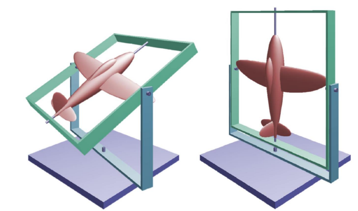
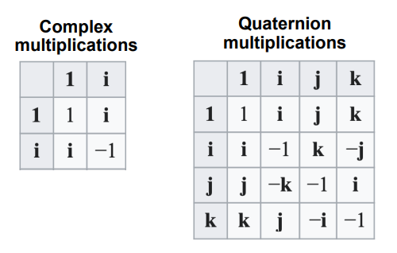
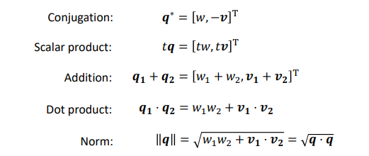
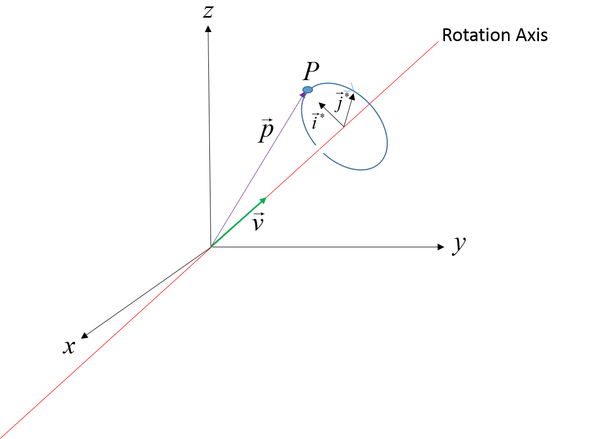
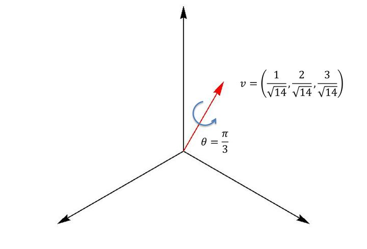

#! https://zhuanlan.zhihu.com/p/560990376
# 三维空间旋转表示

#### 欧拉角
* 欧拉角表示法也很流行，通常用于设计和控制。
* 直观。 它使用三个轴向旋转来表示一个通用旋转。 每个轴向旋转使用角度。
* 在 Unity 中，顺序是 Z 旋转、X 旋转、Y 旋转。(对顺序有要求)
* 但它也不适合动态：
* 在某些状态下可能会丢失DoFs自由度，(`Gimbal lock，两个或更多轴的对齐导致旋转自由度的损失，即存在旋转轴重叠`)。
* 定义其时间导数（旋转速度）很困难

#### 四元数

让$\mathbf{q = av}$是由两部分组成的四元数：标量部分$\bf a$和3D矢量部分$\bf v$，占$\bf ijk$。
$$
\mathbf{q}=[\mathbf{a}, x \mathbf{i}+y \mathbf{j}+z \mathbf{k}] \qquad (s, x, y, z) \in \mathbb{R}
$$

**四元数的表示：**
* A). $q=a+b i+c j+d k$
* B). $2 \times 2$ 复矩阵表示 $\left(\begin{array}{cc}a+i b & c+i d \\ -c+i d & a-i b\end{array}\right)$
四个基矢量为 $1=\left[\begin{array}{ll}1 & 0 \\ 0 & 1\end{array}\right], \quad \sigma_1=\left[\begin{array}{ll}0 & i \\ i & 0\end{array}\right], \quad \sigma_2=\left[\begin{array}{cc}0 & 1 \\ -1 & 0\end{array}\right], \quad \sigma_3=\left[\begin{array}{cc}i & 0 \\ 0 & -i\end{array}\right]$
* C). 将四元数的每个虚部对应两个 $2 \times 2$ 泡利矩阵 之积, 即令 $i=\sigma_3 \sigma_2, j=\sigma_1 \sigma_3, k=\sigma_2 \sigma_1$, 有:
$$
\begin{gathered}
q=a+b \sigma_3 \sigma_2+c \sigma_1 \sigma_3+d \sigma_2 \sigma_1 \\
q=a+b i+c j+\mathrm{dk}\\
\end{gathered}\\
$$
* D). 四元数 $4 \times 4$ 矩阵表示 $\left[\begin{array}{cccc}a & -b & -c & -d \\ b & a & -d & c \\ c & d & a & -b \\ d & -c & b & a\end{array}\right]$, 这是个分量为 $(a, b, c, d)$ 的四维线性空间矢量, 四个基矢量为:
$$
\left[\begin{array}{cccc}
1 & 0 & 0 & 0 \\
0 & 1 & 0 & 0 \\
0 & 0 & 1 & 0 \\
0 & 0 & 0 & 1
\end{array}\right], \quad i=\left[\begin{array}{cccc}
0 & -1 & 0 & 0 \\
1 & 0 & 0 & 0 \\
0 & 0 & 0 & -1 \\
0 & 0 & 1 & 0
\end{array}\right], j=\left[\begin{array}{cccc}
0 & 0 & -1 & 0 \\
0 & 0 & 0 & 1 \\
1 & 0 & 0 & 0 \\
0 & -1 & 0 & 0
\end{array}\right], \quad k=\left[\begin{array}{cccc}
0 & 0 & 0 & -1 \\
0 & 0 & -1 & 0 \\
0 & 1 & 0 & 0 \\
1 & 0 & 0 & 0
\end{array}\right]
$$

**四则运算法则**

**四元数表示的旋转:**

假设 $\mathrm{v}$ 是单位四元数 $\mathrm{q}$ 里的单位矢量 $q=\cos \theta +\sin \theta v$。
* $\rm u^{\prime}=q u q^{-1}$ 的结果就是矢量 $\mathrm{u}$ 绕 矢量 $\mathrm{v}$ 转过了 $2 \theta$ 角。
* 对矢量的两次转动, $\rm u^{\prime}=q_2\left(q_1 u q_1^{-1}\right) q_2^{-1}=q u q^{-1}$ 对应 $q=q_2 q_1, q^{-1}=q_1^{-1} q_2^{-1}$

因此为了以角度 𝜃 表示围绕 𝐯 的旋转，我们将四元数设置为：

$$
\left\{\begin{array} { l } 
{ \mathbf { q } = [ \begin{array} { l l } 
{ \operatorname { c o s } \frac { \theta } { 2 } } & { \mathbf { v } }
\end{array} ] } \\
{ \| \mathbf { q } \| = 1 }
\end{array} \quad \left\{\begin{array}{l}
\mathbf{q}=\left[\begin{array}{ll}
\cos \frac{\theta}{2} & \mathbf{v}
\end{array}\right] \\
\|\mathbf{v}\|^{2}=\sin ^{2} \frac{\theta}{2}
\end{array}\right.\right. \\
$$

如果你有一个四元数:
$$
q=(q 1, q 2, q 3, q 4)=\left(\cos \left(\frac{\theta}{2}\right), \sin \left(\frac{\theta}{2}\right) * v_x, \sin \left(\frac{\theta}{2}\right) * v_y, \sin \left(\frac{\theta}{2}\right) * v_z\right)
$$
那么，对向量的旋转操作$\rm u^{\prime}=q u q^{-1}$等于对应一个以向量 $\mathbf{v} = [v_x, v_y, v_z]$ 为轴旋转 $\theta$ 角度的旋转操作 (右手法则的旋转)

* 可转换为矩阵：
$$
\mathbf{R}=\left[\begin{array}{ccc}
s^{2}+x^{2}-y^{2}-z^{2} & 2(x y-s z) & 2(x z+s y) \\
2(x y+s z) & s^{2}-x^{2}+y^{2}-z^{2} & 2(y z-s x) \\
2(x z-s y) & 2(y z+s x) & s^{2}-x^{2}-y^{2}+z^{2} \\
\end{array}\right]\\
$$

**四元数插值公式：**
$$
\operatorname{slerp}\left(\mathbf{q}_1, \mathbf{q}_2, \mathrm{t}\right)=\frac{\mathbf{q}_1 \sin ((1-\mathrm{t}) \theta)+\mathbf{q}_2 \sin (\mathrm{t} \theta)}{\sin \theta}\\
$$

**四元数计算案例**

那么与此相对应的四元数（下三行式子都是一个意思，只是不同的表达形式）
$$
\begin{aligned}
&q=\left(\cos \left(\frac{\theta}{2}\right), \sin \left(\frac{\theta}{2}\right) * v_x, \sin \left(\frac{\theta}{2}\right) * v_y, \sin \left(\frac{\theta}{2}\right) * v_z\right) \\
&q=\left(\cos \left(\frac{\pi}{6}\right), \sin \left(\frac{\pi}{6}\right) * \frac{1}{\sqrt{14}}, \sin \left(\frac{\pi}{6}\right) * \frac{2}{\sqrt{14}}, \sin \left(\frac{\pi}{6}\right) * \frac{3}{\sqrt{14}}\right) \\
\end{aligned}\\
$$
这时它的共轭:
$$
\begin{aligned}
&q^{-1}=\left(\cos \left(\frac{\theta}{2}\right), - \sin\left(\frac{\theta}{2}\right) * v_x, -\sin \left(\frac{\theta}{2}\right) * v_y, -\sin \left(\frac{\theta}{2}\right) * v_z\right) \\
&q^{-1}=\left(\cos \left(\frac{\pi}{6}\right), - \sin\left(\frac{\pi}{6}\right) * \frac{1}{\sqrt{14}}, - \sin \left(\frac{\pi}{6}\right) * \frac{2}{\sqrt{14}}, - \sin \left(\frac{\pi}{6}\right) * \frac{3}{\sqrt{14}}\right) \\
\end{aligned}\\
$$

>Note: 
> * 核心要理解四元数的乘法定义和数乘的定义不一样：$\rm u^{\prime}=q u q^{-1}$

##### 参考资料：
1. [Quaternion](https://en.wikipedia.org/wiki/Quaternion)
2. [如何形象地理解四元数](https://www.zhihu.com/question/23005815/answer/33971127)
3. [理解四元数](https://www.3dgep.com/understanding-quaternions/)
4. [3D Rotations in General: Rodrigues Rotation Formula and Quaternion Exponentials](https://youtu.be/q-ESzg03mQc) 这个视频通过引入欧拉公式来解释，对理解四元数形式有帮助。
5. [曹则贤开讲“从一元二次方程到规范场论” ](https://www.bilibili.com/video/BV1qa411B792?share_source=copy_web&vd_source=e84f3d79efba7dc72e6306f35613222e&t=7629)