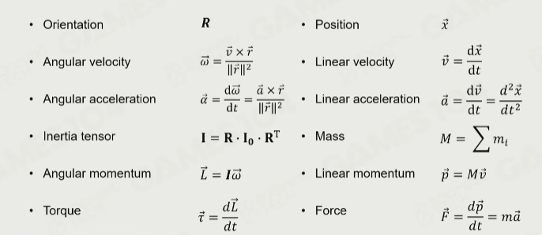
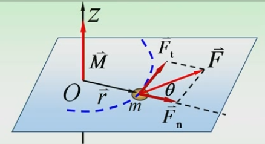
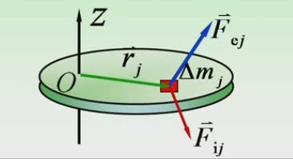
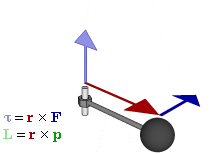
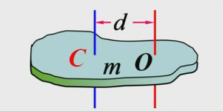
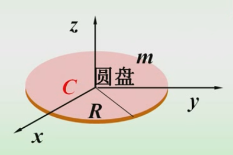
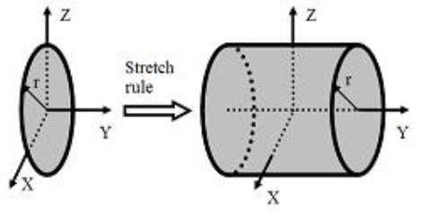
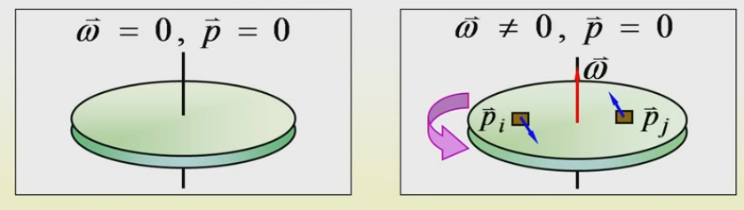
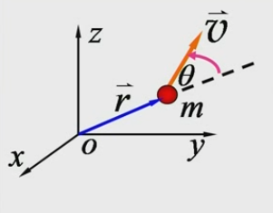
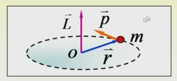

#! https://zhuanlan.zhihu.com/p/564852770
#  刚体动力学

### 总结
#### Angular Values vs. Linear Values

### 刚体
#### 转动惯量
**角速度:**
定义角速度为 $\omega=\frac{d \varphi}{d t}$ (其中 $\varphi$ 是弧度，即弧长除以半径)。

**质点转动惯量:**
设单个质点 $m$ 与转轴刚性连接, 角加速度为$\alpha$,有力矩$M$等于：

$$
\begin{aligned}
F_{\mathrm{t}} &=m a_{\mathrm{t}}=m r \alpha \\
M&=r F \sin \theta=r F_{\mathrm{t}}=m r^{2} \alpha\\
M&=m r^{2} \alpha
\end{aligned}
$$
定义: $I=m r^{2}$ 为质点 $m$ 对 $O$ 点的 “转动惯量”

**刚体的转动惯量：**

质量元受外力 $\vec{F}_{\mathrm{e} j}$, 内力 $\vec{F}_{\mathrm{i} j}$, **外力矩$M_{ej}$, 内力矩$M_{ij}$**
$$
\begin{aligned}
&M_{\mathrm{e} j}+M_{\mathrm{i} j} =\Delta m_{j} r_{j}^{2} \alpha\\
&\sum_{j} M_{\mathrm{e} j}+\sum_{j} M_{\mathrm{i} j}=\sum_{j} \Delta m_{j} r_{j}^{2} \alpha \\
&\because M_{i j}=-M_{j i} \quad \therefore \sum_{j} M_{i j}=0 \\
&\sum_{j} M_{\mathrm{e} j}=\left(\sum \Delta m_{j} r_{j}^{2}\right) \alpha\\
&I=\sum_j \Delta m_j r_j^2\\
\end{aligned}\\
$$
定义质量连续分布的刚体转动惯量$I$: (转动惯量的单位: $\mathrm{kg} \cdot \mathrm{m}^{2}$)
$$
\begin{aligned}
&I=\sum_{j} \Delta m_{j} r_{j}^{2}=\int r^{2} \mathrm{~d} m \\
&=\int_{V} r^{2} \rho \mathrm{d} V
\end{aligned}
$$

#### 刚体扭矩torque
定义： 
$$
\vec{\tau}=\vec{r} \times \vec{F}=\frac{d \vec{L}}{d t}
$$
如图所示：

**转动定律:**
* 也有这种表达：$\mathbf{M=I \alpha}$ 
* 有的教材是记成这样$\mathbf{M = J \alpha}$, 图形学中也有$\mathbf{\tau = I \alpha}$
* 刚体定轴转动的角加速度与它所受的合外力矩成正比, 与刚体的转动惯量成反比.

>Note: 
>* 转动惯量$I$是物体转动惯性的量度(转动惯性的大小)，质量 $m$ 是物体平动惯性的量度. 
>* 转动惯量是对某一转轴的

**平行轴定理:**
质量为 $m$ 的刚体, 如果对 其质心轴的转动惯量为 $J_{C}$, 则 对任一与该轴平行, 相距为 $d$ 的转轴的转动惯量为:

$$
J_{O}=J_{C}+m d^{2} \\
$$

**垂直轴定理:**
在物理学里，垂直轴定理（也叫“正交轴定理”）可以用来计算一片薄片的转动惯量。假设$O_{XYZ}$座标系统的 X-轴与 $Y$-轴都包含与平行于此薄片，而 Z-轴垂直于薄片的面。
*  $I_X$ 与 $I_Y$ 分别代表薄片对于 X-轴与 $Y$-轴的转动惯量
* 此刚体是一块很薄的薄片，厚度 $t$ 是均匀的，密度也是均匀的。

$$
\mathbf{I}_{z}=\mathbf{I}_{\mathbf{x}}+\mathbf{I}_{\mathbf{y}}\\
$$

公式推导如下: 
$$
\begin{aligned}
&I_X=\int\left(y^2+z^2\right) d m \\
&I_Y=\int\left(x^2+z^2\right) d m \\
&I_Z=\int\left(x^2+y^2\right) d m \\
\end{aligned}\\
$$
由于厚度超小于薄片的面尺寸，我们可以忽略 $z^2$ 对于积分的贡献. 因此，
$$
\begin{aligned}
&I_X \approx \int y^2 d m \\
&I_Y \approx \int x^2 d m\\
\end{aligned}\\
$$
所以: $I_Z=I_X+I_Y$

**伸展定则：**

在物理学里，伸展定则阐明，如果将一个物体的任何一点，平行地沿着一支直轴作任意大小的位移，则此物体对此轴的转动惯量不变。
* 将一个物体，平行于直轴地，往两端拉开。在物体伸展的同时，保持物体任何一点离直轴的垂直距离不变，则伸展定则阐明此物体对此轴的转动惯量不变。

如下图：

圆板对于 $Y$-轴的转动惯量 $I_Y$ 是 $\frac{1}{2} m r^2$ 。将圆板沿 Y-轴伸展成实心圆柱，其对于 $Y$-轴的转动惯量 $I_Y$ 仍旧是 $\frac{1}{2} m r^2$ 。

#### 角动量(动量矩)
角速度不为0时，物体总的动量仍然为0，所以描述刚体运动的时候不能再用动量这个概念了，因此引入角动量这个概念：

p是动量， E是动能：
* 质点运动描述 $\quad \vec{p}=m \vec{v}, \quad E_{\mathrm{k}}=m v^{2} / 2$
* 刚体定轴转动描述  $L=I \omega, \quad E_{\mathrm{k}}=I \omega^{2} / 2$

**定义：**
 
质量为 $m$ 的质点以速度 $\overrightarrow{\mathbf{U}}$ 在空间运动, 某时刻对 $\bf O$ 的位矢为： $\vec{r}$ 质点对$\bf O$ 的角动量定义为:
$$
\vec{L}=\vec{r} \times \vec{p}=\vec{r} \times m \vec{v} = I\vec{\omega}\\
$$
大小 $L=r m v \sin \theta$, $\vec{L}$ 的方向符合右手法则。

**质点的角动量定理:**
刚体的合外力矩$\vec{M}$（冲量矩）在$\Delta t$时间内的作用效果等于角动量的改变量。(作用于质点的合外力对参考点 $O$ 的力矩, 等于质点 对该点 $O$ 的角动量随时间的变化率。)
$$
\vec{M}=\frac{\mathrm{d} \vec{L}}{\mathrm{~d} t}\\
$$

#### 冲量矩（合外力矩）
定义：质点所受的冲量矩等于质点角动量的增量(即：若质点所受外力对某给定点 $O$ 的力矩为零, 则质点对 $O$ 点的角动量保持不变)。
记作$\Delta L$或者物理模拟中记作$J$:
$$
\Delta L  = \int_{t_{1}}^{t_{2}} M \mathrm{d}t = \vec{L}_{2}-\vec{L}_{1} \qquad or \qquad  J = \int_{t_{1}}^{t_{2}} I \mathrm{d}t  \\
$$
>Note: 可以类比质点运动中： 物体平动所受的外力等于其动量的变化率、物体平动动量的变化量 (冲量) 是力对时 间的累积效应。 $\left(F=\frac{d P}{d t} 、 \Delta P=\int_{t_1}^{t_2} F d t\right)$

#### 动能定理
我们可选择任意一个惯性参考系来考虑动能。一个物体原来静止，在受到作用力之后便加速。它所得到的动能是总共的作用力对它所做的功。
$$
W=\int \vec{F} \cdot d \vec{x}\\
$$
其中 $W$ 代表功， $\vec{F}$ 代表物体所受到的总共的作用力， $\vec{x}$ 代表物体的位移。

**质点动能：**
在经典力学，一个质点（一个很小的物体，它的大小基本可以忽略) 或者一个没有自转的刚体的动能、速率与质量的关系是:
$$
E_k=\frac{1}{2} m v^2\\
$$
其中 $E_k$ 代表动能， $m$ 代表质量及 $v$ 代表速率。

**自转的物体动能：**
如果一个物体自转，它便有自转动能。自转动能是它的每一质点的平移动能的和。
$$
E_r=\frac{1}{2} \int v^2 d m=\frac{1}{2} \int r^2 \omega^2 d m=\frac{1}{2} \omega^2 \int r^2 d m=\frac{1}{2} I \omega^2
$$
其中 $E_r$ 代表自转动能， $v$ 代表速率， $\omega$ 代表角速度， $m$ 代表质量及 $r$ 代表质点到旋转轴间的距离。

**刚体的转动动能定理:**
$$
W=\int_{\theta_1}^{\theta_2} M d \theta=\frac{1}{2} I \omega_2^2-\frac{1}{2} I \omega_1^2\\
$$
其中 $\int_{\theta_1}^{\theta_2} M d \theta$ 表示合外力的力矩 $M$ 在角位移 $\theta_2-\theta_1$上所做的功，$I$为刚体的转动惯量， $\omega$ 为刚体角速度。

#### 转动张量
**定义**： 在经典力学中，转动惯量又称惯性矩 (英语: Moment of inertia)，通常以 $I$ 表示，国际单位制为 $\mathrm{kg} \cdot \mathrm{m}^2$ 。转动惯量是一个物体对于其旋转运动的惯性大小的量度。一个刚体对于某转轴的转动惯量决定对于这物体绕着这转轴 进行某种角加速度运动所需要施加的力矩。
转动惯量在转动力学中的角色相当于线性动力学中的质量，描述角动量. 角速度、力矩和角加速度等数个量之间的关系。

**转动张量(Moment of inertia)**: 将刚体由角动量（动量矩）在三维下的形式有矢径：$\vec{r}=r_1 \overrightarrow{e_1}+r_2 \overrightarrow{e_2}+r_3 \overrightarrow{e_3}$, 和$\boldsymbol{E}=\boldsymbol{e}_1 e_1+e_2 e_2+e_3 e_3$ 为`单位张量`， $r r$ 为并矢:
$$
\mathbf{H}=\iiint_{\Omega} \mathbf{r} \times(\mathbf{\omega} \times \mathbf{r}) \mathrm{d} m=\iiint_{\Omega}\left(\mathbf{r}^2 \mathbf{E}-\mathbf{r} \mathbf{r}\right) \cdot \mathbf{\omega} \mathrm{d} m=\mathbf{I} \cdot \mathbf{\omega}\\
$$

惯量张量: 其实是在力学中学过的转动惯量概念,  是由固定轴到非固定轴的推广。
$$
\boldsymbol{I}=\iiint_{\Omega}\left(\boldsymbol{r}^2 \boldsymbol{E}-\boldsymbol{r} \boldsymbol{r}\right) \mathrm{d} m\\
$$
对于三维空间中任意一参考点 $O$ 与以此参考点为原点的直角坐标系 $O_{x y z}$, 由矢量分析知识可知惯性张量为二阶张量，投影到坐标系中可以得到惯性张量的分量矩阵为
$$
[\boldsymbol{I}]=\left[\begin{array}{ccc}
I_{x x} & -I_{x y} & -I_{x z} \\
-I_{y x} & I_{y y} & -I_{y z} \\
-I_{z x} & -I_{z y} & -I_{z z} \\
\end{array}\right] = 
\left[\begin{array}{ccc}
I_{x x} & I_{x y} & I_{x z} \\
I_{y x} & I_{y y} & I_{y z} \\
I_{z x} & I_{z y} & I_{z z}
\end{array}\right]\\
$$

这里矩阵的对角元素 $x_{x x} 、 I_{y y} 、 I_{z z}$ 分别为对于 $x$-轴、 $y$-轴、 $z$-轴的转动惯量。设定 $(x, y, z)$ 为微小质量 $d m$ 对于点 $O$ 的相对位置 则这些转动惯量以方程式定义为:
$$
\begin{aligned}
&I_{x x} \stackrel{\text { def }}{=} \int\left(y^2+z^2\right) d m \\
&I_{y y} \stackrel{\text { def }}{=} \int\left(x^2+z^2\right) d m \\
&I_{z z} \stackrel{\text { def }}{=} \int\left(x^2+y^2\right) d m\\
\end{aligned}\\
$$
矩阵的非对角元素，称为惯量积，以方程式定义为:
$$
\begin{aligned}
&I_{x y}=I_{y x} \stackrel{\text { def }}{=}-\int x y d m \\
&I_{x z}=I_{z x} \stackrel{\text { def }}{=}-\int x z d m \\
&I_{y z}=I_{z y} \stackrel{\text { def }}{=}-\int y z d m\\
\end{aligned}\\
$$

#### 参考资料
1. [【大学物理】](https://www.bilibili.com/video/BV1qW411H7UX?p=14&vd_source=1a163e481fb12c5b6ca8a57f994c1d73)
2. [Moment_of_inertia](https://en.wikipedia.org/wiki/Moment_of_inertia)
3. [转动惯量](https://zh.wikipedia.org/zh-sg/%E8%BD%89%E5%8B%95%E6%85%A3%E9%87%8F)
4. [Torque](https://en.wikipedia.org/wiki/Torque)