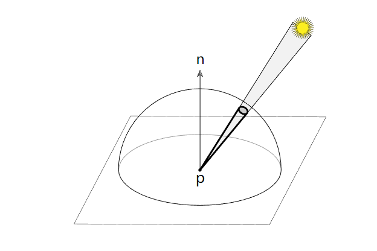
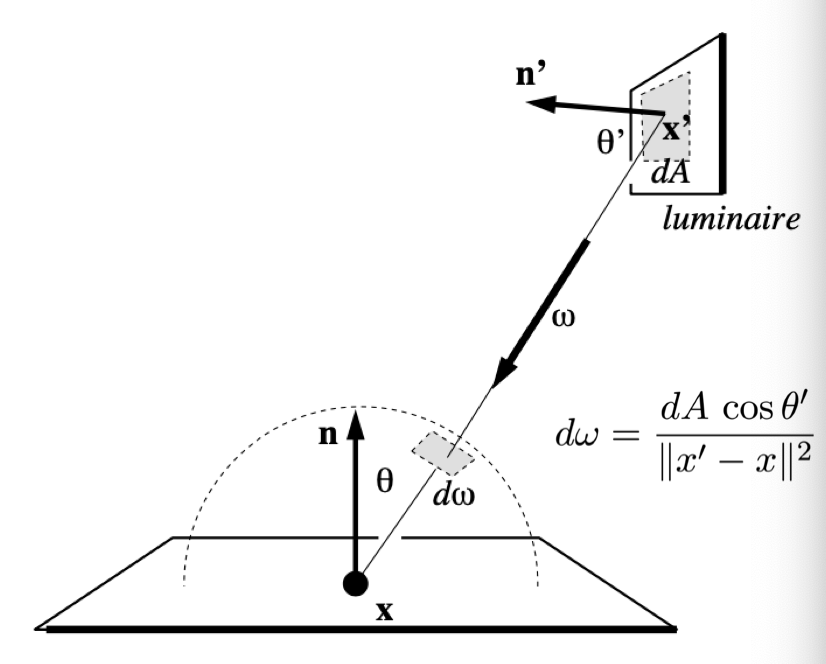
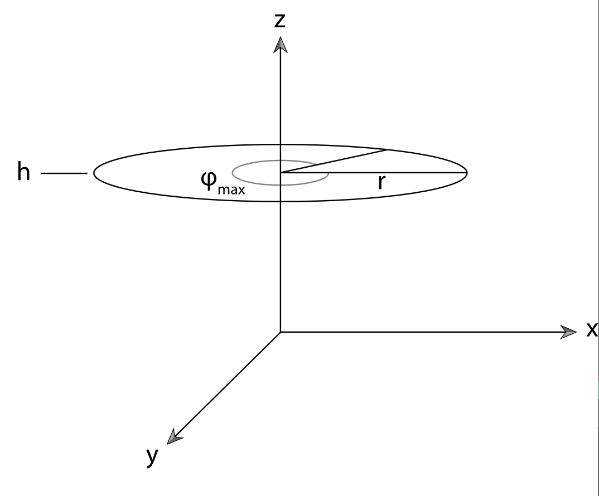

#! https://zhuanlan.zhihu.com/p/568205778
# PBRT 光线传输之光源采样

## overview


**光源重要性采样**： 

在下面场景中，考虑一个由小球面光源照明的漫反射表面：使用 BSDF 的采样分布的采样方向可能非常低效，更好的方法是使用基于光源的采样分布。上篇文章[光线传输之表面反射](https://zhuanlan.zhihu.com/p/555867858) 表面采样方法是采样例程可以仅从球体可能可见的那些方向中进行, 本节介绍 Light::Sample_Li()方法，选择该方法对灯光方向采样
* 一种是： 可能可见的那些方向（即shading表面方向随机采样）
* 另一种是 ； 对灯光方向采样。


Lights 必须实现两种采样方法。
* 第一个，Sample_Li()，对场景中某个点的入射方向进行采样，来自光的照明可能沿着该点到达。
* 第二个(双向光传输算法)，Light::Sample_Le()它返回离开光源的携带光线。两者都有相应的方法，分别返回入射方向或射线的 PDF。

Light::Sample_Li() 方法的声明：
```c++
virtual Spectrum Sample_Li(const Interaction &ref, const Point2f &u,Vector3f *wi, Float *pdf, VisibilityTester *vis) const = 0;
```
现在可以理解它的u和pdf参数的含义了：u提供了一个对光源进行采样的2D样本值，对选择的方向进行采样的PDF在*pdf中返回。

Light 的 Pdf_Li() 方法返回相对于立体角的概率密度，以便 Light 的 Sample_Li() 方法从参考点 ref 对方向 wi 进行采样。


## 对shapes光源采样 Sampling Shapes

给定参考点和方向$\omega_i$，Pdf() 方法确定来自方向$\omega_i$点的光线是否与形状相交。 如果光线根本不与形状相交，则可以假设形状选择方向的概率为 0。

为了计算相对于参考点$P_{d\omega}$的立体角的 PDF 值，该方法首先计算相对于表面积的 PDF。 从面积密度到立体角密度的转换需要除以因子：
$$
{\frac{\mathrm{d}\omega_{\mathrm{i}}}{\mathrm{d}A}}={\frac{\cos\theta_{\mathrm{o}}}{r^{2}}}\\
$$


渲染方程转化成对光源面积的积分：
$$
L_{o}(p,w_{o})=\int_{\Omega}L_{i}(p,w_{i})\;f_{r}(p,w_{i}, w_{o})\cos\theta\;\text{d}w_{i}\\
$$
此时有两种策略去计算以上的区域:
第一种： 对处于灯光区域的内立体角进行积分（即$\omega_i \in A$）,此时立体角的概率$pdf(\omega_j) = \frac{1}{\omega_j} = \frac{r^2}{\cos \theta_o \cdot A}$。
$$
\begin{align*}
    L_{o}(p,w_{o})&=\int_{\Omega_{(A)}}L_{i}(p,w_{i})\;f_{r}(p,w_{i}, w_{o})\cos\theta_i\;\text{d}w_{i}\\
    & \approx \frac{1}{N}\sum_{j = 1}^{N}\frac{L_{i}(p,w_{j})\;f_{r}(p,w_{o}, w_{j})\cos\theta_j}{p(\omega_j)}\\
    & \approx \frac{1}{N}\sum_{j = 1}^{N}\frac{L_{i}(p,w_{j})\;f_{r}(p,w_{o}, w_{j})\cos\theta_j}{\frac{r^2}{\cos \theta_o \cdot A}}\\
    & \approx \frac{A}{N}\sum_{j = 1}^{N}\frac{L_{i}(p,w_{j})\;f_{r}(p,w_{o}, w_{j})\cos\theta_j \cos \theta_o \cdot}{r^2}\\
\end{align*}\\
$$

第二种： 将积分区域转换到光源区域积分，此时灯光上点的采样概率$pdf(A) = \frac{1}{A}$ 。
$$
\begin{align*}
    L_{o}(p,w_{o})& = \int_{A}L_{i}(p,w_{i})\;f_{r}(p,w_{i}, w_{o})\cos\theta_i \frac{\mathrm{cos}\theta_{o}}{r^{2}}\text{d}A\\
    & \approx  \frac{1}{N}\sum_{j = 1}^{N}\frac{L_{i}(p,w_{j})f_{r}(p,w_{o},w_{j})\cos\theta_j \frac{\cos\theta_o}{r^{2}}}{p(A)}\\
    & \approx \frac{A}{N}\sum_{j = 1}^{N}\frac{L_{i}(p,w_{j})\;f_{r}(p,w_{o}, w_{j})\cos\theta_j \cos \theta_o \cdot}{r^2}\\
\end{align*}\\
$$
最后可以看到两种采样方式的就算结果是一致的。

```c++
Float Shape::Pdf(const Interaction &ref, const Vector3f &wi) const {
    // Intersect sample ray with area light geometry
    Ray ray = ref.SpawnRay(wi);
    Float tHit;
    SurfaceInteraction isectLight;
    // Ignore any alpha textures used for trimming the shape when performing
    // this intersection. Hack for the "San Miguel" scene, where this is used
    // to make an invisible area light.
    if (!Intersect(ray, &tHit, &isectLight, false)) return 0;

    // Convert light sample weight to solid angle measure
    Float pdf = DistanceSquared(ref.p, isectLight.p) / (AbsDot(isectLight.n, -wi) * Area());
    if (std::isinf(pdf)) pdf = 0.f;
    return pdf;
}
```
## 对圆盘光源采样 Sampling Disks

圆盘采样法利用同心圆盘采样函数在单位圆盘上找到一个点，然后对该点进行缩放和偏移，使其位于给定半径和高度的圆盘上。 请注意，由于 Disk::innerRadius 不为零或 Disk::phiMax 小于 ，因此此方法不考虑部分磁盘。 修复这个错误留待本章最后的练习。

因为采样点的对象空间值等于 Disk::height，所以可以将零范围界限用于离开采样点的光线的误差界限，就像光线与磁盘的交点一样。 （但是，这些边界可能会在以后通过对象到世界的转换来扩展。）


```c++
Interaction Disk::Sample(const Point2f &u, Float *pdf) const 
{
    Point2f pd = ConcentricSampleDisk(u);
    Point3f pObj(pd.x * radius, pd.y * radius, height);
    Interaction it;
    it.n = Normalize((*ObjectToWorld)(Normal3f(0, 0, 1)));
    if (reverseOrientation) it.n *= -1;
    it.p = (*ObjectToWorld)(pObj, Vector3f(0, 0, 0), &it.pError);
    *pdf = 1 / Area();
    return it;
}
```

## 对三角形光源采样 Sampling Triangles
具体推导参考[对三角形采样](https://zhuanlan.zhihu.com/p/552773776)
```c++
Interaction Triangle::Sample(const Point2f &u) const
{
    Point2f b = UniformSampleTriangle(u);
    // <<Get triangle vertices in p0, p1, and p2>> 
    Interaction it;
    it.p = b[0] * p0 + b[1] * p1 + (1 - b[0] - b[1]) * p2;
    // <<Compute surface normal for sampled point on triangle>> 
    // <<Compute error bounds for sampled point on triangle>> 
    Point3f pAbsSum = Abs(b[0] * p0) + Abs(b[1] * p1) +
                        Abs((1 - b[0] - b[1]) * p2);
    it.pError = gamma(6) * Vector3f(pAbsSum);
    return it;
}
```

## 对球体光源采样 Sampling Spheres

具体参考:[圆锥光源采样](https://zhuanlan.zhihu.com/p/552773776)


### 参考资料
1. [Sampling Light Sources](https://www.pbr-book.org/3ed-2018/Light_Transport_I_Surface_Reflection/Sampling_Light_Sources)