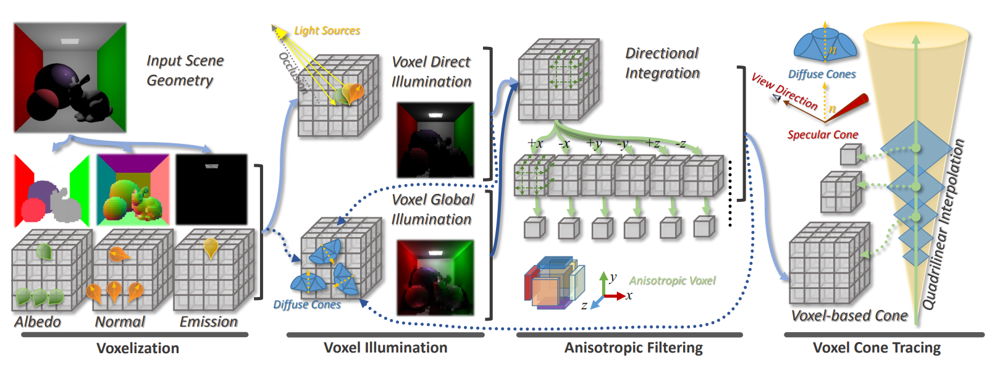
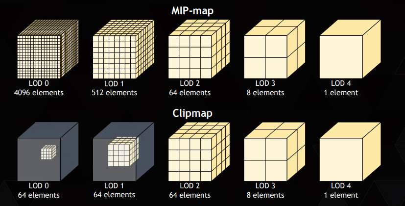
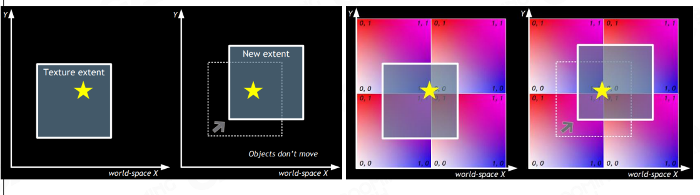
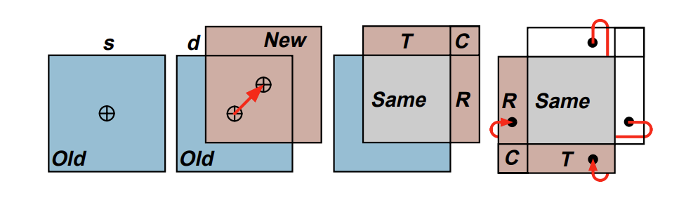
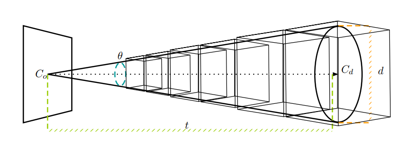

#! https://zhuanlan.zhihu.com/p/579696507
# VXGI 笔记

## 概览
four steps approach for the deferred voxel shading for global illumination.



## GPU 体素化的基础知识
GPU Voxelization 的基本概念是使用 GPU 着色器将由三角形网格组成的场景转换为规则的体素网格表示。 


## 带着问题去学习
### 1. 如何对整个场景进行体素化？
首先分成不同的层级，找到这个层级的boundingbox，对这个boudingbox内的物体进行体素化。 由视点相机到外部逐渐扩大层级。


### 2. 如何将光照信息注入到体素？
* 首先需要知道的是：每个voxel存储的是 radiance。给voxel注入光照信息其实就是计算每个voxel 的直接光照（DIRECT ILLUMINATION）。
* 存储单元是一个RGBA值，RGB部分代表这个体素的radiance，A部分代表这个体素的遮挡程度,即opacity值（用于后面的光照计算）。

代码如下：
```c
{
    vec4 color = u_color;
    
    if (u_hasDiffuseTexture > 0.0)
    {
        lod = log2(float(textureSize(u_diffuseTexture0, 0).x) / u_clipmapResolution);
        color = textureLod(u_diffuseTexture0, In.uv, lod);
    }
    
    vec3 normal = normalize(In.normalW);
    
    vec3 lightContribution = vec3(0.0);
    for (int i = 0; i < u_numActiveDirLights; ++i)
    {
        float nDotL = max(0.0, dot(normal, -u_directionalLights[i].direction));
        
        float visibility = 1.0;
        if (u_directionalLightShadowDescs[i].enabled != 0)
        {
            visibility = computeVisibility(in_cvFrag.posW, u_shadowMaps[i], u_directionalLightShadowDescs[i], u_usePoissonFilter, u_depthBias);
        }
        
        lightContribution += nDotL * visibility * u_directionalLights[i].color * u_directionalLights[i].intensity;
    }
    
    if (all(equal(lightContribution, vec3(0.0))))
        discard;
    
    vec3 radiance = lightContribution * color.rgb * color.a;
    radiance = clamp(radiance, 0.0, 1.0);
    
    ivec3 faceIndices = computeVoxelFaceIndices(-normal);
    storeVoxelColorAtomicRGBA8Avg(u_voxelRadiance, in_cvFrag.posW, vec4(radiance, 1.0), faceIndices, abs(normal));
}
```


### 3. 体素化如何支持场景动态更新？




### 4. 如何去做间接光的渲染？
voxel cone tracing


##### 计算cone tracing过程中的遮挡：
$$
\text { Irradiance }=\sum \text { Emittance }_i\left(\frac{\text { ConeFactor }}{\text { SampleSize }}\right)^2 \prod_0^i\left(1-\text { Opacity }_k\right)^{\text {t.Step} \times \text{opacityCorrectionFactor} }  \\ 
$$


### 参考资料

1. [Deferred Voxel Shading for Real Time Global Illumination] (https://github.com/jose-villegas/VCTRenderer#voxel-illumination)
2. [The Clipmap: A Virtual Mipmap] (https://dl.acm.org/doi/pdf/10.1145/280814.280855)
3. [VoxelConeTracingGI] (https://github.com/compix/VoxelConeTracingGI)