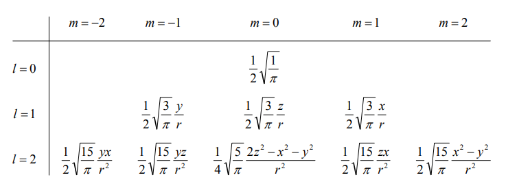
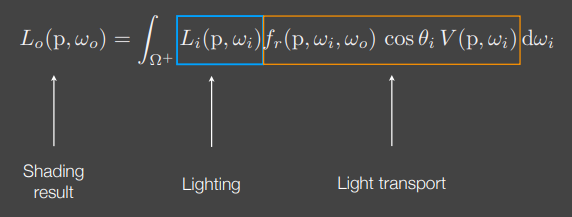
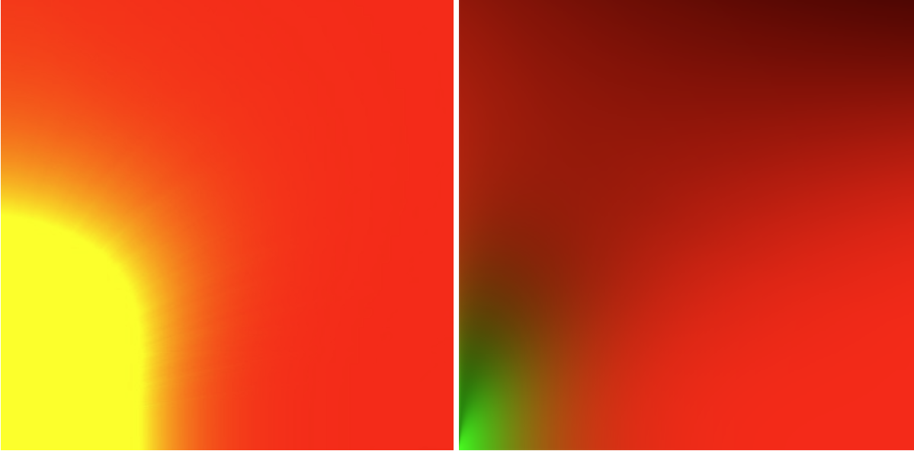
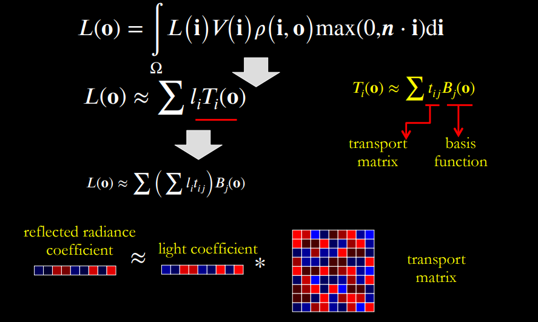

#! https://zhuanlan.zhihu.com/p/577123149
# 球谐光照笔记

## 数学细节

**前置知识：**

通过理解傅里叶变换（参考以前文章[傅里叶变换推导](https://zhuanlan.zhihu.com/p/546428695)）了解函数如何从时域信号转化到频域信号。

#### 环境光照：

* 在环境光照下， environment map可以看作无限远，那么对于任何shading point就相等于处于中心位置了。 所以着色过程与着色点的位置，只与着色点的法线相关。
* environment lighting过程可以看成**参数为 $w_i$ 的球面函数**。而球谐函数本质上把**整个environment map的lighting作为原函数$f(p,w_i)$**（p可以忽略）。 以各个shading point中心，预计算好各个shading point的球谐系数。 然后在render过程中，通过预先计算好的各个shading point的球谐系数和球谐基函数线性组合恢复原函数$f(p,w_i)$。 因为环境光照低频的性质，所以就可以很好的用低阶的球协函数表示原始lighting函数

## 一. 预计算过程
### 球谐函数
球谐函数是球坐标下三维空间拉普拉斯方程的角度部分的解，构成一组完备的基组。球谐函数可以表达为:  
* $Y_l^m(\theta, \phi)=\sqrt{\frac{(l-m) !}{(l+m) !} \frac{(2 l+1)}{4 \pi}} P_l^m(\cos \theta) e^{i m \phi}$。
* 或者：$Y_{l, m}(\theta, \phi)=N_{l, m} P_{l, m}(\cos \theta) \exp (\operatorname{Im} \phi)$。

##### SH投影过程：
* 将environment lighting函数$f(w_i) = f(p,w_i)$ 投影（点乘）到 SH 系数的过程
$$
l_l^m=\int_{\Omega} f(w_i) Y_l^m(w_i) d w_i\\
$$

##### 函数重建：
* 重构environment lighting函数, 由球谐函数展开有：
$$
\begin{aligned}
f(w_i) &=\sum_{l=0}^{\infty} \sum_{m=-l}^l l_l^m Y_l^m(w_i) =\sum_{i=0}^N l_i Y_i(w_i)
\end{aligned}\\
$$

其中$i$代表阶数， $m$代表在其阶中m序号基函数。 其中 $i=l *(l+1)+m, N=l^2, l_l^m$ 为常数也叫做球谐系数.
#### 球谐基函数

##### 笛卡尔坐标系：
球谐函数在笛卡尔坐标系下($r=\sqrt{x^2+y^2+z^2}$ (n.b. usually $r=1$ ))的表示：


##### 极坐标系：
为了便于计算将笛卡尔坐标系转换成球面坐标系$p(x, y, z) \longrightarrow p(\sin \theta \cos \varphi, \sin \theta \sin \varphi, \cos \theta)$

球谐基函数 SH_Basis用 $y$ （球谐基函数其实就是Legendre多项式）。表示如下：
$$
y_i(\theta, \varphi) = y_l^m(\theta, \varphi)= \begin{cases}\sqrt{2} K_l^m \cos (m \varphi) P_l^m(\cos \theta), & m>0 \\ \sqrt{2} K_l^m \sin (-m \varphi) P_l^{-m}(\cos \theta), & m<0 \\ K_l^0 P_l^0(\cos \theta), & m=0\end{cases}
$$
* 其中有：$K_l^m=\sqrt{\frac{(2 l+1)}{4 \pi} \frac{(l-|m|) !}{(l+|m|) !}}$。
* 考虑 l 为非负整数的情况，Legendre多项式： $P_l(x)=\frac{1}{2^l} \sum_{s=0}^{[l / 2]} \frac{(-1)^s(2 l-2 s) !}{s !(l-s) !(l-2 s) !} x^{l-2 s}$ （实际是递归定义的）, 低阶有已经预计算好的。

球谐函数在极坐标系的代码如下：
```c++
double P(int l, int m, double x)
{
	// evaluate an Associated Legendre Polynomial P(l,m,x) at x 
	double pmm = 1.0;
	if (m > 0)
	{
		double somx2 = sqrt((1.0 - x) * (1.0 + x));
		double fact = 1.0;
		for (int i = 1; i <= m; i++)
		{
			pmm *= (-fact) * somx2;
			fact += 2.0;
		}
	}
	if (l == m) return pmm;
	double pmmp1 = x * (2.0 * m + 1.0) * pmm;
	if (l == m + 1) return pmmp1;
	double pll = 0.0;
	for (int ll = m + 2; ll <= l; ++ll)
	{
		pll = ((2.0 * ll - 1.0) * x * pmmp1 - (ll + m - 1.0) * pmm) / (ll - m);
		pmm = pmmp1;
		pmmp1 = pll;
	}
	return pll;
}
double K(int l, int m)
{
	// renormalisation constant for SH function 
	double temp = ((2.0 * l + 1.0) * factorial(l - m)) / (4.0 * PI * factorial(l + m));
	return sqrt(temp);
}
double SH(int l, int m, double theta, double phi)
{
	// return a point sample of a Spherical Harmonic basis function 
	const double sqrt2 = sqrt(2.0);
	if (m == 0) return K(l, 0) * P(l, m, cos(theta));
	else if (m > 0) return sqrt2 * K(l, m) * cos(m * phi) * P(l, m, cos(theta));
	else return sqrt2 * K(l, -m) * sin(-m * phi) * P(l, -m, cos(theta));
}
```

#### 球谐函数的特性
**标准正交性：**  这意味着如果我们对 i 和 j 的任何一对积分，如果i=j，计算将返回1，如果i≠j，则返回0 :
$$
\begin{aligned}
&\int_{\Omega} Y_i(x) \cdot Y_j(x) \mathrm{d}x= 1 \quad(i = j) \\
&\int_{\Omega} Y_i(x) \cdot Y_j(x) \mathrm{d}x= 0 \quad(i \neq j)
\end{aligned}
$$

**旋转不变性：** 传入的光照自变量，在被旋转之后再传入SH函数，可以表示成旋转可分离的计算形式。也是旋转不变的，有一个定义在单位球面上的原函数： $g(\mathbf{s})=R(f(\mathbf{s}))$ ，如果函数 $\mathrm{g}$ 是函数 $\mathrm{f}$ 的旋转副本， 那么在SH投影之后:
$$
\tilde{g}(s)=\tilde{f}(R(s))
$$

#### 球谐系数的计算
求解球谐系数需要将半球积分转换成二重积分。
$$
l_l^m=\int_{\Omega} f(w_i) Y_l^m(w_i) d w_i = \int_0^{2 \pi} \int_0^\pi f(\theta, \varphi) \sin Y_l^m(w_i) \theta d \theta d \phi\\
$$
整个environment map的球谐系数计算，pseudo code如下：
方法一： 使用蒙特卡洛方法求解：
```c++
void SH_project_polar_function(SH_polar_fn fn, const SHSample samples[], double result[])
{
    const double weight = 4.0 * PI;
    double factor = weight / n_samples;
    // for each sample
    for (int i = 0; i < n_samples; ++i)
    {
        double theta = samples[i].sph.x;
        double phi = samples[i].sph.y;
        for (int n = 0; n < n_coeff; ++n)
        {
            result[n] += fn(theta, phi) * samples[i].coeff[n] * factor;
        }
    }
}
```
方法二： 直接暴力计算整个球面
```c++
dw = pixelArea \\立体角就是单位球的面积;
for(pixel &SimplieP : EnivromnentMap)
    Coefs_i += SimplieP.color * Y_i(normalise(SimplieP.position)) * dw;
```

>Note: 
>* 图像SH系数计算：需要将图像的RGB三通道提取出来，然后求各自的球谐系数

## 二. Lighting & Light transport

将渲染方程拆分为Lighting和Light transport 两个部分，如图所示：
 


将Lighting函数和Light transport函数都投影到SH系数中，那么**正交性**： 有且仅有 $\mathrm{i}==\mathrm{j}$ 的时候 $\int_{\Omega} Y_i(w) Y_j(w) d w$ 才为 1 ，其余都为 0 。
#### Diffuse光照
在diffuse光照环境下，注意 $L_i(p, \omega_i)$ 与**着色点**相关, 有如下公式：
$$
\begin{aligned}
E(p) &=\int_{\Omega^{+}} L_i\left(\mathrm{p}, \omega_i\right) \cos \theta_i V\left(\mathrm{p}, \omega_i\right) \mathrm{d} \omega_i \\
&=\int_{\Omega}\left(\sum_{i=0} l_i Y_i(w)\right) \cdot\left(\sum_{j=0} t_j Y_j(w)\right) dw   \qquad \{\text{light和lighttransport由球谐函数表示}\}\\
&=\sum_{i = 0}^n \sum_{j = 0}^n l_i t_j \int_{\Omega^{+}} Y_i(w) Y_j(w)\mathrm{d} \omega_i \\
&=\sum_{i = 0}^n l_i t_j \qquad \text{\{由球谐函数正交性得到\}} \\
L_o\left(\mathrm{p}, \omega_0\right)  & = \frac{\rho}{\pi} E(p) = \frac{\rho}{\pi} \sum_{i = 0}^n l_i t_j\\
\end{aligned}\\
$$
>Note：
>* 两个函数的乘积的积分等于它们各自的球谐系数向量的点积。
>* $\rho = Albedo$
>* 取$(l \leq 2)$基函数，由于基函数计算了 9 个数字，因此预过滤步骤需要 O(9S) 时间，其中 S 是环境图的大小（像素总数）。 相比之下，计算辐照度环境贴图纹理的标准方法需要 O(T·S) 时间，其中 T 是辐照度环境贴图中的纹素数。 因此，预过滤方法将快大约 T /9 倍 （引用论文《An Efficient Representation for Irradiance Environment Maps》数据）。

##### 改进Diffuse
**存在的问题：** 在上面的公式中，还需要预计算出light transport函数 $t_l^m$， 当**着色点法线方向**改变的时候就需要重新做预计算。
**改进：**  改进的算法不需要再对针对每个着色点的入射方向预计算球谐系数 $t_l^m$ 。具体推导参考文章《On the relationship between radiance and irradiance: determining the illumination from images of a convex Lambertian object》。 此时iradiance 与具体的着色点无关$E$。 得到如下表达式：
$$
\begin{aligned}
E(\mathrm{N_{normal}}) &= \int_{\Omega} L\left(\omega_i\right) n \cdot \omega_i d w_i\\
&= \int_{\Omega} L\left(R^{\alpha, \beta, \gamma}(w_i^{\prime})\right) n \cdot \omega_i d w_i \\
&= \int_{\Omega} \left[\sum_{l=0}^{\infty} \sum_{m=-l}^l L_l^m \sqrt{\frac{4 \pi}{2 l+1}} Y_l^m(n) Y_l^0(w_i^{\prime}) \right] n \cdot \omega_i d w_i \\
&= \int_{\Omega} \left[\sum_{l=0}^{\infty} \sum_{m=-l}^l L_l^m \sqrt{\frac{4 \pi}{2 l+1}} Y_l^m(n) Y_l^0(w_i^{\prime}) \right] \sum_{k=0}^{\infty} t_k Y_k^0\left(w_i^{\prime}\right) d w_i^{\prime} \\
&= \sum_{l=0}^{\infty} \sum_{k=0}^{\infty} \sum_{m=-l}^l \sqrt{\frac{4 \pi}{2 l+1}} L_l^m t_l Y_l^m(n) \int_{\Omega} Y_l^0\left(w_i^{\prime}\right) Y_k^0\left(w_i^{\prime}\right) d w_i^{\prime} \\
&=\sum_{l=0}^{\infty} \sum_{m=-l}^l \sqrt{\frac{4 \pi}{2 l+1}} L_l^m t_l Y_l^m(n)\\
& = \sum_{l=0}^{\infty} \sum_{m=-l}^l \sqrt{\frac{4 \pi}{2 l+1}} A_l \, l_l^m  Y_l^m(\mathrm{N_{normal}})\\
& =\sum_{l, m} \hat{A}_l \, l_l^m Y_{l m}(\mathrm{N_{normal}})\\
\end{aligned}\\
$$
其中有：$\hat{A}_l=2 \pi \frac{(-1)^{\frac{l}{2}-1}}{(l+2)(l-1)}\left[\frac{l !}{2^l\left(\frac{l}{2} !\right)^2}\right]$
>Note:
>* 辐照度只是表面法线坐标(归一化)的二次多项式。因此，在 $\mathbf{n}^t=(x, y, z, 1)$ 的情况下，可以写: 
$$E(\mathbf{n})=\mathbf{n}^t M \mathbf{n}\\$$
>* 每个像素颜色都对应各自无关的 对称矩阵 $M$. 
>* 由于 $A$ 没有方位角依赖性，所以 $m = 0$ 并且我们只使用 $l$ 索引
>* 其中预计算好的数值：$\hat{A}_0= \pi \quad \hat{A}_1= \frac{2}{3}\pi \quad \hat{A}_2=\frac{1}{4}\pi \quad \hat{A}_3=0 \quad \hat{A}_4=-0.130900 \quad \hat{A}_5=0 \quad \hat{A}_6=0.049087$

#### Glossy光照

##### 前置数学知识：
微积分中几个重要的不等式：Schwarz不等式 和 Minkovski不等式
设 $f(x)$ 和 $g(x)$ 在 $[a, b]$ 上都可积, 有不等式:
* (1) (Schwarz 不等式) 
$$\left[\int_a^b f(x) g(x) \mathrm{d} x\right]^2 \leqslant \int_a^b f^2(x) \mathrm{d} x \cdot \int_a^b g^2(x) \mathrm{d} x\\$$
* (2) Minkowski 不等式
$$
\left\{\int_a^h[f(x)+g(x)]^2 \mathrm{~d} x\right\}^{\frac{1}{2}} \leqslant\left\{\int_a^h f^2(x) \mathrm{d} x\right\}^{\frac{1}{2}}+\left\{\int_a^b g^2(x) \mathrm{d} x\right\}^{\frac{1}{2}}\\
$$

**对于积分约等式：**
$$
\int_{\Omega} f(x) g(x) \mathrm{d} x \approx \frac{\int_{\Omega} f(x) \mathrm{d} x}{\int_{\Omega} \mathrm{d} x} \cdot \int_{\Omega} g(x) \mathrm{d} x \\
$$
成立的前置条件为：**函数$f(x)$的积分区域非常小且集中； 或者 函数 $g(x)$ 函数在积分区域的数值非常平滑。**

##### Glossy 反射
对于光滑部分的反射，可以观察到：**brdf光滑，反射波瓣的区域小且集中，符号约等式条件。**
所以有：
$$
\begin{aligned}
L_o(\mathrm{p}, \omega_0) &=\int_{\Omega^{+}} L_i\left(\mathrm{p}, \omega_i\right) f_r\left(\mathrm{p}, \omega_i, \right) \cos \theta_i \mathrm{d} \omega_i \\
&=\int_{\Omega^+} L(\mathrm{p}, \omega_i) \mathrm{n \cdot v} \mathrm{d} w_i * \int_{\Omega^+} f_r(\mathrm{p}, w_i, w_o) \mathrm{d} w_i  \\
&= \sum_{l, m} \hat{A}_l \, l_l^m Y_{l m}(\mathrm{n}) * \int_{\Omega^+} f_r(\mathrm{p}, w_i, w_o) \mathrm{d} w_i 
\end{aligned}\\
$$
其中glossy BRDF 有两种预计算方式：

**一.使用LUT图:** 

形成一个以 粗糙度 $\alpha$ 和 视角$\bf l$ 的2d纹理贴图（注意这里和IBL的lut图有区别）。
$$
\begin{aligned}
\int_{\Omega^+} f_r(\mathrm{p}, w_i, w_o) \mathrm{d} w_i 
&= \int_{\Omega^+} \frac{ D(\mathrm{n,h,\alpha})G(\mathrm{n, v, l, \alpha})F(\mathrm{h, v,f_0}) }{4 \mathrm{(v \cdot n)(l \cdot n)}} \mathrm{d}\omega_i\\	
&= \int_{\Omega^+} \frac{ D(\mathbf{\alpha}, \mathrm{\omega_h})G(\mathbf{\alpha},\mathrm{n},\mathbf{v, l})F(\mathrm{h}, \mathbf{v}, \mathbf{f_0}) }{4 \mathrm{\cos{\theta_o} \cos{\theta_i}}}  \mathrm{d}\omega_i\\
&= \text{sample by } \omega_i \quad pdf(\omega_i)=\frac{\cos \theta_h}{4(\omega_h \cdot \omega_i)} D({\omega}_h) \\
&\approx \frac{1}{N}\sum_{k = 1}^N \frac{ D(\mathbf{\alpha}, \mathrm{\omega_h})G(\mathbf{\alpha},\mathrm{n},\mathbf{v, l_k})F(\mathrm{h}, \mathbf{v}, \mathbf{f_0})}{4\cos{\theta_o} \cos{\theta_i} pdf(\mathbf{l_k}) } \\	
&\approx \frac{1}{N}\sum_{k = 1}^N \frac{ G(\mathbf{\alpha},\mathrm{n},\mathbf{v, l})F(\mathrm{h}, \mathbf{v}, \mathbf{f_0}) (\omega_h \cdot \omega_i)}{ \cos{\theta_o} \cos{\theta_h}pdf(\mathbf{l_k})} \\	
&\approx \mathbf{f_0} \frac{1}{N}\sum_{k = 1}^N  \frac{f(\mathbf{\alpha, \mathbf{v},\mathbf{l_k}})}{pdf(\mathbf{l_k})} \\
&\approx \mathbf{f_0} \frac{1}{N}\sum_{k = 1}^N f(\mathbf{\alpha, \cos{\theta_o}}) \\
\end{aligned}\\
$$
>Notices:
>* 在预计算过程中，入射角$\bf l$ 是通过随机采样$\mathrm{\omega_h}$（一般使用重要性采样）得到的
>* 在等式中，取法线 $\mathrm{n} = vec3(0.0, 0.0, 1.0)$ 朝向z轴归一化。 那么变量就只有 $\cos{\theta_o}$
>* 函数基于微表面模型:  $\omega_i  \quad \omega_o , \quad \omega_h$

**重要性采样**：概率密度函数可选用与被积函数的分布一致可以达到高效的采样,参考[重要性采样](https://zhuanlan.zhihu.com/p/553388212)：
* 因为被积函数是关于 $\omega_i$ 的积分函数， 所以选用的概率密度函数需要由微平面法相分布 $\omega_h$ 转化成微平面入射光 $\omega_i$ 分布：
* 由[The Torrance–Sparrow Model](https://zhuanlan.zhihu.com/p/554905095)可知 : $\frac{\mathrm{d} \omega_{\mathrm{h}}}{\mathrm{d} \omega_{\mathrm{o}}} = \frac{1}{4(\mathrm{\omega_i} \cdot \mathrm{\omega_h})}$， 由根据法线分布函数的定义有：$\int_{\mathcal{H}^2} \cos \theta_h D\left({\omega}_h\right) \mathrm{d} {\omega}_h=1$。 
$$
\int_{\mathcal{H}^2} \frac{\cos \theta_h}{4\left(\omega_h \cdot \omega_i\right)} D\left({\omega}_h\right) \mathrm{d} {\omega}_i=1 \Longrightarrow
p d f\left(\omega_i\right)=\frac{\cos \theta_h}{4(\omega_h \cdot \omega_i)} D({\omega}_h)\\
$$

代码如下：
```c
vec2 IntegrateBRDF(float NdotV, float roughness)
{
    vec3 V;
    V.x = sqrt(1.0 - NdotV*NdotV);
    V.y = 0.0;
    V.z = NdotV;

    float A = 0.0;
    float B = 0.0; 

    vec3 N = vec3(0.0, 0.0, 1.0);
    
    const uint SAMPLE_COUNT = 1024u;
    for(uint i = 0u; i < SAMPLE_COUNT; ++i)
    {
        // generates a sample vector that's biased towards the
        // preferred alignment direction (importance sampling).
        vec2 Xi = Hammersley(i, SAMPLE_COUNT);
        vec3 H = ImportanceSampleGGX(Xi, N, roughness);
        vec3 L = normalize(2.0 * dot(V, H) * H - V);

        float NdotL = max(L.z, 0.0);
        float NdotH = max(H.z, 0.0);
        float VdotH = max(dot(V, H), 0.0);

        if(NdotL > 0.0)
        {
            float G = GeometrySmith(N, V, L, roughness);
            float G_Vis = (G * VdotH) / (NdotH * NdotV);
            float Fc = pow(1.0 - VdotH, 5.0);

            A += (1.0 - Fc) * G_Vis;
            B += Fc * G_Vis;
        }
    }
    A /= float(SAMPLE_COUNT);
    B /= float(SAMPLE_COUNT);
    return vec2(A, B);
}
```
二：**使用球谐函数与计算出系数：**
核心思想和diffuse一样，只不过和diffuse光照不同的地方在于：
* diffuse光照： 取入射光方向 $\omega_i$ 为球谐函数的变量。
* glossy光照：需要取入射光 $\omega_i$ 和观察方向 $\omega_o$ 两个变量。

参考[【GAMES202-高质量实时渲染】](https://www.bilibili.com/video/BV1YK4y1T7yY?p=7&share_source=copy_web&vd_source=e84f3d79efba7dc72e6306f35613222e) 

>Note:
>* 对于每个$\omega_o$应该能计算出一个系数, $L_o$和$L_i$的向长度应该都是系数$l, t$ 的数量（或者基函数数量）

### Diffuse Interreflected Transfer
todo...


### 参考资料

1. [Spherical Harmonic Lighting: The Gritty Details] (http://www.cse.chalmers.se/~uffe/xjobb/Readings/GlobalIllumination/Spherical%20Harmonic%20Lighting%20-%20the%20gritty%20details.pdf)
2. [球谐函数] (https://zh.wikipedia.org/wiki/%E4%BC%B4%E9%9A%8F%E5%8B%92%E8%AE%A9%E5%BE%B7%E5%A4%9A%E9%A1%B9%E5%BC%8F)
3. [勒让德多项式](https://wuli.wiki//online/Legen.html)
4. [An Efficient Representation for Irradiance Environment Maps] (https://cseweb.ucsd.edu/~ravir/papers/envmap/envmap.pdf)
5. [On the relationship between radiance and irradiance: determining the illumination from images of a convex Lambertian object] (https://cseweb.ucsd.edu/~ravir/papers/invlamb/josa.pdf)
6. [【GAMES202-高质量实时渲染】] (https://www.bilibili.com/video/BV1YK4y1T7yY?p=7&vd_source=1a163e481fb12c5b6ca8a57f994c1d73)
7. [微积分中几个重要的不等式] (https://blog.csdn.net/meilikafei/article/details/52802310)