#! https://zhuanlan.zhihu.com/p/559732914
# Games103 刚体模拟

**最终效果**
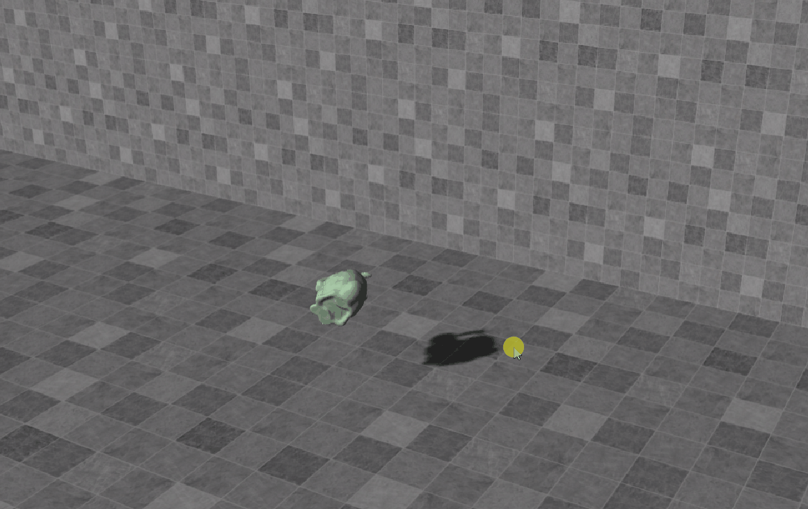
## 作业基本任务 
**位置更新：**
* 在 Update 函数中，通过 Leapfrog 积分实现位置和方向的更新。 
* 因为是使用leapforg积分，所以位置的更新依赖计算出下一帧的速度和角速度。
```c++
    void Update()
    {
        //计算出V_1和W_1.
        ...
        Vector3 x_1 = x_0 + dt * V_1;
        //Update angular status ,将角速度的变化量转换成四元数相乘。
        Quaternion q_w = new Quaternion(dt * W_1.x / 2, dt * W_1.y / 2, dt * W_1.z / 2, 0.0f);
        Quaternion q_1 = QuatAdd(q_0, q_w * q_0);
    }
```

**速度更新：**
* 计算重力并用它来更新速度。为了产生阻尼效应，可以将速度乘以线性和角度衰减因子：$\mathbf{v}=c^{linear\_decay} \mathbf{v}$ and $\mathbf{\omega}=c^ {angular\_decay} \mathbf{\omega}$。鉴于引力是唯一的力，无需计算扭矩或更新角速度。现在，在发射兔子后，应该会看到兔子在飞行和旋转（具有一些初始角速度）！
```c++
    void Update()
    {
            //calculate torque or to update the angular velocity
            Vector3 F_gravity = new Vector3(0.0f, -mass * gravity, 0.0f);
            V_1 = v + F_gravity / mass * dt;
            V_1 *= linear_decay; //To produce damping effects ， 如果是基于物理的模拟应该是建立f(x,v)的函数来计算力。这里直接使用decay来模拟。
            W_1 = w * angular_decay;
    }
``` 

**碰撞检测：**
* 在碰撞脉冲函数中，计算每个网格顶点的位置和速度。使用它们来确定顶点是否与地板发生碰撞。如果是这样，将其添加到总和中，然后计算所有碰撞顶点的平均值。 
```c++
    void Collision_Impulse(Vector3 P, Vector3 N)
    {
        Vector3 Rr_Sum_collision = new Vector3(0, 0, 0);
        Vector3 V_Sum_Collision = new Vector3(0, 0, 0);

        Mesh mesh = GetComponent<MeshFilter>().mesh;
        Vector3[] vertices = mesh.vertices;
        //transform是世界坐标系下,x_i是在模型坐标系下。得到模型的平移向量和旋转向量
        Matrix4x4 R = Matrix4x4.Rotate(transform.rotation);
        Vector3 X_center = transform.position;

        uint counter = 0;
        //碰撞检测，采用比较初级的检测算法：直接遍历每个点,判断是否有点在平面内部
        for (int i = 0; i < vertices.Length; i++)
        {
            //Vector3 Vertice_i = vertices[i];
            Vector3 R_ri = R.MultiplyPoint(vertices[i]);
            Vector3 X_i = X_center + R_ri;
            //sdf求解
            if (Vector3.Dot(X_i - P, N) < 0.0f)
            {
                //𝐯𝑖 ⟵ 𝐯 + 𝛚_1 × 𝐑𝐫i  
                Vector3 V_i = V_1 + Vector3.Cross(W_1, R_ri);
                //判断速度方向是向平面内运动还是向外运动。如果是内则需要计算碰撞。
                if (Vector3.Dot(V_i, N) < 0)
                {
                    Rr_Sum_collision += R_ri;
                    V_Sum_Collision += V_i;
                    counter++;
                }
            }
        }
        //计算冲量大小更新速度，角速度
        //...
    }
```

**碰撞响应：**
* 在同一个函数中，应用基于脉冲的方法计算平均碰撞位置的适当脉冲 j。然后，相应地通过 j 更新线速度和角速度。这样做将使与地板发生碰撞。 
```c++
    void Collision_Impulse(Vector3 P, Vector3 N)
    {
        //...

        //计算冲量大小更新速度，角速度
        if (counter > 0)
        {
            Rr_Sum_collision /= counter;
            V_Sum_Collision /= counter;

            //虚拟碰撞点：将速度collisonVelocity分解成水平向和垂直向，然后进行碰撞衰减计算
            Vector3 V_N = Vector3.Dot(V_Sum_Collision, N) * N;
            Vector3 V_T = V_Sum_Collision - V_N;
            //由库仑定律： a = max(1 - μt(1 + μn)||Vni||/||Vti||)
            float a = Mathf.Max(1 - friction * (1 + restitution) * V_N.magnitude / V_T.magnitude, 0);
            Vector3 V_N_new = -V_N * restitution;
            Vector3 V_T_new = a * V_T;
            Vector3 V_new = V_N_new + V_T_new;

            //compute the impulse J， 计算冲量J， 需要注意冲量和冲量矩的区别。
            Matrix4x4 I_inverse = I_ref.inverse;
            Matrix4x4 R_ri_cross = Convert_Cross_Matrix(Rr_Sum_collision);
            Matrix4x4 K = MatrixMinus(MatrixTimesFloat(Matrix4x4.identity, 1 / mass), R_ri_cross * I_inverse * R_ri_cross);
            Vector3 J = K.inverse * (V_new - V_Sum_Collision);

            //通过冲量来更新刚体的速度和角速度
            V_1 = V_1 + J / mass;
            //冲量矩 R_ri * J, 这里使用Rr_collision是因为需要对多个碰撞点去平均值计算。
            W_1 = W_1 + I_inverse.MultiplyVector(Vector3.Cross(Rr_Sum_collision, J));

            //系数μN碰撞后衰减，防止物体抖动。
            restitution *= 0.9f;
        }
    }
```

**实现细节**

如何处理中间状态？
* 在实现算法过程中，一开始尽量不考虑优化，把所有的中间状态也记录下来。速度用$V_1$和$V_0$区分开。（0时刻表示是当前状态，即等于v），角速度用$W_1$ 和$W_0$区分。（提示：一般情况下，尽量不要直接修改变换中的变量，因为这样做有时会减慢模拟速度。请改用临时变量。） 

有多个点碰撞怎么处理？
* 求出这些点位置的平均值，对这个点做碰撞响应、计算冲量即可

因为重力的存在，重力会让物体有一个永远向下的力，在$\text{d}t$的作用下，用一个向下的速度。会导致物体一直在地面上抖动，掉下来弹上去（oscillation）
* 加上一个衰减系数$\mu_{\mathbf{N}}$，（ps：最开始我没有加上衰减系数，一直抖动，最后才发现是这个问题。）

为什么不直接更新每个点的位置？
* 碰撞计算是一个非线性问题，计算刚体碰撞不能直接算每个点的碰撞，因为需要保持刚体的形状，直接更新可能会不满足刚体原来的形状


## 课程笔记
模拟的目标是随着时间的推移更新状态变量$\bf s[k]$, 而$\bf s$一般代表了物体的position位置和velocity速度。
* 对于刚体运动，由于其不能变形，它的运动由两部分组成：平移和旋转.
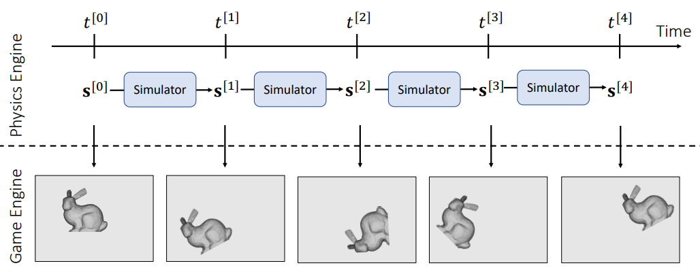


### 平移运动

对于平移运动，状态变量包含位置$\bf x$和速度$\bf v$。
$$
\left\{\begin{array}{l}
\mathbf{v}\left(t^{[1]}\right)=\mathbf{v}\left(t^{[0]}\right)+M^{-1} \int_{t^{[0]}}^{t^{[1]}} \mathbf{f}(\mathbf{x}(t), \mathbf{v}(t), t) d t \\
\mathbf{x}\left(t^{[1]}\right)=\mathbf{x}\left(t^{[0]}\right)+\int_{t[0]}^{t^{[1]}} \mathbf{v}(t) d t
\end{array}\right.\\
$$
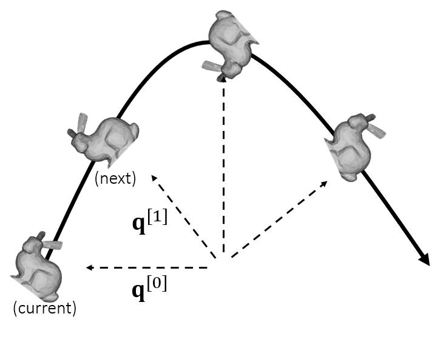


**积分方法理解**

根据定义，积分$\mathbf{x}(t)=\int \mathbf{v}(t) \text{d}t$是区域。 许多方法将区域估计为一个盒子。


**Explicit Euler 显式欧拉** （`一阶精确`）将高度设置为 𝑡[0] ：
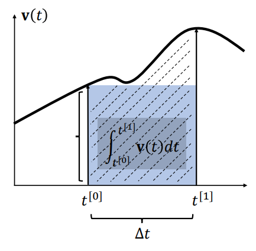
泰勒展开：
$$
\begin{aligned}
\int_{t^{[0]}}^{t^{[1]}} \mathbf{v}(t) d t &=\Delta t \mathbf{v}\left(t^{[0]}\right)+\frac{\Delta t^{2}}{2} \mathbf{v}^{\prime}\left(t^{[0]}\right)+\cdots \\
&=\Delta t \mathbf{v}\left(t^{[0]}\right)+O\left(\Delta t^{2}\right)
\end{aligned}\\
$$

**Implicit Euler 隐式欧拉**（`一阶精确`）将高度设置为 𝑡[1]：
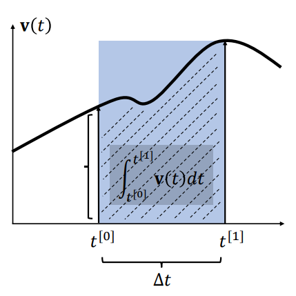
泰勒展开：
$$
\begin{aligned}
\int_{t}^{t^{[1]}} \mathbf{v}(t) d t &=\Delta t \mathbf{v}\left(t^{[1]}\right)-\frac{\Delta t^{2}}{2} \mathbf{v}^{\prime}\left(t^{[1]}\right)+\cdots \\
&=\Delta t \mathbf{v}\left(t^{[1]}\right)+O\left(\Delta t^{2}\right)
\end{aligned}\\
$$

**中点法 Mid-point** (2nd-order accurate) 中点（`二阶精确`）将高度设置为 $𝑡^{[0.5]}$:
$$
\begin{aligned}
\int_{t^{[0]}}^{t^{[1]}} \mathbf{v}(t) d t &=\int_{t^{[0]}}^{t^{[0.5]}} \mathbf{v}(t) d t+\int_{t^{[0.5]}}^{t^{[1]}} \mathbf{v}(t) d t \\
&= \frac{1}{2} \Delta t \mathbf{v}\left(t^{[0.5]}\right)-\frac{\Delta t^{2}}{2} \mathbf{v}^{\prime}\left(t^{[0.5]}\right)+O\left(\Delta t^{3}\right)+ \frac{1}{2} \Delta t \mathbf{v}\left(t^{[0.5]}\right)+\frac{\Delta t^{2}}{2} \mathbf{v}^{\prime}\left(t^{[0.5]}\right)+O\left(\Delta t^{3}\right) \\
&= \Delta t \mathbf{v}\left(t^{[0.5]}\right)+O\left(\Delta t^{3}\right)
\end{aligned}\\
$$
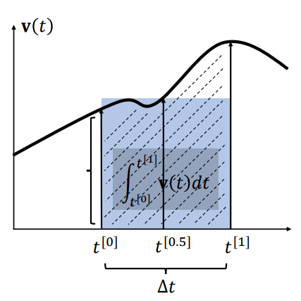

>Note: 由此可以看出，当存在两个变量的时候，midpoint方法精确度（二阶可靠）高于显示欧拉（一阶可靠）。
> 术语理解： 
> * 显式欧拉 Explicit Euler (1st-order accurate) sets the height at 𝑡[0]
> * 隐式欧拉 Implicit Euler (1st-order accurate) sets the height at 𝑡[1]
> * 中点法 Mid-point (2nd-order accurate) sets the height at 𝑡[0.5]

**the leapfrog method**

对于平移运动，状态变量包含位置 𝐱 和速度 𝐯。
改进方法： 隐式和显式结合：
$$
\left\{\begin{array}{l}
\mathbf{v}^{[1]}=\mathbf{v}^{[0]}+\Delta t M^{-1} \mathbf{f}^{[0]}    \Longleftarrow \text{Explicit}\\
\mathbf{x}^{[1]}=\mathbf{x}^{[0]}+\Delta t \mathbf{v}^{[1]} \qquad \Longleftarrow \text{Implicit}
\end{array}\right. \\
$$

在一些文献中，这种方法被称为半隐式 semi-implicit, 也有叫 `the leapfrog method`
将上式左移0.5个时间单位，就成了如下表达式：
$$
\left\{\begin{array}{l}
\mathbf{v}^{[0.5]}=\mathbf{v}^{[-0.5]}+\Delta t M^{-1} \mathbf{f}^{[0]} \Longleftarrow \text{Mid-point} \\
\mathbf{x}^{[1]}=\mathbf{x}^{[0]}+\Delta t \mathbf{v}^{[0.5]}  \qquad \Longleftarrow \text{Mid-point}
\end{array}\right. \\
$$
图示如下：
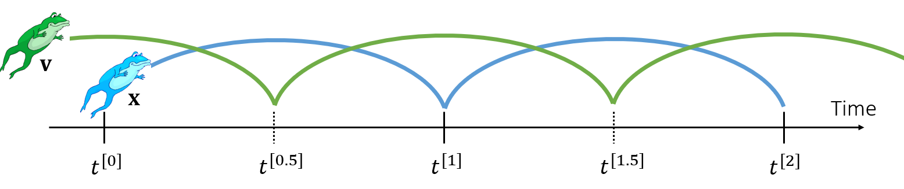

### 力的类型
重点 Gravity Force :
$$
\mathbf{f}_{\text {gravity }}^{[0]}= \mathbf{M}_{\text {mass}} \, \mathbf{g}_{\text {gravity}} \\
$$
阻力 Drag Force: 
$$
\mathbf{f}_{\text {drag}}^{[0]}=  \mathbf{-\sigma}_{\text {drag coefficient}} \mathbf{V}_{\text {velocity}}\\
$$

但是由于阻力会降低速度，因此更流行的方法是衰减速度: 
$$
\mathbf{f}_{\text {drag}}^{[0]}= \underbrace {\mathbf{\alpha}}_{\text {decay coefficient}} \mathbf{V^{[0]}}\\
$$

### 刚体模拟
关于刚体模拟的理论部分可以看看前面的文章[刚体动力学](https://zhuanlan.zhihu.com/p/557061822)
**移动**

转入变量$\mathrm{V^{[0]}, X^{[0]}}$输出变量$\mathrm{V^{[1]}, X^{[1]}}$. 
$$
\begin{aligned}
&\mathbf{f}_{i}^{[0]} \longleftarrow \operatorname{Force}\left(\mathbf{x}_{i}^{[0]}, \mathbf{v}_{i}^{[0]}\right) \\
&\mathbf{f}^{[0]} \longleftarrow \sum \mathbf{f}_{i}^{[0]} \\
&\mathbf{v}^{[1]} \longleftarrow \mathbf{v}^{[0]}+\Delta t M^{-1} \mathbf{f}^{[0]} \\
&\mathbf{x}^{[1]} \longleftarrow \mathbf{x}^{[0]}+\Delta t \mathbf{v}^{[1]}
\end{aligned}\\
$$

>Note: 质量 𝑀 和时间步长 ∆𝑡 是用户指定的变量。

**旋转运动**

用矩阵表示的旋转
* 矩阵表示用于旋转运动
* 对每个顶点应用旋转（通过矩阵向量乘法）很友好。

但它不适合动态：
* 它有太多的冗余：9 个元素但只有 3 个自由度。
* 它不直观。
* 定义其时间导数（旋转速度）也很困难。

$$
\mathbf{R}=\left[\begin{array}{lll}
r_{00} & r_{01} & r_{02} \\
r_{10} & r_{11} & r_{12} \\
r_{20} & r_{21} & r_{22}
\end{array}\right]
$$

>Note: 关于旋转运动的表示参考[三维空间旋转表示](https://zhuanlan.zhihu.com/p/560990376)

#### 力矩和惯性 Torque and Inertia
运动物体：

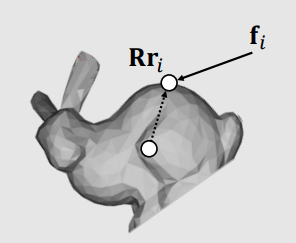
* 力的旋转当量称为扭矩$\tau$: 
$$
\begin{aligned}
\boldsymbol{\tau}_{i} &=\left(\mathbf{R} \mathbf{r}_{i}\right) \times \mathbf{f}_{i} \\
\boldsymbol{\tau} &=\sum \boldsymbol{\tau}_{i}
\end{aligned}
$$
* 质量的旋转当量称为惯性𝐈: 同先计算初始位置的$\mathbf{I}_{\text {ref }}=\sum m_{i}\left(\mathbf{r}_{i}^{\mathrm{T}} \mathbf{r}_{i} \mathbf{1}-\mathbf{r}_{i} \boldsymbol{r}_{i}^{\mathrm{T}}\right)$,来计算下一个位置的$\mathbf{I}$
$$
\begin{aligned}
\mathbf{I}  &=\sum m_{i}\left(\mathbf{r}_{i}^{\mathrm{T}} \mathbf{R}^{\mathrm{T}} \mathbf{R} \mathbf{r}_{i} \mathbf{1}-\mathbf{R r}_{i} \boldsymbol{r}_{i}^{\mathrm{T}} \mathbf{R}^{\mathrm{T}}\right) \\
&=\sum m_{i}\left(\mathbf{R} \mathbf{r}_{i}^{\mathrm{T}} \mathbf{r}_{i} \mathbf{1} \mathbf{R}^{\mathrm{T}}-\mathbf{R} \mathbf{r}_{i} \boldsymbol{r}_{i}^{\mathrm{T}} \mathbf{R}^{\mathrm{T}}\right) \\
&=\sum m_{i} \mathbf{R}\left(\mathbf{r}_{i}^{\mathrm{T}} \mathbf{r}_{i} \mathbf{1}-\mathbf{r}_{i} \boldsymbol{r}_{i}^{\mathrm{T}}\right) \mathbf{R}^{\mathrm{T}} \\
&=\mathbf{R} \mathbf{I}_{\mathbf{r e f}} \mathbf{R}^{\mathrm{T}}
\end{aligned}
$$
>Note: 
>* 旋转矩阵的逆等于其转置[矩阵变换](https://zhuanlan.zhihu.com/p/557061822)
>* $r_i^T r_i$计算出来是一个实数。


### 粒子碰撞检测与响应

##### 有向距离函数
有符号距离函数Signed Distance Function$\phi(x) $定义了从x到带有符号的表面的距离。 标志signed表示x位于哪一侧：
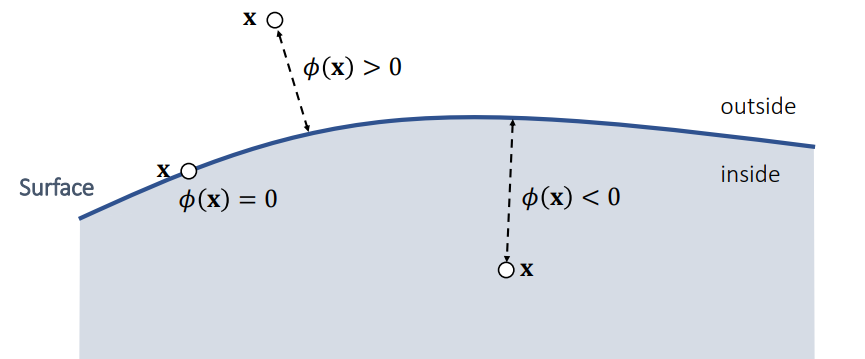
eg:
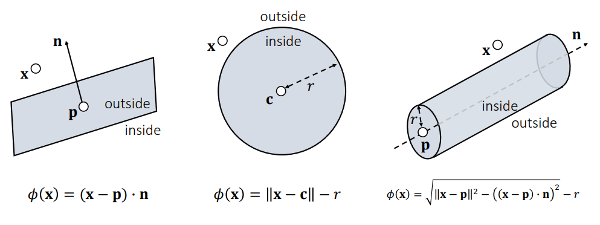

有符号距离函数的交集:
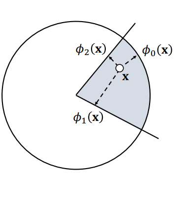
If $\phi_{0}(\mathbf{x})<0$ and $\phi_{1}(\mathbf{x})<0$ and $\phi_{2}(\mathbf{x})<0$ 
then inside 
    $\phi(\mathbf{x})=\max \left(\phi_{0}(\mathbf{x}), \phi_{1}(\mathbf{x}), \phi_{2}(\mathbf{x})\right)$
Else outside
$\phi(x)=?$

有符号距离函数的并集：
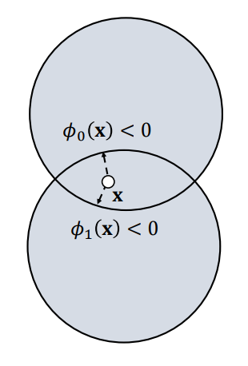 
If $\phi_{0}(\mathbf{x})<0$ or $\phi_{1}(\mathbf{x})<0$
then inside 
$\phi(\mathbf{x}) \approx \min \left(\phi_{0}(\mathbf{x}), \phi_{1}(\mathbf{x})\right)$
Else outside 
$\phi(\mathbf{x})=\min \left(\phi_{0}(\mathbf{x}), \phi_{1}(\mathbf{x})\right)$


#####  Penalty Method 求解碰撞响应
二次惩罚法 
惩罚方法Quadratic Penalty Method 在下一次更新中应用惩罚力。 当惩罚潜在性是二次方时，力是线性的。
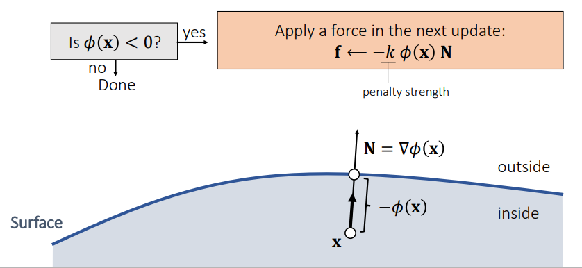

带缓冲区的二次惩罚方法 
Quadratic Penalty Method with a Buffer，在表面建立一层缓冲区（offset），缓冲区有助于减少渗透问题。 但无论𝑘多大，它都不能严格防止渗透。
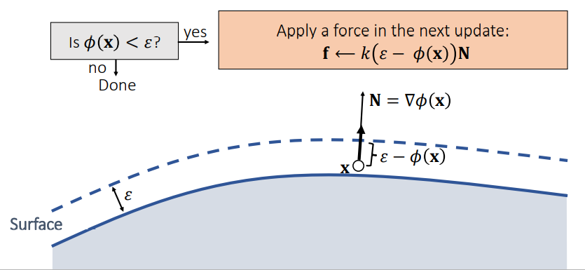

对数屏障惩罚法
Log-Barrier Penalty Method,对数障碍惩罚势能确保力足够大。 但它假设 𝜙 𝐱 < 0 永远不会发生！！！ 为此，它需要调整$\Delta t$
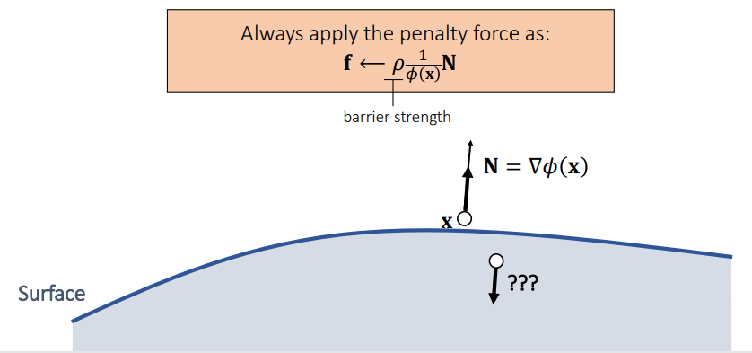

Penalty Method小结：
* 使用步长调整是必须的。
    * 避免过冲。
    * 避免渗透对数障碍法。
* Log-barrier 方法也可以限制在缓冲区内。
    * Li et al. 2020. Incremental Potential Contact: Intersection- and Inversion-free Large Deformation Dynamics. TOG.
    * Wu et al. 2020. A Safe and Fast Repulsion Method for GPU-based Cloth Self Collisions. TOG.
* 摩擦接触难以处理。

##### 冲量方法 求解碰撞响应
* Impulse Method： 脉冲方法假设碰撞会立即变位置和速度
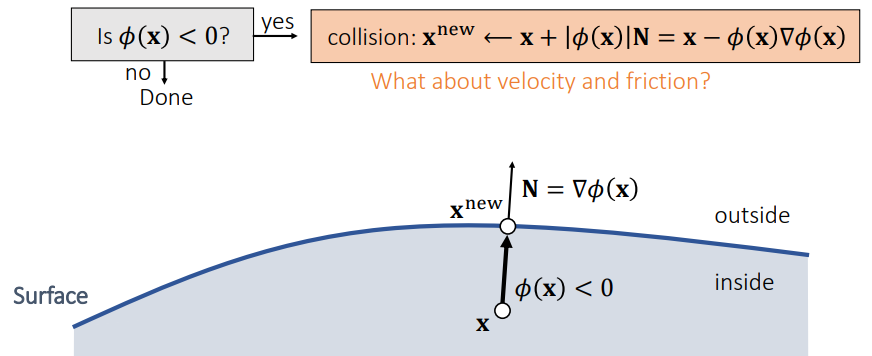

* 改变位置是不够的，我们还必须改变速度。

if $\mathbf{v\cdot N} \lt 0?$
$$
\left\{\begin{array}{l}\mathbf{v}_{\mathbf{N}} \longleftarrow(\mathbf{v} \cdot \mathbf{N}) \mathbf{N} \\ \mathbf{v}_{\mathrm{T}} \longleftarrow \mathbf{v}-\mathbf{v}_{\mathbf{N}}\end{array} \rightarrow\left\{\begin{array}{l}\mathbf{v}_{\mathbf{N}}^{\text {new }} = -\mu_{\mathrm{N}} \mathbf{v}_{\mathbf{N}} \\ \mathbf{v}_{\mathrm{T}}^{\text {new }} = a \mathbf{v}_{\mathbf{T}}\end{array} \mathbf{v}^{\text {new }} \longleftarrow \mathbf{v}_{\mathbf{N}}^{\text {new }}+\mathbf{v}_{\mathbf{T}}^{\text {new }}\right.\right.\\
$$
else:
    done
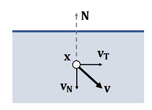

𝑎 应该小于1，且不违反库仑定律（切方向的改变等于法方向的改变成摩擦系数，其比例系数小于1）
$$
\begin{aligned}
\left\|\mathbf{v}_{\mathbf{T}}^{\text {new }}-\mathbf{v}_{\mathbf{T}}\right\| & \leq \mu_{\mathbf{T}}\left\|\mathbf{v}_{\mathbf{N}}^{\text {new }}-\mathbf{v}_{\mathbf{N}}\right\| \Longrightarrow
(1-a)\left\|\mathbf{v}_{\mathbf{T}}\right\| & \leq \mu_{\mathbf{T}}\left(1+\mu_{\mathbf{N}}\right)\left\|\mathbf{v}_{\mathbf{N}}\right\|
\end{aligned}\\
$$
因此
$$
a = \max \left(1-\mu_{\mathbf{T}}\left(1+\mu_{\mathbf{N}}\right)\left\|\mathbf{v}_{\mathbf{N}}\right\| /\left\|\mathbf{v}_{\mathbf{T}}\right\|, 0\right)\\
$$

### 刚体碰撞检测与响应
>Note：如果一个刚体不能变形，它的运动由两部分组成：平移和旋转。
##### 刚体碰撞检测
粗粒度的计算方法：当身体由许多顶点组成时，我们可以通过测试每个顶点来检测碰撞：（效率低但是有效）
$$
\mathbf{x}_{i} \longleftarrow \mathbf{x}+\mathbf{R} \mathbf{r}_{i}\\
$$
细粒度的计算方法：
* 凸多边形碰撞检测: 大名鼎鼎的GJK算法[7]
* sweep-and-prune, 
* 分离轴算法，Separating Axis Theorem(SAT)算法
* 实际物理引擎还会用到Continuous Collision Detection(CCD)算法；
##### 刚体碰撞响应
刚体质心和顶点运动关系：
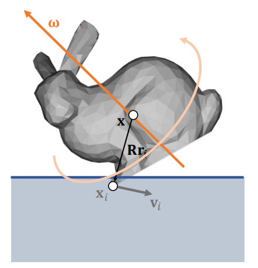
$$
\left\{\begin{array}{l}
\mathbf{X}_{i} \longleftarrow \mathbf{x}+\mathbf{R} \mathbf{r}_{i} \qquad (Position)\\
\mathbf{V}_{i} \longleftarrow \mathbf{V}+\boldsymbol{\omega} \times \mathbf{R} \mathbf{r}_{i} \qquad (Velocity)
\end{array}\right. \\
$$
**问题**：在刚体模拟的时候，我们只有四个关于质心的变量$\bf s = {v, x, \omega, q}$。 我们不能直接修改$\bf x_i$或$\bf v_i$，因为它们不是状态变量。 它们是间接确定的。
**解决方案**：通过计算修改质心的$\bf v$和$\bf \omega$来间接修改$\bf x_i$或$\bf v_i$。

**使用冲量来计算碰撞相应**
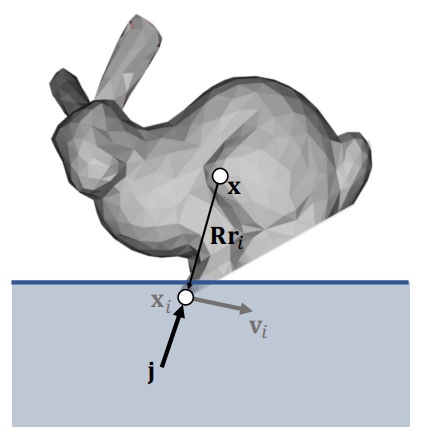
增加一个$\bf j$冲量后，对于旋转惯量需要使用冲量矩，$\because p = Mv, F = Ma, J = \int F \text{d}t, \therefore \Delta v =a \cdot \Delta t =  J / M$有：
$$
\left\{\begin{array}{l}
\mathbf{v}^{\text {new }} \longleftarrow \mathbf{v}+\frac{1}{M} \mathbf{j} \\
\boldsymbol{\omega}^{\text {new }} \longleftarrow \boldsymbol{\omega}+\mathbf{I}^{-1}\left(\mathbf{R r}_{i} \times \mathbf{j}\right)
\end{array}\right.
$$
有质心速度可以得到点速度。
$$
\begin{aligned}
\mathbf{v}_{i}^{\text {new }} &=\mathbf{v}^{\text {new }}+\boldsymbol{\omega}^{\text {new }} \times \mathbf{R} \mathbf{r}_{i} \\
&=\mathbf{v}+\frac{1}{M} \mathbf{j}+\left(\mathbf{\omega}+\mathbf{I}^{-1}\left(\mathbf{R r}_{i} \times \mathbf{j}\right)\right) \times \mathbf{R} \mathbf{r}_{i} \\
&=\mathbf{v}_{i}+\frac{1}{M} \mathbf{j}+\left(\mathbf{I}^{-1}\left(\mathbf{R r}_{i} \times \mathbf{j}\right)\right) \times \mathbf{R} \mathbf{r}_{i} \\
&=\mathbf{v}_{i}+\frac{1}{M} \mathbf{j}-\left(\mathbf{R} \mathbf{r}_{i}\right) \times\left(\mathbf { I } ^ { - 1 } \left(\mathbf{R r}_{i} \times\right.\right.\mathbf{j})) \\
\end{aligned}\\
$$
> Note：
> * 冲量等于动量的增加量。
> * cross 交换位置，添加负号。 
> * 我们可以将叉积$\bf r \times$转换为矩阵积$\bf r*$。 cross product可以写成矩阵形式：
$$
\mathbf{r} \times \mathbf{q}=\left[\begin{array}{l}
r_{y} q_{z}-r_{z} q_{y} \\
r_{z} q_{x}-r_{x} q_{z} \\
r_{x} q_{y}-r_{y} q_{x}
\end{array}\right]=\left[\begin{array}{ccc}
0 & -r_{z} & r_{y} \\
r_{z} & 0 & -r_{x} \\
-r_{y} & r_{x} & 0
\end{array}\right]\left[\begin{array}{c}
q_{x} \\
q_{y} \\
q_{z}
\end{array}\right]=\mathbf{r}^{*} \mathbf{q}
$$


**推导出在冲量$j$作用后，新的速度和原始速度的关系式**
$$
\begin{aligned}
\mathbf{v}_{i}^{\text {new }}&=\mathbf{v}_{i}+\frac{1}{M} \mathbf{j}-\left(\mathbf{R} \mathbf{r}_{i}\right) \times\left(\mathbf{I}^{-1}\left(\mathbf{R} \mathbf{r}_{i} \times \mathbf{j}\right)\right) \\
&=\mathbf{v}_{i}+\frac{1}{M} \mathbf{j}-\left(\mathbf{R} \mathbf{r}_{i}\right)^{*} \mathbf{I}^{-1}\left(\mathbf{R} \mathbf{r}_{i}\right)^{*} \mathbf{j}
\end{aligned}
$$
$$
\begin{gathered}
\mathbf{v}_{i}^{\text {new }}-\mathbf{v}_{i}=\mathbf{K} \mathbf{j} \\
\mathbf{K} \leftarrow \frac{1}{M} \mathbf{1}-\left(\mathbf{R r}_{i}\right)^{*} \mathbf{I}^{-1}\left(\mathbf{R r}_{i}\right)^{*}
\end{gathered}
$$
详细过程如下：
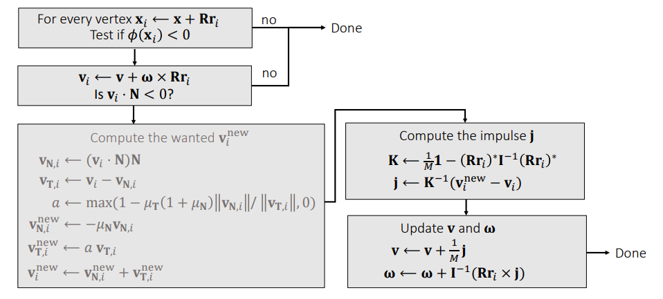

>Note: 位置的计算是非线性的问题，需要求解约束条件。

#### 更新平移和旋转
平移计算：状态变换Velocity $V$和Position $X$， 依赖的物理量是Mass $M$和Force $F$
$$
\left\{\begin{array}{l}
\mathbf{v}^{[1]}=\mathbf{v}^{[0]}+\Delta t M^{-1} \mathbf{f}^{[0]} \\
\mathbf{x}^{[1]}=\mathbf{x}^{[0]}+\Delta t \mathbf{v}^{[1]}
\end{array}\right.
$$

旋转计算：状态变换Angular $\omega$和Quaternion $q$， 依赖的物理量是Inertia $I$和Torque $\tau$
$$
\left\{\begin{array}{l}
\boldsymbol{\omega}^{[1]}=\boldsymbol{\omega}^{[0]}+\Delta t\left(\mathbf{I}^{[0]}\right)^{-1} \boldsymbol{\tau}^{[0]} \\
\mathbf{q}^{[1]}=\mathbf{q}^{[0]}+\left[\begin{array}{ll}
0 & \frac{\Delta t}{2} \boldsymbol{\omega}^{[1]}
\end{array}\right] \times \mathbf{q}^{[0]}
\end{array}\right.
$$

计算过程：
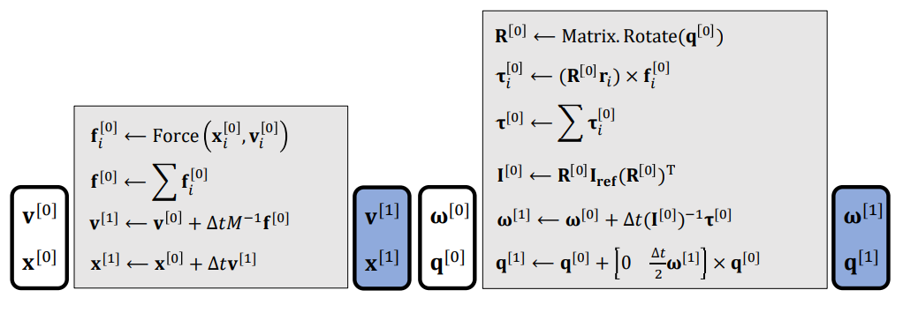

**多点碰撞的计算：**
多点接触碰撞就组成了一个线性系统： $\mathbf{K_{𝑎01}j_1}$代表兔子a在关节0处的速度变化，由脉冲$\mathbf{j_1}$引起。
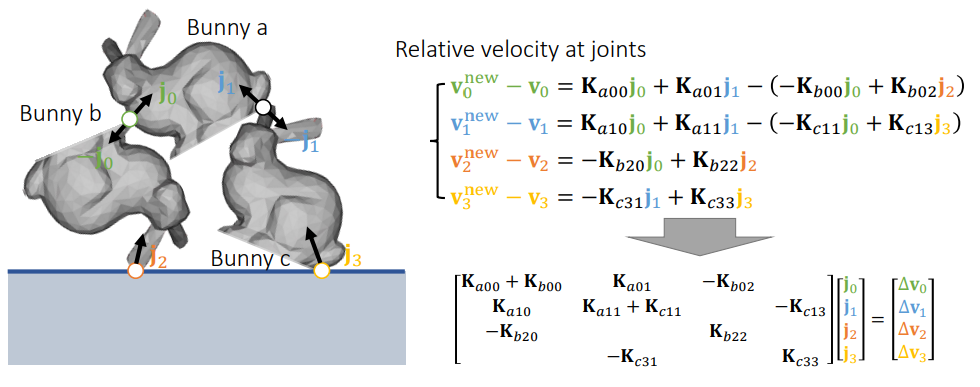  


### 形状匹配 Shape Matching

基本想法：我们允许每个顶点有自己的速度，所以它可以自己移动
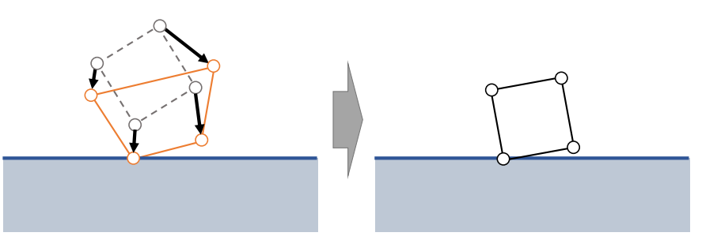

* 首先，通过速度独立移动顶点，处理碰撞和摩擦。
* 其次，强制刚性约束再次成为刚体。

**数学公式** 
求解未知量物体质心$c$和旋转矩阵$R$。
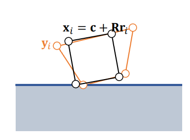
$$
\begin{aligned}
\{\mathbf{c}, \mathbf{R}\} &=\operatorname{argmin} \sum_{i} \frac{1}{2}\left\|\mathbf{c}+\mathbf{R} \mathbf{r}_{i}-\mathbf{y_{i}}\right\|^{2}\\
&\Downarrow  放松对 \mathbf{R}  矩阵的限制\\ 
\{\mathbf{c}, \mathbf{A}\}&=\operatorname{argmin} \sum_{i} \frac{1}{2}\left\|\mathbf{c}+\mathbf{A r}_{i}-\mathbf{y}_{i}\right\|^{2}
\end{aligned}\\
$$
>Note: 开始计算时候，放松对 $\mathbf{R}$矩阵的限制, 因为最后通过对$\mathbf{A}$矩阵的极分解，来强制矩阵只有旋转，排除到缩放影响来达到刚体效果。

约束求解的理解：约束之前的中心点和约束之后的中心点的最好是同一个点, 即argmin = 0时,
先对参数中心点c求偏导：
$$
\begin{aligned}
\frac{\partial E}{\partial \mathbf{c}}&=\sum_{i} \mathbf{c}+\mathbf{A r}_{i}-\mathbf{y}_{i}=\sum_{i} \mathbf{c}-\mathbf{y}_{i}=\mathbf{0} \\
&\Downarrow \\
\mathbf{c}&=\frac{1}{N} \sum_{i} \mathbf{y}_{i}\\
\end{aligned}\\
$$
再对矩阵A求偏导：（其中使用了公式：$\frac{\partial\|\mathbf{x}\|}{\partial \mathbf{x}} = \frac{\mathbf{x}^{\mathrm{T}}}{\|\mathbf{x}\|}$, [向量梯度计算](https://zhuanlan.zhihu.com/p/557061822)）
$$
\begin{aligned}
\{\mathbf{c}, \mathbf{A}\} &=\operatorname{argmin} \sum \frac{1}{2}\left\|\mathbf{c}+\mathbf{A} \mathbf{r}_{i}-\mathbf{y}_{i}\right\|^{2} \\
\frac{\partial E}{\partial \mathbf{A}} &=\sum_{i}\left(\mathbf{c}+\mathbf{A} \mathbf{r}_{i}-\mathbf{y}_{i}\right) \mathbf{r}_{i}^{\mathrm{T}}=\mathbf{0}\\
&\Downarrow \\
\mathbf{A}&=\left(\sum_i\left(\mathbf{y}_i-\mathbf{c}\right) \mathbf{r}_i^{\mathrm{T}}\right)\left(\sum_i \mathbf{r}_i \mathbf{r}_i^{\mathrm{T}}\right)^{-1}\\
\end{aligned}\\
$$
对矩阵A做极分解(Polar Decomposition)，如下：
* $\mathbf{A}=\mathbf{R} \mathbf{S}$。A的奇异值分解$\mathbf{A}=\mathbf{U D V}^{\mathrm{T}}$， 扩展$\mathbf{A}=\left(\mathbf{U V}^{\mathrm{T}}\right)\left(\mathbf{V D V}^{\mathrm{T}}\right)$
* 其中$\mathrm{VDV}^{\mathrm{T}}=\mathrm{S}$可以看作是本地形变，因为是刚体，所以本地形变不变。
* 所以可以R矩阵代表A矩阵旋转量，$S$可以直接丢掉。
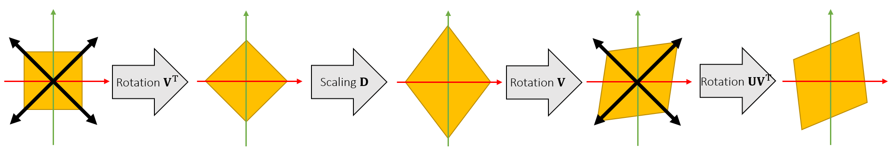

Shape Matching具体过程，（和impluse方法的区别是物理量附加到每个顶点上，而不是整个物理。通过每个顶点中间状态来拟合计算物体最终运动。）
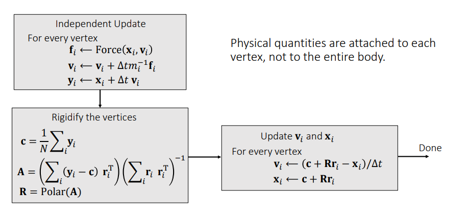

分析：
* 很容易实现
* 能够很好的模拟其他基于点的系统，如：布料、软体、粒子的流体
* 很难严格保证所有的约束(friction)都满足，满足一个约束可能会破坏其他约束，可以通过迭代的方式，
* 当摩擦((friction)不是很重要的时候，可以使用 shape matching（接触不频繁，例如衣服上的纽扣）

### todo

articulate body

**参考资料**
1. [Physically Based Modeling Rigid Body Simulation](https://graphics.pixar.com/pbm2001/)
2. [Quaternion Derivations(Appendix B)](https://graphics.pixar.com/pbm2001/pdf/notesg.pdf)
3. [反对称矩阵的性质](https://gutsgwh1997.github.io/2020/05/26/%E5%8F%8D%E5%AF%B9%E7%A7%B0%E7%9F%A9%E9%98%B5%E7%9A%84%E6%80%A7%E8%B4%A8/)
4. [凸多边形碰撞检测.分离轴算法.SAT.理论](https://www.bilibili.com/video/BV1FD4y1d7NN?spm_id_from=333.337.search-card.all.click&vd_source=1a163e481fb12c5b6ca8a57f994c1d73)
5. [Muller et al. 2005. Meshless Deformations Based on Shape Matching. TOG (SIGGRAPH)](https://www.cs.drexel.edu/~david/Classes/Papers/MeshlessDeformations_SIG05.pdf)
6. [A fast procedure for computing the distance between complex objects in three-dimensional space(大名鼎鼎的GJK算法)](http://graphics.stanford.edu/courses/cs164-09-spring/Handouts/paper_GJKoriginal.pdf)


