#! https://zhuanlan.zhihu.com/p/604914087
# 虚幻多线程渲染
并行渲染的目的主要是为了优化在CPU上的瓶颈, 尽可能的利用多核CPU的能力。
## 一. 最大化利用cpu多核性能提高渲染效率
1. 多线程的生成和翻译 RHI commands。
2. 多线程的创建和更新RHI resources。
      
**具体的实现多线程渲染方法：**
**Frontend** : Platform-agnostic ways，前端方法与平台无关，可以跨平台运行。
**Backend** : Platform parallelization，利用平台特有的Graphic API来实现。

分离渲染线程
* 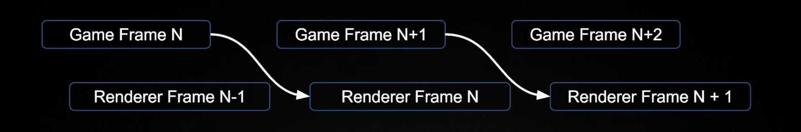

分离RHI层：
* 由于调用底层图形API达到driver层，特别如opengl底层的驱动消耗特别大，RHI执行需要等待驱动层返回结果。因此可以分离出RHI线程，用于单独调用图形API（driver）。
* 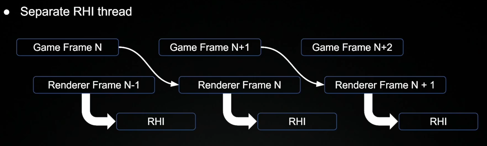

**在UE引擎中的大致数据流如下：**

FPrimitiveSceneProxy
- 渲染数据在游戏线程中的表示。The rendering thread representation for the game thread's 

UPrimitiveComponent
- 通过GetDynamicMeshElements和DrawStaticElements提供FMeshBatch给Renderer

FMeshBatch
- 包含一个pass所最终需要的着色器绑定和渲染状态。
- 通过Mesh Pass由FmeshPassProcessor的处理成渲染用的FMeshDrawCommand

FMeshDrawCommand
- 存储 RHI 需要了解的有关**网格绘制**的所有信息 。
- RHI level进行FMeshDrawCommand 缓存和自动合批 （如果Mesh不发生改变，可以提前将MeshDrawCommand cache下来）。

RHICommand
* 为了记录渲染线程传输给RHI线程的RHI指令（底层图形API需要的**参数信息**），而创建的数据结构。
* 如： FRHICommandBeginRenderPass

**流程总结**

资源处理（Parallel Processing Resources）
- 主要发生在InitView阶段如：ComputeLightVisibility, PrimitiveCulling, ComputeAndMarkRelevance, SetupMeshPass
- 还有就是在RDG中，用RDG去创建需要的RenderPass需要的资源。Parallel pass setup in RenderDependencyGraph

CommandList生成（Parallel CommandList Generation）
* 生成发生在RenderDependencyGraph里DispatchParallelExeute的函数里以及渲染MeshPass时候用到的FParallelCommandListSet里。 

多线程翻译Parallel CommandList Translation
- 使用FRHICommandListImmediate::QueueAsyncCommandListSubmit()函数提交

下面进行逐步解析细节。
### FMeshDrawCommand生成
具体MeshDrawCommand的生成看我下面绘制的流程图。
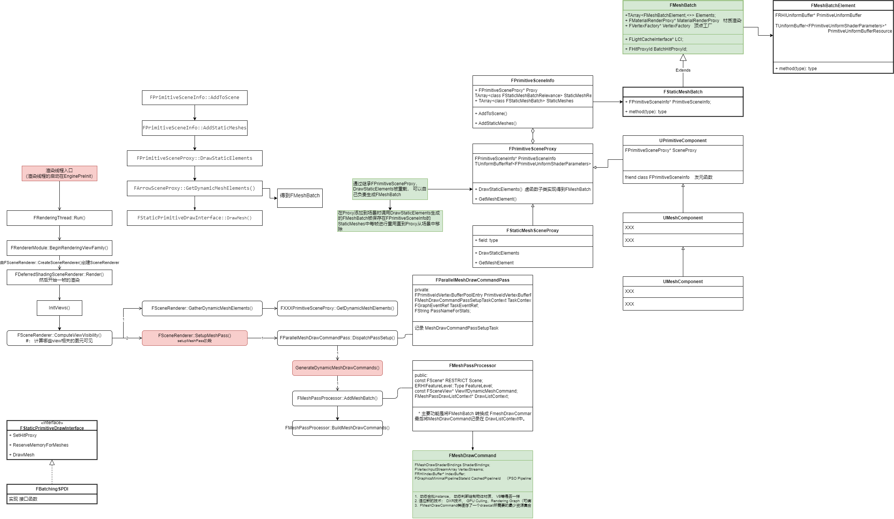
当有了FMeshDrawCommand之后，调用SubmitDraw方法(`SubmitDraw()由DispatchDraw()调用`)：
* 提交单个MeshDrawCommand到RHICommandList
```c++
void FMeshDrawCommand::SubmitDraw(
	const FMeshDrawCommand& RESTRICT MeshDrawCommand, 
	const FGraphicsMinimalPipelineStateSet& GraphicsMinimalPipelineStateSet,
	FRHIVertexBuffer* ScenePrimitiveIdsBuffer,
	int32 PrimitiveIdOffset,
	uint32 InstanceFactor,
	FRHICommandList& RHICmdList,
	FMeshDrawCommandStateCache& RESTRICT StateCache)
{
     // 设置和缓存PSO.
    if (MeshDrawCommand.CachedPipelineId.GetId() != StateCache.PipelineId)
    {
        FGraphicsPipelineStateInitializer GraphicsPSOInit = MeshPipelineState.AsGraphicsPipelineStateInitializer();
        RHICmdList.ApplyCachedRenderTargets(GraphicsPSOInit);
        SetGraphicsPipelineState(RHICmdList, GraphicsPSOInit);
        StateCache.SetPipelineState(MeshDrawCommand.CachedPipelineId.GetId());
    }

    // 设置和缓存模板值.
    if (MeshDrawCommand.StencilRef != StateCache.StencilRef)
    {
        RHICmdList.SetStencilRef(MeshDrawCommand.StencilRef);
        StateCache.StencilRef = MeshDrawCommand.StencilRef;
    }
     // 设置顶点数据.
    for (int32 VertexBindingIndex = 0; VertexBindingIndex < MeshDrawCommand.VertexStreams.Num(); VertexBindingIndex++)
    {
        const FVertexInputStream& Stream = MeshDrawCommand.VertexStreams[VertexBindingIndex];

        if (MeshDrawCommand.PrimitiveIdStreamIndex != -1 && Stream.StreamIndex == MeshDrawCommand.PrimitiveIdStreamIndex)
        {
            RHICmdList.SetStreamSource(Stream.StreamIndex, ScenePrimitiveIdsBuffer, PrimitiveIdOffset);
            StateCache.VertexStreams[Stream.StreamIndex] = Stream;
        }
        else if (StateCache.VertexStreams[Stream.StreamIndex] != Stream)
        {
            RHICmdList.SetStreamSource(Stream.StreamIndex, Stream.VertexBuffer, Stream.Offset);
            StateCache.VertexStreams[Stream.StreamIndex] = Stream;
        }
    }

      // 设置shader绑定的资源.
    MeshDrawCommand.ShaderBindings.SetOnCommandList(RHICmdList, MeshPipelineState.BoundShaderState.AsBoundShaderState(), StateCache.ShaderBindings);

     // 根据不同的数据调用不同类型的绘制指令到RHICommandList.
    if (MeshDrawCommand.IndexBuffer)
    {
        if (MeshDrawCommand.NumPrimitives > 0)
        {
            RHICmdList.DrawIndexedPrimitive(...);
        }
        else
        {
            RHICmdList.DrawIndexedPrimitiveIndirect(...)
        }
    }
    else
    {
        if (MeshDrawCommand.NumPrimitives > 0)
        {
            RHICmdList.DrawPrimitive(...)
        }
        else
        {
            RHICmdList.DrawPrimitiveIndirect(...)
        }
    }
}
```
* SubmitDraw的过程做了PSO（Pipeline State Object）和模板值的缓存，防止向RHICommandList提交重复的数据和指令，减少CPU和GPU的IO交互。
* 支持索引绘制和indirect绘制。（Indirect Draw是对GPU instance的优化，现代API支持）。


### RHI Front（RHICommandList生成）
本质上就是将RHICommand记录到RHICommandList中（由FDrawMeshCommand提供）。**记录和执行都由FRHICommandListImmediate控制** 。 渲染线程并不是一条一条的向RHI发送指令，而是通过记录RHICommmand形成一条链表，然后一起发送到RHI线程去执行。

* 实际上具体的RHICommand的子类是记录**graphic api需要的参数信息**，如：
```c++
template <typename TRHIShader>
struct FRHICommandSetShaderTexture final : public FRHICommand<FRHICommandSetShaderTexture<TRHIShader>, FRHICommandSetShaderTextureString >
{
	TRHIShader* Shader;
	uint32 TextureIndex;
	FRHITexture* Texture;
	RHI_API void Execute(FRHICommandListBase& CmdList);
};
FRHICOMMAND_MACRO(FRHICommandBeginRenderPass)
{
	FRHIRenderPassInfo Info;
	const TCHAR* Name;
	RHI_API void Execute(FRHICommandListBase& CmdList);
};
```

* 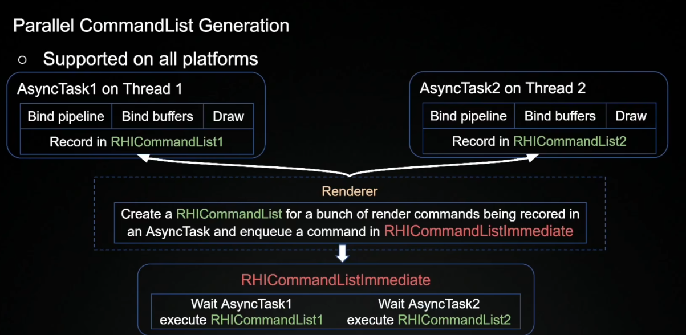

FRHICommandBase 
* 所有rhicommand的基类，子类会重载Excute接口，里面回去调用实际的RHI函数。
```c++
class RHI_API FRHICommandListBase
{
    private:
	FRHICommandBase* Root;
	FRHICommandBase** CommandLink;
	bool bExecuting;
	uint32 NumCommands;
	uint32 UID;
	IRHICommandContext* Context;
	IRHIComputeContext* ComputeContext;
}
```

#### FRHICommandList理解
* 渲染帧都是由一个或多个RHICommandList组成的。每个RHICommandList包含一组渲染命令，这些命令被提交到GPU以进行处理。这些命令可以包括绘制命令、状态设置命令、纹理加载命令等。


```c++
class RHI_API FRHICommandList : public FRHIComputeCommandList
```
* 可以延迟执行RHI函数的容器
- 记录**RHICommand到一个CommandLink的链表里** 。


FRHICommandListImmediate : public FRHICommandList
- 需要立即返回结果的接口：Including some render commands that need to be executed immediately on rendering thread and may need to flush RHI thread
- **Singleton instance** ：将RHICommand都记录在FRHICommandListImmediate的这个链表上，然后再发送到RHI线程执行。 保证所有提交给RHI线程的指令，是按照预期的**顺序执行**的。


RHI线程**执行顺序**
* 渲染线程在一帧内可以多次向RHI发送任务，由**task的依赖关系**来确定前后执行顺序。
* 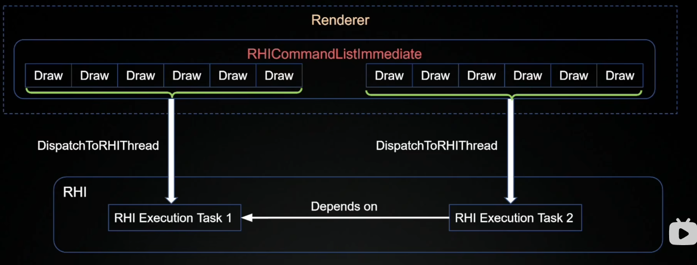

### RHI 翻译 Backend
多线程翻译RHICommand就是指将RHICommandList写入到Command Buffer中。
>Note:
>* 每个Commandbuffer里都需要记录beginRenderPass和EndRenderPass，这样就会又多次的RenderTarget的Load Store（如果不懂Load Store可以参考[深入探索移动端GPU图形架构](https://zhuanlan.zhihu.com/p/573930989)）。 load操作对移动设备不太友好，建议使用SecondaryBuffer。

* 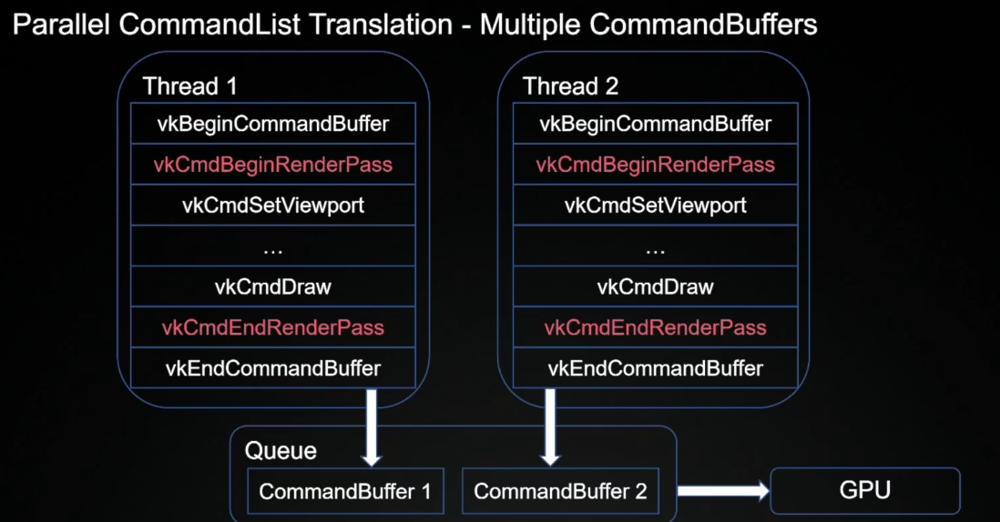

对硬件层抽象了一层接口，叫IRHICommandContext。通过这层接口将RHI Command翻译成GPU指令。

**UE代码分析**
IRHIComputeContext
- Including interfaces for doing **compute work**, such as RHIDispatchComputeShader, etc

IRHICommandContext : public IRHIComputeContext 
- 图形接口, such as RHIBeginRenderPass, etc
- FRHICommandList翻译接口。
- 每个平台会各自重载IRHICommandContext
- 负责缓存状态、验证和发布（可以避免状态的重复设置）
- 具有即时上下文的平台直接向 GPU 发送 RHI 命令（类如OpenGL）。
- 具有延迟上下文的平台将 RHI 命令写入命令缓冲区并且可以是多线程的

这里可以参考一下Vulkan的多线程提交到command的机制。
* 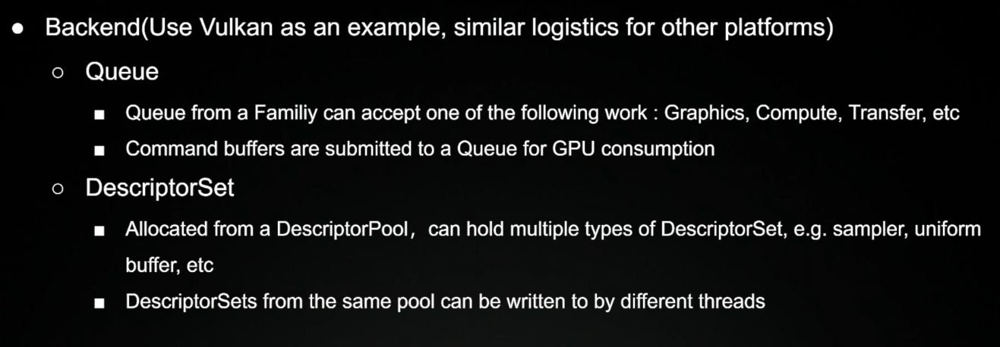


关于资源的多线程处理主要是发生在Interview里面。遍历所有的MeshPass，用特定的MeshPassProcessor把相关的PrimitiveSceneProxy的MeshBatch生成对应的MeshDrawCommand。
* **FMeshDrawCommandPassSetupTask用与生成FmeshDrawCommand**
```c++
FParallelMeshDrawCommandPass::DispatchPassSetup(...)
{
    //...
    if (bExecuteInParallel)
    {
        if (IsOnDemandShaderCreationEnabled())
        {
            TaskEventRef = TGraphTask<FMeshDrawCommandPassSetupTask>::CreateTask(nullptr, ENamedThreads::GetRenderThread()).ConstructAndDispatchWhenReady(TaskContext);
        }
        else
        {
            FGraphEventArray DependentGraphEvents;
            DependentGraphEvents.Add(TGraphTask<FMeshDrawCommandPassSetupTask>::CreateTask(nullptr, ENamedThreads::GetRenderThread()).ConstructAndDispatchWhenReady(TaskContext));
            TaskEventRef = TGraphTask<FMeshDrawCommandInitResourcesTask>::CreateTask(&DependentGraphEvents, ENamedThreads::GetRenderThread()).ConstructAndDispatchWhenReady(TaskContext);
        }
    }
    //...
}
```
* 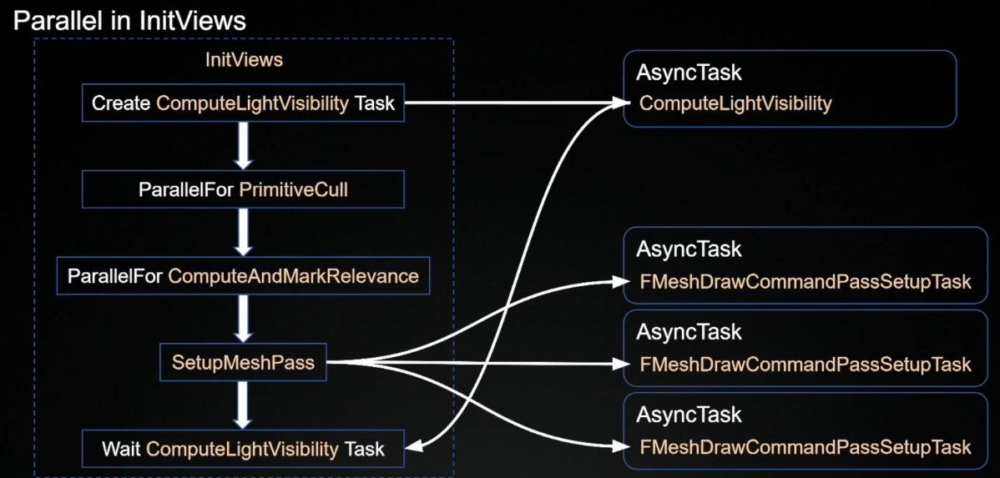

而RenderMeshPass阶段（进行渲染绘制的时候）交给RDG去处理。把MeshDrawCommand转换成实际执行的RHICommand。记录在RHICommandList中
* RDG使用多线程去创建RenderPass所需要的资源，比如创建UniformBuffer，创建PipelineBerriers等。
* RDG控制RHICommand提交。
* 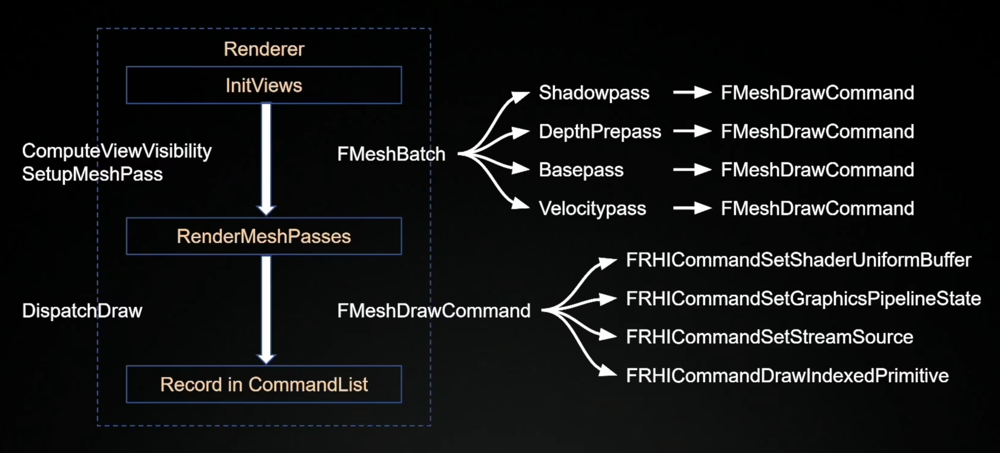
```c++
void FParallelMeshDrawCommandPass::DispatchDraw(FParallelCommandListSet* ParallelCommandListSet, FRHICommandList& RHICmdList) const
{
//...
        for (int32 TaskIndex = 0; TaskIndex < NumTasks; TaskIndex++)
    {
        const int32 StartIndex = TaskIndex * NumDrawsPerTask;
        const int32 NumDraws = FMath::Min(NumDrawsPerTask, MaxNumDraws - StartIndex);
        checkSlow(NumDraws > 0);

        FRHICommandList* CmdList = ParallelCommandListSet->NewParallelCommandList();

        FGraphEventRef AnyThreadCompletionEvent = TGraphTask<FDrawVisibleMeshCommandsAnyThreadTask>::CreateTask(&Prereqs, RenderThread)
            .ConstructAndDispatchWhenReady(*CmdList, TaskContext.MeshDrawCommands, TaskContext.MinimalPipelineStatePassSet, PrimitiveIdsBuffer, BasePrimitiveIdsOffset, TaskContext.bDynamicInstancing, TaskContext.InstanceFactor, TaskIndex, NumTasks);
        ParallelCommandListSet->AddParallelCommandList(CmdList, AnyThreadCompletionEvent, NumDraws);
    }
    //...
}
```


### 二. 关于多线程渲染的同步

**同步方法：**
Fronted： 前端部分采用taskgraph system， Prerequisite tasks。
Backend： 后端部分采用Barrier，fence， Semaphore。

### 三. Render In RDG
所有RenderPass是用RenderDependencyGraph来统一管理的，RenderDependencyGraph在收集完所有的RenderPass之后执行。

#### Parallelize Pass Setup  
setup阶段最核心的是使用多线程创建RenderPass所需要的资源，如创建UniformBuffer，分析Pass之间对资源的依赖关系创建PileineBarrier等等。
- Compile(SetupPassResources)
- CompilePassBarriers
- SubmitBufferUploads
- CreateUniformBuffer
- CreatePassBarriers

**SetupParallelExecute** ：
* 使用RHICommandList的RenderPass都不是一个特别大的pass，就是没有太多的渲染指令（一般是compute Pass或者是一些Post Process的pass），所以合并成一个set执行提高效率。
* 收集RHICommandList的RenderPass, 如果RenderPass使用的是RHICommandList（区别于RHICommandListImmediate）那可以是可以并行执行的，可以放入一个ParallelPassSet里。

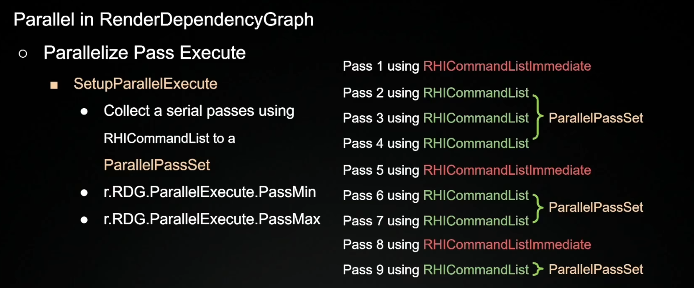


**DispatchParallelExeute**： 这一部分对应前面提到了**多线程生成RHI**。
* 收集完ParallelPassSet之后，会去执行DispatchParallelExecute()，对每个ParallelPassSet创建一个AyncTask
* MeshPass使用的是RHICommandListImmediate()。 
* 多线程的生成RHICommandList是发生在RenderDependencyGraph里DispatchParallelExeute的函数里以及渲染MeshPass时候用到的FParallelCommandListSet里
* 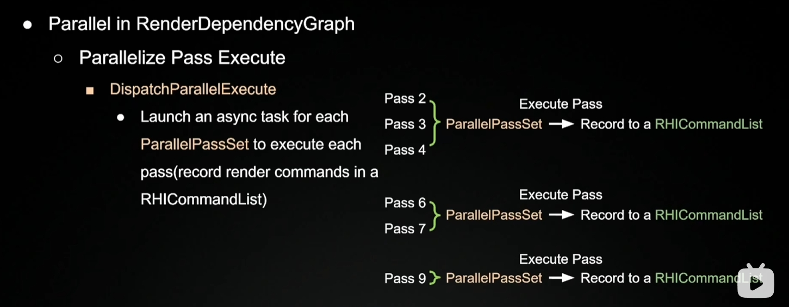
* 如果RenderPass是之前DispatchParallelExecute处理过的，就会把异步生成的RHICommandList记录在RHICommandListImmediate里。用于保证生成的**RHICommand**顺序不变
* 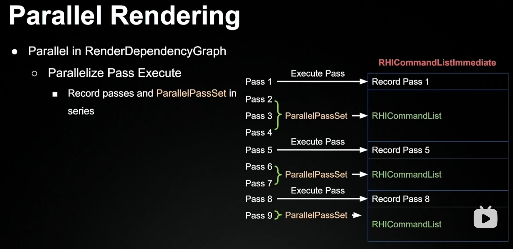

**MeshPass的RHICommandList的生成**
在函数FParallelMeshDrawCommandPass::DispatchDraw()中
对MeshPass 中MeshDrawCommand按照一定数量划分成很多块。在这个过程我们会根据工作线程的数量以及r.RHICmdWidth来得到可用的线程数。 计算出每个Task的DrawCall。
```c++
void FParallelMeshDrawCommandPass::DispatchDraw(FParallelCommandListSet* ParallelCommandListSet, FRHICommandList& RHICmdList, const FInstanceCullingDrawParams* InstanceCullingDrawParams) const
{
    .....

    // Distribute work evenly to the available task graph workers based on NumEstimatedDraws.
    // Every task will then adjust it's working range based on FVisibleMeshDrawCommandProcessTask results.
    const int32 NumThreads = FMath::Min<int32>(FTaskGraphInterface::Get().GetNumWorkerThreads(), ParallelCommandListSet->Width);
    const int32 NumTasks = FMath::Min<int32>(NumThreads, FMath::DivideAndRoundUp(MaxNumDraws, ParallelCommandListSet->MinDrawsPerCommandList));
    const int32 NumDrawsPerTask = FMath::DivideAndRoundUp(MaxNumDraws, NumTasks);

    for (int32 TaskIndex = 0; TaskIndex < NumTasks; TaskIndex++)
    {
        const int32 StartIndex = TaskIndex * NumDrawsPerTask;
        const int32 NumDraws = FMath::Min(NumDrawsPerTask, MaxNumDraws - StartIndex);
        checkSlow(NumDraws > 0);

        FRHICommandList* CmdList = ParallelCommandListSet->NewParallelCommandList();

        FGraphEventRef AnyThreadCompletionEvent = TGraphTask<FDrawVisibleMeshCommandsAnyThreadTask>::CreateTask(&Prereqs, RenderThread)
            .ConstructAndDispatchWhenReady(*CmdList, TaskContext.InstanceCullingContext, TaskContext.MeshDrawCommands, TaskContext.MinimalPipelineStatePassSet,
                OverrideArgs,
                TaskContext.InstanceFactor,
                TaskIndex, NumTasks);

        ParallelCommandListSet->AddParallelCommandList(CmdList, AnyThreadCompletionEvent, NumDraws);
    }
    ......
}
```
FDrawVisibleMeshCommandsAnyThreadTask依赖FMeshDrawCommandPassSetupTask

* 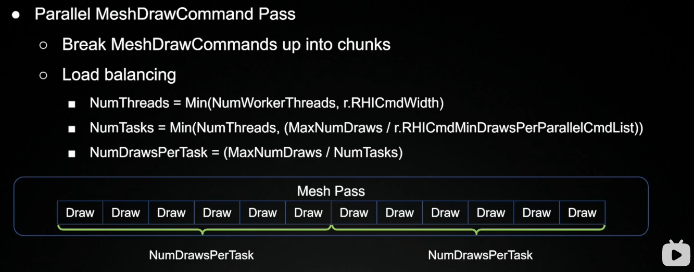

按照之前算好的Task数量去创建AsyncTask。
* 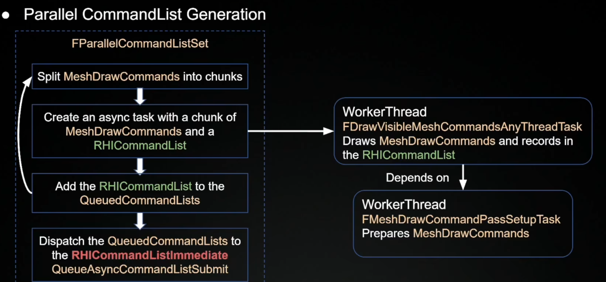

**CommandList多线程翻译**
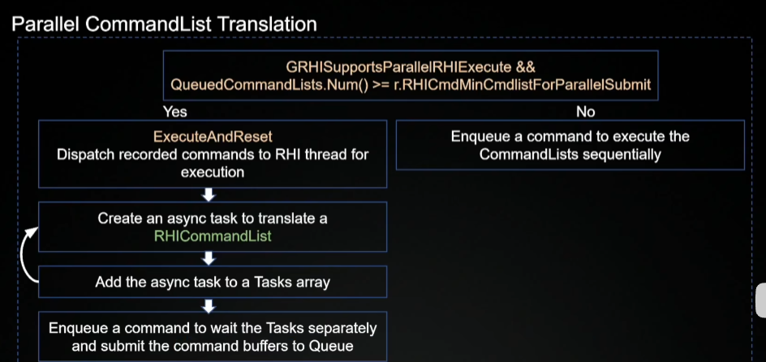
多线程翻译发生在FRHIGGommandListlmmediate::**QueueAsyncCommandListSubmit**这函数里。
* 这个函数里会根据平台是否支持多线程翻译以及并行的RHICmmandList的数量是否超过了r.RHICmdMincmdlistForParallelSubmiti这个值。 
* 如果条侏没有满足足就会简单的顺序执行这RHICommandList数组。
* 如果满足，然后再创建多个AsyncTask去并行的翻译传入的RHICommandList数组。并把这些Task记录在一个Task数组里，之后会创建一个RHICommand记录在RHICommandListImmediate上。
* 这个RHIGommand会等待翻译RHICommandList的工作结束。然后再把生成的 CommandBuffer提交到Queue里。


## 总结：
Conclusion
**Parallel Processing Resources**
- ComputeLightVisibility, PrimitiveCulling, ComputeAndMarkRelevance, SetupMeshPass
- Parallel pass setup in RenderDependencyGraph

**Parallel CommandList Generation**
- DispatchParallelExecute, FParallelCommandListSet

**Parallel CommandList Translation**
- FRHICommandListImmediate::QueueAsyncCommandListSubmit

## 并行渲染调试

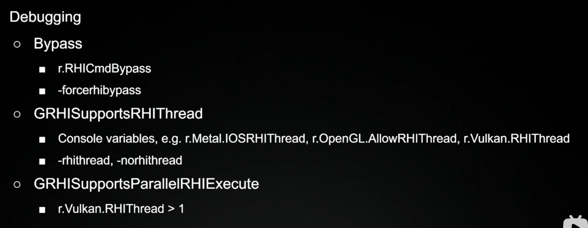


### 参考资料
1. https://www.bilibili.com/video/BV1sP4y117Dg/?share_source=copy_web&vd_source=e84f3d79efba7dc72e6306f35613222e)
2. https://registry.khronos.org/vulkan/specs/1.3-khr-extensions/html/vkspec.html
3. https://docs.unrealengine.com/4.26/en-US/ProgrammingAndScripting/Rendering/ParallelRenderingl
4. https://www.khronos.org/assets/uploads/developers/library/2016-siggraph/3D-BOF-SIGGRAPH_Jul16.pdf
5. https://developer.nvidia.com/sites/default/files/akamai/gameworks/blog/munich/mschott_vulkan_multi_threading.pdf